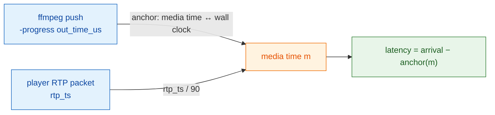

# nginx-rtc-example

Example deploy of [nginx-rtc-module](https://github.com/DeguiLiu/nginx-rtc-module), an in-nginx C module for RTMP/WHIP → WebRTC low-latency live streaming.

[中文文档](README.zh.md)

The module runs inside OpenResty/nginx. RTMP or WHIP pushes come in, the module turns them into RTP/SRTP and sends them over UDP straight to browser WebRTC players. The same origin also serves HTTP-FLV, HLS, and DASH, and records every stream to FLV on disk. If WebRTC fails or stalls, the player falls back to HTTP-FLV.

Pipeline:

```
ffmpeg/WHIP → nginx (RTMP/HTTP) → module (bridge → shm media ring → SRTP/UDP) → browser WebRTC
```

Both player pages below run against the same live stream; the wall clock burned into the top-left corner is what makes the latency difference readable at a glance:


<!-- One capture, both real pages side by side: the right pane is a live
     /rtcplayer.html, so the two burned-in clocks are directly comparable. -->

## Repos

The C code lives in its own public repo, [DeguiLiu/nginx-rtc-module](https://github.com/DeguiLiu/nginx-rtc-module) (MIT). This repo keeps only the glue: deploy config + Lua, player pages, client scripts, build/ops scripts, and docs. See `docs/` for architecture, multi-worker shm design, and evaluation notes.

## Layout

```
vendor/                 dependency notes (no embedded source, except one runtime asset, below)
deploy/nginx/
  conf/                 nginx.conf + *.lua (HMAC auth, stats, flvplayer, viewer count)
  html/                 rtcplayer.html / flv.min.js (flv.js v1.6.2) / hmac-sha256.js
client/                 play.mjs (play), whip_push.mjs (WHIP push), latency_probe.mjs (latency), lib/token.mjs (HMAC)
scripts/                fetch-deps.sh / build-deps.sh / build-openresty.sh
docs/                   design, evaluation, implementation guides, nginx coding standards (Chinese)
  images/               README screenshots
run.sh                  sync / nginx / push / keep-push / stop / verify
```

## Dependencies

Nothing is vendored: neither the module nor third-party C source. `scripts/fetch-deps.sh` pulls everything at build time into `scripts/_cache/` (gitignored) at pinned refs, and the build scripts unpack/clone and compile it.

| Dependency | Form | Version / source |
|---|---|---|
| nginx-rtc-module | shallow clone at build time | v0.4.0 (DeguiLiu/nginx-rtc-module, MIT) |
| OpenResty | tarball at build time | 1.31.1.1 (openresty.org) |
| nginx-http-flv-module | shallow clone at build time | v1.2.14 (winshining/nginx-http-flv-module) |
| Opus | tarball at build time | 1.3.1 (xiph/opus) |
| libsrtp | shallow clone at build time | 2.3.0 (ciscosystems/libsrtp) |
| FFmpeg (subset) | shallow clone at build time | aac decode + swresample + avutil (FFmpeg n6.1) |

The one embedded third-party asset is `deploy/nginx/html/flv.min.js` (flv.js v1.6.2, Apache-2.0), kept so the player page works offline; see `vendor/README.md`.

Prebuilt libs land in `build/third/{include,lib}`. The module's addon `config` finds them via `NGX_RTC_THIRD`, which `build-openresty.sh` passes explicitly. If you already have a prebuilt tree, `export NGX_RTC_THIRD=/path/to/third` skips the rebuild.

## Build

```bash
# one-shot: fetch → build-deps → build-openresty
scripts/setup.sh

# module host unit tests run in the module repo (no nginx/ffmpeg needed):
#   git clone --depth 1 --branch v0.4.0 https://github.com/DeguiLiu/nginx-rtc-module
#   make -C nginx-rtc-module/test test

# fetch all dependency sources (cached runs are instant; on github-blocked
# hosts export HTTPS_PROXY=http://127.0.0.1:7890 first)
scripts/fetch-deps.sh

# build static libs (opus/libsrtp/ffmpeg) -> build/third
scripts/build-deps.sh

# configure + build openresty + module + http-flv -> build/nginx
OPENRESTY_PREFIX=$PWD/build/nginx scripts/build-openresty.sh
```

## Run

```bash
OPENRESTY_PREFIX=/path/to/nginx-prefix ./run.sh nginx   # sync config + start
./run.sh push          # ffmpeg pushes livestream (Beijing wall clock burned in for latency eyeballing)
./run.sh keep-push     # supervised push, auto-restarts ffmpeg
./run.sh verify        # node client/play.mjs smoke playback (any play.mjs flag passes through)
./run.sh stop
```

Prefix resolution: `OPENRESTY_PREFIX`, then `build/nginx`, else error. `run.sh nginx|start` syncs `deploy/nginx/{conf,html}` into the prefix and generates `conf/nginx.rtc.conf` (candidate IP auto-detected or `RTC_CANDIDATE_IP`).

### Ports

| Port | Purpose |
|---|---|
| 18082 HTTP | `/flvplayer`, `/rtcplayer.html`, `/rtc/v1/stats`, `/rtc/v1/flvcnt`, `/rtc/v1/report`, `/metrics` |
| 1935 RTMP | push ingest + HTTP-FLV source |
| 8000 UDP | WebRTC SRTP/SRTCP + ICE/STUN |

Auth is an HMAC token: `t` = expiry seconds, `sign` = base64url(HMAC-SHA256(`<app>/<stream>|t=<t>`)). Each stream has **two** secrets in `deploy/nginx/conf/stream_keys.lua`, and which one verifies a token depends on what the token is for:

| key | used by | ships to clients? |
|---|---|---|
| `<app>/<stream>\|play` | `/rtc/v1/play/`, `/live` (HTTP-FLV) | yes — it is embedded in `rtcplayer.html`, so treat it as public |
| `<app>/<stream>\|publish` | RTMP `on_publish`, `/whip/endpoint` | no |

Demo values: play `demo-secret-0123456789abcdef0123456789abcdef`, publish `push-secret-9f8e7d6c5b4a39281706f5e4d3c2b1a0`. Publishing with the play secret is rejected (403) — that is the point of the split, since anyone who can load the player page holds the play secret.

### Recording

`record all; record_path rec;` in `application live` records each publish to `<prefix>/rec/<stream>-<timestamp>.flv` (written by the worker that actually receives it; auto_push copies are skipped). Files aren't served over HTTP — pull them from disk. `run.sh nginx` creates the directory.

### Player fallback

`rtcplayer.html` redirects to `/flvplayer?app=&stream=&key=` (same target prefilled) when WebRTC `connectionState`/`iceConnectionState` hits `failed`, or when no media arrives within 10 s.

## Latency

Steady-state end-to-end latency: the wall-clock gap between the source encoder handing a frame to the muxer and the player holding that frame's last RTP packet. Measured on one machine, headless werift player, 25 s window (683 frames per run, repeated).

| Push | p50 | p90 | p99 |
|---|---|---|---|
| audio input unpaced (before the fix) | 173 ms | 217 ms | 239 ms |
| audio input paced (after the fix) | **45 ms** | 57 ms | 68 ms |
| no audio input (control) | 18 ms | 31 ms | 35 ms |
| production 640x360 push, paced | 48 ms | 60 ms | 68 ms |

The fix was one line in `run.sh`: `-re` is a *per-input* ffmpeg option, and pacing only the video input left the sine source free to generate samples at full speed, which held video back ~128 ms inside ffmpeg. The RTC leg was never involved — an RTCP sender report places it at ~0 ms either way.

This is the steady-state figure, not startup. Connection setup — ICE/DTLS plus waiting for the first IDR — is a separate and much larger number (476–560 ms, see `docs/测试文档.md`).

### How it is measured



Everything runs on one machine, so a single wall clock covers the whole path. `client/latency_probe.mjs` records every video RTP packet's arrival time and timestamp, groups packets into frames, and takes the **last** packet of a frame as the moment it becomes decodable. Two details carry the method:

- **RTP timestamp → media milliseconds is exact.** The module maps RTMP milliseconds with `ms × 90` and never rebases, so a received timestamp folds straight back onto the encoder's own output clock; the module's `avsync` log asserts the skew is 0 ms.
- **The first 2 s of a subscription are excluded** (`--warmup`, default 2000 ms). The module replays the current GOP to a joining viewer, so those frames arrive far behind the live edge and would otherwise be reported as tens of seconds of latency. They are counted and reported separately rather than dropped silently.

```bash
node client/latency_probe.mjs --anchor /tmp/rtc_anchor.txt --duration 25000
node client/latency_probe.mjs --anchor /tmp/rtc_anchor.txt --raw   # per-frame columns
```

The anchor file is a timestamped capture of the pusher's `-progress` output. The probe also subscribes to RTCP sender reports and uses them as a second anchor that does not depend on ffmpeg — that is what pins the source→server and server→client split.

### What these numbers are not

They are for attribution, not for acceptance. Loopback has no RTT, no loss, no congestion; the werift player has no jitter buffer where a browser adds 100–300 ms; and `-progress` itself reports 25–46 ms late, so every figure above **understates** the true latency by roughly that much. The 45 ms is a reproducible lower bound for same-condition A/B work, not a user-perceived latency claim.

Full method, the experiments that ruled out the alternative explanations, and the limits: `docs/延迟测量方法与数据.md`.

## Testing

- Host unit tests: in [nginx-rtc-module](https://github.com/DeguiLiu/nginx-rtc-module), `make -C test test` (pure C, no nginx).
- End to end: `./run.sh verify` (werift playback smoke test).

## License

- C module: MIT (c) 2026 DeguiLiu, in [nginx-rtc-module](https://github.com/DeguiLiu/nginx-rtc-module).
- This repo (config, Lua, pages, client, docs, scripts): private; add a LICENSE before publishing.
- Build deps: fetched at build time, each keeps its own upstream LICENSE.
- `deploy/nginx/html/flv.min.js`: flv.js v1.6.2, Apache-2.0; see `vendor/README.md`.
