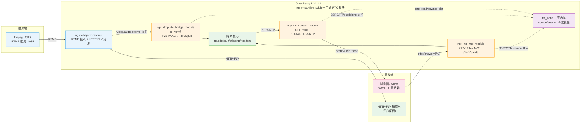

# 基于 Nginx 框架自研 WebRTC RTC 模块——低延迟直播方案设计

## 一、结论

方案的核心是：**在 Nginx 框架内自研 RTC 模块**，而非依赖 SRS 等外部 RTC 服务。在 OpenResty 1.31.1.1（bundle nginx-1.31.1）上，参考 SRS 6.0 的实现思路，用纯 C11 自研 RTC 模块，静态编译进 nginx 进程，实现 RTMP 推流 → H264 NALU → RTP/FU-A 封装 → DTLS/SRTP/STUN → UDP 推送给浏览器 WebRTC 播放器。

**端到端实测**：视频 H264 收到 765 包 / 363KB，首包延迟 ~522ms；音频 AAC→Opus 线程隔离转码后正常出流；HTTP-FLV 兜底播放保留（HTTP 200）。

**能力构成**：

- AAC→Opus 音频转码，**线程隔离**（`ngx_rtc_audio_worker.c` 每路 pthread 独占 FFmpeg，配合有界环 `ngx_rtc_ring.c`）。
- 多 worker 共享内存：`rtc_zone` + `ngx_rtc_core_module` + slab zone 三段式初始化，**双 registry 镜像**（进程内 source/session 保留 + shm 骨架），详见 `docs/multi-worker-shm-design.md`。
- `/rtc/v1/stats` 统计端点（`rtc_stats` 指令）、UDP 发送背压计数、GOP 回放背压提前终止；`auth.lua` 采用 `resty.limit.req`（官方 lua-resty-limit-traffic）限流。

## 二、总体架构

数据流两条（媒体面/信令面），外加一条元数据同步面：

- **媒体面（低延迟）**：推流端 → RTMP :1935 → nginx-http-flv-module → 桥接模块（events 钩子）→ H264 NALU /
  AAC→Opus → RTP 封装 → SRTP 加密 → UDP :8000 → 浏览器。全程 UDP 出网。
- **信令面（控制）**：浏览器 → POST /rtc/v1/play/ → HTTP 信令模块解析 offer → 创建/镜像 source+session →
  返回 answer SDP → 浏览器 STUN/DTLS 建链；GET /rtc/v1/stats 读取 source 注册表输出 JSON。
- **元数据同步面（多 worker）**：http/stream/bridge 三处 glue 与 `rtc_zone` 的 shm 骨架双向同步
  SSRC/PT/ufrag/pwd/srtp_ready/owner_slot/publishing（媒体热路径不跨 shm）。

## 三、模块划分

自研 RTC 模块位于 `ngx-rtc-module/`，分两层：

| 层 | 模块 | 职责 | 参考 SRS |
| --- | --- | --- | --- |
| 纯 C 核心（可单测） | `ngx_rtc_rtp` | H264 NALU→RTP/STAP-A/FU-A + B 帧过滤 | srs_app_rtc_source.cpp |
| | `ngx_rtc_sdp` | SDP offer 解析 / answer 生成 | srs_app_rtc_sdp.cpp |
| | `ngx_rtc_stun` | STUN binding request/response | srs_protocol_rtc_stun.cpp |
| | `ngx_rtc_dtls` | DTLS 握手 + SRTP 密钥导出 | srs_app_rtc_dtls.cpp |
| | `ngx_rtc_srtp` | SRTP/SRTCP 加解密（libsrtp2） | SrsSRTP |
| | `ngx_rtc_rtcp` | SR/RR/NACK/PLI/BYE 编解码 | SrsRtcp |
| | `ngx_rtc_hsm` / `ngx_rtc_session_fsm` | 层次状态机 + session 生命周期 | — |
| | `ngx_rtc_core` | 进程内 source/session 注册表 + GOP 环 + send_rtp | SrsRtcSource/SrsRtcQueue |
| | `ngx_rtc_audio` / `ngx_rtc_audio_worker` / `ngx_rtc_ring` | AAC→Opus 转码 + 线程隔离 + 有界环 | SrsAacTranscoder |
| nginx 胶水层 | `ngx_rtc_core_module`（`ngx_rtc_shm.c`） | `rtc_zone` 指令 + shm source/session 骨架 | limit_req zone |
| | `ngx_rtmp_rtc_bridge_module` | RTMP→RTC 桥接（RTMP 模块） | SrsFrameToRtcBridge |
| | `ngx_rtc_http_module` | HTTP 信令 + stats（HTTP 模块） | srs_app_rtc_api.cpp |
| | `ngx_rtc_stream_module` | UDP 媒体（STREAM 模块） | SrsRtcUdpNetwork |

## 四、关键技术实现

### 4.1 桥接（RTMP → RTC）

参考 `ngx_rtmp_gop_cache_module` 的成熟模式，桥接模块在 `postconfiguration` 里把 `ngx_rtmp_rtc_av` 注册到
`cmcf->events[NGX_RTMP_MSG_VIDEO/AUDIO]`，**零改动** nginx-http-flv-module 的 live/GOP/HTTP-FLV 模块。钩子拿到
FLV tag body（`1B codec + 1B AVCPacketType + 3B CTS + AVCC 长度前缀 NALU`），只处理 publisher
（`ctx->publishing`）；视频序列头提取 SPS/PPS 与 profile-level-id，NALU 逐个做 B 帧过滤 + RTP 封装；音频 AAC
序列头提取 AudioSpecificConfig 后启动转码 worker，raw AAC 帧异步投递给 `ngx_rtc_audio_worker`，产出 Opus 帧后按
RFC 7587 封装为单包 RTP。

### 4.2 RTP 封装（H264 → RTP）

- 小 NALU（≤1200B）→ single NAL unit packet
- 大 NALU → FU-A 分包（FU indicator 保留 NRI，首片 S=1、末片 E=1，marker 落在 access unit 末片）
- IDR 前用 STAP-A 聚合 SPS+PPS，保证解码器首帧可解
- B 帧识别：对 NALU type ∈ {1,2,3,4} 读 slice_type，∈ {1,6} 判 B 帧丢弃
- 每发一包把明文 RTP 推入进程内 GOP 环（供晚订阅者快启与 NACK/PLI 重传）

### 4.3 DTLS / SRTP / STUN

- **DTLS**：OpenSSL `DTLS_server_method` + 自签名 RSA-2048 证书，`SSL_CTX_set_tlsext_use_srtp("SRTP_AES128_CM_SHA1_80")`，内存 BIO + 输出回调（正确处理 MTU 分片），**显式 `SSL_set_accept_state`**（server 角色）
- **SRTP 密钥**：`SSL_export_keying_material("EXTRACTOR-dtls_srtp")` 导出 60 字节（client/server 各 key16+salt14），用 libsrtp2 `srtp_create` 建立收发上下文
- **STUN**：解析 BindingRequest（ice ufrag/pwd），回复 BindingResponse（XOR-MAPPED-ADDRESS + MESSAGE-INTEGRITY + FINGERPRINT）

### 4.4 信令（offer/answer + stats）

HTTP 信令模块兼容 SRS `/rtc/v1/play/` JSON 契约（`{sdp, streamurl}` → `{code:0, sdp}`），解析 offer 的
ice-ufrag/pwd/fingerprint 与 H264/Opus PT，创建 source（SSRC/PT 权威在 shm）与 session（生成服务端 ice-ufrag/pwd，
并写 shm 骨架），answer 含 `a=ice-lite`、`a=candidate`（media 级）、`a=fingerprint`、`a=sendonly`、`a=rtcp-mux`。
`rtc_stats` 指令注册 GET `/rtc/v1/stats`，C 直接遍历 source 注册表输出 JSON（等价 SRS `/api/v1/streams`）。

### 4.5 多 worker 共享内存

`rtc_zone` 指令 + `ngx_rtc_core_module`（NGX_CORE_MODULE）在 `ngx_rtc_shm.c` 实现 slab zone 三段式初始化
（`ngx_rtc_core_init_zone`，照 limit_req 模板）。落地方案为**双 registry 镜像**：进程内
`ngx_rtc_source_t`/`ngx_rtc_session_t` 完整保留（dtls/srtp/fsm/gop/conn 私有状态，媒体热路径主用），另建 shm 骨架
`ngx_rtc_shm_source_t`/`ngx_rtc_shm_session_t`（name/SSRC/PT/seq/ts/SPS/PPS/ASC/ufrag/pwd/srtp_ready/owner_slot/
subscribers），按 name/ufrag 关联。glue 同步点：http 的 SSRC/PT 权威与 session 骨架 add、stream 的
attach_from_shm/DTLS done/owner_slot 删除、bridge 的 sync_shm/close_stream。详细设计与偏差说明见
`docs/multi-worker-shm-design.md`；跨 worker 媒体分发（shm 媒体环 + eventfd 唤醒）见该文档第 5、6 节。

### 4.6 背压与线程隔离

- **UDP 背压**：`ngx_rtc_session_send_rtp` 返回 1（成功）/0（失败），区分 `NGX_ERROR`/`NGX_AGAIN`/短写并分别
  计数（`send_failed`/`send_eagain`），满 socket 直接丢包，让客户端经 NACK/PLI 恢复。
- **回放背压**：`ngx_rtc_rtp_ring_replay` 循环 send 失败即提前终止，避免向满 socket 突发整段 GOP。
- **转码线程隔离**：`ngx_rtc_audio_worker` 每路 pthread 独占 FFmpeg，nginx worker 只 push raw AAC / drain Opus，
  转码不阻塞事件循环。

## 五、验证结果

| 验证项 | 结果 |
| --- | --- |
| RTMP 推流接入 | `live/livestream` 发布成功（H264 640x360 + AAC） |
| 信令 /rtc/v1/play/ | offer→answer 协商成功，code=0 |
| STUN | binding request/response，ice ufrag 匹配 |
| DTLS 握手 | ClientHello→ServerHello→Finished 完整走完 |
| SRTP | 视频/音频 RTP 加密传输 |
| 视频接收 | H264 765 包 / 363KB，首包 ~522ms |
| B 帧过滤 | `-bf 0` 推流验证，过滤逻辑就绪 |
| HTTP-FLV 兜底 | HTTP 200，FLV 头正确（保留） |
| 音频转码 | AAC→Opus 线程隔离转码，Opus RTP 正常出流 |
| 多 worker shm | HTTP 与 UDP 分属不同 worker 时 STUN 可找到 session、DTLS 可完成 |
| stats 端点 | `/rtc/v1/stats` 输出 JSON（code=0 + streams） |

验证工具：`client/play.mjs`（werift headless 客户端，useH264/useOPUS 协商）。

## 六、扩展方向

1. **跨 worker 媒体分发**：shm 每 worker MPSC 环 + master 预建 eventfd 跨 worker 唤醒，
   `worker_processes auto` + UDP `reuseport`，详见 `docs/multi-worker-shm-design.md` 第 5、6 节。
2. **多 worker 优化**：per-source 锁、无锁 ring 入队、expire+LRU GC、同 worker 直发快路径。
3. **鉴权**：`auth.lua` 采用 `resty.limit.req` 官方限流；stream key 校验等业务鉴权收敛在
   `access_by_lua_file`。
4. **candidate IP**：由 `rtc_candidate_ip`/`rtc_candidate_port` 指令配置化（默认 127.0.0.1:8000），
   对外部署设配置即可。

## 七、关键踩坑（详见 Memory）

1. session 不能用 request pool 分配（生命周期跨 HTTP request，用 `ngx_alloc`）
2. DTLS server 必须 `SSL_set_accept_state`
3. werift STUN username 是 `server:client` 顺序（匹配用 local_ufrag）
4. SDP answer 必须含 media 级 `a=candidate`
5. shm 骨架删除必须校验 `owner_slot == ngx_worker`，防止 signaling worker 僵尸 session 被 reaper 误删活跃骨架
6. shm 内 `ngx_rtc_shm_session_t->source` 指向 shm source，不能与进程内 `ngx_rtc_source_t*` 混用
