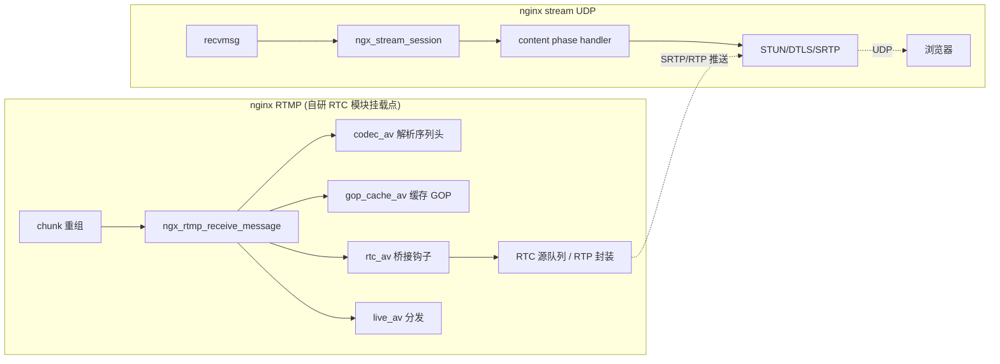
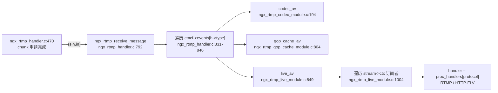

# RTMP→WebRTC 桥接挂载点分析 与 nginx stream UDP 模块骨架设计

> 结论先行。本文件给出三个结论：桥接挂载点、UDP 模块骨架、依赖库方案。所有行号均基于
> `/home/dgliu/workspace/webrtc/nginx-http-flv-module/` 与
> `/home/dgliu/workspace/webrtc/openresty-1.25.3.1/bundle/nginx-1.25.3/src/`。

## 0. 结论摘要

1. **桥接挂载点**：在**新 RTMP 模块**的 `postconfiguration` 中，把自研 `ngx_rtmp_rtc_av`
   注册到 `cmcf->events[NGX_RTMP_MSG_AUDIO]` 与 `events[NGX_RTMP_MSG_VIDEO]`，
   与 `ngx_rtmp_gop_cache_av`（`ngx_rtmp_gop_cache_module.c:804`）、`ngx_rtmp_codec_av`
   （`ngx_rtmp_codec_module.c:194`）同一模式。钩子内拿到的 `(s, h, in)` 即解析完成的
   H264/AAC 帧（`in` 为 FLV tag body，`pos[0]` 帧类型字节、`pos[1]` PacketType 字节），
   序列头（SPS/PPS/AudioSpecificConfig）从 `ngx_rtmp_codec_module` 的 ctx 读取。
   该挂载点**不改动** `ngx_rtmp_live_module.c`、GOP 缓存、HTTP-FLV 分发逻辑。

2. **UDP 模块**：走 nginx `stream` 子系统，`listen 8000 udp reuseport;` 由
   `ngx_stream_core_listen`（`ngx_stream_core_module.c:574`）置 `SOCK_DGRAM`。每个客户端
   4 元组对应一个 `ngx_stream_session_t`，每个数据报触发一次 content phase handler；
   DTLS 握手跨多个数据报，handler 需保持会话不 finalize，逐报驱动 OpenSSL DTLS 状态机。

3. **依赖库**：
   - libopus：工作区已源码编译 1.3.1 到 `third/`（静态库 + 头文件，见 5.1）。
   - SRTP：**用 libsrtp2 而非自研**。工作区已编译出 `third/lib/libsrtp2.a`（libsrtp2 2.3.0，
     SRS `libsrtp-2-fit` 裁剪版）。自研 RFC 3711 可行但需自实现 KDF/ROC/重放窗/RTCP index，
     与 Chrome 互通风险高，不划算（见 5.2）。
   - AAC 解码：**MVP 先 video-only**，AAC→Opus 后置；后续用 FFmpeg 原生 AAC 解码器
     （LGPL）源码编译，fdk-aac 有 license 兼容性问题（见 5.3）。



## 1. RTMP 帧流转关键路径

### 1.1 收流 → 解析 → 分发链路



- **chunk 重组**：`ngx_rtmp_handler.c:470` 在消息头 + 负载拼装完成后调用
  `ngx_rtmp_receive_message(s, h, head)`，`h` 为 `ngx_rtmp_header_t`
  （type/timestamp/mlen/msid/csid），`head` 为负载 `ngx_chain_t`。
- **事件分发**：`ngx_rtmp_receive_message`（`ngx_rtmp_handler.c:792-849`）按
  `h->type` 取 `cmcf->events[h->type]`，**按注册顺序**逐个调用 handler；返回值
  `NGX_ERROR` 中断、`NGX_DONE` 停止、`NGX_OK` 继续。注册顺序 = 模块在
  `config` 中 `RTMP_CORE_MODULES` 的排列顺序（`gop_cache` → `codec` → `live`）。
  另有 `ngx_rtmp_fire_event`（`ngx_rtmp.c:1072-1090`）用于 CONNECT/DISCONNECT 等
  非消息类型事件，逻辑相同。

### 1.2 关键数据结构

- `ngx_rtmp_session_t`（`ngx_rtmp.h:265-406`）：单条 RTMP 连接的会话；`ctx[]`
  存各模块私有 ctx，`app/srv/main_conf[]` 存配置，`publisher` 指向推流会话。
- `ngx_rtmp_handler_pt`（`ngx_rtmp.h:419-420`）：事件 handler 签名
  `ngx_int_t (*)(ngx_rtmp_session_t*, ngx_rtmp_header_t*, ngx_chain_t*)`。
- `ngx_rtmp_core_main_conf_t.events`（`ngx_rtmp.h:432`）：
  `ngx_array_t events[NGX_RTMP_MAX_EVENT]`，是模块注册钩子的唯一入口。
- `ngx_rtmp_codec_ctx_t`（`ngx_rtmp_codec_module.h:90-115`）：`avc_header`/`aac_header`
  （序列头共享链）、`avc_nal_bytes`、`width/height/profile/level`、
  `sample_rate/aac_chan_conf` 等解析结果。
- `ngx_rtmp_live_proc_handler_t`（`ngx_http_flv_live_module.h:50-65`）：协议分发函数表
  （`send/meta_message/append_message/free_message` + 4 个缓存链），
  `ngx_rtmp_live_proc_handlers[]`（`ngx_http_flv_live_module.c:193-196`）按协议索引：
  `[RTMP]=&ngx_rtmp_live_proc_handler`、`[HTTP]=&ngx_http_flv_live_proc_handler`。

### 1.3 音视频帧在哪个函数被解析出来

- **编解码类型解析**：`ngx_rtmp_codec_av`（`ngx_rtmp_codec_module.c:194-283`）。
  读取 `in->buf->pos[0]` 的 fmt 字节得到 codec id / 声道 / 采样率；
  当 `pos[1]==0`（`ngx_rtmp_is_codec_header`，`ngx_rtmp.h:805`）时，调用
  `ngx_rtmp_codec_parse_avc_header`（`ngx_rtmp_codec_module.c:382`）解析
  AVCDecoderConfigurationRecord（SPS/PPS/宽高），或
  `ngx_rtmp_codec_parse_aac_header`（`ngx_rtmp_codec_module.c:286`）解析
  AudioSpecificConfig（profile/采样率/声道配置）。
- **帧分发**：`ngx_rtmp_live_av`（`ngx_rtmp_live_module.c:849-1233`）。此处拿到的是
  完整 FLV tag body：`pos[0]`=帧类型+codec id，`pos[1]`=PacketType（0 序列头 / 1 NALU 或
  raw AAC），`pos[2..4]`=composition time（H264），其后为 AVCC 长度前缀 NALU 或 raw AAC。

## 2. 最佳桥接挂载点

### 2.1 候选点对比

| 候选 | 位置 | 优点 | 缺点 | 结论 |
|---|---|---|---|---|
| A. 事件钩子（推荐） | 新模块注册 `events[AUDIO/VIDEO]`，同 codec/gop 模式 | 零改动 live 模块；拿原始帧+时间戳；GOP/HTTP-FLV 完全不受影响 | 需自行过滤 publisher；需自行 hook publish/close | **采用** |
| B. 扩展 proc_handler 协议表 | 增 `NGX_RTMP_PROTOCOL_RTC`，改 `live_av` 循环 + `proc_handlers[]` | 复用 meta/GOP/wait_key 分发逻辑，与 HTTP-FLV 同构 | 要改 `ngx_rtmp.h` 枚举、`live_module.c` 多处、`http_flv_live_module.c` | 备用（需要订阅者参与 GOP 重放时） |
| C. 改 `ngx_rtmp_live_av` 内部 | 在 publisher 广播循环里加 RTC 分支 | 分发语义最精确 | 侵入核心分发函数，耦合最高 | 不采用 |

### 2.2 推荐方案说明

选 **A**，理由：

1. `ngx_rtmp_gop_cache_av` 已经证明该模式能拿到 publisher 的每一帧而不干扰分发：
   它在 handler 内检查 `ngx_rtmp_get_module_ctx(s, ngx_rtmp_live_module)->publishing`
   来只处理推流帧（`ngx_rtmp_gop_cache_module.c:829-836`）。
2. 事件 handler 在 `codec_av` 之后执行（新模块追加在 `RTMP_CORE_MODULES` 尾部），
   因此桥接钩子执行时 `ngx_rtmp_codec_ctx_t` 已就绪，序列头可直接读
   `avc_header/aac_header`，无需重复解析。
3. 桥接输出只依赖 `(s, h, in)` 三元组，RTC 封装、SDP、SRTP 全部放到独立纯 C 模块，
   不污染 nginx 核心。

> 注意：事件 handler 对**每条会话的每个 AV 消息**都会触发（含 play/relay 会话），
> 因此钩子必须像 `gop_cache_av` 一样先过滤 `ctx->publishing`，避免 relay 会话重复桥接。

## 3. 最小改动方案：RTMP→RTC 桥接钩子

### 3.1 模块骨架（新文件 `ngx_rtmp_rtc_bridge_module.c`，RTMP 核心模块类型）

不修改 `ngx_rtmp_live_module.c` / `ngx_rtmp_gop_cache_module.c` /
`ngx_http_flv_live_module.c`。仅新增一个模块并把它追加进 `config` 的
`RTMP_CORE_MODULES`（放在 `ngx_rtmp_live_module` 之后，保证 codec 已注册）。

```c
/* ngx_rtmp_rtc_bridge_module.c — C11, English comments */
#include <ngx_config.h>
#include <ngx_core.h>
#include "ngx_rtmp.h"
#include "ngx_rtmp_live_module.h"
#include "ngx_rtmp_codec_module.h"

/* Pure-C bridge core; independent of nginx, unit-testable */
#include "rtc_bridge.h"          /* rtc_bridge_publish_video/audio() */

typedef struct {
    ngx_flag_t           enabled;
} ngx_rtmp_rtc_app_conf_t;

typedef struct {
    unsigned             publishing:1;
    ngx_str_t            stream;
} ngx_rtmp_rtc_ctx_t;

static ngx_int_t ngx_rtmp_rtc_postconfiguration(ngx_conf_t *cf);
static void *ngx_rtmp_rtc_create_app_conf(ngx_conf_t *cf);
static char *ngx_rtmp_rtc_merge_app_conf(ngx_conf_t *cf, void *parent, void *child);

static ngx_int_t ngx_rtmp_rtc_av(ngx_rtmp_session_t *s, ngx_rtmp_header_t *h,
                                 ngx_chain_t *in);
static ngx_int_t ngx_rtmp_rtc_publish(ngx_rtmp_session_t *s, ngx_rtmp_publish_t *v);
static ngx_int_t ngx_rtmp_rtc_close_stream(ngx_rtmp_session_t *s,
                                           ngx_rtmp_close_stream_t *v);

static ngx_rtmp_publish_pt        next_publish;
static ngx_rtmp_close_stream_pt   next_close_stream;

static ngx_command_t ngx_rtmp_rtc_commands[] = {
    { ngx_string("rtc"),
      NGX_RTMP_MAIN_CONF|NGX_RTMP_SRV_CONF|NGX_RTMP_APP_CONF|NGX_CONF_TAKE1,
      ngx_conf_set_flag_slot,
      NGX_RTMP_APP_CONF_OFFSET,
      offsetof(ngx_rtmp_rtc_app_conf_t, enabled),
      NULL },
    ngx_null_command
};

static ngx_rtmp_module_t ngx_rtmp_rtc_module_ctx = {
    NULL,                                /* preconfiguration */
    ngx_rtmp_rtc_postconfiguration,      /* postconfiguration */
    NULL, NULL,
    NULL, NULL,
    ngx_rtmp_rtc_create_app_conf,
    ngx_rtmp_rtc_merge_app_conf
};

ngx_module_t ngx_rtmp_rtc_bridge_module = {
    NGX_MODULE_V1,
    &ngx_rtmp_rtc_module_ctx,
    ngx_rtmp_rtc_commands,
    NGX_RTMP_MODULE,
    NULL, NULL, NULL, NULL, NULL, NULL, NULL,
    NGX_MODULE_V1_PADDING
};

static ngx_int_t
ngx_rtmp_rtc_postconfiguration(ngx_conf_t *cf)
{
    ngx_rtmp_core_main_conf_t *cmcf;
    ngx_rtmp_handler_pt       *h;

    cmcf = ngx_rtmp_conf_get_module_main_conf(cf, ngx_rtmp_core_module);

    h = ngx_array_push(&cmcf->events[NGX_RTMP_MSG_AUDIO]);
    *h = ngx_rtmp_rtc_av;

    h = ngx_array_push(&cmcf->events[NGX_RTMP_MSG_VIDEO]);
    *h = ngx_rtmp_rtc_av;

    /* chain lifecycle hooks, same pattern as live/gop module */
    next_publish = ngx_rtmp_publish;
    ngx_rtmp_publish = ngx_rtmp_rtc_publish;

    next_close_stream = ngx_rtmp_close_stream;
    ngx_rtmp_close_stream = ngx_rtmp_rtc_close_stream;

    return NGX_OK;
}

static ngx_int_t
ngx_rtmp_rtc_av(ngx_rtmp_session_t *s, ngx_rtmp_header_t *h, ngx_chain_t *in)
{
    ngx_rtmp_rtc_app_conf_t *conf;
    ngx_rtmp_rtc_ctx_t      *ctx;
    ngx_rtmp_codec_ctx_t    *codec_ctx;
    ngx_uint_t               prio;

    conf = ngx_rtmp_get_module_app_conf(s, ngx_rtmp_rtc_bridge_module);
    if (conf == NULL || !conf->enabled || in == NULL || in->buf == NULL) {
        return NGX_OK;
    }

    ctx = ngx_rtmp_get_module_ctx(s, ngx_rtmp_rtc_bridge_module);
    if (ctx == NULL || !ctx->publishing) {
        return NGX_OK;                  /* only the publisher feeds RTC */
    }

    codec_ctx = ngx_rtmp_get_module_ctx(s, ngx_rtmp_codec_module);
    if (codec_ctx == NULL) {
        return NGX_OK;
    }

    prio = (h->type == NGX_RTMP_MSG_VIDEO)
           ? (ngx_uint_t) ngx_rtmp_get_video_frame_type(in) : 0;

    if (h->type == NGX_RTMP_MSG_VIDEO) {
        rtc_bridge_publish_video(&ctx->stream, h->timestamp, prio,
                                 codec_ctx, in);
    } else {
        rtc_bridge_publish_audio(&ctx->stream, h->timestamp,
                                 codec_ctx, in);
    }

    return NGX_OK;
}

static ngx_int_t
ngx_rtmp_rtc_publish(ngx_rtmp_session_t *s, ngx_rtmp_publish_t *v)
{
    ngx_rtmp_rtc_ctx_t *ctx;

    ctx = ngx_pcalloc(s->connection->pool, sizeof(ngx_rtmp_rtc_ctx_t));
    if (ctx != NULL) {
        ctx->publishing = 1;
        ctx->stream = v->name;
        ngx_rtmp_set_ctx(s, ctx, ngx_rtmp_rtc_bridge_module);
    }

    return next_publish(s, v);
}

static ngx_int_t
ngx_rtmp_rtc_close_stream(ngx_rtmp_session_t *s, ngx_rtmp_close_stream_t *v)
{
    ngx_rtmp_rtc_ctx_t *ctx;

    ctx = ngx_rtmp_get_module_ctx(s, ngx_rtmp_rtc_bridge_module);
    if (ctx != NULL && ctx->publishing) {
        rtc_bridge_close_stream(&ctx->stream);
        ctx->publishing = 0;
    }

    return next_close_stream(s, v);
}
```

### 3.2 帧格式与转换要点

- H264 数据帧（PacketType=1）为 **AVCC 格式**：`pos[0]`=帧类型(4bit)|codec(4bit)，
  `pos[1]`=1，`pos[2..4]`=composition time，随后为若干
  `[4 字节大端长度][NALU]`；`codec_ctx->avc_nal_bytes` 给长度前缀字节数。
  RTP 封装（RFC 6184）建议：单 NALU 直接打包，超 MTU 拆 FU-A，SPS/PPS 从
  `codec_ctx->avc_header` 取并用于 SDP `sprop-parameter-sets`。
- AAC 数据帧（PacketType=1）：`pos[0]` 声道/采样率，`pos[1]`=1，`pos[2..]`=raw AAC。
  MVP 直接丢弃；后续送 AAC 解码器再 Opus 编码。
- 时间戳统一：`h->timestamp` 为 RTMP 毫秒时间戳，RTP 侧需换算到 90kHz（视频）/
  48kHz（音频）时钟。

## 4. nginx stream UDP 模块骨架

### 4.1 `listen 8000 udp` 与 UDP 连接模型

- `ngx_stream_core_listen`（`ngx_stream_core_module.c:574`）解析 `udp` 关键字时置
  `ls->type = SOCK_DGRAM`（`ngx_stream_core_module.c:631-632`）。
- UDP 收包在 `ngx_event_recvmsg`（`ngx_event_udp.c:24`）：
  - `recvmsg` 后按客户端 4 元组查红黑树 `ngx_lookup_udp_connection`
    （`ngx_event_udp.c:508`）；
  - 已存在连接：把当前数据报放入 `c->udp->buffer`，置 `rev->ready=1`，
    调 `rev->handler(rev)`（`ngx_event_udp.c:184`）→ `ngx_stream_session_handler`
    → `ngx_stream_core_run_phases`；
  - 新连接：分配 `ngx_connection_t`（`c->shared=1`、`c->type=SOCK_DGRAM`、
    `c->recv=ngx_udp_shared_recv`、`c->send=ngx_udp_send`，`ngx_event_udp.c:238-239`），
    **首包拷入 `c->buffer`**（`ngx_event_udp.c:261-267`），插入红黑树
    （`ngx_event_udp.c:331`），再调 `ls->handler(c)` = `ngx_stream_init_connection`。
- 会话生命周期：
  - `ngx_stream_init_connection`（`ngx_stream_handler.c:20`）分配
    `ngx_stream_session_t`，`s->connection=c`、`c->data=s`，
    `rev->handler=ngx_stream_session_handler`（`ngx_stream_handler.c:176-177`）。
  - `ngx_stream_session_handler`（`ngx_stream_handler.c:283`）→
    `ngx_stream_core_run_phases`（`ngx_stream_core_module.c:141`）。
  - content phase checker `ngx_stream_core_content_phase`
    （`ngx_stream_core_module.c:315`）调用 `cscf->handler(s)`（void）。
  - `ngx_stream_finalize_session`（`ngx_stream_handler.c:296`）销毁连接与 pool，
    pool cleanup 触发 `ngx_delete_udp_connection` 从红黑树摘除。
- **UDP 关键点**：每个数据报触发一次 content handler；RTC 会话跨多报（DTLS 握手 +
  SRTP 流），因此 handler **不能**每报后 finalize。首报读 `c->buffer`，后续报读
  `c->recv()`（即 `ngx_udp_shared_recv`，仅 handler 调用期间有效）。空闲清理用
  `ngx_add_timer(c->read, timeout)`。

### 4.2 config 配置项与模块结构体

```nginx
stream {
    upstream rtc_backend { }        # 占位，说明 stream 体系可用

    server {
        listen 8000 udp reuseport;
        rtc on;                     # 自研指令：开启 RTC 端点
        rtc_certificate cert.pem;   # DTLS 证书（MVP 可先用自签）
        rtc_certificate_key key.pem;
        rtc_timeout 30s;
    }
}
```

```c
/* ngx_stream_rtc_module.c — C11, English comments */
#include <ngx_config.h>
#include <ngx_core.h>
#include <ngx_stream.h>

typedef struct {
    ngx_flag_t           enabled;
    ngx_str_t            cert;
    ngx_str_t            cert_key;
    ngx_msec_t           timeout;
} ngx_stream_rtc_srv_conf_t;

typedef struct {
    SSL_CTX             *ssl_ctx;      /* DTLS 1.2, SRTP extension enabled */
    ngx_msec_t           last_active;
    unsigned             dtls_done:1;
    rtc_transport_t      transport;    /* pure-C: STUN/DTLS/SRTP state */
} ngx_stream_rtc_ctx_t;

static void ngx_stream_rtc_handler(ngx_stream_session_t *s);

static void *
ngx_stream_rtc_create_srv_conf(ngx_conf_t *cf)
{
    ngx_stream_rtc_srv_conf_t *conf;

    conf = ngx_pcalloc(cf->pool, sizeof(ngx_stream_rtc_srv_conf_t));
    if (conf == NULL) {
        return NULL;
    }
    conf->timeout = NGX_CONF_UNSET_MSEC;
    return conf;
}

static char *
ngx_stream_rtc_merge_srv_conf(ngx_conf_t *cf, void *parent, void *child)
{
    ngx_stream_rtc_srv_conf_t *prev = parent;
    ngx_stream_rtc_srv_conf_t *conf = child;

    ngx_conf_merge_value(conf->enabled, prev->enabled, 0);
    ngx_conf_merge_msec_value(conf->timeout, prev->timeout, 30000);
    ngx_conf_merge_str_value(conf->cert, prev->cert, "");
    ngx_conf_merge_str_value(conf->cert_key, prev->cert_key, "");
    return NGX_CONF_OK;
}

static char *
ngx_stream_rtc(ngx_conf_t *cf, ngx_command_t *cmd, void *conf)
{
    ngx_stream_rtc_srv_conf_t    *rscf = conf;
    ngx_stream_core_srv_conf_t   *cscf;

    if (rscf->enabled) {
        return "is duplicate";
    }

    rscf->enabled = 1;

    cscf = ngx_stream_conf_get_module_srv_conf(cf, ngx_stream_core_module);
    cscf->handler = ngx_stream_rtc_handler;   /* content phase entry */

    return NGX_CONF_OK;
}

static ngx_command_t ngx_stream_rtc_commands[] = {
    { ngx_string("rtc"),
      NGX_STREAM_SRV_CONF|NGX_CONF_TAKE1,
      ngx_stream_rtc,
      NGX_STREAM_SRV_CONF_OFFSET,
      0, NULL },
    { ngx_string("rtc_timeout"),
      NGX_STREAM_SRV_CONF|NGX_CONF_TAKE1,
      ngx_conf_set_msec_slot,
      NGX_STREAM_SRV_CONF_OFFSET,
      offsetof(ngx_stream_rtc_srv_conf_t, timeout), NULL },
    ngx_null_command
};

static ngx_stream_module_t ngx_stream_rtc_module_ctx = {
    NULL,                               /* preconfiguration */
    NULL,                               /* postconfiguration */
    NULL, NULL,
    ngx_stream_rtc_create_srv_conf,
    ngx_stream_rtc_merge_srv_conf
};

ngx_module_t ngx_stream_rtc_module = {
    NGX_MODULE_V1,
    &ngx_stream_rtc_module_ctx,
    ngx_stream_rtc_commands,
    NGX_STREAM_MODULE,
    NULL, NULL, NULL, NULL, NULL, NULL, NULL,
    NGX_MODULE_V1_PADDING
};
```

### 4.3 init / handler 骨架

```c
static void
ngx_stream_rtc_handler(ngx_stream_session_t *s)
{
    ngx_connection_t           *c;
    ngx_stream_rtc_ctx_t       *ctx;
    ngx_stream_rtc_srv_conf_t  *rscf;
    u_char                      buf[1500];   /* typical MTU; large STUN/DTLS fit */
    ssize_t                     n;

    c = s->connection;
    rscf = ngx_stream_get_module_srv_conf(s, ngx_stream_rtc_module);

    if (c->read->timedout) {
        ngx_stream_finalize_session(s, NGX_STREAM_OK);  /* idle cleanup */
        return;
    }

    ctx = ngx_stream_get_module_ctx(s, ngx_stream_rtc_module);
    if (ctx == NULL) {
        ctx = ngx_pcalloc(c->pool, sizeof(ngx_stream_rtc_ctx_t));
        if (ctx == NULL) {
            ngx_stream_finalize_session(s, NGX_STREAM_INTERNAL_SERVER_ERROR);
            return;
        }
        ngx_stream_set_ctx(s, ctx, ngx_stream_rtc_module);
        rtc_transport_init(&ctx->transport, rscf->ssl_ctx);
    }

    /* First datagram is preloaded into c->buffer; the following ones arrive
     * via c->recv() (ngx_udp_shared_recv for shared UDP connections). */
    if (c->buffer != NULL && c->buffer->pos < c->buffer->last) {
        n = ngx_min((ssize_t) sizeof(buf), c->buffer->last - c->buffer->pos);
        ngx_memcpy(buf, c->buffer->pos, (size_t) n);
        c->buffer->pos = c->buffer->last;
    } else {
        n = c->recv(c, buf, sizeof(buf));
        if (n == NGX_AGAIN || n == NGX_ERROR || n == 0) {
            return;
        }
    }

    /* Pure-C state machine: STUN -> DTLS handshake -> SRTP */
    rtc_transport_feed(&ctx->transport, c, buf, (size_t) n);

    ngx_add_timer(c->read, rscf->timeout);   /* keep-alive / idle timeout */
    /* do NOT finalize: keep the UDP session alive across datagrams */
}
```

要点：

- `rtc_transport_feed` 内部用 `c->send(c, out, out_len)`（UDP 下即 `ngx_udp_send`，
  `ngx_event.h:424-425`）回包，无需自建 socket。
- DTLS 用 OpenSSL 3.0 `DTLS_method()` + `SSL_CTX_set_tlsext_use_srtp`
  （SRTP 扩展协商，RFC 5764），握手在逐报驱动下完成；握手完成后按
  `SSL_get_selected_srtp_profile` 导出的 master key/salt 初始化 libsrtp2 会话。
- content handler 返回值是 void，会话保持不结束即可；`ngx_stream_core_run_phases`
  在 checker 返回 `NGX_OK` 后返回，下一次数据报再次进入同一 content phase。

## 5. 依赖库方案结论

### 5.1 libopus（AAC→Opus 时使用）

本机只有运行时库 `libopus0`（1.3.1，无 dev 头）。工作区**已完成源码编译**：

| 项 | 值 |
|---|---|
| 源码版本 | opus-1.3.1（`/home/dgliu/workspace/webrtc/third/opus-1.3.1/`） |
| 产物 | `third/lib/libopus.a`（静态）、`libopus.so.0.8.0`、`third/include/opus/*.h`、`third/lib/pkgconfig/opus.pc` |
| 构建方式 | autotools，`--prefix` 指向用户目录（见 `third/` 与 `build-opus.log`） |

复现命令（已构建，供重建参考）：

```bash
cd /home/dgliu/workspace/webrtc/third/opus-1.3.1
./configure --prefix=/home/dgliu/workspace/webrtc/third --disable-shared
make -j"$(nproc)"
make install
```

编译期集成：`CFLAGS += -I/home/dgliu/workspace/webrtc/third/include`，
链接 `-L/home/dgliu/workspace/webrtc/third/lib -lopus -lm`（opus.pc 已就绪，
也可 `pkg-config` 指定 `PKG_CONFIG_PATH`）。

### 5.2 SRTP：用 libsrtp2，不自研

**结论：使用 libsrtp2。** 工作区已编译出静态库：

| 项 | 值 |
|---|---|
| 版本 | libsrtp2 2.3.0（SRS 6.0 `3rdparty/libsrtp-2-fit` 裁剪版） |
| 产物 | `third/lib/libsrtp2.a`（192KB，内置 aes_icm/hmac/sha1/replay）、`third/include/srtp2/` |

构建日志 `build-libsrtp.log` 中 `libsrtp2.a` 的 `ar`/`ranlib` 已成功；**失败的是 test
程序链接**（GCC 10+ `-fno-common` 下 `test/util.c` 的全局 `bit_string` 与
`datatypes.o` 重定义，`LIBSRTP_EXIT=2`），不影响库本身使用。

自研 RFC 3711（OpenSSL AES-CTR + HMAC-SHA1）可行性评估：

- **可行**：SRTP 加密包（`AES_128_CTR`）与认证（`HMAC_SHA1_80`）都可用 OpenSSL EVP/HMAC
  直接实现，Chrome 默认 profile `SRTP_AEAD_AES_128_GCM` 也可用 EVP 实现。
- **不建议**：完整互通还需自实现 RFC 3711 §4.3 密钥派生、ROC/序号回绕、
  重放窗口、SRTCP index、以及 RFC 5764 DTLS-SRTP `use_srtp` 导出 → SRTP key 映射；
  任一处与 Chrome 不一致即黑屏/无声，调试成本远高于直接链 libsrtp2。
- 结论：libsrtp2 已静态可用，**MVP 直接链 `third/lib/libsrtp2.a`**；DTLS 部分用
  OpenSSL 3.0.2（本机 dev 头齐备，支持 DTLS 1.2 + `use_srtp` 扩展）。

### 5.3 AAC 解码（AAC→Opus 前置）

**结论：MVP 先 video-only，AAC 解码后置。**

| 方案 | 可行性 | 说明 |
|---|---|---|
| FFmpeg 原生 AAC 解码器（LGPL） | 可行，偏重 | 只编 `libavcodec` 原生 AAC 解码（`--disable-everything --enable-decoder=aac`），静态链入；体积与构建时间可控但引入较大依赖 |
| fdk-aac | 可行但有 license 风险 | 解码质量好，但 FDK 许可与 GPL 不兼容，与 nginx/OpenSSL 组合分发需谨慎 |
| 自写 AAC-LC 解码 | 不现实 | AAC 解码复杂度高，无必要 |
| MVP 跳过 | 推荐 | 视频-only 先跑通 DTLS/SRTP/H264 RTP 全链路，音频作为二期 |

音频二期路径：AAC raw frame（PacketType=1）→ FFmpeg `avcodec` AAC 解码 →
PCM → libopus 编码（`opus_encode`，48kHz，2ch 起步）→ Opus RTP 打包（RFC 7587）。

## 6. 模块拆分建议

| 模块 | 依赖 nginx | 可单测 | 说明 |
|---|---|---|---|
| `rtc_h264_rtp`（AVCC→NALU、RFC 6184 FU-A/STAP-A 打包） | 否 | 是 | 纯 C，输入 AVCC buffer + 时间戳，输出 RTP 负载 |
| `rtc_opus_rtp` / `rtc_aac_dec` | 否 | 是 | 二期；Opus 打包 RFC 7587、AAC 解码 wrapper |
| `rtc_stun`（RFC 5389/8489 编解码、fingerprint、ice-lite） | 否 | 是 | 纯 C 结构体 + 字节流 |
| `rtc_sdp`（SDP 生成/解析、sprop-parameter-sets） | 否 | 是 | 纯 C |
| `rtc_srtp`（libsrtp2 封装：key 派生、收/发会话） | 否（链 libsrtp2） | 是（需 mock libsrtp2 或真实库） | 纯 C |
| `rtc_dtls`（OpenSSL DTLS 状态机 wrapper） | 否（链 OpenSSL） | 部分（需 mock socket 或真实 UDP） | 纯 C + socket 抽象 |
| `rtc_bridge`（RTMP 帧 → RTC 源队列/registry） | 否 | 是 | 纯 C；RTMP 侧与 stream 侧共享的"源"抽象 |
| `ngx_rtmp_rtc_bridge_module` | 是 | 否 | 第 3 节骨架，事件钩子 + 生命周期 |
| `ngx_stream_rtc_module` | 是 | 否 | 第 4 节骨架，UDP 收包/发包 + 会话管理 |

单测边界：`rtc_*` 纯 C 模块用 host CMake + TDD（RED→GREEN→REFACTOR，覆盖率 80%+）；
两个 nginx 模块只做薄胶水层，逻辑尽量下沉到纯 C 模块，nginx 侧仅做事件/配置/socket 转发。

## 7. 关键行号索引

### 7.1 nginx-http-flv-module

| 符号 | 位置 |
|---|---|
| chunk 重组完成 → receive_message | `ngx_rtmp_handler.c:470` |
| `ngx_rtmp_receive_message`（事件分发循环） | `ngx_rtmp_handler.c:792-849` |
| `ngx_rtmp_fire_event` | `ngx_rtmp.c:1072-1090` |
| `ngx_rtmp_codec_av`（帧/序列头解析） | `ngx_rtmp_codec_module.c:194-283` |
| `ngx_rtmp_codec_parse_aac_header` | `ngx_rtmp_codec_module.c:286-379` |
| `ngx_rtmp_codec_parse_avc_header` | `ngx_rtmp_codec_module.c:382-584` |
| `ngx_rtmp_codec_ctx_t` | `ngx_rtmp_codec_module.h:90-115` |
| `ngx_rtmp_gop_cache_av`（publisher 帧钩子范本） | `ngx_rtmp_gop_cache_module.c:804-855` |
| `ngx_rtmp_gop_cache_postconfiguration` | `ngx_rtmp_gop_cache_module.c:990-1015` |
| `ngx_rtmp_live_av`（直播分发） | `ngx_rtmp_live_module.c:849-1233` |
| `ngx_rtmp_live_postconfiguration` | `ngx_rtmp_live_module.c:1625-1682` |
| `ngx_rtmp_live_proc_handler_t` | `ngx_http_flv_live_module.h:50-65` |
| `ngx_rtmp_live_proc_handlers[]` | `ngx_http_flv_live_module.c:193-196` |
| 协议枚举 `NGX_RTMP_PROTOCOL_*` | `ngx_rtmp.h:230-233` |
| 事件 handler 类型 / events 数组 | `ngx_rtmp.h:419-420` / `ngx_rtmp.h:432` |
| `ngx_rtmp_session_t` | `ngx_rtmp.h:265-406` |
| 模块加载顺序（codec 在 live 之前） | `config` 的 `RTMP_CORE_MODULES` |

### 7.2 nginx stream / event

| 符号 | 位置 |
|---|---|
| `ngx_stream_core_listen`（`udp` → SOCK_DGRAM） | `ngx_stream_core_module.c:574` / `:631-632` |
| `ngx_stream_core_run_phases` | `ngx_stream_core_module.c:141-159` |
| `ngx_stream_core_content_phase` | `ngx_stream_core_module.c:315-338` |
| `ngx_stream_init_connection` | `ngx_stream_handler.c:20-202` |
| `ngx_stream_session_handler` | `ngx_stream_handler.c:283-293` |
| `ngx_stream_finalize_session` | `ngx_stream_handler.c:296-307` |
| `ngx_event_recvmsg`（UDP 收包/连接复用） | `ngx_event_udp.c:24-348` |
| 已存在 UDP 连接触发 `rev->handler` | `ngx_event_udp.c:184` |
| 新连接 recv/send 赋值 | `ngx_event_udp.c:238-239` |
| 首包拷入 `c->buffer` | `ngx_event_udp.c:261-267` |
| `ngx_udp_connection_t` | `ngx_event_udp.h:26-32` |
| `ngx_udp_send` / `ngx_udp_send_chain` 宏 | `ngx_event.h:424-425` |
| 指令 setter 设 `cscf->handler` 范本 | `ngx_stream_return_module.c:189-216` |
| `ngx_stream_session_t` | `ngx_stream.h:199-235` |
| `ngx_stream_module_t` | `ngx_stream.h:238-248` |

### 7.3 SRS 参考（桥接方式）

| 位置 | 说明 |
|---|---|
| `srs_app_rtmp_conn.cpp:1122-1139` | `rtmp_to_rtc` 时创建 `SrsCompositeBridge` + `SrsFrameToRtcBridge`，`source->set_bridge(bridge)` |
| `srs_app_rtmp_conn.cpp:1222-1229` | 发布消息循环 `source->on_audio/on_video`，由 source 转发给 bridge |

SRS 的思路是"在 RTMP source 上挂 bridge，逐帧分叉到 RTC source"，与本文第 3 节
"在 publisher 帧上挂事件钩子、逐帧转 RTC 队列"本质一致。
