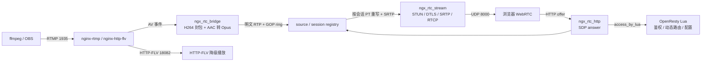

# RTMP 转 WebRTC 方案改进建议

> 依据：2026-09-09 对 nginx / OpenResty 开源模块的联网调研，以及对
> `ngx-rtc-module/src/`、`openresty-rtmp-new/nginx/conf/nginx.conf` 的只读核对。
> 本文件只给改进方向和理由，不重复 `evaluation-report.md` 的逐行问题清单。

## 1 结论

调研确认：不存在可复用的成熟 nginx 进程内 RTMP 转 WebRTC 模块，也不存在可承载
WebRTC 媒体面的 `lua-resty-*` 模块。因此当前“OpenResty 做接入与信令、纯 C 模块做
RTP/STUN/DTLS/SRTP 媒体面、以 SRS 协议栈为参考”的主线不应推翻，应继续保留并做
生产化收敛。

改进方向概括为三件事：

1. 明确分工：Lua/OpenResty 只做鉴权、信令路由、动态配置和负载均衡，不做媒体面。
2. 把 SRS 已经验证过的生命周期、线程隔离、会话回收、弱网恢复能力补齐到当前 C 模块。
3. 优先消除会直接影响上线质量的问题，再考虑多 worker 扩展，不提前引入过度设计。

## 2 调研对方案的约束

| 调研结论 | 对方案的直接约束 |
| --- | --- |
| 无成熟的 nginx 进程内 RTMP 转 WebRTC 模块 | 自研 C 媒体面仍是一条无现成替代路径，不能指望换一个模块完成 |
| `nginx-rtmp-module` / `nginx-http-flv-module` 只覆盖 RTMP/HTTP-FLV | 它们适合继续承担推流接入和 HTTP-FLV 兜底，但 WebRTC 能力必须留在自研模块或独立媒体服务 |
| 无 `lua-resty-webrtc/rtmp/sdp/dtls/stun/turn` 可用模块 | 媒体协议栈不能下放到 Lua，Lua 层应只保留 HTTP/WebSocket 信令 |
| OpenResty 有通用 UDP 服务能力但无 SRTP/DTLS/SDP/RTP 封装 | 不能用纯 Lua 拼一个 WebRTC SFU，成本和可靠性不可控 |
| SRS 是本方案协议栈的事实参考系 | 应继续逐项对照 `SrsFrameToRtcBridge`、`SrsRtcRtpBuilder`、`SrsAudioTranscoder`、`SrsSdp`、`SrsRtcConnection` 补齐实现 |

## 3 推荐的目标架构

边界原则：

- 信令和控制面：OpenResty Lua。
- 媒体面和协议栈：纯 C nginx 模块，继续借鉴 SRS。
- 跨 worker 共享状态：后续才引入 `ngx_shm_zone`，当前先保持单 worker。

## 4 分阶段改进建议

### 4.1 第一阶段：生产化正确性与生命周期收敛

优先级最高，目标是让方案在“多观众、长期运行、断流重推、异构浏览器”下可靠。

1. 补全 source 生命周期。
   当前 `ngx_rtc_core.c` 的 `ngx_rtc_source_get()` 只会插入，没有对应的
   `ngx_rtc_source_remove()`，GOP ring 也只在首次 RTP 到达时 `calloc`。应增加：
   - `ngx_rtc_source_remove()`，释放 ring、音频转码器并移出 rbtree；
   - RTMP publish stop/close 时调用，断流重推时重置 video/audio seq、SSRC、PT 和音频时间戳；
   - 保留最近一个有效 source 而不是无限累积唯一流名。
   理由：当前唯一流名或频繁重推会线性泄漏约 2.4 MB/路的 ring 内存，并导致重推后 RTP
   seq 和时间戳不单调，订阅者可能解码错乱。

2. 补齐 DTLS 弱网行为。
   当前 `ngx_rtc_dtls.c` 只被动 `SSL_read`，没有 `DTLSv1_handle_timeout`，也没有首包
   cookie/HelloVerifyRequest。建议：
   - 首包改用 `DTLSv1_listen()` 获取无状态 cookie；
   - 握手期间用 `ngx_add_timer` 驱动 OpenSSL 重传；
   - 把 cipher 从 `ALL` 收紧到 DTLS 1.2 + 非匿名非空算法；
   - DTLS 证书改为配置提供或 master 进程生成一次，避免每个 worker 指纹不同。
   理由：公网丢包时末段 flight 丢失会挂住握手；每个 worker 独立生成 RSA-2048 既慢又会让
   HTTP 信令返回的 fingerprint 与实际 UDP worker 不一致。

3. 修正配置和端口可移植性。
   - 不要把 `172.16.48.122` 作为仓库内默认 candidate IP，改为空值或由 `run.sh`
     自动探测后注入，生成文件单独管理；
   - `NGX_RTC_AUDIO_BITRATE`、`NGX_RTC_RTCP_SR_INTERVAL_MS`、握手/ready 超时等
     `#define` 提升为 nginx 指令，并给 `NGX_CONF_UNSET` 默认值；
   - 构建脚本去掉 `/home/dgliu/workspace/webrtc/third` 这类绝对路径假设，改为相对
     项目根或环境变量。
   理由：当前配置在换机器后 candidate IP 失效，参数调整需要改源码重新编译。

4. 处理发送失败与突发回放。
   `ngx_rtc_core.c` 的 `c->send` 返回值被忽略，UDP `EAGAIN/ENOBUFS` 会静默丢包；
   GOP 回放和 PLI 可能一次突发最多 2048 包。建议至少记录/计数发送失败，并对回放加入
   简单 pacing 或按 RTT 限速。
   理由：不处理背压会在观众集中加入或 PLI 重传时打爆客户端 jitter buffer。

5. 补齐针对上述行为的 host 单测。
   现有 `ngx-rtc-module/test/` 已覆盖 rtp/stun/sdp/rtcp/hsm/avsync 等 59 项，
   应继续增加 STUN 长度边界、DTLS 定时器驱动、source remove/re-publish、SDP offer
   子集校验、NACK 命中与串流隔离用例。
   理由：这些是纯 C 协议核心，host 测试成本低，能避免端到端偶发才能暴露的问题。

### 4.2 第二阶段：事件循环外的 CPU 密集工作

当前 AAC 到 Opus 的 FFmpeg 解码、重采样和 Opus 编码同步运行在 nginx worker 事件循环
里。单路测试可以接受，但多路推流会互相挤压。

建议采用 nginx SRT module 已验证的工程模式：独立线程或线程池执行转码，通过 eventfd
或 nginx 通知机制把结果送回 worker 事件循环。DTLS 握手计算量大时也可评估同模型。

理由：这是“把 SRS 协议栈塞进 nginx worker”与“独立媒体进程”相比最核心的工程风险，
不应长期依赖“每帧只有数百微秒”的乐观假设。

### 4.3 第三阶段：多 worker 扩展

当前 `worker_processes 1` 与进程内 rbtree/队列实现一致。若单 worker 吞吐不足，需要：

1. 用 `ngx_shm_zone` 承载跨 worker 的 source/session 索引；
2. 每 worker 保留私有 DTLS/SRTP 扩展表；
3. `reuseport` 配合一致性哈希，保证同一观众的 HTTP 信令与 UDP 数据报落在同一 worker；
4. DTLS 证书统一由配置或 master 生成，避免 worker 间 fingerprint 漂移。

已有 `docs/multi-worker-shm-design.md`，实施时以该文件为准。不要在尚未验证单 worker
上限前提前改造。

## 5 建议保留与不建议做的事

建议保留：

- RTMP/HTTP-FLV 接入继续使用成熟模块，作为直播兼容和降级通道；
- 信令鉴权继续放在 OpenResty Lua，用 `access_by_lua_file` 复用 stream key；
- 纯 C 核心保持与 nginx 解耦，便于 host 单测；
- 继续以 SRS 为协议正确性参照，避免自创 STUN/DTLS/SRTP/RTP 细节。

不建议做：

- 用 `lua-resty-*` 实现 WebRTC 媒体面，调研确认没有可用模块，且媒体路径不应过 Lua；
- 等待或寻找一个现成 nginx WebRTC 模块替代当前方案，当前不存在成熟替代；
- 长期保留 HSM 空 action 与 stream 模块内联逻辑的双份状态源，应择一收敛；
- 在正确性和生命周期问题未修复前，把精力投向复杂多 worker 或额外协议能力。

## 6 验收标准

建议按以下闭环验证：

| 场景 | 验收项 |
| --- | --- |
| 断流重推 | source 被回收或正确复位，重推后浏览器可重新订阅，seq/时间戳单调 |
| 异构浏览器 | 两个 offer PT 不同的观众均能完成 SDP 协商并出画面 |
| 弱网 | DTLS 丢包重传成功，NACK/PLI 命中且只重传对应视频 track |
| 长时间运行 | 唯一流名增加和观众连接断开不会线性增长内存或耗尽 UDP 连接槽 |
| 配置迁移 | 换机器后无需改源码，仅靠配置和 `run.sh` 生成运行配置 |
| 单元测试 | `ngx-rtc-module/test/run_tests` 通过，并新增上述协议边界用例 |
