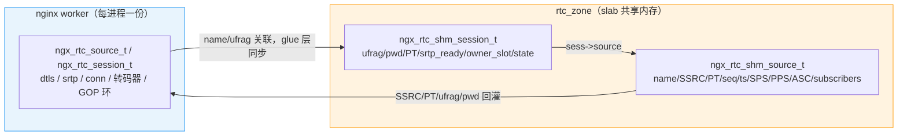

# nginx-rtc-module 多 worker 共享内存设计

模块通过 nginx 原生 `ngx_shm_zone` + `ngx_slab_pool` + `ngx_shmtx` 提供跨 worker 共享内存，
以 `rtc_zone rtc 32m;` 声明单 zone。共享内存承载跨 worker 必需的元数据与媒体缓存；
DTLS/SRTP/连接/转码句柄保留在进程内，随 worker 生命周期创建与销毁。

## 1. 状态分层与 zone 布局

`rtc_zone` 内只放值类型与指向其它 shm 分配的指针，`ngx_rtc_shm_ctx_t` 根表存于 `shpool->data`：

```c
typedef struct {
    ngx_slab_pool_t       *pool;       /* == shm_zone->shm.addr */
    ngx_rbtree_t           source_tree; /* 按 name，ngx_str_node_t */
    ngx_rbtree_node_t      source_sentinel;
    ngx_queue_t            source_list;  /* 全量 source，GC/统计 */
    ngx_queue_t            session_list; /* 全量 session 骨架，按 ufrag 线性查 */
    ngx_rtc_shm_ring_t    *rings[NGX_MAX_PROCESSES];    /* 每 worker 媒体环 */
    ngx_fd_t               notify_fd[NGX_MAX_PROCESSES]; /* 每 worker eventfd */
    ngx_uint_t             next_session_id;
    ngx_uint_t             nworkers;
    ngx_uint_t             ring_slots;
    uint32_t               layout;      /* == NGX_RTC_SHM_LAYOUT */
} ngx_rtc_shm_ctx_t;
```

进入 shm 的状态：source/session 骨架、广播 SSRC/PT/seq/ts、SPS/PPS/ASC、
订阅关系、per-worker 媒体分发环、per-source 重传环、跨 worker 唤醒 fd。

**刻意留在进程内**（不可跨进程）：`ngx_rtc_source_t` / `ngx_rtc_session_t` 完整结构，
含 `SSL*`/`BIO*`（DTLS）、`srtp_t`（libsrtp2 不透明句柄）、`ngx_connection_t*`、
`peer_addr`、音频转码器（FFmpeg/libopus 堆句柄 + pthread）、封装 scratch buffer、
同 worker GOP 环。媒体热路径（封装、GOP、SRTP、RTCP）继续使用进程内结构，
shm 骨架按 name / ufrag 关联为跨 worker 权威元数据。



`ngx_rtc_core_module.c` 以 NGX_CORE_MODULE 提供 `rtc_zone` 指令，`ngx_rtc_core_init_zone`
照 `ngx_http_limit_req_init_zone` 三段式初始化，根表指针写入 `shpool->data`：

1. `octx != NULL`（reload 有旧 data）：续用 `octx->sh` / `octx->shpool`，返回 layout 校验。
2. `shm_zone->shm.exists`（shm 已存在但无旧 cycle data，如 master 崩溃重启）：取 `shpool->data`，同样返回 layout 校验。
3. 首次：slab 分配根表，初始化红黑树/队列，记录 `nworkers`/`ring_slots`，为每个 worker 调用
   `ngx_rtc_shm_ring_init` 分配媒体环，`notify_fd[]` 置 -1。

**layout 标签**：`NGX_RTC_SHM_LAYOUT`（当前 3）。zone 生命周期跨越 reload 与 master 重启，
两条 reuse 分支都无法判断新二进制是否期望不同偏移，故都调用 `ngx_rtc_shm_layout_check`；
不匹配时 `NGX_LOG_EMERG` 记日志并返回 `NGX_ERROR` 拒绝启动，而不是把旧 struct 当新 struct 静默读下去。
任何可达结构的布局变化都必须递增该常量。

## 2. source 与 session 骨架

`ngx_rtc_shm_source_t` 关键字段：`sn`（rbtree 节点，key = `crc32(name)`）、
`name`（`NGX_RTC_SHM_SOURCE_NAME_MAX` 128）、`publishing`、`publisher_kind`、
`expires`、`publisher_seen_ms`、`publisher_slot`、video/audio SSRC 与 PT、
`video_seq`/`audio_seq`/`video_ts`/`audio_ts`、SPS/PPS/ASC 及长度、
`subscribers` 队列与 `subscribers_version`、`remote_subscribers`、
`retransmit` 重传环指针。查找用 `ngx_str_rbtree_lookup`。

`ngx_rtc_shm_session_t` 关键字段：

- `owner_slot`：持有该 UDP 连接的 worker 槽位，-1 表示尚未绑定；只有 `owner_slot` 为 -1
  或等于当前 worker 时才允许删除骨架（`ngx_rtc_shm_session_remove_if_owner`）。
- `publishing` / `publisher_kind`：发布所有权对，权威在 shm，见第 3 节。
- `srtp_ready`：DTLS→SRTP 完成后由 `ngx_rtc_shm_session_activate` 置 1。
- `state`：`ngx_rtc_session_state_t`，追加在结构最后，只有持有 UDP 连接的 worker 可写
  （`ngx_rtc_shm_session_set_state`）。守卫接受 `owner_slot == -1` 或等于本 worker：
  单 worker 下 `bind()` 不执行，整个 ICE_BOUND 窗口 `owner_slot` 都是 -1。
  `CLOSED` 永不写入，关闭的骨架在 `ngx_rtc_shm_expire_locked` 直接释放，
  可观测的“已关闭”是它从 `session_list` 消失。
- `expires`：毫秒绝对时间，0 表示不过期，用于半开 session 回收。
- `close_requested`：管理端踢人标志，owner worker 下次 reap 时关闭。

session 骨架还镜像 ufrag/pwd/PT/twcc 扩展 id 与丢包/码率计数器。`state` 的唯一消费者是
`/rtc/v1/stats`，按 `session_list` 过滤 `sess->source` 输出。

## 3. 发布所有权

`publishing` / `publisher_kind` 在 shm 与进程内各存一份：shm 为仲裁权威
（`ngx_rtc_shm_source_try_publish` / `ngx_rtc_shm_source_release_publish`），
进程内为媒体路径免锁读取的镜像。镜像的唯一写者是三个函数：

- `ngx_rtc_publish_claim(src, kind)`：取得发布权；`NGX_BUSY` 表示另一协议已持有。
- `ngx_rtc_publish_release(src)`：释放本进程持有的发布权，幂等，各 teardown 路径可无条件调用。
- `ngx_rtc_publish_mirror(src, kind)`：采纳另一 worker 已持有的所有权，不再 claim。

`publisher_kind` 取 `NGX_RTC_PUBLISHER_NONE` / `_RTMP` / `_WHIP`，同一 source 同时只允许一个发布者，
跨协议抢占被拒绝，避免一方 close 释放另一方的 shm 缓存。

**心跳与超时**：发布 worker 在 `ngx_rtmp_rtc_shm_stats()` 中逐包无锁刷新 `publisher_seen_ms`。
worker 崩溃未走 release 时心跳冻结，reaper 静默超过 `NGX_RTC_SHM_PUBLISH_GRACE_MS`（10000ms）
即判定发布者已死，清 `publishing` / `publisher_kind` 后按普通空 source 规则回收其重传环。

**释放前引用检查**：`subscribers` 为空不足以释放 source——未完成握手的 session 还不是订阅者，
WHIP 发布者也从不进入订阅列表。`ngx_rtc_shm_source_referenced_locked()` 遍历 `session_list`，
确认没有任何 session 骨架的 `source` 指针仍指向它；显式 remove 与 reaper 都以此为准。

## 4. 媒体分发：MPSC 环与跨 worker 唤醒

SDP/信令 worker 完成 H264→RTP 封装后，明文 RTP 需送达各播放 worker 再逐 session 加密。
同 worker 目标直接本进程 SRTP + send；跨 worker 目标按 `owner_slot` 分组写入目标 worker 的
`ngx_rtc_shm_ring_t`，并写 eventfd 唤醒。

```c
typedef struct {
    ngx_atomic_t          head;      /* 生产者推进 */
    ngx_atomic_t          tail;      /* 消费者推进 */
    ngx_shmtx_t           mtx;       /* per-ring 锁，指向 mtx_sh */
    ngx_shmtx_sh_t        mtx_sh;
    ngx_uint_t            size;      /* 2 的幂槽位数 */
    ngx_uint_t            mask;
    ngx_rtc_ring_entry_t  entries[1];
} ngx_rtc_shm_ring_t;
```

单条目定长约 2KB：`NGX_RTC_RING_MAX_SESSIONS`（64）个目标 shm session id +
`NGX_RTC_RING_RTP_MAX`（1500）字节明文 RTP + 头。一个 worker 的环会被多个 source 的生产者写入，
故入队为 MPSC，每环一把独立 `ngx_shmtx_t` 保护 head，与注册表的 `pool->mutex` 分离，
避免每帧抢全局自旋锁。环满（`head - tail == size`）时丢帧而非阻塞，并累加 `ring_drops` 计数。

跨 worker 唤醒不用 `ngx_notify`：它是进程内 eventfd，只能唤醒本 worker。模块在
`ngx_rtc_core_init_module`（master、fork 之前）为每个 worker 建 eventfd，所有 worker 继承全部 fd 且
fd 号一致，任何 worker 都能写任意目标。fd 存入 `ctx->notify_fd[]`，消费者在
`ngx_rtc_stream_init_process` 注册读事件，handler 读 eventfd 清计数后调用
`ngx_rtc_stream_drain_ring()` 读环至空。

## 5. per-source 重传环

`ngx_rtc_shm_retransmit_t` 是定长环，`NGX_RTC_SHM_RETX_RING_CAP`（1024）槽，每槽
`len` + `is_gop_start` + 1500B 明文 RTP，按 RTP seq 索引；`head` / `count` / `gop_start`
记录写游标与最近 IDR 起点。发布者逐包 append，任意 worker 可经 `ngx_rtc_shm_retransmit_get`
（按 seq）或 `ngx_rtc_shm_retransmit_replay_gop`（重放最近 GOP）应答 NACK/PLI。

环懒分配，仅当 `remote_subscribers > 0`（存在跨 worker 观众）时启用；否则 append 走
无 viewer 快路径，跳过 slab 池锁与 rbtree 查找。**环的所有槽位读写都在 `pool->mutex` 下，
不引入独立锁**：source 释放时在同一临界区内与环一并 `ngx_slab_free_locked`，
因此该 mutex 同时承担环的生命周期保证——不存在“source 已释放、环仍被读”的窗口。
新发布或流重启时 `ngx_rtc_shm_retransmit_reset` 清空环。

## 6. Reaper、GC 与锁序

`ngx_rtc_stream_reap_timer` 周期调用 `ngx_rtc_shm_expire(ctx, forced)`：

- 未绑定（`owner_slot == -1`）且 `expires` 已到的 session 骨架直接释放；
  HTTP 侧新建时按 `NGX_RTC_SHM_SESSION_EXPIRE_MS`（30s）起半开计时。
- 空非发布 source 超过 `NGX_RTC_SHM_SOURCE_EXPIRE_MS`（10s）回收。
- 发布 source 先按 `publisher_seen_ms` 与 `NGX_RTC_SHM_PUBLISH_GRACE_MS` 判活（见第 3 节）。
- 回收 source 前要求 `subscribers` 为空**且** `ngx_rtc_shm_source_referenced_locked()` 为假；
  被引用而暂缓的 source 保留已到期的 `expires`，最后一个引用消失后的首轮清扫即回收。
- 分配失败时以 `forced=1` 跳过到期判定，立即清扫全部可回收项。

**锁序**：注册表与重传环在 `pool->mutex` 下直接调用 slab `*_locked` API；媒体环热路径只持
`ring->mtx`。两条锁链在热路径互不嵌套。唯一同时涉及两者的是环初始化
`ngx_rtc_shm_ring_init`：持 `pool->mutex` 完成 slab 分配后即释放，之后热路径不再触碰池锁。
因此允许的方向是 `pool->mutex` -> `ring->mtx`，禁止反向；per-source 锁不属于当前实现。

## 7. 容量与配置

| 常量 | 值 | 作用域 |
|------|----|--------|
| `NGX_RTC_SHM_RETX_RING_CAP` | 1024 槽 | shm，per-source，仅跨 worker 观众存在时懒分配 |
| `NGX_RTC_RING_DEFAULT_SLOTS` | 512 槽 | shm，per-worker 媒体环，`rtc_ring_slots` 可覆盖 |
| `NGX_RTC_RING_MAX_SESSIONS` | 64 | 媒体环单条目的目标 session 上限 |
| `NGX_RTC_GOP_RING_CAP` | 2048 槽 | 进程内，per-source，约 2.4MB，覆盖 1-2s 1080p GOP |
| `NGX_RTC_SOURCE_MAX_SNAPSHOT` | 256 | 进程内，per-source 免锁订阅者快照上限 |

估算：source 骨架约 1KB，session 骨架约 400B；重传环 `1024 × ~1.5KB ≈ 1.5MB/source`；
媒体环 `512 × ~2KB ≈ 1MB/worker`。`rtc_zone 32m` 对单 source、单分辨率部署有余量，但对
多 source / 多分辨率部署偏紧：每个存在跨 worker 观众的 source 都会带来一条 1.5MB 重传环，
每 worker 一条约 1MB 媒体环，叠加多路转码后总量按
`N_worker×1MB + N_cross_source×1.5MB + 源/会话数×(1KB / 0.4KB)` 增长，
配置时应按上限预留而非按单路估算。

部署配置位于 `deploy/nginx/conf/nginx.conf`（`worker_processes 2;`、`rtc_zone rtc 32m;`）。

## 8. 关键文件

以下文件都在模块仓 `nginx-rtc-module/src/`（末条在 `test/`）：

- `ngx_rtc_shm.h` / `ngx_rtc_shm.c`：shm 注册表、source/session 骨架、媒体环、重传环、发布所有权。
- `ngx_rtc_core_module.c`：`rtc_zone` 指令、zone 三段式初始化与 layout 校验、pre-fork eventfd。
- `ngx_rtc_core.h` / `ngx_rtc_core.c`：进程内注册表与媒体平面主用结构。
- `ngx_rtc_http_module.c`：SSRC/PT 权威、session 骨架创建。
- `ngx_rtc_stream_module.c`：STUN attach、DTLS done 激活、reap timer、环消费。
- `ngx_rtmp_rtc_bridge_module.c`：shm 同步、发布 claim/release、环入队与 eventfd 唤醒。
- `test/test_shm.c`：shm 注册表的 host 单测覆盖。
