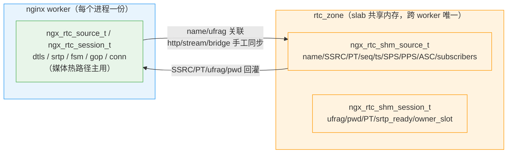
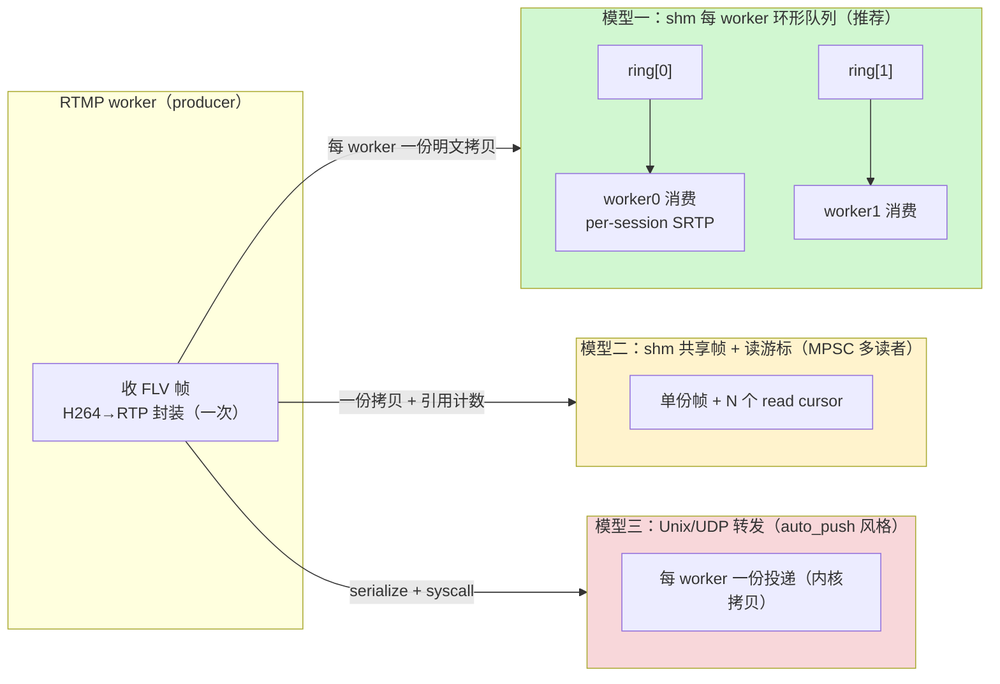

# ngx-rtc-module 多 worker 共享内存方案设计

> 结论先行。本文给出多 worker 痛点、三种方案对比、共享数据结构设计、媒体数据分布、跨 worker 唤醒机制与实现分解。
> 所有 nginx 源码行号基于 `/home/dgliu/workspace/webrtc/openresty-1.31.1.1/bundle/nginx-1.31.1/`，
> 模块代码基于 `/home/dgliu/workspace/webrtc/nginx-rtc-module/`。
>
> **实现说明**：采用「双 registry 镜像」方案（见 0.4），与本文第 4 节原始「单一 registry + 私有扩展」
> 方案存在偏差；shm 媒体环 + 跨 worker eventfd 唤醒已实现并端到端验证。锁粒度/GC 方面：每 ring 独立锁
> （`ring->mtx`）、source 空/断连回收、`expires` 超时回收（无 LRU）、环满丢帧埋点（`ring_drops`）、
> per-source GOP 重传环下沉 shm（`ngx_rtc_shm_retransmit_t`）、同 worker 直发快路径均实现；
> 每 source 锁、ring 无锁 CAS、LRU 强淘汰为扩展项。跨机 relay 为可选扩展。

## 0. 结论

1. **状态共享（推荐且唯一合理路径）**：采用 nginx 原生 `ngx_shm_zone` + `ngx_slab_pool` + `ngx_shmtx`，
   把 source 元数据、session 骨架（身份 + PT + 就绪标志 + 订阅关系）、SSRC/PT、seq/ts 计数器、SPS/PPS/ASC
   放进共享内存。这与 `ngx_http_limit_req_module`、`ngx_stream_limit_conn_module` 的官方做法完全一致，
   天然获得 slab 分配器、自旋锁、reload/二进制升级的 `shm.exists` 续用语义。
2. **私有状态绝不进 shm（实际采用双 registry 镜像）**：session 里的 `SSL*/BIO*`（DTLS）、`srtp_t`、
   `ngx_connection_t*`、`peer sockaddr`、AAC→Opus 转码器都是进程内指针/句柄。实际落地没有做
   「shm 骨架 + 每 worker 私有扩展表」的单一 registry 拆分，而是**完整保留**进程内
   `ngx_rtc_source_t` / `ngx_rtc_session_t`（含全部私有状态，媒体热路径继续用它），另建 shm 骨架
   `ngx_rtc_shm_source_t` / `ngx_rtc_shm_session_t` 只存跨 worker 必需元数据，两者按 name/ufrag 关联。
   理由与取舍见 0.4。
3. **媒体数据本体放 shm 环形队列，不逐个 session 拷贝**：RTMP worker 完成一次
   H264→RTP 封装后，把明文 RTP 包 + 目标 session 列表写入**每个目标 worker 一个 MPSC 环形队列**，
   由目标 worker 消费并做 per-session SRTP 加密发送。零拷贝到 socket 不可能——SRTP 每 session 密钥不同、
   必须就地变换，因此「每 worker 一份明文拷贝」是理论下界。
4. **跨 worker 唤醒不能用 `ngx_notify`**：`ngx_notify` 是**进程内** eventfd
   （`ngx_epoll_module.c:386-430`），只能唤醒本 worker。跨 worker 唤醒用 **master 在 fork 前创建的
   per-worker eventfd 数组**（所有 worker 继承全部 fd，可互写），fd 号存入 shm；写环后写 8 字节唤醒目标 worker。
5. **全程只改模块，不改 nginx/http-flv 源码**，最小改动。
6. **封装模板**：source/session 注册表照搬 `ngx_http_limit_req_init_zone` 三段式 zone 初始化 + 全局
   `shpool->mutex`；`expires` 超时回收已实现，LRU 淘汰未实现（显式 remove + 定时/分配压力清扫，见 3.7）。

### 0.4 关键偏差：双 registry 镜像（实际落地方案）

设计文档原方案是「session/source 拆成 shm 骨架 + 每 worker 私有扩展」，即**单一 registry**：shm 骨架作为唯一
权威，`priv` 挂在骨架地址上。实际落地为**双 registry 镜像**：

- 进程内 `ngx_rtc_source_t` / `ngx_rtc_session_t`（`ngx_rtc_core.h`）完整保留，dtls/srtp/fsm/gop/conn 等
  私有状态与媒体热路径（封装、GOP 环、SRTP、RTCP）继续用它，每个 worker 各自维护一份。
- 新增 shm 骨架 `ngx_rtc_shm_source_t` / `ngx_rtc_shm_session_t`（`ngx_rtc_shm.h`），只存
  name / SSRC / PT / seq / ts / sps / pps / asc / ufrag / pwd / srtp_ready / owner_slot / subscribers，
  作为跨 worker 的权威元数据镜像；两者通过 name / ufrag 关联。

取舍：

- **改动最小**：不重构媒体热路径与 session 生命周期，只增 shm 层，http/stream/bridge 各加几处同步。
- **单 worker 可逐步演进**：`ngx_rtc_core_get_conf()->sh == NULL`（未配 `rtc_zone`，函数本身仍返回非 NULL 的 conf）时走原进程内路径，功能不回退。
- **媒体热路径不跨 shm**：每帧不碰 shm 锁，避免把全局自旋锁引入每帧发送。

代价：SSRC/PT/seq/SPS/PPS 等元数据出现「进程内 + shm」两份，需手工保持一致；媒体环（`ngx_rtc_shm_ring_t`，
Phase 2 已落地，见 5、7.2）的生产/消费两端仍各自持有进程内 source/session，shm 骨架只负责身份与订阅关系，
媒体环按 `owner_slot` 分组即可，无需推翻本方案。集成方式见 5.6。

---

## 1. 现状与痛点

### 1.1 单 worker 基线

`ngx_rtc_core.c` 用**进程内**注册表保存全部状态（`/home/dgliu/workspace/webrtc/nginx-rtc-module/src/ngx_rtc_core.c`）：

- source：`ngx_rbtree`（`ngx_str_node_t`，key = `crc32("app/stream")`），`ngx_rtc_source_get()` 查找/新建；
- session：全局 `ngx_queue_t` 链表 + `ngx_rbtree`（key = ICE ufrag），`ngx_rtc_session_find()` 按 ufrag 查找；
- subscriber：每 source 一个 `ngx_queue_t`。

session 由 `ngx_rtc_http_module.c` 用 `ngx_alloc` 分配，跨 HTTP 请求存活。部署配置
`openresty-rtmp-new/nginx/conf/nginx.conf` 曾显式 `worker_processes 1;`，注释写明「RTC source/session 注册表是每进程的」。

> 多 worker 方案下 `ngx_rtc_core.c/h` 的进程内注册表**仍然保留**，作为媒体平面（封装/GOP/SRTP/RTCP）的
> 主用注册表；shm 只镜像跨 worker 元数据，见 1.4 与 0.4。

三类流量落在哪个 worker 由 nginx 事件分发决定，彼此无关联：

| 流量 | 模块 | 触碰的状态 |
|------|------|-----------|
| RTMP 推流（1935） | `ngx_rtmp_rtc_bridge_module.c` | source 查找/新建、SPS/PPS/ASC 缓存、seq/ts 推进、遍历 subscribers 发 RTP |
| HTTP 信令（18082 `/rtc/v1/play/`） | `ngx_rtc_http_module.c` | source 查找/新建、分配 SSRC/PT、session 新建（ufrag/pwd） |
| UDP 媒体（8000 STUN/DTLS/SRTP） | `ngx_rtc_stream_module.c` | 按 ufrag 找 session、绑定 conn、DTLS/SRTP、置 `srtp_ready`、订阅 source |

### 1.2 多 worker 下必然破裂的状态

开启 `worker_processes auto` 后，以下五类状态必须跨 worker 可见，否则功能直接失效：

1. **source 注册表**：HTTP worker 第一次 play 时创建 source 并分配 SSRC/PT，RTMP worker 收帧时若查不到同一
   source，会重复创建并分配另一套 SSRC/PT，导致 SDP 与 RTP 不一致，浏览器解码失败。
2. **session 注册表**：HTTP worker 生成 ufrag 写入 SDP answer，但 STUN/DTLS 报文落在 UDP worker，
   后者 `ngx_rtc_session_find(ufrag)` 必须能找到 HTTP worker 创建的 session（`ngx_rtc_stream_module.c:192`）。
3. **SSRC/seq/ts 计数器**：SSRC/PT 由 HTTP 分配、RTMP 使用；`video_seq` 每发一包自增。若 RTMP 推流重连落到
   不同 worker，seq 必须连续，否则 RTP 流断流、需重新关键帧。
4. **GOP/序列头缓存（SPS/PPS/ASC）**：RTMP worker 解析 AVCDecoderConfigurationRecord 缓存 SPS/PPS
   （`ngx_rtmp_rtc_bridge_module.c:147-194`），IDR 前要 STAP-A 前置；推流重连换 worker 后若缓存丢失，
   新订阅者无法起播。
5. **订阅关系与就绪标志**：`source->subscribers` 链表和 `sess->srtp_ready` 是 RTMP worker 判断
   「给谁发、往哪个 worker 发」的唯一依据。

### 1.3 不能跨 worker 的状态（必须留私有）

`ngx_rtc_session_s` 内嵌了不可跨进程的句柄/指针（`ngx_rtc_core.h:22-42`）：

| 字段 | 类型 | 为何不能进 shm |
|------|------|---------------|
| `dtls` | `ngx_rtc_dtls_t`（`SSL*`、`BIO*`） | OpenSSL 堆对象指针，只对创建它的进程有意义 |
| `srtp` | `ngx_rtc_srtp_t`（`srtp_t recv/send_ctx`） | libsrtp2 不透明句柄，内部为堆指针 |
| `conn` | `void*`（`ngx_connection_t*`） | nginx 连接对象在进程内存池 |
| `peer_addr` | `struct sockaddr*` | 指向 `c->sockaddr`，进程内地址 |
| 音频转码器 | `ngx_rtc_audio_worker_t`（FFmpeg/libopus 堆句柄 + pthread） | 同理，仅属 RTMP worker |

结论：**私有句柄绝不能进 shm**，但实际方案不是「单一 shm 骨架 + priv 扩展表」，
而是**双 registry 镜像**——进程内 `ngx_rtc_source_t`/`ngx_rtc_session_t` 完整保留（含 dtls/srtp/fsm/gop/conn/
scratch/转码器），shm 骨架只存跨 worker 必需的身份/PT/就绪/订阅元数据，见 1.4。

### 1.4 实现结构（双 registry）

`rtc_zone` 指令 + `ngx_rtc_core_module`（NGX_CORE_MODULE）+ slab zone 三段式初始化（`ngx_rtc_core_init_zone`，
照 limit_req 模板）已从 `ngx_rtc_shm.c` 拆到 `src/ngx_rtc_core_module.c`；`ngx_rtc_shm.c` 现为纯数据结构
注册表，不感知 nginx config 与模块身份（因此可被 host 单测编译，见 7.0），只定义 `ngx_rtc_shm_ctx_t`
与 source/session 骨架。shm 内两类骨架：

| shm 结构 | 内容 | 关联方式 |
|---------|------|---------|
| `ngx_rtc_shm_source_t` | name / publishing / video·audio SSRC+PT / seq / ts / SPS / PPS / ASC / 计数 / subscribers 队列 | 按 name（`ngx_str_rbtree`） |
| `ngx_rtc_shm_session_t` | ice_ufrag / ice_pwd / video·audio PT / srtp_ready / owner_slot / source 指针 | 按 ufrag（`ngx_queue` 线性查） |

与进程内注册表的镜像关系：



同步点（glue 层）：

- **http**：SSRC/PT 权威在 shm（先 `ngx_rtc_shm_source_get`，`video_ssrc==0` 才分配并写回 shm）；
  play 时 `ngx_rtc_shm_session_add` 加 session 骨架。
- **stream**：STUN 进程内查不到时 `ngx_rtc_stream_attach_from_shm` 从 shm 重建私有 session
  （alloc + 拷 ufrag/pwd + fsm init + 重建 source）；DTLS done 时更新 shm（`srtp_ready=1`、
  `owner_slot=ngx_worker`、subscribe）；close 时仅 `owner_slot==-1`（半开）或 `owner_slot==ngx_worker` 才删 shm 骨架。
- **bridge**：`ngx_rtmp_rtc_sync_shm` 从 shm 同步 SSRC/PT（推流先来则分配写 shm）；
  close_stream 同步 shm `publishing=0` + remove。

---

## 2. 方案对比

### 2.1 候选方案

| 维度 | A. ngx_shm_zone + slab + shmtx | B. 直接 mmap 自管理 | C. 进程间 UDP/Unix 通知转发（auto_push 风格） |
|------|-------------------------------|--------------------|---------------------------------------------|
| 分配器 | `ngx_slab_pool`（小对象免碎片、`_locked` 变体） | 自己写 free-list/伙伴算法 | 不需要 |
| 锁 | `ngx_shmtx` 自旋锁 + POSIX sem 睡眠回退 | 自己写锁 | 不需要 |
| reload/二进制升级 | `shm.exists` + `oshm_zone->data` 续用，官方路径 | 完全自己处理重映射 | 不需要 |
| 地址一致性 | nginx 强制各进程映射同地址（`ngx_cycle.c:1002` 校验），可直接存裸指针 | 自己保证 | 无关 |
| 媒体分发 | 同 zone 里划 ring 或额外 slab 大块 | 自定义 ring | 每 worker 重新投递（内核拷贝 + 序列化） |
| 跨机器扩展 | 无 | 无 | 天然支持（relay） |
| 工作量/风险 | 低，全部复用 nginx 原生 | 高，重造 slab+锁+生命周期 | 中，但媒体路径每帧多 syscall、延迟和 CPU 差 |

### 2.2 结论

**推荐 A（ngx_shm_zone + slab + shmtx）**，理由：

1. `ngx_slab_alloc_locked` / `ngx_slab_free_locked`（`src/core/ngx_slab.c:184/461`）正是为跨进程小对象设计，
   source/session 都是几百字节的小对象，slab 完美匹配。
2. `ngx_shmtx_lock`（`src/core/ngx_shmtx.c:70`）自带「多核自旋 + 单核 yield + POSIX sem 睡眠」退化，
   临界区按 nginx 约定「短促」即可，官方模块证明可用。
3. `ngx_shared_memory_add`（`src/core/ngx_cycle.c:1312`）与 `shm_zone->init`（`src/core/ngx_cycle.c:973`
   `ngx_init_zone_pool`）自动处理 mmap、地址一致性、reload 续用，我们只需按
   `ngx_http_limit_req_init_zone` 的握手模板写一个 init 回调。
4. 方案 B 除了自由度高没有任何收益，且要重做 `ngx_slab_pool_t` 已提供的全部能力，违背「最小改动」。
5. 方案 C 本质是 nginx-rtmp 的 `rtmp_auto_push`（经 Unix socket 把流 push 给其他 worker），社区文档明确
   标注「对 nginx ≥1.7.2 不推荐」；且它仍绕不开「session 查找、SSRC/PT 一致性」等元数据共享问题，
   媒体又多一次内核拷贝。仅在未来「跨机器级联」时才考虑复用其思想，不作为本模块内部 IPC。

**注意一个易被误读的参考点**：任务里提到的 `nginx-http-flv-module/ngx_rtmp_shared.c` 并不是「跨 worker 帧广播」，
它实现的是**单 worker 内**带引用计数的 `ngx_chain_t` 缓冲池（`NGX_RTMP_REFCOUNT_BYTES` 引用计数），
服务于同进程内的 GOP 缓存与多订阅者复用，不含任何 shm。nginx-rtmp 真正的多 worker 方案是 auto_push
（进程间 relay），与本方案要解决的问题不同。这一事实必须澄清，避免照搬错误参考。封装的正确模板是
OpenResty `lua_shared_dict`，见第 3 节。

---

## 3. 借鉴 OpenResty lua_shared_dict 封装

OpenResty 的 `lua_shared_dict`（`/home/dgliu/workspace/webrtc/openresty-1.31.1.1/bundle/ngx_lua-0.10.31rc5/src/ngx_http_lua_shdict.c`）
是 nginx 生态里规模最大、被验证最多的「跨 worker 键值存储」，其结构与本模块 source/session 注册表高度同构：
**key = source 名 / session ufrag，value = 对应元数据**。以下逐项对照并给出本模块的推荐封装。

### 3.1 与注册表的映射关系

| lua_shared_dict 概念 | 本模块对应 | 差异 |
|---------------------|-----------|------|
| `ngx_http_lua_shdict_node_t`（key+value+expires+LRU 队列） | `ngx_rtc_source_t` / `ngx_rtc_session_t`（shm 骨架） | 本模块节点内还有跨节点指针（source↔session、subscribers） |
| 根表 `ngx_http_lua_shdict_shctx_t`（rbtree + lru_queue，存 `pool->data`） | `ngx_rtc_shm_ctx_t` | 额外存 notify_fd/ring 描述符 |
| `ngx_http_lua_shdict_ctx_t`（`sh` + `shpool`，挂 `shm_zone->data`） | 同构 | 同构 |
| 指令 `lua_shared_dict name size` | `rtc_zone rtc 32m;` | 同构 |
| 查找 `ngx_crc32_short` + rbtree + `ngx_memn2cmp` | source 按 name、session 按 ufrag | 同构 |
| `ngx_http_lua_shdict_expire(ctx, n)` 摊还清扫 | session/source 超时回收 | 见 3.4 |

### 3.2 zone 初始化与 slab 大小计算

`ngx_http_lua_shdict_init_zone`（`ngx_http_lua_shdict.c:70-121`）的三段式握手与 limit_req 完全一致，
本模块照抄即可：

1. `octx != NULL`（reload 有旧 data）：`ctx->sh = octx->sh; ctx->shpool = octx->shpool;` 直接续用。
2. `shm_zone->shm.exists`（shm 已存在但无旧 cycle data）：`ctx->sh = ctx->shpool->data;` 复用根表。
3. 首次：`ngx_slab_alloc` 分配根表 → `ngx_rbtree_init` + `ngx_queue_init(lru)` → 设置 `log_ctx`、
   `log_nomem = 0`，最后把根表指针写入 `ctx->shpool->data`。

关键点：**根表指针存 `shpool->data`，不依赖模块全局 C 变量**——reload/二进制升级/worker fork 后，
任何进程都能经 `shm_zone->shm.addr` 上的 `ngx_slab_pool_t.data` 拿到同一张表。这比「静态全局变量指向 shm」
更稳（本模块的 `ngx_rtc_shm_ctx_t` 同样存 `pool->data`）。

slab 大小：指令配置的 zone 尺寸是**总尺寸**，`ngx_slab_init`（`src/core/ngx_slab.c:98-165`）先扣掉
slots/stats/pages 元数据，余下才可分配。故 `rtc_zone 32m` 实际可用小于 32m，估算时要留 slab 头部开销
（约 1 页 + `n×sizeof(page)` + stats），详见 8.2。

### 3.3 锁粒度：全局 mutex，不预先分片

shdict 的所有操作（get/set/expire/lpush/lpop）都收敛到一把 `ngx_shmtx_lock(&ctx->shpool->mutex)`
（如 `ngx_http_lua_shdict.c:604,628,428,524`），临界区仅「rbtree 查/插 + slab 小对象分配/释放」，
几十~几百纳秒，未做分片。理由：写操作低频，读多写少，分片/每桶锁复杂度收益不成比例。

本模块的分层结论（与 shdict 一致但更明确）：

- **注册表元数据（source/session 的查/建/改/删）用同一把全局 `shpool->mutex`**。
- **媒体热路径（每帧 subscriber 快照 + seq/ts 推进）不学 shdict 用全局锁**——shdict 没有每帧热路径。
  媒体环已用 per-ring 独立锁（见 4.5、5.3）避免每帧全局自旋竞争。

### 3.4 条目生命周期：expire + LRU，先于引用计数

shdict 节点内嵌 `uint64_t expires`（毫秒绝对时间，0=不过期）与 `ngx_queue_t queue`（LRU）：
访问时移到队头（`ngx_http_lua_shdict.c:219-220`），过期从队尾淘汰。清理分两档：

- 摊还清扫：每次 get/set 前 `ngx_http_lua_shdict_expire(ctx, 1)`，顺带清 1~2 个已过期条目，O(1) 摊还。
- 强淘汰：slab 分配失败时（非 safe_store）循环最多 30 次 `ngx_http_lua_shdict_expire(ctx, 0)`（强制淘汰
  最旧）再重试分配（`ngx_http_lua_shdict.c:1500-1520`），天然防内存耗尽。

本模块借鉴：

- session 骨架带 `expires`：DTLS/播放超时（如 30s 未绑定 STUN 即过期回收）；source 带 `expires`：
  无发布者且无订阅者 N 秒后回收。
- 用 `expires` + `ngx_rtc_shm_expire(ctx, 0/1)` 清扫：worker reap 定时器周期调用非强制清扫，分配失败时
  forced=1 立即强淘汰重试。**未采用 LRU 队列**（shdict 的 LRU 未移植），**也不引入引用计数**——引用计数
  跨 worker 增删极易漏配对。
- 约束：source/session 之间有跨节点指针（subscribers），淘汰 source 前必须满足「`subscribers == NULL`、
  已过期，且没有任何 session 骨架的 `source` 指针仍指向它（`ngx_rtc_shm_source_referenced_locked`）」；
  session 私有扩展（SSL/srtp/conn）仍由 owner worker 在断连回调里释放，shm 骨架过期只回收 shm 内存。

### 3.5 变长条目：节点头部 + 内联 data

shdict 用「定长头部 + `u_char data[1]` 尾随 key+value」一次 `ngx_slab_alloc_locked` 分配变长条目，
长度 `n = offsetof(..., data) + key_len + value_len` 并对齐（`ngx_http_lua_shdict.c:889-901`）。
本模块 source/session 均为**定长结构**，直接 `sizeof(struct)` 分配即可；仅未来「变长 key / 变长 GOP 缓存」
才启用内联 data 技巧。shdict 还把 rbtree 节点的 `color` 字段复用为节点首部（`&node->color` 即节点起始），
省 8 字节，属可选优化，本模块第 1 版直接内嵌 `ngx_rbtree_node_t node;` 更清晰。

### 3.6 定时清扫与 UDP drain 借鉴

- **定时/摊还清扫**：`ngx_http_lua_timer.c` 用 `ngx_add_timer(ev, delay)` + `ev->handler`
  （`ngx_http_lua_timer.c:335,351,487`），periodic 在 handler 里重新 `ngx_add_timer`。本模块用
  `ngx_rtc_stream_reap_timer` 周期调用 `ngx_rtc_shm_expire(ctx, 0)` 做全量清扫，分配失败时以 forced=1
  立即清扫；未实现 get/set 摊还清扫，也未用 LRU。
- **UDP/环 drain**：`ngx_http_lua_socket_tcp.c` 的 cosocket 用 `c->recv(c, ...)` 读满直到 EAGAIN +
  `ngx_handle_read_event(c->read, 0)` 重挂读事件（`ngx_http_lua_socket_tcp.c:3062,3124`）。本模块
  eventfd 唤醒 handler 与环消费同构：读环到空、读 eventfd 清计数，不阻塞事件循环。

### 3.7 source/session 注册表封装

实际 API 见 `ngx_rtc_shm.h`，已按 shdict/limit_req 模板实现：

```c
ngx_rtc_core_conf_t *ngx_rtc_core_get_conf(ngx_cycle_t *cycle);  /* 未配 rtc_zone 时 ccf->sh == NULL（返回非 NULL） */
ngx_rtc_shm_source_t *ngx_rtc_shm_source_get(ctx, u_char *name, size_t len);  /* find-or-create */
void ngx_rtc_shm_source_remove(ctx, u_char *name, size_t len);
ngx_rtc_shm_session_t *ngx_rtc_shm_session_add(ctx, ufrag, ufrag_len, pwd, pwd_len,
        name, name_len, video_pt, audio_pt, twcc_video_ext, twcc_audio_ext, publishing);
ngx_int_t ngx_rtc_shm_session_bind(ctx, ufrag, len, slot, snapshot);       /* attach：绑定 owner + 拷快照 */
ngx_int_t ngx_rtc_shm_session_activate(ctx, ufrag, len, slot);            /* DTLS done：srtp_ready + 订阅 */
void ngx_rtc_shm_session_remove_if_owner(ctx, ufrag, len, slot);          /* owner 或未绑定才可删 */
ngx_uint_t ngx_rtc_shm_source_snapshot(ctx, name, len, ids, slots, max);  /* 就绪订阅者快照 */
/* 发布所有权：唯一写者，契约见 ngx_rtc_shm.h */
ngx_int_t ngx_rtc_publish_claim(ngx_rtc_source_t *src, ngx_uint_t kind);
void ngx_rtc_publish_release(ngx_rtc_source_t *src);
void ngx_rtc_publish_mirror(ngx_rtc_source_t *src, ngx_uint_t kind);
```

落地要点与偏差：

- 查找结构：source 按 name 用 `ngx_str_node_t` + `ngx_str_rbtree_lookup`（key=`crc32_long(name)`）；
  session 按 ufrag 用 **`ngx_queue_t` 线性链表**（当前 session 数量小，未上红黑树，与 3.7 原文
  「session 红黑树统一」有偏差）。
- 锁：所有 get/add/remove/bind/activate/snapshot 都是 `ngx_shmtx_lock(&pool->mutex)` +
  `ngx_slab_alloc_locked`，一把全局锁，临界区短促，与 shdict 一致。
- 生命周期：`expires` 超时回收已实现（`ngx_rtc_shm_expire`，无 LRU）。显式 remove 与 reaper 都要求
  `subscribers` 为空**且**没有 session 骨架的 `source` 指针仍指向它（`ngx_rtc_shm_source_referenced_locked`）；
  LRU 强淘汰仍为扩展项（见 3.4）。
- 发布所有权：`publisher_kind`/`publishing` 的唯一写者是 `ngx_rtc_publish_claim()` /
  `ngx_rtc_publish_release()` / `ngx_rtc_publish_mirror()`（进程内镜像）配 `ngx_rtc_shm_source_try_publish()` /
  `ngx_rtc_shm_source_release_publish()`（shm 权威），契约见 `ngx_rtc_shm.h`。
- 根表存 `pool->data`，reload 安全（三段式 init 已实现）。
- 反向同步：shm 骨架是「镜像」而非唯一权威，http/stream/bridge 各 glue 点负责进程内 ↔ shm 的读写同步
  （见 1.4 同步点）。

---

## 4. 数据结构设计（shm 元数据）

### 4.1 shm zone 总布局

单 zone `rtc`，根表 `ngx_rtc_shm_ctx_t` 存于 `shpool->data`（实际定义，见 `ngx_rtc_shm.h`）：

```c
typedef struct {
    ngx_slab_pool_t       *pool;          /* == shm_zone->shm.addr */
    ngx_rbtree_t           source_tree;   /* 按 name 的红黑树（ngx_str_node_t） */
    ngx_rbtree_node_t      source_sentinel;
    ngx_queue_t            source_list;   /* 全量 source（GC/统计用） */
    ngx_queue_t            session_list;  /* 全量 session 骨架链表（按 ufrag 线性查） */
    ngx_rtc_shm_ring_t    *rings[NGX_MAX_PROCESSES];     /* 每 worker 媒体环 */
    ngx_fd_t               notify_fd[NGX_MAX_PROCESSES]; /* 每 worker eventfd */
    ngx_uint_t             next_session_id; /* session id 单调分配器（从 1 起） */
    ngx_uint_t             nworkers;      /* number of workers */
    ngx_uint_t             ring_slots;    /* 媒体环容量（rtc_ring_slots，默认 512） */
    uint32_t               layout;        /* == NGX_RTC_SHM_LAYOUT，reuse 时校验 */
} ngx_rtc_shm_ctx_t;
```

媒体环与跨 worker 唤醒字段 `ngx_fd_t notify_fd[NGX_MAX_PROCESSES]` 与 `ngx_rtc_shm_ring_t *rings[NGX_MAX_PROCESSES]`
位于本结构（见第 5、6 节）。

zone 声明（`ngx_rtc_core_module`，NGX_CORE_MODULE，已实现）：

```nginx
# 主配置段
rtc_zone rtc 32m;
```

init 回调 `ngx_rtc_core_init_zone`（在 `ngx_rtc_core_module.c`）严格照搬 `ngx_http_limit_req_init_zone` 三段式
（`src/http/modules/ngx_http_limit_req_module.c:642-707`）：

1. `octx != NULL`（reload 有旧 data）：`ctx->sh = octx->sh; ctx->shpool = octx->shpool;`，随后
   `return ngx_rtc_shm_layout_check(ctx->sh, ...)`。
2. `shm_zone->shm.exists`（shm 已存在但无旧 cycle data，如 master 崩溃重启）：`ctx->sh = ctx->shpool->data;`
   随后同样 `return ngx_rtc_shm_layout_check(...)`。
3. 首次：`ngx_slab_alloc` 分配根表 → `pool->data = root`、`root->layout = NGX_RTC_SHM_LAYOUT` →
   `ngx_rbtree_init`（`ngx_str_rbtree_insert_value`）+ `ngx_queue_init`（source_list/session_list）→
   记录 `nworkers`/`ring_slots`、`next_session_id=1`、`notify_fd[]=-1`，为每个 worker
   `ngx_rtc_shm_ring_init` 分配媒体环 → 设 `log_ctx` / `log_nomem=0`。

**zone reuse 的 layout 校验**：zone 的生命周期跨越 reload 与 master 重启，两条 reuse 分支都无法知道
新二进制是否期望不同偏移。根表带 `layout`（当前 `NGX_RTC_SHM_LAYOUT == 3`），两条分支都调用
`ngx_rtc_shm_layout_check`：不匹配时 `NGX_LOG_EMERG` 记日志并返回 `NGX_ERROR`，拒绝启动，而不是把旧
struct 当新 struct 静默读下去。任何可达结构的布局变化都必须递增该常量。

### 4.2 裸指针 vs 偏移量

nginx 在 `ngx_init_zone_pool`（`src/core/ngx_cycle.c:980-1005`）强制校验 `sp == sp->addr`（所有进程映射到相同虚拟地址），
因此 shm 内的链表/红黑树节点 `next/left/right/parent` **可以直接存裸指针**，这正是 `limit_req`、`limit_conn`、`upstream_zone` 的官方惯例。
本模块沿用裸指针；若未来要支持「地址不一致」环境，再统一换 `uint32_t` 相对 `ctx` 的偏移量。约束：shm 节点内
**只允许**指向 shm 地址（或整数），禁止指向任何 worker 私有内存。

> 双 registry 注意：`ngx_rtc_shm_session_t->source` 指向的是 **shm source**（`ngx_rtc_shm_source_t`），
> 不是进程内 `ngx_rtc_source_t`；两者靠 name 关联，代码里不得互相赋值。

### 4.3 source 骨架（shm 侧，实际）

```c
struct ngx_rtc_shm_source_s {
    ngx_str_node_t  sn;                 /* rbtree node; key = crc32(name) */
    ngx_queue_t     queue;              /* source_list link */
    u_char          name[NGX_RTC_SHM_SOURCE_NAME_MAX];   /* 128 */
    ngx_uint_t      publishing;         /* 1 = 有发布者；仅发布所有权三函数写 */
    ngx_uint_t      publisher_kind;     /* NGX_RTC_PUBLISHER_NONE/RTMP/WHIP */
    ngx_atomic_t    expires;            /* 毫秒绝对时间，0=不过期（空 source 回收宽限） */
    ngx_atomic_t    publisher_seen_ms;  /* 发布者心跳，逐包无锁刷新（ngx_rtmp_rtc_shm_stats） */
    ngx_int_t       publisher_slot;     /* RTMP 发布 worker 槽位，-1 未知 */
    uint32_t        video_ssrc; uint8_t video_pt;
    uint32_t        audio_ssrc; uint8_t audio_pt;
    uint16_t        video_seq; uint16_t audio_seq;
    uint32_t        video_ts;  uint32_t audio_ts;
    ngx_uint_t      audio_ts_valid; ngx_uint_t have_ts;
    ngx_uint_t      video_pkts; ngx_uint_t video_octets;
    ngx_uint_t      audio_pkts; ngx_uint_t audio_octets;
    ngx_uint_t      send_failed; ngx_uint_t send_eagain;  /* 发送丢包埋点 */
    u_char          sps[NGX_RTC_SHM_SPS_MAX];     ngx_uint_t sps_len;
    u_char          pps[NGX_RTC_SHM_PPS_MAX];     ngx_uint_t pps_len;
    u_char          sps_profile_level_id[3];      ngx_uint_t sps_profile_level_id_valid;
    u_char          audio_asc[NGX_RTC_SHM_ASC_MAX]; ngx_uint_t audio_asc_len;
    ngx_atomic_t    subscribers_version;  /* 订阅增删时自增 */
    ngx_queue_t     subscribers;          /* shm session 骨架订阅队列 */
    ngx_atomic_t    remote_subscribers;   /* owner_slot != publisher_slot 的订阅者数 */
    ngx_rtc_shm_retransmit_t *retransmit; /* 跨 worker 重传环，懒分配 */
    ngx_uint_t      retransmit_alloc_failed;
    ngx_uint_t      retx_append_locked;   /* 锁开销埋点：持锁 append 次数 */
    ngx_uint_t      retx_append_us;       /* 上述路径耗时（含等锁），微秒 */
    ngx_uint_t      retx_replay_count;    /* GOP 重放次数 */
    ngx_uint_t      retx_replay_slots;    /* 重放拷贝槽位总数 */
    ngx_uint_t      retx_replay_us;       /* 重放路径耗时，微秒 */
};
```

**没有** per-source `ngx_shmtx_t`（扩展项）。入队/转码热路径状态（video_body / audio_body / audio_ctx
  与同 worker GOP 环）仍在进程内 `ngx_rtc_source_t`；`retransmit` 是唯一进 shm 的媒体缓存，它不是媒体
  分发环，只是 per-source 的 GOP/NACK 应答缓存（见下文与 7.3）。
- 分配：`ngx_shmtx_lock` + `ngx_slab_alloc_locked` + `ngx_rbtree_insert`；查找 `ngx_str_rbtree_lookup`。
- `publishing`/SSRC/PT/seq/ts/SPS/PPS 由 bridge 与 http 双向同步（见 1.4）；`publishing`/`publisher_kind`
  只允许由 3.7 的发布所有权三函数写，其它任何地方不得直接赋值。
- `publisher_seen_ms` 是发布者存活证明：发布 worker 在 `ngx_rtmp_rtc_shm_stats()` 中逐包无锁刷新。
  worker 崩溃未走 `ngx_rtc_publish_release()` 时心跳冻结，reaper 超过 `NGX_RTC_SHM_PUBLISH_GRACE_MS`
  （10000ms）后回收 source 及其 `retransmit` 环（见 3.7、7.3）。
- 只有当 `remote_subscribers > 0`（存在跨 worker 观众）时 `retransmit` 才启用，否则 append 走无锁快路径直接返回。

`retransmit` 指向 `ngx_rtc_shm_retransmit_t`：`NGX_RTC_SHM_RETX_RING_CAP == 1024` 槽的定长环，每槽
`len` + `is_gop_start` + 1500B 明文 RTP，按 RTP seq 索引；`head` / `count` / `gop_start` 记录写游标与
最近 IDR 起点。publisher 逐包 append，任意 worker 用 `ngx_rtc_shm_retransmit_get`（按 seq）或
`ngx_rtc_shm_retransmit_replay_gop`（重放最近 GOP）应答 NACK/PLI。所有槽位读写都在 `pool->mutex` 下，
source 释放时在同锁内一并释放该环（`ngx_rtc_shm_source_remove` / `ngx_rtc_shm_expire_locked`）。

### 4.4 session 骨架（shm 侧，实际）+ 进程内完整结构

**shm 骨架（进 slab，只有值类型与 shm 指针）：**

```c
struct ngx_rtc_shm_session_s {
    ngx_queue_t            queue;      /* session_list link */
    ngx_queue_t            sub_queue;  /* source->subscribers link */
    ngx_rtc_shm_source_t  *source;
    ngx_uint_t             id;         /* 单调递增，永不复用 */
    u_char                 ice_ufrag[64];
    u_char                 ice_pwd[256];
    uint8_t                video_pt;
    uint8_t                audio_pt;
    uint8_t                twcc_video_ext; /* transport-cc 扩展 id，0=无 */
    uint8_t                twcc_audio_ext;
    uint8_t                publishing;     /* 1 = WHIP 发布者，0 = 播放端 */
    ngx_atomic_t           srtp_ready;     /* DTLS→SRTP 完成后置 1 */
    ngx_int_t              owner_slot;     /* 持有 UDP 连接的 worker 槽位，-1 未绑定 */
    ngx_atomic_t           close_requested;/* 管理端踢人：1 = 下次 reap 关闭 */
    ngx_atomic_t           expires;        /* 毫秒绝对时间，0=不过期（半开 session 回收） */
    ngx_atomic_t           twcc_lost;      /* 累计 transport-cc 丢包 */
    ngx_atomic_t           twcc_received;  /* 累计 transport-cc 收到 */
    ngx_atomic_t           pacer_bps;      /* AIMD 发送速率目标，bit/s */
    ngx_atomic_t           drop_pacer;     /* 令牌桶拒绝的媒体数 */
    ngx_atomic_t           drop_gop;       /* 等待下一个 IDR 而扣下的视频数 */
    uint8_t                state;          /* ngx_rtc_session_state_t，追加在最后 */
};
```

**与原文最大差异：没有 `ngx_rtc_session_priv_t` 私有扩展表。** 进程内 `ngx_rtc_session_t`
（`ngx_rtc_core.h`）完整保留 dtls/srtp/fsm/conn/peer_addr/cipher/last_active/send_failed/send_eagain/
queue/sub_queue/sn/dtls_timer，作为媒体平面唯一操作对象；shm session 只镜像 ufrag/pwd/PT/twcc/
publishing/就绪/owner_slot/订阅/生命周期状态。

`state` 字段（`ngx_rtc_session_state_t`）追加在结构**最后**，因此此前每个字段偏移不变。只有拥有该 UDP
session 的 worker 才能写（`ngx_rtc_shm_session_set_state`）：守卫接受 `owner_slot == -1` 或
`owner_slot == slot`——单 worker 场景下 `bind()` 不会执行，整个 ICE_BOUND 窗口 `owner_slot` 都是 -1，
严格相等会恰好丢掉最值得看的两个状态。`CLOSED` 永不写入：关闭的骨架在 `ngx_rtc_shm_expire_locked` 等处
被直接释放，可观测的「已关闭」是它从 `session_list` 消失，而不是某个字节。

`state` 的唯一消费者是 `/rtc/v1/stats`：每个 `streams[].sessions[]` 输出 `state` 字符串，顶层另有
`session_states` 聚合对象（`UNKNOWN/NEW/ICE_BOUND/DTLS_HANDSHAKE/SRTP_READY`）；聚合刻意不含 `CLOSED`，
因为按构造它只可能是 0。`streams[].sessions[]` 由遍历 `session_list` 并按 `sess->source` 过滤生成，
不是遍历 source 的 `subscribers` 队列——WHIP 发布者被刻意排除在自己的订阅列表之外，按订阅队列统计会让
发布会话完全消失。

生命周期与并发约定：

- HTTP worker：`ngx_rtc_session_add`（进程内）+ `ngx_rtc_shm_session_add`（shm）各建一份，shm 骨架初始
  `state=NEW`、`owner_slot=-1`、`expires` 起 30s 半开计时；私有 DTLS/SRTP/conn 在 UDP worker 绑定后才创建。
- UDP worker 收到 STUN：先 `ngx_rtc_session_find`（进程内），未命中则 `ngx_rtc_stream_attach_from_shm`
  按 shm 快照重建进程内 session（alloc + 拷 ufrag/pwd/PT + fsm init + `ngx_rtc_source_get` 重建 source）。
- DTLS done：`ngx_rtc_shm_session_activate` 写 shm（`srtp_ready=1`、`owner_slot=ngx_worker`、
  `state=SRTP_READY`、`expires=0`，非 publishing 才订阅 source）。
- 生命周期状态：UDP handler 在 ICE 绑定 / DTLS 握手 / SRTP 就绪处调用 `ngx_rtc_stream_publish_state`
  写 `state`；关闭路径不写（骨架直接被释放，没有 CLOSED tombstone）。
- close：`ngx_rtc_shm_session_remove_if_owner` 仅在 `owner_slot == -1`（半开）或 `owner_slot == ngx_worker`
  时删除骨架，防止信令 worker 的僵尸进程内 session 被 reaper 关闭时误删活跃骨架。

### 4.5 锁粒度

| 层级 | 锁 | 保护范围 | 状态 |
|------|----|---------|------|
| L0 | `shpool->mutex`（全局自旋锁，slab 自带） | 所有 shm 分配/释放、红黑树/队列头指针变更 | **使用中** |
| L1 | 每 source 一把 `ngx_shmtx_t` | `subscribers` 快照、seq/ts 推进、SPS/PPS 写 | 扩展项 |
| L2 | 每 worker ring 一把 `ngx_shmtx_t`（或 CAS head） | 环队列入队/出队 | **已实现**（每 ring 独立 `ring->mtx`）；无锁 CAS 为扩展项 |

**锁序铁律（防死锁）**：注册表（含 `retransmit` 环）在 `pool->mutex` 下直接调用 slab `*_locked` API，
锁由调用方持有，而不是 `ngx_slab_alloc/free` 内部自取；媒体环热路径整体在 `ring->mtx` 下。两条锁链互不
嵌套（`ngx_rtc_shm_ring_init` 取一次 `pool->mutex` 完成分配，之后热路径不碰 pool 锁）；source 锁 → ring 锁
单向，禁止反向。这与「L1 Singleton → L2 Context → L3 Device 禁反向」的既有约定一致。

元数据用 L0 全局锁保证正确性；媒体热路径（封装/GOP/SRTP）仍在进程内，或走 per-ring 锁。
每 source 锁是纯优化，非正确性必需。

---

## 5. 与零拷贝环形队列的衔接（媒体本体）

> 注意：仓库中已存在的 `src/ngx_rtc_ring.c/h` 是**进程内 pthread 有界环形队列**，服务于 AAC→Opus 转码线程
> （`ngx_rtc_audio_worker`），与本节的 shm 跨 worker 媒体环**无关**。

### 5.1 为什么媒体不能零拷贝到 socket

SRTP 是 per-session 变换：每个 session 由各自 DTLS 导出的密钥不同（`ngx_rtc_srtp_protect_rtp` 就地加密），
同一份明文 RTP 必须被逐 session 加密成不同密文。因此「明文 → 密文」这步**必然发生每 session 一次拷贝/变换**，
socket 零拷贝在物理上不成立。问题退化为：**明文 RTP 从 RTMP worker 到 UDP worker 之间，怎么搬代价最小。**

### 5.2 三种媒体搬运模型



| 模型 | 拷贝次数 | 锁竞争 | 实现复杂度 | 结论 |
|------|---------|--------|-----------|------|
| M1 shm 每 worker SPSC/MPSC ring | 每 worker 一份明文 | 入队短临界区 | 中（ring 结构 + 唤醒） | **推荐** |
| M2 shm 单份帧 + 多读游标 + refcount | 一份明文 | 需读者进度/引用计数/回收，竞争复杂 | 高 | 过度设计，暂不需要 |
| M3 UDP/Unix relay | 每 worker 一次 + 内核拷贝 | 无 shm 锁但多 syscall | 中 | 延迟/CPU 差，仅跨机再用 |

推荐 **M1**：每目标 worker 一个 MPSC 环形队列（`rtc` zone 里用 slab 大块分配，见 5.4），RTMP worker 是唯一
「每 source 生产者」，按订阅者的 `owner_slot` 把已封装的明文 RTP 写进对应 worker 的环。跨 worker 由消费
worker「查进程内 session → SRTP 加密 → `c->send`」；同 worker 会话走本进程直发快路径（已实现，见 5.5），
RTMP worker 直接做 SRTP，不绕环。

### 5.3 环条目与 SPSC/MPSC

环条目为定长（避免 slab 变长分配热路径），RTP 载荷上限 `NGX_RTC_RING_RTP_MAX == 1500`，另加最多
`NGX_RTC_RING_MAX_SESSIONS == 64` 个目标 session id，单条目约 2KB：

```c
typedef struct {
    ngx_atomic_t   seq;    /* 单调递增槽位号，消费端据此判断条目已完整写入 */
    ngx_uint_t     media;  /* 0=video, 1=audio */
    ngx_uint_t     gop;    /* 1 = IDR access unit 的首包（video） */
    ngx_uint_t     len;    /* rtp[] 有效字节数 */
    ngx_uint_t     nsess;  /* sess[] 有效项数 */
    ngx_uint_t     sess[NGX_RTC_RING_MAX_SESSIONS]; /* shm session id */
    u_char         rtp[NGX_RTC_RING_RTP_MAX];       /* 明文 RTP 载荷 */
} ngx_rtc_ring_entry_t;
```

环描述符（shm 内）：

```c
typedef struct {
    ngx_atomic_t          head;    /* 生产者推进（下一个写槽） */
    ngx_atomic_t          tail;    /* 消费者（owner worker）推进（下一个读槽） */
    ngx_shmtx_t           mtx;     /* per-ring 锁（指向 mtx_sh） */
    ngx_shmtx_sh_t        mtx_sh;  /* 锁字本身，位于 shm */
    ngx_uint_t            size;    /* 2 的幂槽位数 */
    ngx_uint_t            mask;    /* size - 1 */
    ngx_rtc_ring_entry_t  entries[1]; /* 按 size 槽分配 */
} ngx_rtc_shm_ring_t;
```

- **为什么不是严格 SPSC**：一个 worker 的环会被多个 source 的生产者写（两个不同 RTMP 推流落在不同 worker），
  故入队需 MPSC。用每环一把 `ngx_shmtx_t` 保护 head（第 1 版），后续换 `ngx_atomic_cmp_set` 无锁入队。
- **背压策略**：环满（`head - tail == size`）时**丢帧**而非阻塞（低延迟直播可接受，丢帧后靠下一个 IDR 恢复），
  同时 `ring_drops` 计数供监控。绝不在事件循环里自旋等待。

### 5.4 环内存从哪来

两个选择：

1. **同 zone 内 slab 大块**：`ngx_slab_alloc_locked(pool, ring_bytes)`（`size > ngx_slab_max_size` 时按整页分配，
   `src/core/ngx_slab.c:191-206`），得到的地址即可当环。简单，复用 zone 生命周期。
2. **zone 尾部裸内存区**：init 时在 `pool->start` 之前留一段不交给 slab 的裸区域（修改 init 回调里 slab 初始化边界），
   适合需要 cache-line 对齐、精确布局的场景。

推荐 **选择 1**（最小改动）：每个 worker 环 = `ngx_slab_alloc_locked(pool, ring_bytes)` 一次大块分配，
ring 地址存进 `ctx->rings[w]`（实际在 `ngx_rtc_core_init_zone` 里每 worker 调用一次
`ngx_rtc_shm_ring_init`）。环大小按「单 worker 缓冲窗口」估算（见 8.2），默认
`NGX_RTC_RING_DEFAULT_SLOTS == 512` 条目，可由 `rtc_ring_slots` 覆盖（非 2 的幂向上取整）。

### 5.5 同 worker 快路径（已实现）

若 `owner_slot == 本 worker`，RTMP worker 直接在本进程内「SRTP 加密 + send」，省一次环往返；
只有 `owner_slot != 本 worker` 的目标才写对应 worker 的环并写 eventfd 唤醒（`ngx_rtmp_rtc_bridge_module.c`
的发送循环先走本 worker 直发，再按目标 worker 分组入环）。两种路径共享同一份 subscriber 快照逻辑。

### 5.6 双 registry 上的媒体环集成

shm 媒体环的启用无需推翻双 registry 方案：RTMP worker 仍按进程内 source 封装明文 RTP，同 worker 目标直接
本进程发送，跨 worker 目标按 `shm_sess->owner_slot` 分组写每 worker 环；消费端 UDP worker 用
「shm session id」查本 worker 的进程内 session，再走现有 `ngx_rtc_session_send_rtp` 做 SRTP + send。
shm 骨架继续承担身份与订阅关系，进程内结构继续承担媒体热路径状态，二者职责不变。

---

## 6. 事件通知（跨 worker 唤醒）

### 6.1 关键事实：`ngx_notify` 不能跨 worker

`ngx_notify` 宏展开为 `ngx_event_actions.notify`（`src/event/ngx_event.h:411`），epoll 实现是写本进程的
`notify_fd`（eventfd，`src/event/modules/ngx_epoll_module.c:386-430`）。它只唤醒**当前 worker 自己的事件循环**，
用于把耗时操作投递回本 worker。跨 worker 唤醒必须另建通道。

### 6.2 推荐：master fork 前创建 per-worker eventfd

利用 nginx 进程模型：模块的 `init_module` 在 master 进程、fork worker **之前**执行（`ngx_init_cycle`
→ `ngx_init_modules`，`src/core/ngx_cycle.c:652`），`ngx_rtc_core_init_module` 正是在这里为每个 worker
建 eventfd；worker 内再由 stream 模块的 `init_process` 注册读端。因此 master（fork 前）创建的 eventfd 被
所有 worker 继承，且 **fd 号在各 worker 的 fd 表里一致**，任何 worker 都能写任何其他 worker 的 eventfd。
注意：必须在 `init_module`（pre-fork）创建，不能放到 `init_process`——后者在 master 里根本不执行，
放这里会让 `notify_fd[]` 恒为 -1，跨 worker 唤醒静默失效。

```c
/* ngx_rtc_core_init_module（master, pre-fork） */
for (w = 0; w < ccf->sh->nworkers; w++) {
    ccf->sh->notify_fd[w] = eventfd(0, EFD_NONBLOCK);   /* 非 Linux 回退 pipe() */
}
/* notify_fd[] 存于 shm ctx，worker fork 后继承 fd；reload 时先 close 旧 fd 再重建 */

/* ngx_rtc_stream_init_process（worker） */
ngx_add_event(notify_conn[ngx_worker].read, NGX_READ_EVENT, handler);
/* handler: read(eventfd) 清计数 -> ngx_rtc_stream_drain_ring() */
```

生产者写完环后：

```c
uint64_t one = 1;
(void) write(ctx->notify_fd[target], &one, sizeof(one));  /* eventfd 原子计数，写 8 字节 */
```

### 6.3 备选与取舍

| 机制 | 能否跨 worker | 评价 |
|------|--------------|------|
| `ngx_notify`（eventfd） | 否（进程内） | 仅用于本 worker 投递，不能当跨 worker 通道 |
| master 预建 per-worker eventfd | 是 | **推荐**，零 syscall 语义、计数合并、无背压 |
| per-worker pipe | 是 | 可行，需处理缓冲区满/EAGAIN，eventfd 更简单 |
| `ngx_channel`（socketpair） | 否（master↔worker 专用，`src/os/unix/ngx_process.c:125`） | worker 间无直接 channel |
| 信号 `kill(pid, SIGUSR1)` | 是 | 粗粒度、易与 nginx 控制信号冲突、丢失合并语义，不推荐 |

注意：eventfd 写端 fd 号存 shm 是安全的——因为所有 worker 继承同一批 fd，编号全局一致；若未来改为
「worker 各自创建 + SCM_RIGHTS 传递」，则不能再存裸 fd 号，需存每进程映射表。当前 fork 继承方案避免了这个复杂度。

---

## 7. 实现分解


### 7.0 共享核心与 zone 声明

- `src/ngx_rtc_shm.c` / `src/ngx_rtc_shm.h`：纯数据结构的 shm 注册表——`ngx_rtc_shm_ctx_t`、
  source/session 骨架、`ngx_rtc_shm_ring_t`、`ngx_rtc_shm_retransmit_t`、发布所有权三函数。
  不感知 nginx config 与模块身份（头注释仍写「Phase 0/1」，实际媒体环与重传环均已落地）。
- `src/ngx_rtc_core_module.c`：`rtc_zone` 指令、`ngx_rtc_core_module`（NGX_CORE_MODULE）、
  `ngx_rtc_core_init_zone`（照 limit_req 三段式 + layout 校验）。拆分原因就是可测性：注册表要进 host
  sanitizer 单测，config/module 只能在 nginx 内运行。
- `config` 把 `ngx_rtc_core_module.c` 注册为 CORE 模块，把 `ngx_rtc_shm.c` 放进 `RTC_CORE_SRCS`；
  `test/Makefile` 的 `CORE_NAMES` 也包含 `ngx_rtc_shm`，由 `test/test_shm.c` 覆盖。`nginx.conf` 增加
  `rtc_zone rtc 32m;`。
- `ngx_rtc_core.c` 未删除，进程内注册表继续承担媒体平面（与原文「先保留旧接口做对照」一致，但定位转为长期共存）。

### 7.1 元数据上 shm，信令/绑定跨 worker 正确

- `ngx_rtc_http_module.c`：SSRC/PT 权威在 shm（`ngx_rtc_shm_source_get`，`video_ssrc==0` 才分配写回）；
  play 时 `ngx_rtc_shm_session_add` 加 session 骨架；进程内 session 仍 `ngx_alloc` 分配。
- `ngx_rtc_stream_module.c`：STUN 进程内未命中时 `ngx_rtc_stream_attach_from_shm` 从 shm 重建私有 session；
  DTLS done 更新 shm（`srtp_ready=1`/`owner_slot=ngx_worker`/subscribe）；close 仅 `owner_slot==-1`
  或 `owner_slot==ngx_worker` 才删 shm 骨架（防 signaling worker 僵尸 session 被 reaper 误删活跃骨架）。
- `ngx_rtmp_rtc_bridge_module.c`：`ngx_rtmp_rtc_sync_shm` 从 shm 同步 SSRC/PT（推流先来则分配写 shm）；
  close_stream 同步 shm `publishing=0` + remove。
- **设计取舍**：未采用「session/source 拆 shm 骨架 + worker 私有扩展」的单一 registry，而是双 registry 镜像
  （见 0.4、1.4）。媒体热路径仍在进程内，信令→绑定→订阅的跨 worker 一致性由 shm 保证。
  验收：HTTP 与 UDP 分属不同 worker 时，STUN 能找到 session、DTLS 能完成。

### 7.2 媒体环形队列 + 跨 worker 唤醒

- 启用 `ctx->notify_fd[w]` 与 `ctx->rings[w]`（已追加到 `ngx_rtc_shm_ctx_t`）。
- 实现 shm `ngx_rtc_shm_ring_t`（MPSC，每 ring 独立 `ring->mtx` 锁）与消费 handler；RTMP worker 对本
  worker 目标直发，对跨 worker 目标按 `owner_slot` 分组写环 + 写 eventfd；
  UDP worker handler 读环 → 查本 worker 进程内 session → `ngx_rtc_session_send_rtp`。
- `nginx.conf` 用 `worker_processes 2;`（未用 auto，可后续调），UDP listen 已增加 `reuseport`。
- 验收：推流、信令、UDP 分散在不同 worker 时，浏览器可正常起播、连续播放（已端到端验证，丢包 0%、首帧约 550ms）。
- 集成方式见 5.6（复用双 registry 分工，不推翻）。

### 7.3 优化项

- 已实现：媒体环每 ring 独立 `ring->mtx`（不抢全局 `shpool->mutex`）；同 worker 直发快路径（本进程
  SRTP + send，不绕环）；source 空/断连回收（`ngx_rtc_shm_expire_locked` 的 source GC +
  `close_requested` 踢人断流）；发布者心跳失效回收（`publisher_seen_ms` + `NGX_RTC_SHM_PUBLISH_GRACE_MS`）；
  环满丢帧埋点（`ring_drops`）；per-source GOP 重传环下沉 shm（`ngx_rtc_shm_retransmit_t`，1024 槽，
  NACK/PLI 任意 worker 可答）。
- 扩展项：每 source 独立锁（L1）；ring 入队无锁 CAS（L2）；LRU 强淘汰。

### 7.4 跨机扩展：外部 relay（可选）

- 复用 shm source/session 语义，把「环 + eventfd」替换为对外 UDP/RTMP relay，即可横向扩展，
  与 worker 内分发正交，互不影响。

---

## 8. 附录

### 8.1 关键源码索引（绝对路径）

| 主题 | 文件与行号 |
|------|-----------|
| slab 分配器 `_locked` / free | `/home/dgliu/workspace/webrtc/openresty-1.31.1.1/bundle/nginx-1.31.1/src/core/ngx_slab.c:184,461` |
| slab 大块整页分配 | 同上 `:191-206` |
| shmtx 自旋 + sem 睡眠回退 | `/home/dgliu/workspace/webrtc/openresty-1.31.1.1/bundle/nginx-1.31.1/src/core/ngx_shmtx.c:70-133` |
| mmap 共享内存 | `/home/dgliu/workspace/webrtc/openresty-1.31.1.1/bundle/nginx-1.31.1/src/os/unix/ngx_shmem.c:14-28` |
| `ngx_shared_memory_add` / zone 结构 | `/home/dgliu/workspace/webrtc/openresty-1.31.1.1/bundle/nginx-1.31.1/src/core/ngx_cycle.c:1312` |
| zone pool 初始化与地址一致性校验 | 同上 `:973-1035`（`:1002` 报「no equal addresses」） |
| master/worker `init_process` 时机 | `/home/dgliu/workspace/webrtc/openresty-1.31.1.1/bundle/nginx-1.31.1/src/core/ngx_cycle.c:652`；`src/os/unix/ngx_process_cycle.c:967` |
| `ngx_notify` 定义与 epoll eventfd 实现 | `src/event/ngx_event.h:411`；`src/event/modules/ngx_epoll_module.c:386-430` |
| master↔worker socketpair channel | `/home/dgliu/workspace/webrtc/openresty-1.31.1.1/bundle/nginx-1.31.1/src/os/unix/ngx_process.c:125` |
| limit_req zone init 握手模板 | `/home/dgliu/workspace/webrtc/openresty-1.31.1.1/bundle/nginx-1.31.1/src/http/modules/ngx_http_limit_req_module.c:642-707` |
| nginx-rtmp 引用计数链（非跨 worker） | `/home/dgliu/workspace/webrtc/nginx-http-flv-module/ngx_rtmp_shared.c:12-126` |
| 现有进程内注册表（保留，媒体平面主用） | `/home/dgliu/workspace/webrtc/nginx-rtc-module/src/ngx_rtc_core.c` |
| 进程内 source/session 完整结构 | `/home/dgliu/workspace/webrtc/nginx-rtc-module/src/ngx_rtc_core.h` |
| shm 注册表（骨架/环/重传/所有权） | `/home/dgliu/workspace/webrtc/nginx-rtc-module/src/ngx_rtc_shm.c`、`ngx_rtc_shm.h` |
| `rtc_zone` 指令与 core 模块（NGX_CORE_MODULE、init_zone） | `/home/dgliu/workspace/webrtc/nginx-rtc-module/src/ngx_rtc_core_module.c` |
| host 单测覆盖 shm 注册表 | `/home/dgliu/workspace/webrtc/nginx-rtc-module/test/test_shm.c`、`test/Makefile`（`CORE_NAMES`） |
| http glue：SSRC/PT 权威 + session 骨架 add | `/home/dgliu/workspace/webrtc/nginx-rtc-module/src/ngx_rtc_http_module.c`（`ngx_rtc_shm_source_get`/`ngx_rtc_shm_session_add` 处） |
| stream glue：attach_from_shm / DTLS done / close 删骨架 | `/home/dgliu/workspace/webrtc/nginx-rtc-module/src/ngx_rtc_stream_module.c`（`ngx_rtc_stream_attach_from_shm`、`ngx_rtc_stream_dtls_done`、`ngx_rtc_stream_close_ev_handler`、`ngx_rtc_stream_publish_state`） |
| bridge glue：sync_shm / shm_stats / 发布关闭 | `/home/dgliu/workspace/webrtc/nginx-rtc-module/src/ngx_rtmp_rtc_bridge_module.c`（`ngx_rtmp_rtc_sync_shm`、`ngx_rtmp_rtc_shm_stats`、AMF_CMD 发布关闭路径） |
| 音频转码线程 + 有界环 | `/home/dgliu/workspace/webrtc/nginx-rtc-module/src/ngx_rtc_audio_worker.c`、`ngx_rtc_ring.c` |

### 8.2 容量估算

- source 骨架：name(128) + sps/pps(512) + asc(64) + SSRC/PT/seq/ts + 指针/原子 ≈ 800B~1KB。
- session 骨架：ufrag(64) + pwd(256) + 指针/原子/槽位 ≈ 400B。
- per-source 重传环（懒分配）：`NGX_RTC_SHM_RETX_RING_CAP`(1024) × 单槽 ~1.5KB ≈ 1.5MB/source；
  仅当 `remote_subscribers > 0`（有跨 worker 观众）时分配。
- 媒体环：单条目 ≈ 2KB（64×session id + 1500B RTP + 头）× 默认 512 槽 ≈ 1MB/worker。
- `rtc_zone 32m` 在 2 worker + 少量跨 worker source 时余量充足；重传环是主要变量，按
  `N_worker×1MB + N_cross_source×1.5MB + 源/会话数×1KB/0.4KB` 估算。

> 共享内存按加环后的上界估算，32m 配置对当前结构有充足余量。

### 8.3 与既有代码约定的对齐

- 沿用「struct(状态) + const 函数指针表(行为)」的模块边界，不加动态池/工厂；shm 分配器本身就是 nginx 的 slab，不自造。
- 锁层级 L0(全局 pool 锁) → L1(per-source) → L2(per-ring)，禁止反向；与 RS500 `L1→L2→L3` 约定同构。
- 英文代码/注释，中文文档；无 emoji；结论先行。
