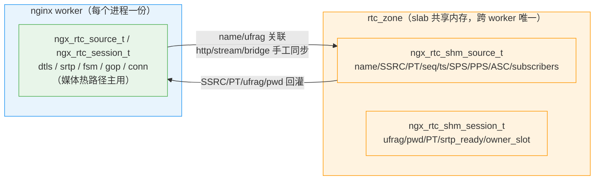
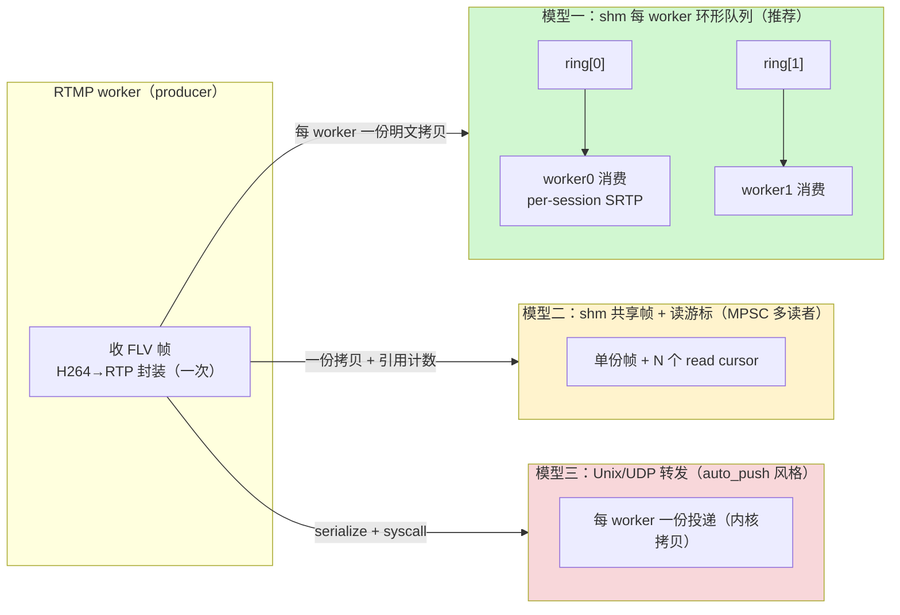

# ngx-rtc-module 多 worker 共享内存方案设计

> 结论先行。本文给出现状痛点、三种方案对比、共享数据结构设计、媒体数据分布、跨 worker 唤醒机制与分阶段落地步骤。
> 所有 nginx 源码行号基于 `/home/dgliu/workspace/webrtc/openresty-1.31.1.1/bundle/nginx-1.31.1/`，
> 模块代码基于 `/home/dgliu/workspace/webrtc/ngx-rtc-module/`。
>
> **实现状态（2026-09-09）**：阶段 0 与阶段 1 已完成并落地，采用「双 registry 镜像」方案（见 0.4），
> 与本文第 4 节原始「单一 registry + 私有扩展」方案存在偏差。阶段 2（shm 媒体环 + 跨 worker eventfd 唤醒）、
> 阶段 3（锁粒度 / GC / 快路径）、阶段 4（跨机 relay）仍为规划，尚未实现。

## 0. 结论

1. **状态共享（推荐且唯一合理路径）**：采用 nginx 原生 `ngx_shm_zone` + `ngx_slab_pool` + `ngx_shmtx`，
   把 source 元数据、session 骨架（身份 + PT + 就绪标志 + 订阅关系）、SSRC/PT、seq/ts 计数器、SPS/PPS/ASC
   放进共享内存。这与 `ngx_http_limit_req_module`、`ngx_stream_limit_conn_module` 的官方做法完全一致，
   天然获得 slab 分配器、自旋锁、reload/二进制升级的 `shm.exists` 续用语义。**阶段 0/1 已完成。**
2. **私有状态绝不进 shm（实际采用双 registry 镜像）**：session 里的 `SSL*/BIO*`（DTLS）、`srtp_t`、
   `ngx_connection_t*`、`peer sockaddr`、AAC→Opus 转码器都是进程内指针/句柄。实际落地没有做
   「shm 骨架 + 每 worker 私有扩展表」的单一 registry 拆分，而是**完整保留**进程内
   `ngx_rtc_source_t` / `ngx_rtc_session_t`（含全部私有状态，媒体热路径继续用它），另建 shm 骨架
   `ngx_rtc_shm_source_t` / `ngx_rtc_shm_session_t` 只存跨 worker 必需元数据，两者按 name/ufrag 关联。
   理由与取舍见 0.4。
3. **媒体数据本体放 shm 环形队列，不逐个 session 拷贝**（阶段 2，未开始）：RTMP worker 完成一次
   H264→RTP 封装后，把明文 RTP 包 + 目标 session 列表写入**每个目标 worker 一个 MPSC 环形队列**，
   由目标 worker 消费并做 per-session SRTP 加密发送。零拷贝到 socket 不可能——SRTP 每 session 密钥不同、
   必须就地变换，因此「每 worker 一份明文拷贝」是理论下界。
4. **跨 worker 唤醒不能用 `ngx_notify`**（阶段 2，未开始）：`ngx_notify` 是**进程内** eventfd
   （`ngx_epoll_module.c:386-430`），只能唤醒本 worker。跨 worker 唤醒用 **master 在 fork 前创建的
   per-worker eventfd 数组**（所有 worker 继承全部 fd，可互写），fd 号存入 shm；写环后写 8 字节唤醒目标 worker。
5. **落地分 4 阶段、最小改动**：阶段 0（`rtc_zone` + slab zone 初始化）与阶段 1（元数据上 shm，信令/绑定跨
   worker 正确）**已完成**；阶段 2（媒体环 + eventfd）、阶段 3（锁粒度/GC/快路径）、阶段 4（跨机 relay）未开始。
   全程只改模块，不改 nginx/http-flv 源码。
6. **封装模板**：source/session 注册表照搬 `ngx_http_limit_req_init_zone` 三段式 zone 初始化 + 全局
   `shpool->mutex`；expire + LRU 淘汰**未在阶段 1 落地**（当前为显式 remove），属阶段 3（见 3.7）。

### 0.4 关键偏差：双 registry 镜像（实际落地方案）

设计文档原方案是「session/source 拆成 shm 骨架 + 每 worker 私有扩展」，即**单一 registry**：shm 骨架作为唯一
权威，`priv` 挂在骨架地址上。实际落地为**双 registry 镜像**：

- 进程内 `ngx_rtc_source_t` / `ngx_rtc_session_t`（`ngx_rtc_core.h`）完整保留，dtls/srtp/fsm/gop/conn 等
  私有状态与媒体热路径（封装、GOP 环、SRTP、RTCP）继续用它，每个 worker 各自维护一份。
- 新增 shm 骨架 `ngx_rtc_shm_source_t` / `ngx_rtc_shm_session_t`（`ngx_rtc_shm.h`），只存
  name / SSRC / PT / seq / ts / sps / pps / asc / ufrag / pwd / srtp_ready / owner_slot / subscribers，
  作为跨 worker 的权威元数据镜像；两者通过 name / ufrag 关联。

取舍：

- **改动最小**：不重构媒体热路径与 session 生命周期，只增 shm 层，http/stream/bridge 各加几处同步。
- **单 worker 可逐步演进**：`ngx_rtc_core_get_conf()` 为空（未配 `rtc_zone`）时走原进程内路径，功能不回退。
- **媒体热路径不跨 shm**：每帧不碰 shm 锁，避免把全局自旋锁引入每帧发送。

代价：SSRC/PT/seq/SPS/PPS 等元数据出现「进程内 + shm」两份，需手工保持一致；Phase 2 媒体环落地时，
生产/消费两端仍各自持有进程内 source/session，shm 骨架只负责身份与订阅关系，媒体环按 `owner_slot` 分组即可，
无需推翻本方案。Phase 2 演进方式见 5.6。

---

## 1. 现状与痛点

### 1.1 单 worker 基线（阶段 0 之前）

`ngx_rtc_core.c` 用**进程内**注册表保存全部状态（`/home/dgliu/workspace/webrtc/ngx-rtc-module/src/ngx_rtc_core.c`）：

- source：`ngx_rbtree`（`ngx_str_node_t`，key = `crc32("app/stream")`），`ngx_rtc_source_get()` 查找/新建；
- session：全局 `ngx_queue_t` 链表 + `ngx_rbtree`（key = ICE ufrag），`ngx_rtc_session_find()` 按 ufrag 查找；
- subscriber：每 source 一个 `ngx_queue_t`。

session 由 `ngx_rtc_http_module.c` 用 `ngx_alloc` 分配，跨 HTTP 请求存活。部署配置
`openresty-rtmp-new/nginx/conf/nginx.conf` 曾显式 `worker_processes 1;`，注释写明「RTC source/session 注册表是每进程的」。

> 阶段 1 落地后，`ngx_rtc_core.c/h` 的进程内注册表**仍然保留**，作为媒体平面（封装/GOP/SRTP/RTCP）的
> 主用注册表；shm 只镜像跨 worker 元数据，见 1.4 与 0.4。

三类流量落在哪个 worker 由 nginx 事件分发决定，彼此无关联：

| 流量 | 模块 | 触碰的状态 |
|------|------|-----------|
| RTMP 推流（1935） | `ngx_rtmp_rtc_bridge_module.c` | source 查找/新建、SPS/PPS/ASC 缓存、seq/ts 推进、遍历 subscribers 发 RTP |
| HTTP 信令（18082 `/rtc/v1/play/`） | `ngx_rtc_http_module.c` | source 查找/新建、分配 SSRC/PT、session 新建（ufrag/pwd） |
| UDP 媒体（8000 STUN/DTLS/SRTP） | `ngx_rtc_stream_module.c` | 按 ufrag 找 session、绑定 conn、DTLS/SRTP、置 `srtp_ready`、订阅 source |

### 1.2 多 worker 下必然破裂的状态

开启 `worker_processes auto` 后，以下五类状态必须跨 worker 可见，否则功能直接失效：

1. **source 注册表**：HTTP worker 第一次 play 时创建 source 并分配 SSRC/PT，RTMP worker 收帧时若查不到同一
   source，会重复创建并分配另一套 SSRC/PT，导致 SDP 与 RTP 不一致，浏览器解码失败。
2. **session 注册表**：HTTP worker 生成 ufrag 写入 SDP answer，但 STUN/DTLS 报文落在 UDP worker，
   后者 `ngx_rtc_session_find(ufrag)` 必须能找到 HTTP worker 创建的 session（`ngx_rtc_stream_module.c:192`）。
3. **SSRC/seq/ts 计数器**：SSRC/PT 由 HTTP 分配、RTMP 使用；`video_seq` 每发一包自增。若 RTMP 推流重连落到
   不同 worker，seq 必须连续，否则 RTP 流断流、需重新关键帧。
4. **GOP/序列头缓存（SPS/PPS/ASC）**：RTMP worker 解析 AVCDecoderConfigurationRecord 缓存 SPS/PPS
   （`ngx_rtmp_rtc_bridge_module.c:147-194`），IDR 前要 STAP-A 前置；推流重连换 worker 后若缓存丢失，
   新订阅者无法起播。
5. **订阅关系与就绪标志**：`source->subscribers` 链表和 `sess->srtp_ready` 是 RTMP worker 判断
   「给谁发、往哪个 worker 发」的唯一依据。

### 1.3 不能跨 worker 的状态（必须留私有）

`ngx_rtc_session_s` 内嵌了不可跨进程的句柄/指针（`ngx_rtc_core.h:22-42`）：

| 字段 | 类型 | 为何不能进 shm |
|------|------|---------------|
| `dtls` | `ngx_rtc_dtls_t`（`SSL*`、`BIO*`） | OpenSSL 堆对象指针，只对创建它的进程有意义 |
| `srtp` | `ngx_rtc_srtp_t`（`srtp_t recv/send_ctx`） | libsrtp2 不透明句柄，内部为堆指针 |
| `conn` | `void*`（`ngx_connection_t*`） | nginx 连接对象在进程内存池 |
| `peer_addr` | `struct sockaddr*` | 指向 `c->sockaddr`，进程内地址 |
| 音频转码器 | `ngx_rtc_audio_worker_t`（FFmpeg/libopus 堆句柄 + pthread） | 同理，仅属 RTMP worker |

结论（已随阶段 1 落地修订）：**私有句柄绝不能进 shm**，但实际方案不是「单一 shm 骨架 + priv 扩展表」，
而是**双 registry 镜像**——进程内 `ngx_rtc_source_t`/`ngx_rtc_session_t` 完整保留（含 dtls/srtp/fsm/gop/conn/
scratch/转码器），shm 骨架只存跨 worker 必需的身份/PT/就绪/订阅元数据，见 1.4。

### 1.4 当前实际实现（阶段 0/1 落地后）

新增 `ngx_rtc_shm.h/c`：`rtc_zone` 指令 + `ngx_rtc_core_module`（NGX_CORE_MODULE）+ slab zone 三段式初始化
（`ngx_rtc_core_init_zone`，照 limit_req 模板）。shm 内两类骨架：

| shm 结构 | 内容 | 关联方式 |
|---------|------|---------|
| `ngx_rtc_shm_source_t` | name / publishing / video·audio SSRC+PT / seq / ts / SPS / PPS / ASC / 计数 / subscribers 队列 | 按 name（`ngx_str_rbtree`） |
| `ngx_rtc_shm_session_t` | ice_ufrag / ice_pwd / video·audio PT / srtp_ready / owner_slot / source 指针 | 按 ufrag（`ngx_queue` 线性查） |

与进程内注册表的镜像关系：



同步点（glue 层）：

- **http**：SSRC/PT 权威在 shm（先 `ngx_rtc_shm_source_get`，`video_ssrc==0` 才分配并写回 shm）；
  play 时 `ngx_rtc_shm_session_add` 加 session 骨架。
- **stream**：STUN 进程内查不到时 `ngx_rtc_stream_attach_from_shm` 从 shm 重建私有 session
  （alloc + 拷 ufrag/pwd + fsm init + 重建 source）；DTLS done 时更新 shm（`srtp_ready=1`、
  `owner_slot=ngx_worker`、subscribe）；close 时仅 `owner_slot==ngx_worker` 才删 shm 骨架。
- **bridge**：`ngx_rtmp_rtc_sync_shm` 从 shm 同步 SSRC/PT（推流先来则分配写 shm）；
  close_stream 同步 shm `publishing=0` + remove。

---

## 2. 方案对比

### 2.1 候选方案

| 维度 | A. ngx_shm_zone + slab + shmtx | B. 直接 mmap 自管理 | C. 进程间 UDP/Unix 通知转发（auto_push 风格） |
|------|-------------------------------|--------------------|---------------------------------------------|
| 分配器 | `ngx_slab_pool`（小对象免碎片、`_locked` 变体） | 自己写 free-list/伙伴算法 | 不需要 |
| 锁 | `ngx_shmtx` 自旋锁 + POSIX sem 睡眠回退 | 自己写锁 | 不需要 |
| reload/二进制升级 | `shm.exists` + `oshm_zone->data` 续用，官方路径 | 完全自己处理重映射 | 不需要 |
| 地址一致性 | nginx 强制各进程映射同地址（`ngx_cycle.c:1002` 校验），可直接存裸指针 | 自己保证 | 无关 |
| 媒体分发 | 同 zone 里划 ring 或额外 slab 大块 | 自定义 ring | 每 worker 重新投递（内核拷贝 + 序列化） |
| 跨机器扩展 | 无 | 无 | 天然支持（relay） |
| 工作量/风险 | 低，全部复用 nginx 原生 | 高，重造 slab+锁+生命周期 | 中，但媒体路径每帧多 syscall、延迟和 CPU 差 |

### 2.2 结论

**推荐 A（ngx_shm_zone + slab + shmtx）**，理由：

1. `ngx_slab_alloc_locked` / `ngx_slab_free_locked`（`src/core/ngx_slab.c:184/461`）正是为跨进程小对象设计，
   source/session 都是几百字节的小对象，slab 完美匹配。
2. `ngx_shmtx_lock`（`src/core/ngx_shmtx.c:70`）自带「多核自旋 + 单核 yield + POSIX sem 睡眠」退化，
   临界区按 nginx 约定「短促」即可，官方模块证明可用。
3. `ngx_shared_memory_add`（`src/core/ngx_cycle.c:1312`）与 `shm_zone->init`（`src/core/ngx_cycle.c:973`
   `ngx_init_zone_pool`）自动处理 mmap、地址一致性、reload 续用，我们只需按
   `ngx_http_limit_req_init_zone` 的握手模板写一个 init 回调。
4. 方案 B 除了自由度高没有任何收益，且要重做 `ngx_slab_pool_t` 已提供的全部能力，违背「最小改动」。
5. 方案 C 本质是 nginx-rtmp 的 `rtmp_auto_push`（经 Unix socket 把流 push 给其他 worker），社区文档明确
   标注「对 nginx ≥1.7.2 不推荐」；且它仍绕不开「session 查找、SSRC/PT 一致性」等元数据共享问题，
   媒体又多一次内核拷贝。仅在未来「跨机器级联」时才考虑复用其思想，不作为本模块内部 IPC。

**注意一个易被误读的参考点**：任务里提到的 `nginx-http-flv-module/ngx_rtmp_shared.c` 并不是「跨 worker 帧广播」，
它实现的是**单 worker 内**带引用计数的 `ngx_chain_t` 缓冲池（`NGX_RTMP_REFCOUNT_BYTES` 引用计数），
服务于同进程内的 GOP 缓存与多订阅者复用，不含任何 shm。nginx-rtmp 真正的多 worker 方案是 auto_push
（进程间 relay），与本方案要解决的问题不同。这一事实必须澄清，避免照搬错误参考。封装的正确模板是
OpenResty `lua_shared_dict`，见第 3 节。

---

## 3. 借鉴 OpenResty lua_shared_dict 封装

OpenResty 的 `lua_shared_dict`（`/home/dgliu/workspace/webrtc/openresty-1.31.1.1/bundle/ngx_lua-0.10.31rc5/src/ngx_http_lua_shdict.c`）
是 nginx 生态里规模最大、被验证最多的「跨 worker 键值存储」，其结构与本模块 source/session 注册表高度同构：
**key = source 名 / session ufrag，value = 对应元数据**。以下逐项对照并给出本模块的推荐封装。

### 3.1 与注册表的映射关系

| lua_shared_dict 概念 | 本模块对应 | 差异 |
|---------------------|-----------|------|
| `ngx_http_lua_shdict_node_t`（key+value+expires+LRU 队列） | `ngx_rtc_source_t` / `ngx_rtc_session_t`（shm 骨架） | 本模块节点内还有跨节点指针（source↔session、subscribers） |
| 根表 `ngx_http_lua_shdict_shctx_t`（rbtree + lru_queue，存 `pool->data`） | `ngx_rtc_shm_ctx_t` | 额外存 notify_fd/ring 描述符 |
| `ngx_http_lua_shdict_ctx_t`（`sh` + `shpool`，挂 `shm_zone->data`） | 同构 | 同构 |
| 指令 `lua_shared_dict name size` | `rtc_zone rtc:32m;` | 同构 |
| 查找 `ngx_crc32_short` + rbtree + `ngx_memn2cmp` | source 按 name、session 按 ufrag | 同构 |
| `ngx_http_lua_shdict_expire(ctx, n)` 摊还清扫 | session/source 超时回收 | 见 3.4 |

### 3.2 zone 初始化与 slab 大小计算

`ngx_http_lua_shdict_init_zone`（`ngx_http_lua_shdict.c:70-121`）的三段式握手与 limit_req 完全一致，
本模块照抄即可：

1. `octx != NULL`（reload 有旧 data）：`ctx->sh = octx->sh; ctx->shpool = octx->shpool;` 直接续用。
2. `shm_zone->shm.exists`（shm 已存在但无旧 cycle data）：`ctx->sh = ctx->shpool->data;` 复用根表。
3. 首次：`ngx_slab_alloc` 分配根表 → `ngx_rbtree_init` + `ngx_queue_init(lru)` → 设置 `log_ctx`、
   `log_nomem = 0`，最后把根表指针写入 `ctx->shpool->data`。

关键点：**根表指针存 `shpool->data`，不依赖模块全局 C 变量**——reload/二进制升级/worker fork 后，
任何进程都能经 `shm_zone->shm.addr` 上的 `ngx_slab_pool_t.data` 拿到同一张表。这比「静态全局变量指向 shm」
更稳（本模块的 `ngx_rtc_shm_ctx_t` 同样存 `pool->data`）。

slab 大小：指令配置的 zone 尺寸是**总尺寸**，`ngx_slab_init`（`src/core/ngx_slab.c:98-165`）先扣掉
slots/stats/pages 元数据，余下才可分配。故 `rtc_zone 32m` 实际可用小于 32m，估算时要留 slab 头部开销
（约 1 页 + `n×sizeof(page)` + stats），详见 8.2。

### 3.3 锁粒度：全局 mutex，不预先分片

shdict 的所有操作（get/set/expire/lpush/lpop）都收敛到一把 `ngx_shmtx_lock(&ctx->shpool->mutex)`
（如 `ngx_http_lua_shdict.c:604,628,428,524`），临界区仅「rbtree 查/插 + slab 小对象分配/释放」，
几十~几百纳秒，未做分片。理由：写操作低频，读多写少，分片/每桶锁复杂度收益不成比例。

本模块的分层结论（与 shdict 一致但更明确）：

- **注册表元数据（source/session 的查/建/改/删）用同一把全局 `shpool->mutex`**，第 1 阶段即如此。
- **媒体热路径（每帧 subscriber 快照 + seq/ts 推进）不学 shdict 用全局锁**——shdict 没有每帧热路径。
  第 2 阶段把热路径抽离到 per-source 锁 / 无锁环（见 4.5、5.3），避免每帧全局自旋竞争。

### 3.4 条目生命周期：expire + LRU，先于引用计数

shdict 节点内嵌 `uint64_t expires`（毫秒绝对时间，0=不过期）与 `ngx_queue_t queue`（LRU）：
访问时移到队头（`ngx_http_lua_shdict.c:219-220`），过期从队尾淘汰。清理分两档：

- 摊还清扫：每次 get/set 前 `ngx_http_lua_shdict_expire(ctx, 1)`，顺带清 1~2 个已过期条目，O(1) 摊还。
- 强淘汰：slab 分配失败时（非 safe_store）循环最多 30 次 `ngx_http_lua_shdict_expire(ctx, 0)`（强制淘汰
  最旧）再重试分配（`ngx_http_lua_shdict.c:1500-1520`），天然防内存耗尽。

本模块借鉴：

- session 骨架带 `expires`：DTLS/播放超时（如 30s 未绑定 STUN 即过期回收）；source 带 `expires`：
  无发布者且无订阅者 N 秒后回收。
- 用 LRU 队列 + `ngx_rtc_shm_expire(ctx, 1)` 摊还清扫，分配失败时 `expire(ctx, 0)` 强淘汰重试，
  **不引入引用计数**——引用计数跨 worker 增删极易漏配对，shdict 证明「expire + LRU」对键值生命周期足够。
- 约束：source/session 之间有跨节点指针（subscribers），淘汰 source 前必须满足「`subscribers == NULL`
  且已过期」；session 私有扩展（SSL/srtp/conn）仍由 owner worker 在断连回调里释放，shm 骨架过期只回收 shm 内存。

### 3.5 变长条目：节点头部 + 内联 data

shdict 用「定长头部 + `u_char data[1]` 尾随 key+value」一次 `ngx_slab_alloc_locked` 分配变长条目，
长度 `n = offsetof(..., data) + key_len + value_len` 并对齐（`ngx_http_lua_shdict.c:889-901`）。
本模块 source/session 均为**定长结构**，直接 `sizeof(struct)` 分配即可；仅未来「变长 key / 变长 GOP 缓存」
才启用内联 data 技巧。shdict 还把 rbtree 节点的 `color` 字段复用为节点首部（`&node->color` 即节点起始），
省 8 字节，属可选优化，本模块第 1 版直接内嵌 `ngx_rbtree_node_t node;` 更清晰。

### 3.6 定时清扫与 UDP drain 借鉴

- **定时/摊还清扫**：`ngx_http_lua_timer.c` 用 `ngx_add_timer(ev, delay)` + `ev->handler`
  （`ngx_http_lua_timer.c:335,351,487`），periodic 在 handler 里重新 `ngx_add_timer`。本模块可加一个
  每 worker 周期定时器（如每 5s）做全量 `ngx_rtc_shm_expire`，或仅靠 get/set 摊还清扫（更简单，先选后者）。
- **UDP/环 drain**：`ngx_http_lua_socket_tcp.c` 的 cosocket 用 `c->recv(c, ...)` 读满直到 EAGAIN +
  `ngx_handle_read_event(c->read, 0)` 重挂读事件（`ngx_http_lua_socket_tcp.c:3062,3124`）。本模块
  eventfd 唤醒 handler 与环消费同构：读环到空、读 eventfd 清计数，不阻塞事件循环。

### 3.7 source/session 注册表封装（阶段 0/1 已落地）

实际 API 见 `ngx_rtc_shm.h`，已按 shdict/limit_req 模板实现：

```c
ngx_rtc_core_conf_t *ngx_rtc_core_get_conf(ngx_cycle_t *cycle);              /* shm_zone 未配置时返回 NULL */
ngx_rtc_shm_source_t *ngx_rtc_shm_source_get(ctx, u_char *name, size_t len);  /* find-or-create */
ngx_rtc_shm_source_t *ngx_rtc_shm_source_find(ctx, u_char *name, size_t len);
void ngx_rtc_shm_source_remove(ctx, u_char *name, size_t len);
ngx_rtc_shm_session_t *ngx_rtc_shm_session_add(ctx, ufrag, ufrag_len, pwd, pwd_len, src, vpt, apt);
ngx_rtc_shm_session_t *ngx_rtc_shm_session_find(ctx, u_char *ufrag, size_t len);
void ngx_rtc_shm_session_remove(ctx, ngx_rtc_shm_session_t *sess);
void ngx_rtc_shm_source_subscribe / unsubscribe(ctx, src, sess);
```

落地要点与偏差：

- 查找结构：source 按 name 用 `ngx_str_node_t` + `ngx_str_rbtree_lookup`（key=`crc32_long(name)`）；
  session 按 ufrag 用 **`ngx_queue_t` 线性链表**（当前 session 数量小，未上红黑树，与 3.7 原文
  「session 红黑树统一」有偏差）。
- 锁：所有 get/find/add/remove/subscribe/unsubscribe 都是 `ngx_shmtx_lock(&pool->mutex)` +
  `ngx_slab_alloc_locked`，一把全局锁，临界区短促，与 shdict 一致。
- 生命周期：**expire + LRU 未在阶段 1 落地**。当前为显式 remove（发布者关闭 / owner worker 断连时删），
  source 删除前置校验 `subscribers` 为空；expire + LRU、强淘汰重试属阶段 3（见 3.4，原规划保留）。
- 根表存 `pool->data`，reload 安全（三段式 init 已实现）。
- 反向同步：shm 骨架是「镜像」而非唯一权威，http/stream/bridge 各 glue 点负责进程内 ↔ shm 的读写同步
  （见 1.4 同步点）。

---

## 4. 数据结构设计（shm 元数据）

### 4.1 shm zone 总布局（阶段 0/1 已落地）

单 zone `rtc`，根表 `ngx_rtc_shm_ctx_t` 存于 `shpool->data`（实际定义，见 `ngx_rtc_shm.h`）：

```c
typedef struct {
    ngx_slab_pool_t       *pool;          /* == shm_zone->shm.addr */
    ngx_rbtree_t           source_tree;   /* 按 name 的红黑树（ngx_str_node_t） */
    ngx_rbtree_node_t      source_sentinel;
    ngx_queue_t            source_list;   /* 全量 source（GC/统计用） */
    ngx_queue_t            session_list;  /* 全量 session 骨架链表（按 ufrag 线性查） */
    ngx_uint_t             nworkers;      /* 阶段 1 未使用，阶段 2 环/唤醒再用 */
} ngx_rtc_shm_ctx_t;
```

阶段 2 将在本结构追加 `ngx_fd_t notify_fd[NGX_MAX_PROCESSES]` 与 `ngx_rtc_ring_t *rings[NGX_MAX_PROCESSES]`
（见第 5、6 节），阶段 1 暂不占用。

zone 声明（`ngx_rtc_core_module`，NGX_CORE_MODULE，已实现）：

```nginx
# 主配置段
rtc_zone rtc:32m;
```

init 回调 `ngx_rtc_core_init_zone` 严格照搬 `ngx_http_limit_req_init_zone` 三段式
（`src/http/modules/ngx_http_limit_req_module.c:642-707`）：

1. `octx != NULL`（reload 有旧 data）：`ctx->sh = octx->sh; ctx->shpool = octx->shpool; return NGX_OK;`
2. `shm_zone->shm.exists`（shm 已存在但无旧 cycle data，如 master 崩溃重启）：`ctx->sh = ctx->shpool->data; return NGX_OK;`
3. 首次：`ngx_slab_alloc` 分配根表 → `pool->data = root` → `ngx_rbtree_init`（`ngx_str_rbtree_insert_value`）+
   `ngx_queue_init`（source_list/session_list）→ 设 `log_ctx` / `log_nomem=0`。

### 4.2 裸指针 vs 偏移量

nginx 在 `ngx_init_zone_pool`（`src/core/ngx_cycle.c:980-1005`）强制校验 `sp == sp->addr`（所有进程映射到相同虚拟地址），
因此 shm 内的链表/红黑树节点 `next/left/right/parent` **可以直接存裸指针**，这正是 `limit_req`、`limit_conn`、`upstream_zone` 的官方惯例。
本模块沿用裸指针；若未来要支持「地址不一致」环境，再统一换 `uint32_t` 相对 `ctx` 的偏移量。约束：shm 节点内
**只允许**指向 shm 地址（或整数），禁止指向任何 worker 私有内存。

> 双 registry 注意：`ngx_rtc_shm_session_t->source` 指向的是 **shm source**（`ngx_rtc_shm_source_t`），
> 不是进程内 `ngx_rtc_source_t`；两者靠 name 关联，代码里不得互相赋值。

### 4.3 source 骨架（shm 侧，实际）

```c
struct ngx_rtc_shm_source_s {
    ngx_str_node_t  sn;                 /* rbtree node; key = crc32(name) */
    ngx_queue_t     queue;              /* source_list link */
    u_char          name[128];
    uint8_t         publishing;
    uint32_t        video_ssrc; uint8_t video_pt;
    uint32_t        audio_ssrc; uint8_t audio_pt;
    uint32_t        video_seq; uint32_t audio_seq;
    uint32_t        video_ts;  uint32_t audio_ts;
    uint8_t         audio_ts_valid; uint8_t have_ts;
    uint32_t        video_pkts; uint32_t video_octets;
    uint32_t        audio_pkts; uint32_t audio_octets;
    u_char          sps[256]; uint32_t sps_len;
    u_char          pps[256]; uint32_t pps_len;
    u_char          sps_profile_level_id[3]; uint8_t sps_profile_level_id_valid;
    u_char          audio_asc[64]; uint32_t audio_asc_len;
    ngx_queue_t     subscribers;        /* shm session 骨架订阅队列 */
};
```

- **没有** per-source `ngx_shmtx_t`（阶段 3 优化项）、**没有** GOP ring / video_body / audio_body / audio_ctx 等
  进程内热路径状态——这些仍在进程内 `ngx_rtc_source_t`。
- 分配：`ngx_shmtx_lock` + `ngx_slab_alloc_locked` + `ngx_rbtree_insert`；查找 `ngx_str_rbtree_lookup`。
- `publishing`/SSRC/PT/seq/ts/SPS/PPS 由 bridge 与 http 双向同步（见 1.4）。

### 4.4 session 骨架（shm 侧，实际）+ 进程内完整结构

**shm 骨架（进 slab，只有值类型与 shm 指针）：**

```c
struct ngx_rtc_shm_session_s {
    ngx_queue_t           queue;       /* session_list link */
    ngx_queue_t           sub_queue;   /* source->subscribers link */
    ngx_rtc_shm_source_t *source;      /* 指向 shm source */
    u_char                ice_ufrag[64];
    u_char                ice_pwd[256];
    uint8_t               video_pt;
    uint8_t               audio_pt;
    ngx_atomic_t          srtp_ready;  /* DTLS→SRTP 完成后置 1 */
    ngx_int_t             owner_slot;  /* 持有 UDP 连接的 worker 槽位，-1 未绑定 */
};
```

**与原文最大差异：没有 `ngx_rtc_session_priv_t` 私有扩展表。** 进程内 `ngx_rtc_session_t`
（`ngx_rtc_core.h`）完整保留 dtls/srtp/fsm/conn/peer_addr/cipher/last_active/send_failed/send_eagain/
queue/sub_queue/sn/dtls_timer，作为媒体平面唯一操作对象；shm session 只镜像 ufrag/pwd/PT/就绪/owner_slot/订阅。

生命周期与并发约定（阶段 1 实际）：

- HTTP worker：`ngx_rtc_session_add`（进程内）+ `ngx_rtc_shm_session_add`（shm）各建一份；
  私有 DTLS/SRTP/conn 在 UDP worker 绑定后才创建。
- UDP worker 收到 STUN：先 `ngx_rtc_session_find`（进程内），未命中则 `ngx_rtc_stream_attach_from_shm`
  按 shm 骨架重建进程内 session（alloc + 拷 ufrag/pwd/PT + fsm init + `ngx_rtc_source_get` 重建 source）。
- DTLS done：进程内 `ngx_rtc_source_subscribe`，同时写 shm（`srtp_ready=1`、`owner_slot=ngx_worker`、
  `ngx_rtc_shm_source_subscribe`）。
- close：仅 `shm_sess->owner_slot == ngx_worker` 的 worker 删除 shm 骨架，防止信令 worker 的僵尸进程内
  session 被 reaper 关闭时误删活跃骨架。

### 4.5 锁粒度（阶段 1 实际）

| 层级 | 锁 | 保护范围 | 状态 |
|------|----|---------|------|
| L0 | `shpool->mutex`（全局自旋锁，slab 自带） | 所有 shm 分配/释放、红黑树/队列头指针变更 | **阶段 1 已用** |
| L1 | 每 source 一把 `ngx_shmtx_t` | `subscribers` 快照、seq/ts 推进、SPS/PPS 写 | 阶段 3（未开始） |
| L2 | 每 worker ring 一把（或 CAS head） | 环队列入队/出队 | 阶段 2/3（未开始） |

**锁序铁律（防死锁）**：`pool->mutex` 只出现在 `ngx_slab_alloc/free` 内部，业务锁（source/ring）**必须
在调用 slab 之前释放**；source 锁 → ring 锁单向，禁止反向。这与「L1 Singleton → L2 Context → L3 Device 禁反向」
的既有约定一致。

阶段 1 实际只用 L0 全局锁完成元数据正确性；媒体热路径（封装/GOP/SRTP）仍在进程内，不碰 shm 锁。
每 source 锁是阶段 3 的纯优化，非正确性必需。

---

## 5. 与零拷贝环形队列的衔接（媒体本体，阶段 2 规划）

> 注意：仓库中已存在的 `src/ngx_rtc_ring.c/h` 是**进程内 pthread 有界环形队列**，服务于 AAC→Opus 转码线程
> （`ngx_rtc_audio_worker`），与本节的 shm 跨 worker 媒体环**无关**；阶段 2 的 shm 环尚未实现。

### 5.1 为什么媒体不能零拷贝到 socket

SRTP 是 per-session 变换：每个 session 由各自 DTLS 导出的密钥不同（`ngx_rtc_srtp_protect_rtp` 就地加密），
同一份明文 RTP 必须被逐 session 加密成不同密文。因此「明文 → 密文」这步**必然发生每 session 一次拷贝/变换**，
socket 零拷贝在物理上不成立。问题退化为：**明文 RTP 从 RTMP worker 到 UDP worker 之间，怎么搬代价最小。**

### 5.2 三种媒体搬运模型



| 模型 | 拷贝次数 | 锁竞争 | 实现复杂度 | 结论 |
|------|---------|--------|-----------|------|
| M1 shm 每 worker SPSC/MPSC ring | 每 worker 一份明文 | 入队短临界区 | 中（ring 结构 + 唤醒） | **推荐** |
| M2 shm 单份帧 + 多读游标 + refcount | 一份明文 | 需读者进度/引用计数/回收，竞争复杂 | 高 | 过度设计，暂不需要 |
| M3 UDP/Unix relay | 每 worker 一次 + 内核拷贝 | 无 shm 锁但多 syscall | 中 | 延迟/CPU 差，仅跨机再用 |

推荐 **M1**：每目标 worker 一个 MPSC 环形队列（`rtc` zone 里预留裸内存区，见 5.4），RTMP worker 是唯一
「每 source 生产者」，按订阅者的 `owner_slot` 把已封装的明文 RTP 写进对应 worker 的环。消费者 worker
统一做「查私有扩展 → SRTP 加密 → `c->send`」，RTMP worker 自身不再做 SRTP（同 worker 会话也走环，或做
本 worker 直发快路径，见 5.5）。

### 5.3 环条目与 SPSC/MPSC

环条目为定长（避免 slab 变长分配热路径），约 `1.5KB`：

```c
typedef struct {
    ngx_atomic_t   seq;      /* 单调递增槽位号，消费端据此判断条目已完整写入 */
    uint8_t        media;    /* video/audio */
    uint16_t       len;      /* rtp[] 长度 */
    uint16_t       nsess;    /* 目标 session 数（本 worker 的订阅者） */
    uint32_t       sess[];   /* 目标 shm session 指针（跨 worker 地址一致，作 id） */
    uint8_t        rtp[];    /* 明文 RTP 载荷 */
} ngx_rtc_ring_entry_t;
```

环描述符（shm 内）：

```c
typedef struct {
    ngx_atomic_t    head;    /* 生产者推进 */
    ngx_atomic_t    tail;    /* 消费者（owner worker）推进 */
    ngx_uint_t      size, mask;
    ngx_shmtx_t     lock;    /* MPSC 入队锁；单生产者时可用 CAS 替代 */
    ngx_rtc_ring_entry_t entries[];
} ngx_rtc_ring_t;
```

- **为什么不是严格 SPSC**：一个 worker 的环会被多个 source 的生产者写（两个不同 RTMP 推流落在不同 worker），
  故入队需 MPSC。用每环一把 `ngx_shmtx_t` 保护 head（第 1 版），后续换 `ngx_atomic_cmp_set` 无锁入队。
- **背压策略**：环满（`head - tail == size`）时**丢帧**而非阻塞（低延迟直播可接受，丢帧后靠下一个 IDR 恢复），
  同时 `dropped` 计数供监控。绝不在事件循环里自旋等待。

### 5.4 环内存从哪来

两个选择：

1. **同 zone 内 slab 大块**：`ngx_slab_alloc_locked(pool, ring_bytes)`（`size > ngx_slab_max_size` 时按整页分配，
   `src/core/ngx_slab.c:191-206`），得到的地址即可当环。简单，复用 zone 生命周期。
2. **zone 尾部裸内存区**：init 时在 `pool->start` 之前留一段不交给 slab 的裸区域（修改 init 回调里 slab 初始化边界），
   适合需要 cache-line 对齐、精确布局的场景。

推荐 **选择 1**（最小改动）：每个 worker 环 = `ngx_slab_alloc_locked(pool, ring_bytes)` 一次大块分配，
ring 地址存进 `ctx->rings[w]`。环大小按「单 worker 缓冲窗口」估算（见 8.2），默认 4096 条目 ≈ 6MB/worker。

### 5.5 同 worker 快路径（可选优化）

若 `owner_slot == 本 worker` 且本 worker 持有该 session 的 `priv`，RTMP worker 可直接在本进程内
「SRTP 加密 + send」，省一次环往返。这是纯优化：第 1 版可统一走环（更简单、路径唯一），
第 2 阶段再加直发快路径。两种路径共享同一份 subscriber 快照逻辑。

### 5.6 双 registry 上的阶段 2 演进（规划）

阶段 2 启用 shm 媒体环时，无需推翻双 registry 方案：RTMP worker 仍按进程内 source 封装明文 RTP，按
`shm_sess->owner_slot` 分组写每 worker 环；消费端 UDP worker 用「shm session 指针/id」查本 worker 的进程内
session，再走现有 `ngx_rtc_session_send_rtp` 做 SRTP + send。shm 骨架继续承担身份与订阅关系，进程内结构继续
承担媒体热路径状态，二者职责与阶段 1 一致。同 worker 直发快路径（5.5）在阶段 3 叠加。

---

## 6. 事件通知（跨 worker 唤醒，阶段 2 规划）

### 6.1 关键事实：`ngx_notify` 不能跨 worker

`ngx_notify` 宏展开为 `ngx_event_actions.notify`（`src/event/ngx_event.h:411`），epoll 实现是写本进程的
`notify_fd`（eventfd，`src/event/modules/ngx_epoll_module.c:386-430`）。它只唤醒**当前 worker 自己的事件循环**，
用于把耗时操作投递回本 worker。跨 worker 唤醒必须另建通道。

### 6.2 推荐：master fork 前创建 per-worker eventfd

利用 nginx 进程模型：模块 `init_process` 会**先**在 master 执行（`ngx_init_cycle` → `ngx_init_modules`，
`src/core/ngx_cycle.c:652`），**然后**才 fork worker（`src/os/unix/ngx_process_cycle.c:374`），worker 内再次调用
`init_process`（`src/os/unix/ngx_process_cycle.c:967`）。因此在 master 阶段创建的 eventfd 会被所有 worker 继承，
且 **fd 号在各 worker 的 fd 表里一致**，任何 worker 都能写任何其他 worker 的 eventfd。

```c
/* init_process: ngx_process == NGX_PROCESS_MASTER 分支 */
for (w = 0; w < ccf->worker_processes; w++) {
    ctx->notify_fd[w] = eventfd(0, EFD_NONBLOCK);   /* 非 Linux 回退 pipe() */
}
/* 存 ctx 于 shm，worker fork 后继承 fd */

/* init_process: NGX_PROCESS_WORKER 分支 */
ngx_add_event(notify_conn[ngx_worker].read, NGX_READ_EVENT, handler);
/* handler: read(eventfd) 清计数 -> drain ctx->rings[ngx_worker] */
```

生产者写完环后：

```c
uint64_t one = 1;
(void) write(ctx->notify_fd[target], &one, sizeof(one));  /* eventfd 原子计数，写 8 字节 */
```

### 6.3 备选与取舍

| 机制 | 能否跨 worker | 评价 |
|------|--------------|------|
| `ngx_notify`（eventfd） | 否（进程内） | 仅用于本 worker 投递，不能当跨 worker 通道 |
| master 预建 per-worker eventfd | 是 | **推荐**，零 syscall 语义、计数合并、无背压 |
| per-worker pipe | 是 | 可行，需处理缓冲区满/EAGAIN，eventfd 更简单 |
| `ngx_channel`（socketpair） | 否（master↔worker 专用，`src/os/unix/ngx_process.c:125`） | worker 间无直接 channel |
| 信号 `kill(pid, SIGUSR1)` | 是 | 粗粒度、易与 nginx 控制信号冲突、丢失合并语义，不推荐 |

注意：eventfd 写端 fd 号存 shm 是安全的——因为所有 worker 继承同一批 fd，编号全局一致；若未来改为
「worker 各自创建 + SCM_RIGHTS 传递」，则不能再存裸 fd 号，需存每进程映射表。当前 fork 继承方案避免了这个复杂度。

---

## 7. 落地步骤（分阶段，最小改动）

> 阶段 0/1 已完成；阶段 2/3/4 保持规划。已实现内容以代码为准，本节记录计划与偏差。

### 阶段 0：抽出共享核心与 zone 声明 —— 已完成

- 新增 `src/ngx_rtc_shm.c` / `src/ngx_rtc_shm.h`：`ngx_rtc_shm_ctx_t`、`rtc_zone` 指令、
  `ngx_rtc_core_module`（NGX_CORE_MODULE）、`ngx_rtc_core_init_zone`（照 limit_req 三段式）、
  source get/find/remove、session add/find/remove、subscribe/unsubscribe。
- `config` 已把 `ngx_rtc_shm.c` 编入 CORE 模块；`nginx.conf` 增加 `rtc_zone rtc:32m;`。
- `ngx_rtc_core.c` 未删除，进程内注册表继续承担媒体平面（与原文「先保留旧接口做对照」一致，但定位转为长期共存）。

### 阶段 1：元数据上 shm，信令/绑定先跨 worker 正确 —— 已完成

- `ngx_rtc_http_module.c`：SSRC/PT 权威在 shm（`ngx_rtc_shm_source_get`，`video_ssrc==0` 才分配写回）；
  play 时 `ngx_rtc_shm_session_add` 加 session 骨架；进程内 session 仍 `ngx_alloc` 分配。
- `ngx_rtc_stream_module.c`：STUN 进程内未命中时 `ngx_rtc_stream_attach_from_shm` 从 shm 重建私有 session；
  DTLS done 更新 shm（`srtp_ready=1`/`owner_slot=ngx_worker`/subscribe）；close 仅 `owner_slot==ngx_worker`
  才删 shm 骨架（防 signaling worker 僵尸 session 被 reaper 误删活跃骨架）。
- `ngx_rtmp_rtc_bridge_module.c`：`ngx_rtmp_rtc_sync_shm` 从 shm 同步 SSRC/PT（推流先来则分配写 shm）；
  close_stream 同步 shm `publishing=0` + remove。
- **与原文偏差**：未按「session/source 拆 shm 骨架 + worker 私有扩展」的单一 registry 落地，而是双 registry 镜像
  （见 0.4、1.4）。媒体仍是单 worker 语义（推流与 UDP 同 worker 才通），信令→绑定→订阅的跨 worker 一致性已成立。
  验收：HTTP 与 UDP 分属不同 worker 时，STUN 能找到 session、DTLS 能完成。

### 阶段 2：媒体环形队列 + 跨 worker 唤醒 —— 未开始

- 启用 `ctx->notify_fd[w]` 与 `ctx->rings[w]`（阶段 0 未落地，需在阶段 2 追加到 `ngx_rtc_shm_ctx_t`）。
- 实现 shm `ngx_rtc_ring_t`（MPSC 锁/CAS）与消费 handler；RTMP worker 按 `owner_slot` 分组写环 + 写 eventfd；
  UDP worker handler 读环 → 查本 worker 进程内 session → `ngx_rtc_session_send_rtp`。
- `nginx.conf` 改 `worker_processes auto;`，UDP listen 增加 `reuseport`。
- 验收：推流、信令、UDP 分散在不同 worker 时，浏览器可正常起播、连续播放。
- 演进方式见 5.6（复用双 registry 分工，不推翻）。

### 阶段 3：优化与收尾 —— 未开始

- 每 source 锁替代全局锁保护 subscriber/计数器；ring 入队换无锁 CAS。
- session/source 引用计数与 GC（含 3.4 的 expire+LRU 强淘汰重试）：无发布者且无订阅者超时回收；
  断连清理 shm 骨架 + 进程内结构。
- 同 worker 直发快路径；环满丢帧监控埋点；`sps_len==0` 新订阅者拉 GOP 缓存（可选，复用 `gop_cache`）。

### 阶段 4（可选，跨机）：外部 relay —— 未开始

- 复用 shm source/session 语义，把「环 + eventfd」替换为对外 UDP/RTMP relay，即可横向扩展，
  与阶段 2 的 worker 内分发正交，互不影响。

---

## 8. 附录

### 8.1 关键源码索引（绝对路径）

| 主题 | 文件与行号 |
|------|-----------|
| slab 分配器 `_locked` / free | `/home/dgliu/workspace/webrtc/openresty-1.31.1.1/bundle/nginx-1.31.1/src/core/ngx_slab.c:184,461` |
| slab 大块整页分配 | 同上 `:191-206` |
| shmtx 自旋 + sem 睡眠回退 | `/home/dgliu/workspace/webrtc/openresty-1.31.1.1/bundle/nginx-1.31.1/src/core/ngx_shmtx.c:70-133` |
| mmap 共享内存 | `/home/dgliu/workspace/webrtc/openresty-1.31.1.1/bundle/nginx-1.31.1/src/os/unix/ngx_shmem.c:14-28` |
| `ngx_shared_memory_add` / zone 结构 | `/home/dgliu/workspace/webrtc/openresty-1.31.1.1/bundle/nginx-1.31.1/src/core/ngx_cycle.c:1312` |
| zone pool 初始化与地址一致性校验 | 同上 `:973-1035`（`:1002` 报「no equal addresses」） |
| master/worker `init_process` 时机 | `/home/dgliu/workspace/webrtc/openresty-1.31.1.1/bundle/nginx-1.31.1/src/core/ngx_cycle.c:652`；`src/os/unix/ngx_process_cycle.c:967` |
| `ngx_notify` 定义与 epoll eventfd 实现 | `src/event/ngx_event.h:411`；`src/event/modules/ngx_epoll_module.c:386-430` |
| master↔worker socketpair channel | `/home/dgliu/workspace/webrtc/openresty-1.31.1.1/bundle/nginx-1.31.1/src/os/unix/ngx_process.c:125` |
| limit_req zone init 握手模板 | `/home/dgliu/workspace/webrtc/openresty-1.31.1.1/bundle/nginx-1.31.1/src/http/modules/ngx_http_limit_req_module.c:642-707` |
| nginx-rtmp 引用计数链（非跨 worker） | `/home/dgliu/workspace/webrtc/nginx-http-flv-module/ngx_rtmp_shared.c:12-126` |
| 现有进程内注册表（保留，媒体平面主用） | `/home/dgliu/workspace/webrtc/ngx-rtc-module/src/ngx_rtc_core.c` |
| 进程内 source/session 完整结构 | `/home/dgliu/workspace/webrtc/ngx-rtc-module/src/ngx_rtc_core.h` |
| shm 骨架与 `rtc_zone`/init_zone（阶段 0/1） | `/home/dgliu/workspace/webrtc/ngx-rtc-module/src/ngx_rtc_shm.c`、`ngx_rtc_shm.h` |
| http glue：SSRC/PT 权威 + session 骨架 add | `/home/dgliu/workspace/webrtc/ngx-rtc-module/src/ngx_rtc_http_module.c`（`ngx_rtc_shm_source_get`/`ngx_rtc_shm_session_add` 处） |
| stream glue：attach_from_shm / DTLS done / close 删骨架 | `/home/dgliu/workspace/webrtc/ngx-rtc-module/src/ngx_rtc_stream_module.c:281-335`、`:644-695`、`:716-791` |
| bridge glue：sync_shm / close_stream 同步 | `/home/dgliu/workspace/webrtc/ngx-rtc-module/src/ngx_rtmp_rtc_bridge_module.c:380-407`、`:186-235` |
| 音频转码线程 + 有界环 | `/home/dgliu/workspace/webrtc/ngx-rtc-module/src/ngx_rtc_audio_worker.c`、`ngx_rtc_ring.c` |

### 8.2 容量估算

- source：name(128) + sps/pps(512) + asc(64) + SSRC/PT/seq/ts + 锁 + 指针 ≈ 800B~1KB。
- session 骨架：ufrag(64) + pwd(256) + 指针/原子/槽位 ≈ 400B。
- ring：单条目 1.5KB × 4096 ≈ 6MB/worker；`rtc_zone 32m` 在 4 worker + 1000 source + 10000 session 下
  约用 24MB（4×6MB 环 + ~11MB 元数据），留 8MB 余量。规模变化按 `8MB + N_worker×6MB + 源/会话数×1KB/0.4KB` 线性调整。

> 阶段 1 实际结构**不含** `notify_fd[NGX_MAX_PROCESSES]` 与 `rings[NGX_MAX_PROCESSES]`，故当前 32m 更宽裕；
> 上述估算保留为阶段 2 加环后的上界。

### 8.3 与既有代码约定的对齐

- 沿用「struct(状态) + const 函数指针表(行为)」的模块边界，不加动态池/工厂；shm 分配器本身就是 nginx 的 slab，不自造。
- 锁层级 L0(全局 pool 锁) → L1(per-source) → L2(per-ring)，禁止反向；与 RS500 `L1→L2→L3` 约定同构。
- 英文代码/注释，中文文档；无 emoji；结论先行。
