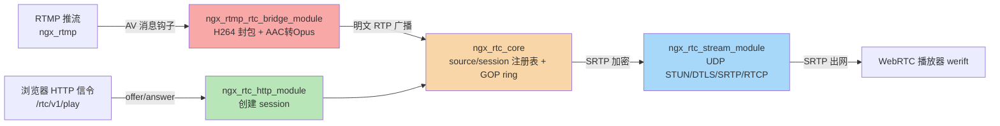
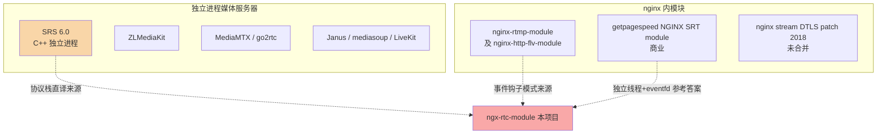

# ngx-rtc-module nginx 设计哲学审查与开源先例调研

> 审查对象：`/home/dgliu/workspace/webrtc/ngx-rtc-module/src/`（纯 C 核心 + 三个 nginx 胶水模块）
> 对照基准：`/home/dgliu/workspace/webrtc/openresty-1.31.1.1/bundle/nginx-1.31.1/` 及 nginx-http-flv-module/nginx-rtmp-module 的集成惯例
> 审查方式：只读，逐文件对照 nginx 设计哲学，标注 file:line。时间为 2026-09-09。

## 1 结论摘要

### 1.1 一句话结论

ngx-rtc-module 的**模块骨架（ngx_module_t 三模块划分、事件钩子、回调式协议栈）符合 nginx 哲学**，协议层「SRS 6.0 协议栈直译进 nginx 进程」的**自研思路在社区无成熟先例**（最接近的 SRS 是独立进程）；但当前在**事件循环内同步做 FFmpeg 音频转码、进程级全局链表替代模块 ctx、硬编码配置、每 worker 独立生成 DTLS 证书、source 永不回收**五点上偏离 nginx 哲学，前三点是上线前必须纠正的反模式。

### 1.2 哲学符合度总评

| 维度 | 符合度 | 一句话结论 |
| --- | --- | --- |
| 1 模块化 | 高 | 三模块 + ngx_module_t + 指令注册标准，不侵入 nginx 核心 |
| 2 事件驱动 | 中低 | 无阻塞 IO，但音频转码/DTLS 握手在事件循环内同步做 CPU 密集活 |
| 3 内存管理 | 中 | session 用 ngx_alloc 正确，但 source 用 libc calloc 且永不释放 |
| 4 配置驱动 | 低 | 关键参数全是 `#define`/硬编码，仅 HTTP/stream 少量指令 |
| 5 零拷贝与缓冲区 | 中 | 解析就地，但发送链路 3 次拷贝，绕过 ngx_buf/chain |
| 6 单 worker 模型 | 低 | 进程级静态链表 + 每 worker 独立 DTLS 证书，是明确的多 worker 障碍 |
| 7 异步回调风格 | 高 | handler + 模块 ctx + opaque 回调风格地道，个别 libc 混用 |

### 1.3 开源先例结论

- **不存在**「纯 nginx 模块进程内直接 RTMP→WebRTC」的成熟开源先例。nginx-rtmp-module（含其派生 nginx-http-flv-module）明确不支持 WebRTC，社区共识是「nginx-rtmp 做 RTMP/HTTP-FLV + 独立进程 SRS/Janus/mediasoup 做 WebRTC」两段式。
- **本项目 = SRS 6.0 RTC 协议栈（STUN/DTLS/SRTP/RTP/SDP/RTCP/AAC→Opus）+ /rtc/v1/play 信令契约 直译进 nginx worker 进程**，代码注释逐文件标注了 SRS 源文件，是一条罕见且无先例的路径。
- 唯一「在 nginx 内集成带自有事件循环的协议栈」的工业先例是 **getpagespeed 的 NGINX SRT module（商业 RPM）**：libsrt 跑在独立线程 + eventfd 通知 nginx 事件循环，正是本项目音频转码/DTLS 阻塞问题的参考答案。
- nginx 官方 2018 年有 **stream 模块 DTLS 实验 patch（Vladimir Homutov，未合并）**，说明「nginx 内做 DTLS/WebRTC」方向上官方曾考虑过，但从未落地，本项目相当于自己补了这一块。

## 2 nginx 哲学符合/不符合清单

### 2.1 架构总览

（红色=CPU 密集点：bridge 音频转码在事件循环内；橙色=进程级全局可变状态；蓝色/绿色=标准 nginx 事件回调。）

### 2.2 逐维度清单

#### 维度 1：模块化

| 结论 | file:line | 说明 |
| --- | --- | --- |
| 符合 | `ngx_rtc_http_module.c:77-90` | 标准 `ngx_module_t` + `NGX_MODULE_V1` + `NGX_HTTP_MODULE` + `ngx_command_t` 指令表 |
| 符合 | `ngx_rtc_stream_module.c:111-124` | `NGX_STREAM_MODULE`，`rtc` 指令挂 `cscf->handler` |
| 符合 | `ngx_rtmp_rtc_bridge_module.c:83-96` | `NGX_RTMP_MODULE`（0x504D5452，见 `nginx-http-flv-module/ngx_rtmp.h:555`）；`config:32-38` 用 `ngx_module_type=CORE` 编译，与 nginx-rtmp-module 的 RTMP_CORE 约定一致，非 bug |
| 符合 | `ngx_rtmp_rtc_bridge_module.c:99-114` | 无指令的纯事件钩子，`postconfiguration` 注册 `events[NGX_RTMP_MSG_VIDEO/AUDIO]`，与 gop_cache 同模式 |
| 符合 | 整体 | 零改动 nginx/http-flv 源码，纯 addon |
| 不符合 | `ngx_rtc_session_fsm.c:67-170` | HSM 引擎 + session_fsm 两层状态机（约 1100 行），entry/exit action 目前是 TODO 空壳，真实逻辑（dtls_create/subscribe/teardown）内联在 `ngx_rtc_stream_module.c:294-453`，形成「双份状态源」的迁移中间态。HSM 本身不是错误，问题在于状态未收敛：要么把动作真正迁入 HSM entry/exit 并删除内联副本，要么删掉空壳只保留纯状态跟踪用法 |

改进建议：要么把 `dtls_create`/`subscribe`/`teardown` 真正迁入 FSM entry/exit action 并删除 `ngx_rtc_stream_module.c` 内的内联副本，要么删除空壳只保留纯状态跟踪（`is_ready`）用法。二者皆可，但必须二选一收敛，不能长期停留在双份状态源。

#### 维度 2：事件驱动

| 结论 | file:line | 说明 |
| --- | --- | --- |
| 符合 | `ngx_rtc_dtls.c:190-200,209-243` | OpenSSL memory BIO + 非阻塞 `SSL_read`，出站走 `send_cb` 回调，无阻塞 recv |
| 符合 | `ngx_rtmp_rtc_bridge_module.c:196-207`、`ngx_rtc_stream_module.c:172-177` | RTCP SR 与 session 回收均用 `ngx_add_timer` 周期触发 |
| 符合 | `ngx_rtc_stream_module.c:502-547` | 跨栈释放 UDP session 用 `ngx_post_event`，避免接收路径同步 `ngx_stream_finalize_session` 的 use-after-free，处理正确且地道 |
| **反模式** | `ngx_rtmp_rtc_bridge_module.c:470-505` → `ngx_rtc_audio.c:165-215,300-329` | **AAC→Opus 转码（FFmpeg avcodec 解码 + swresample 重采样 + libopus 编码）在 RTMP AV handler 内同步执行**，直接落在 nginx 事件循环里。每路流每 23ms 触发一次，SRS 官方口径为「音频转码一路流约 2% CPU」（检索记录：https://blog.51cto.com/u_16099240/13951484 转述 SRS `rtc.rtmp_to_rtc` 配置说明），会放大 worker 延迟并拖累同 worker 的 HTTP 连接 |
| 风险 | `ngx_rtc_dtls.c:47-106,143-159` | **每个 worker 在 init_process 独立生成 RSA-2048 自签证书**（`ngx_rtc_http_module.c:124-134` 与 `ngx_rtc_stream_module.c:157-180` 各自触发），启动即几十毫秒量级 CPU，且导致各 worker fingerprint 不同 |
| 风险 | `ngx_rtc_dtls.c:224-233` | DTLS 握手（ECDHE）同步在 `c->recv` 路径，单次 1-5ms 可接受，高并发握手会积压 |
| 风险 | `ngx_rtc_core.c:195`、`ngx_rtc_stream_module.c:276`、`ngx_rtmp_rtc_bridge_module.c:168` | `c->send` 返回值被忽略，UDP `EAGAIN`/`ENOBUFS` 未处理（无 ngx_event 写队列/背压） |

改进建议：音频转码迁到独立线程池 + 事件队列（参考 getpagespeed NGINX SRT module 的「独立线程 + eventfd 通知 nginx 事件循环」模式），或至少量化每帧耗时并降复杂度（当前 OPUS_SET_COMPLEXITY(1) 已是低复杂度，但仍需线程隔离）；DTLS 证书改为配置文件提供或 master 进程生成一次后继承，统一 fingerprint。

#### 维度 3：内存管理

| 结论 | file:line | 说明 |
| --- | --- | --- |
| 符合 | `ngx_rtc_http_module.c:266` | session 用 `ngx_alloc` 而非 request pool，注释明确生命周期跨 HTTP 请求 |
| 符合 | `ngx_rtc_stream_module.c:502,528` | posted event 用 `ngx_alloc`（必须活过 connection pool），session 用 `ngx_free` 释放 |
| 符合 | `ngx_rtc_core.h:86` | 每 session cipher 缓冲常驻复用，避免每包栈上分配 |
| 符合 | `ngx_rtc_http_module.c:98`、`ngx_rtc_stream_module.c:132` | loc/srv conf 用 `ngx_pcalloc(cf->pool)` |
| **反模式** | `ngx_rtc_core.c:35,217` | **source 用 libc `calloc` 且 `ngx_rtc_source_remove` 根本不存在**；每个唯一 `app/stream` 名泄漏一个 source + 懒分配的 2.4MB GOP ring（2048 slot × ~1224B）。长期运行 + 大量唯一流名 = 内存无限增长 |
| 不一致 | `ngx_rtc_core.c` 全文 | 胶水层混用 libc（calloc/strcmp/snprintf）与 nginx 封装；纯 C 核心（rtp/sdp/...）用 libc 合理（可独立 host 测试），但 `ngx_rtc_core.c` 属胶水却用 libc |
| 可接受 | `ngx_rtc_dtls.c:22-25` | 全局 X509/EVP_PKEY/SSL_CTX 无 exit_process 释放，worker 生命周期内常驻可接受，但应注释说明 |

改进建议：source 绑定 RTMP publish 生命周期回收（现有 `source_fsm` 的 STOPPED 状态是空壳未接线），并统一用 `ngx_alloc/ngx_free`；GOP ring 随 source 一起释放。

#### 维度 4：配置驱动

| 结论 | file:line | 说明 |
| --- | --- | --- |
| 符合 | `ngx_rtc_http_module.c:38-62,105,318-319` | `rtc_candidate_port` 正确用 `NGX_CONF_UNSET` + 默认 8000 回退，规范 |
| 符合 | `ngx_rtc_stream_module.c:88-98,142-154` | `rtc` 指令挂 handler；UDP 端口本身由 nginx 原生 `listen 8000 udp` 决定，代码未硬编码 |
| **反模式** | `ngx_rtmp_rtc_bridge_module.c:28,32` | `NGX_RTC_AUDIO_BITRATE 64000`、`NGX_RTC_RTCP_SR_INTERVAL_MS 2000` 硬编码 `#define` |
| **反模式** | `ngx_rtc_stream_module.c:58-60` | handshake 超时 10s / ready 超时 30s / reap 周期 2s 硬编码 |
| **反模式** | `ngx_rtc_http_module.c:312,318` | 默认 candidate_ip `"127.0.0.1"`、默认 port 8000 硬编码 |
| 硬编码 | `ngx_rtc_rtp.h:64-65`、`ngx_rtc_sdp.c:744-745` | H264/Opus PT 102/111、fmtp 串硬编码 |
| 缺失 | bridge 模块 context 全 NULL | 无法 per-app 开关（如禁用转码/保留 B 帧/禁用 GOP 缓存，SRS 对应 `rtc.keep_bframe` 等指令） |

改进建议：新增 `rtc_audio_bitrate` / `rtc_sr_interval` / `rtc_handshake_timeout` / `rtc_ready_timeout` 等 `NGX_CONF_TAKE1` 指令，默认值用 `NGX_CONF_UNSET`；bridge 模块补 main/srv conf 承载开关。

#### 维度 5：零拷贝与缓冲区

| 结论 | file:line | 说明 |
| --- | --- | --- |
| 符合 | `ngx_rtmp_rtc_bridge_module.c:228-229,350-352` | RTMP AV 负载就地读 `in->buf`，NALU 用指针封包，不拷贝输入 |
| 符合 | `ngx_rtc_core.c:163` | 明文 RTP 复制进 session cipher 后 SRTP 就地变换，SRTP 每 session 密钥不同，此拷贝是理论下界 |
| 可优化 | `ngx_rtc_core.c:227` + `ngx_rtc_core.c:163` | 发送链路 3 次拷贝：`scratch(栈) → GOP ring slot → session cipher`。scratch→ring 这一跳可省（emit 回调直接写 ring 再广播，或用 chain 引用同一明文缓冲） |
| 偏离 | `ngx_rtc_core.c:195`、`ngx_rtmp_rtc_bridge_module.c:168` | 广播发送用 `c->send` 裸指针，完全绕过 `ngx_buf_t`/`ngx_chain_t`/写事件链，无法享受 nginx 发送合并/背压（UDP stream 下是常见做法，但属偏离） |
| 风险 | `ngx_rtc_http_module.c:159-177` | 信令 body 用约 33KB 栈缓冲（body_buf[8192]+resp_buf[8192]+sdp[8192]+ans_buf[4096]），无长度上限校验，大 SDP offer 被静默截断 |

#### 维度 6：单 worker 模型

| 结论 | file:line | 说明 |
| --- | --- | --- |
| 符合 | `ngx_rtc_core.h:7` | 注释明确「Single-worker MVP: plain process-wide lists」，有自知之明 |
| 符合 | `ngx_rtmp_rtc_bridge_module.c:196`、`ngx_rtc_stream_module.c:157` | 定时器均 `init_process` 每 worker 独立，与 master-worker fork 兼容 |
| **反模式** | `ngx_rtc_core.c:17-18` | source/session 是**文件级 static 链表**（全局可变状态代替模块 ctx），无锁、无 shm；多 worker 下 RTMP 推流落 worker A、HTTP play 落 worker B 时 `ngx_rtc_source_get` 返回 NULL，信令与媒体分离（与 nginx-rtmp 经典问题相同，后者靠 `rtmp_auto_push` 缓解） |
| 阻碍 | `ngx_rtc_dtls.c:22-25,47-106` | DTLS 每 worker 独立自签证书 → fingerprint 因 worker 而异；reuseport 分流下 HTTP 信令返回的 fingerprint 与 UDP DTLS 实际 worker 可能不一致 |

改进建议：落地 `docs/multi-worker-shm-design.md` 的 ngx_shm_zone + slab + 每 worker 私有 DTLS/SRTP 扩展表方案；DTLS 证书统一由配置或 master 生成。

#### 维度 7：异步回调风格

| 结论 | file:line | 说明 |
| --- | --- | --- |
| 符合 | `ngx_rtmp_rtc_bridge_module.c:223`、`ngx_rtc_stream_module.c:194,267,332,496`、`ngx_rtc_http_module.c:309` | `ngx_rtmp_get_module_ctx` / `ngx_stream_get_module_ctx` / `ngx_stream_set_ctx` / `ngx_http_get_module_loc_conf` 上下文传递地道 |
| 符合 | rtp/sdp/audio/dtls/rtcp 各头 | 纯 C 核心全部 opaque 回调（rtp emit / audio frame / dtls send+done / rtcp decode cb），解耦好、可 host 单测 |
| 脆弱 | `ngx_rtc_stream_module.c:494` | `c->data` 直接强转 `ngx_stream_session_t`，依赖 stream 内部「c->data 指向 session」约定 |
| 不一致 | `ngx_rtc_stream_module.c:261,310,340,445`、`ngx_rtc_http_module.c:276` | `time(NULL)` 每包调用（秒级粒度 + 系统时钟回拨误判超时），应改用 `ngx_time()`/`ngx_current_msec` 缓存时钟 |
| 不一致 | `ngx_rtc_http_module.c:220-238`、`ngx_rtmp_rtc_bridge_module.c:247` | 用 libc `snprintf/strstr/strchr` 而非 `ngx_*` 封装，功能等价但风格不一 |

## 3 开源同类模块对比

| 项目 | 实现方式 | 与本项目异同 | 是否可借鉴 |
| --- | --- | --- | --- |
| **SRS (ossrs)** | C++ 独立进程，ST 协程；RTMP/WebRTC/HLS/FLV/SRT/GB28181；`/rtc/v1/play\|publish` + WHIP/WHEP | **最接近**。本项目的 STUN/DTLS/SRTP/RTP/SDP/RTCP/AAC→Opus、`/rtc/v1/play` 契约、B 帧过滤、STAP-A 前置 SPS/PPS 全部是 SRS 6.0 源码的 C 直译（代码注释逐文件标注 SRS 路径）。差异：SRS 是独立进程有自己的事件循环/协程，无 nginx worker 模型约束 | 是主要参考源。可借鉴其 `rtc.keep_bframe`/`rtc.rtmp_to_rtc` 等配置项设计、每订阅者 PT/seq/ts 重写（SrsRtcSendTrack::rebuild_packet，本项目仅重写 PT 单字节，ngx_rtc_core.c:165-188）；来源 https://github.com/ossrs/srs |
| **nginx-rtmp-module (arut) / nginx-http-flv-module (winshining)** | nginx 内模块，RTMP/HLS/HTTP-FLV，明确不支持 WebRTC | 是「nginx 内做流媒体模块」的先例，但无 RTC。本项目的 bridge 模块复用其 `events[]` 钩子模式；`rtmp_auto_push` 是其多 worker 方案 | 借鉴其事件钩子与多 worker relay 思路；其维护停滞（多年无重大更新）也是本项目自研的动机之一 |
| **ZLMediaKit** | C++ 独立进程，RTMP/RTSP/WebRTC(H264/265)/SRT | 同样实现 `/rtc/v1/...`（rtcdn 社区约定）。独立进程 | 借鉴：`/rtc/v1/publish\|play` 是国内 SFU 事实信令标准，本项目兼容该契约是对的 |
| **MediaMTX（原 rtsp-simple-server）/ go2rtc** | Go 独立进程，多协议互转含 WebRTC(WHIP/WHEP) | 独立进程，与 nginx 无集成 | 借鉴其 WHEP/WHIP 标准化方向（本项目仅 play，未做 publish/WHIP） |
| **Janus** | C 独立进程 WebRTC SFU，插件化，streaming 插件接 RTSP/RTMP | 独立进程，与 nginx 只做反向代理组合 | 借鉴其 C 实现 STUN/DTLS/SRTP 的组织方式；但其依赖 libnice/usrsctp，重 |
| **mediasoup / LiveKit / OWT / Licode / OvenMediaEngine** | Node/C++/Go 独立服务或 SFU 库 | 均独立进程，与 nginx 无进程内集成 | 少借鉴价值；LiveKit/OWT 需外部 RTMP 网关 |
| **getpagespeed NGINX SRT module（商业 RPM）** | nginx 动态模块，libsrt 跑独立线程 + eventfd 通知 nginx 事件循环 | **最接近的「nginx 内集成第三方协议栈」工业先例**，直接回答「CPU 密集/自有事件循环的库如何不阻塞 nginx worker」 | 强借鉴：音频转码、DTLS 握手等 CPU 密集段应迁到独立线程 + 事件队列。来源：https://github.com/nginx-modules/nginx-srt-module 、https://www.getpagespeed.com/server-setup/nginx/nginx-srt-module |
| **nginx stream DTLS 实验 patch（2018，未合并）** | nginx 官方 stream 模块增加 UDP+DTLS 终止 | 官方曾考虑过 DTLS 方向但从未合入 mainline | 佐证：nginx 内做 DTLS/WebRTC 是空白区，本项目等于自研补缺。补丁目录 http://nginx.org/patches/dtls/ ，讨论 http://mailman.nginx.org/pipermail/nginx/2018-February/055680.html ，未合并原因 https://nginx.org/pipermail/nginx-ru/2018-June/061220.html |

### 3.1 重点回答：自研思路在社区是否有先例

1. **无先例（纯 nginx 模块进程内 RTMP→WebRTC）**：检索确认 nginx-rtmp-module、nginx-http-flv-module、以及各类 nginx webrtc 话题，社区标准答案是「nginx-rtmp + 独立进程 SRS/Janus/mediasoup」。没有发现任何成熟的、直接跑在 nginx worker 进程内的 RTMP→WebRTC 模块。
2. **最接近的三项**：
   - SRS（协议栈同源，独立进程）——本项目的血缘来源；
   - getpagespeed NGINX SRT module（进程内集成第三方协议栈的工程范式）；
   - nginx 官方 DTLS patch（官方对该方向的态度：考虑过、未落地）。
3. 结论：本项目是「把 SRS 协议栈塞进 nginx worker」的自研空白区探索，正确性上已由 SRS 参考系背书，但**工程风险集中在事件循环阻塞与多 worker 状态共享**，这两个风险恰好是「独立进程」天然规避、而「nginx 进程内」必须自己解决的核心矛盾。

### 3.2 检索范围与查询词（支撑「无先例」否定性结论）

检索时间 2026-09-09，工具为 mcp__MiniMax__web_search（Google 风格检索）+ WebFetch（拉取 nginx 邮件列表原文）。

| 维度 | 覆盖范围 |
| --- | --- |
| 平台 | GitHub（nginx-rtmp 生态 topic 页、nginx webrtc/rtc/DTLS/QUIC 相关仓库页）、nginx 官方邮件列表（mailman.nginx.org / nginx.org/pipermail 的 nginx-devel 与 nginx-ru 线程）、nginx.org 官方文档、ossrs.io（SRS）、Cloudflare blog、getpagespeed blog、npm/GitHub（ngx-webrtc 同名项目甄别） |
| 查询词 | `nginx webrtc module github RTMP to WebRTC`；`nginx rtc module ngx webrtc STUN DTLS SRTP`；`nginx-rtmp-module WebRTC integration SRS Janus`；`SRS nginx WebRTC RTMP flv play rtc/v1/play`；`"nginx" WebRTC module github ngx_rtc WHIP WHEP relay RTMP flv`；`github nginx webrtc module ngx_webrtc DTLS SRTP UDP`；`github nginx QUIC module DTLS over UDP personal implementation`；`nginx quiche HTTP/3 unofficial patch Cloudflare nginx QUIC integration`；`nginx-devel DTLS stream UDP patch Vladimir Homutov 2018 not merged`；`werift WebRTC SRS rtc/v1/play streamurl play API`；`"nginx" DTLS UDP module github SRTP RTP relay STUN 自研 C 模块` |

局限性说明：否定性结论基于上述检索的召回结果，主流生态（nginx-rtmp / SRS / Janus / mediasoup / LiveKit / MediaMTX / ZLMediaKit / go2rtc / nginx-srt-module / quiche / nginx-quic-lb / OWT / Licode / OvenMediaEngine）均已覆盖；不排除存在未被搜索引擎召回的小众个人实现，但「nginx 内进程内 RTMP→WebRTC」无成熟先例的结论成立。

## 4 基于审查的改进优先级建议

| 优先级 | 问题 | 位置 | 建议 |
| --- | --- | --- | --- |
| P0 | 音频转码阻塞事件循环 | `ngx_rtmp_rtc_bridge_module.c:470-505` | 转码迁独立线程 + 事件队列（eventfd 通知 nginx 事件循环），或先降复杂度并量化每帧耗时 |
| P0 | source 永不回收（内存无限增长） | `ngx_rtc_core.c:35,217` | 绑定 RTMP publish 生命周期回收 source + GOP ring，统一 ngx_alloc/ngx_free |
| P0 | 每 worker 独立生成 RSA-2048 DTLS 证书，fingerprint 不一致 | `ngx_rtc_dtls.c:47-106` | 改为配置提供证书或 master 生成一次继承，消除启动开销并统一 fingerprint |
| P0 | `c->send` 忽略 EAGAIN/ENOBUFS | `ngx_rtc_core.c:195` | UDP 发送失败至少计数/日志，必要时加写事件队列 |
| P1 | 关键参数硬编码 | `ngx_rtmp_rtc_bridge_module.c:28,32`、`ngx_rtc_stream_module.c:58-60` | 提升为 nginx.conf 指令 + NGX_CONF_UNSET 默认值 |
| P1 | HSM 与内联逻辑双份状态源未收敛（迁移中间态） | `ngx_rtc_session_fsm.c:67-170` | 二选一：真正迁移 dtls_create/subscribe/teardown 进 FSM entry/exit 并删内联重复，或删空壳保留纯状态跟踪 |
| P1 | 全局可变链表代替模块 ctx（多 worker 障碍） | `ngx_rtc_core.c:17-18` | 落地 ngx_shm_zone + slab + 每 worker 私有扩展表 |
| P1 | `time(NULL)` 每包调用 | `ngx_rtc_stream_module.c:261` 等 | 改 `ngx_time()`/`ngx_current_msec` |
| P2 | RTP 发送 3 次拷贝 | `ngx_rtc_core.c:227,163` | emit 直接写 ring 再广播，省 scratch→ring 一跳 |
| P2 | 信令栈缓冲 + 大 SDP 截断 | `ngx_rtc_http_module.c:159-177` | 改 pool 分配 + body 上限校验 |
| P2 | libc/ngx 混用、`c->data` 强转 | `ngx_rtc_core.c`、`ngx_rtc_stream_module.c:494` | 统一封装 + 注释内部依赖 |

## 5 深入调研补充：DTLS 官方 patch 与个人实现（可借鉴点）

### 5.1 结论先行：最有价值的 5 个可借鉴点

| # | 可借鉴点 | 出处 | 落地建议 |
| --- | --- | --- | --- |
| 1 | **DTLS 握手超时/重传定时器 + cookie 反欺骗** | nginx 官方 DTLS patch（`DTLSv1_listen()` + HelloVerifyRequest cookie，HMAC-SHA1 绑定客户端地址） | `ngx_rtc_dtls.c` 首包改用 `DTLSv1_listen()` 获得无状态 cookie + HelloVerifyRequest 反欺骗；握手期间用 `ngx_add_timer` 驱动 OpenSSL 重传（`DTLSv1_handle_timeout`/再次 `SSL_do_handshake`），而不是只靠 10s idle reaper 关掉会话。直接解决评估报告已标的 P2 handshake timeout |
| 2 | **独立线程 + eventfd 集成 CPU 密集协议栈** | nginx-srt-module（nginx-modules org / getpagespeed）：「libsrt 跑在 side thread，用 eventfd 通知 nginx 主事件循环」 | 把 AAC→Opus 转码（`ngx_rtc_audio.c`）迁到独立线程 + eventfd/ngx_notify 通知，消除 `ngx_rtmp_rtc_bridge_module.c:470-505` 的事件循环阻塞；必要时 DTLS 握手也可同线程模型承载 |
| 3 | **UDP 连接生命周期「接收路径不释放连接」的官方印证** | nginx 1.15.0 UDP 会话基础设施（`ngx_udp_connection_t` + 按客户端地址的 rbtree）+ 后续官方修复「Stream: fixed possible use of a freed connection」（`ngx_event_udp.c`） | 印证 `ngx_rtc_stream_module.c:502-547` 的 `ngx_rtc_stream_close_ev_t` 延迟 finalize 设计正确；多 worker 下参考其 `reuseport` 要求保证同一客户端所有包落在同一 worker |
| 4 | **协议库自带 timer 回调 → nginx `ngx_add_timer` 驱动的集成范式** | Cloudflare quiche 的 nginx 非官方 patch（`conn.timeout()`/`conn.on_timeout()` 接进 nginx 定时器） | `ngx_rtc_dtls_t` 增加一个「下一个超时时间」回调接口，由 stream 模块用 `ngx_add_timer` 驱动，把 DTLS 重传/握手超时从「同步阻塞或整段关闭」升级为「事件循环内精确调度」 |
| 5 | **DTLS 配置校验 + OpenSSL 版本门控 + 编译期探测** | DTLS patch 的 `ssl_protocols` 交叉校验（UDP SSL listener 必须启用 DTLS、TLS listener 禁止 DTLS、DTLSv1 强制 TLSv1）+ `auto/lib/openssl` 探测 `DTLSv1_listen` | 为 `rtc_candidate_ip/port` 增加 HTTP 与 stream 两侧配置一致性校验；`ngx_rtc_dtls.c` 按 OpenSSL 版本选择 `DTLS_method()`（1.1.0+）/`DTLSv1_2_method()`（1.0.2），编译期用 `NGX_SSL_DTLS` 宏探测能力 |

### 5.2 nginx 官方 stream DTLS patch（2018 未合并）调研详情

**出处与状态**：作者 Vladimir Homutov（nginx 核心开发者），实验性 patch，托管在 `http://nginx.org/patches/dtls/`，发布于 2018-02（邮件列表 nginx-devel / nginx-ru 有完整讨论）。**至今（2026）仍未合入 mainline**。

**设计思路（如何在 nginx stream 模块里做 DTLS over UDP）**：

| 机制 | 实现 | 对我们 ngx_rtc_dtls.c 的对照 |
| --- | --- | --- |
| 两种模式 | ① DTLS 终止：`listen 4443 udp ssl` + `ssl_protocols DTLSv1`；② DTLS 透传到后端：`proxy_ssl on` + `proxy_ssl_protocols DTLSv1` + `proxy_pass` | 本项目是「DTLS 终止后接自研 SRTP」的第三种形态，比官方 patch 多了 SRTP 与 RTP 广播 |
| 每客户端独立 UDP socket | 新增 `ngx_event_udp_accept()`：识别到有效 cookie 后，新建一个 `connect()` 到该客户端的专用 UDP socket（`c->recv = ngx_udp_recv`），把共享 UDP 连接「专用化」 | 本项目用「共享 UDP stream session + 4 元组绑定」（`ngx_rtc_stream_module.c:257-267`），无独立 socket；两者取舍见 5.4 |
| Cookie 反欺骗 | RFC 6347 §4.2.1 无状态 cookie，`HMAC-SHA1(secret, 客户端地址+端口)`；`DTLSv1_listen()` 返回 0（无有效 cookie）时由 OpenSSL 生成 HelloVerifyRequest，nginx 回发后 `NGX_ABORT` 丢弃 session | 本项目 `ngx_rtc_dtls.c` 无 cookie、无 HelloVerifyRequest，`SSL_set_accept_state` 直接 `SSL_read`；首包可被 UDP 反射放大利用（WebRTC 场景 STUN 先绑定 ufrag 部分缓解，但 DTLS 首包仍无 cookie） |
| 握手状态机 | 完全委托 OpenSSL：`DTLSv1_listen` 处理首飞行 → `SSL_read` 驱动握手 → `SSL_is_init_finished` 判完成 | 本项目同为委托 OpenSSL（`ngx_rtc_dtls.c:209-243`），但**无定时器驱动，握手丢包时 OpenSSL 不会重传**，只能等 10s idle reaper 关会话 |
| 版本门控 | `DTLSv1_2_method()` 仅 OpenSSL ≥1.0.2；1.1.0+ 用 `DTLS_method()`（单个 method 已废弃）；<1.1.0 手动设 `SSL_OP_COOKIE_EXCHANGE` | 本项目 `ngx_rtc_dtls.c:111` 用 `DTLS_server_method()`（1.1.0+ 可用），无版本门控与编译期探测 |
| 编译期探测 | `auto/lib/openssl/conf` 用 `DTLSv1_listen(NULL,NULL)` 探测 → 定义 `NGX_SSL_DTLS` | 本项目 `config` 硬开 `USE_OPENSSL=YES`，无 DTLS 能力探测 |

**为何没被合并**：nginx 核心开发者 Maxim Konovalov 在 nginx-ru 邮件列表（2018-06）的原话：发布一年内「没有收到任何清晰的 use-case 描述，大部分人在拿到 patch 后就不见了」。即**不是技术失败，而是缺乏明确使用场景**。唯一公开的真实用户是 RFC 8094（DNS-over-DTLS）offload 到 BIND9。这解释了为何「nginx 内做 DTLS」至今是空白区，也反证本项目的 RTMP→WebRTC 是官方未覆盖的真实场景。

**附带的两个历史教训（对本项目直接有效）**：
- `ngx_stream_ssl_init_connection()` 曾对 UDP socket 无条件套用 `tcp_nodelay`，导致 DTLS 必须 `tcp_nodelay off` 才能跑，后以 `c->type == SOCK_STREAM` 修复——教训是**把 TCP 假定带进 UDP 路径**。本项目 `ngx_rtc_stream_module.c` 走 UDP 路径时也要警惕任何 TCP 语义的隐式假设。
- `ngx_event_udp_accept()` 绑定特权端口（<1024）需 `CAP_NET_BIND_SERVICE`——本项目默认 8000 端口避开了这个问题，但如果未来用 443 做 DTLS 会踩同样的坑。

**可借鉴的 DTLS 处理细节（针对评估报告已标 P2 的 handshake timeout）**：
1. 首包用 `DTLSv1_listen()` 替代直接 `SSL_read`，获得无状态 cookie + HelloVerifyRequest 反欺骗（同时天然处理首飞行重传）。
2. 握手期用 `ngx_add_timer` 驱动 OpenSSL 重传：OpenSSL DTLS 的重传依赖应用在定时器到期时再次调用握手 API；本项目目前完全没有这一步，丢包即卡死直到超时关闭。
3. 复用官方 patch 的 `ssl_protocols` 交叉校验思路，在 `ngx_rtc_http_module`/`ngx_rtc_stream_module` 配置加载时校验 candidate_ip/port 与 UDP listen 的一致性。

### 5.3 个人实现的 nginx WebRTC / DTLS / QUIC 模块逐个记录

| 项目 / 作者 / 活跃度 | 实现方式 | 与我们方案异同 | 可借鉴点 |
| --- | --- | --- | --- |
| **nginx-srt-module**（github.com/nginx-modules/nginx-srt-module，getpagespeed / Danila Vershinin，活跃，RPM 分发） | nginx 动态模块，SRT/TCP 双向网关；`srt {}` 新上下文；**libsrt 跑在 side thread，eventfd 通知 nginx 主事件循环** | 同为「nginx 内集成第三方协议栈」，但走独立线程而非进程内协议栈 | **最高价值**：独立线程 + eventfd 的精确工程范式，是音频转码/DTLS 阻塞问题的标准答案；其 `--with-stream --with-threads` 依赖也是参考 |
| **cloudflare/quiche 的 nginx 非官方 patch**（github.com/cloudflare/quiche，extras/nginx/nginx-1.16.patch，2019，随 quiche 演进） | Rust quiche（QUIC+TLS1.3 over UDP）打进 nginx 1.16，`listen 443 quic`，BoringSSL | 最接近的「TLS-over-UDP 握手状态机 + 重传定时器接进 nginx 事件循环」先例，但目标是 HTTP/3 而非 RTC 媒体 | quiche 暴露 `conn.timeout()`/`conn.on_timeout()`，由 nginx 定时器驱动——**正是本项目 DTLS 重传/握手超时应采用的回调模式**；也可借鉴其「第三方库 + 官方模块胶水」的构建集成（`--with-quiche`） |
| **martinduke/nginx-quic-lb**（作者 Martin Duke，已年久失修） | 基于 nginx UDP proxy 的 QUIC-LB 负载均衡模块，stream 块 + `quic-lb` 指令 | 展示 nginx stream 模块处理 QUIC/UDP 会话 + connection ID 路由，无 SRTP/DTLS 终止 | 借鉴其 stream UDP 会话处理与 per-packet 路由；价值低于前两者 |
| **ngx-webrtc**（TarasMoskovych / lotterfriends 等） | **Angular 前端 WebRTC 组件库，与 nginx 无关** | 纯同名，无参考价值 | 无（仅作「检索到的同名项目非 nginx 模块」的澄清） |
| **nginx 官方 HTTP/3（1.25+）** | 原生 QUIC 进 core（`ngx_http_v3_module`），无 DTLS/SRTP | 官方在 core 内做了 QUIC 但没做 DTLS，证明「UDP 之上的 TLS 握手」官方只覆盖了 QUIC 一条路 | 不直接可借鉴，但印证 DTLS 仍是 nginx 空白 |

补充结论：**未发现任何真正的「ngx_webrtc / nginx-rtc 纯 C 模块做 RTMP→WebRTC 或 DTLS+SRTP 媒体转发」的个人实现**。个人项目集中在三块：SRT 网关（nginx-srt-module）、QUIC/HTTP3 集成（quiche patch、quic-lb）、以及大量 nginx-rtmp-module 的 fork（均无 RTC）。本项目「DTLS 终止 + SRTP + RTP 广播」三者合一跑在 nginx worker 内，是检索范围内无先例的组合。

### 5.4 对 ngx_rtc_dtls.c 的针对性改进评估

| 官方 patch 的做法 | 本项目现状 | 建议采用度 |
| --- | --- | --- |
| `ngx_event_udp_accept` 每客户端独立 connected UDP socket | 共享 stream session + 4 元组绑定 | **不采用**：WebRTC 是单 socket 多 session 模型，独立 socket 反而破坏 ICE 端口复用；本项目 4 元组绑定更贴合 WebRTC |
| `DTLSv1_listen()` cookie + HelloVerifyRequest | 直接 `SSL_read` 无 cookie | **建议采用**：低成本获得反欺骗 + 首飞行重传，代价是每个 session 首个 ClientHello 多一次往返 |
| 握手超时/重传由 OpenSSL 内部 timer + 应用驱动 | 仅靠 10s idle reaper 关闭 | **必须补**：增加 `ngx_add_timer` 驱动的握手超时回调，DTLS 丢包场景下当前实现会静默卡死 10 秒 |
| `ssl_protocols` 配置交叉校验 | candidate_ip/port 与 listen 端口无校验 | **建议采用**：配置加载期校验，避免运行时 4 元组对不上 |

> 综上，官方 DTLS patch 对本项目最大的价值不是「整体搬入」，而是三个可直接落到 `ngx_rtc_dtls.c` 的具体点：**`DTLSv1_listen` 首包 cookie、握手超时定时器、配置一致性校验**；而「CPU 密集段不阻塞 worker」的标准答案来自 nginx-srt-module 的 side-thread + eventfd 模式，quiche patch 则提供了「协议库 timer 回调接 nginx 定时器」的现成范式。

## 6 OpenResty 生态可复用模块评估（补充调研）

### 6.1 结论先行（用户决策）

| 组件 | 决策 | 适用场景 |
| --- | --- | --- |
| lua-resty-redis | **排除** | 不引入外部存储依赖，stream key 保持本地表 + `lua_shared_dict` 热加载 |
| lua_shared_dict | **可用（首选）** | 共享状态首选载体：`stream_keys`/`rate_limit` 已用；未来多 worker 的 source/session 元数据共享也走 shm + shared dict 思路 |
| cosocket | **可用** | 外接认证网关、`on_publish` 回调主动查外部服务等场景 |
| lua-resty-lock | **可用** | 多 worker 协调、防 dog-pile、共享状态原子更新时引入 |

1. **最值得立即复用**：`resty.limit.count`（lua-resty-limit-traffic）替换 `auth.lua` 的手写 `ngx.shared.rate_limit:incr` 限流——语义完全等价（固定窗口计数）但更规范（显式 count/window、返回剩余量、可聚合）。该库**已随 OpenResty 内置**（`openresty-rtmp-new/lualib/resty/limit/count.lua` 已存在），引入成本约等于 0。
2. **现状已正确、保持自研**：推流鉴权用 nginx-rtmp notify 回调 + `rtmp_auth.lua`、stream key 用本地 Lua 表 + `lua_shared_dict` 热载、定时用 `ngx.timer.every`——单机场景下是最小改动且零外部依赖，全部符合 nginx 哲学。
3. 关键边界：**session 超时/回收归 C 模块**（`ngx_rtc_stream_module.c` 已有 reap timer），Lua 侧只做信令、限流、配置，不要在 Lua 重复造 session 状态。

### 6.2 适合复用 vs 保持自研总表

| 能力 | 现状实现 | 复用模块 | 决策 | 引入成本 |
| --- | --- | --- | --- | --- |
| play 信令限流（30 次/分/IP） | `auth.lua` 手写 `incr`（固定窗口） | `resty.limit.count`（或 `resty.limit.req` 漏桶） | **替换**（语义等价、更规范） | ≈0（已内置） |
| 共享状态载体 | `lua_shared_dict stream_keys 1m` + `rate_limit 10m` 已用 | `ngx.shared.DICT`（`lua_shared_dict` 指令声明） | **可用（首选）**，未来多 worker 的 source/session 元数据共享也走 shm + shared dict | ≈0（ngx_lua 内置） |
| 推流鉴权 | nginx-rtmp notify 回调 → `rtmp_auth.lua` | notify（nginx-rtmp 官方机制）；需主动查外部服务时用 cosocket | **保持自研**（notify）；外接认证网关时 cosocket **可用** | cosocket ≈0（内置） |
| stream key 存储 | `stream_keys.lua` 本地表 + `config.lua` 热载 shm | —（**排除 lua-resty-redis/mysql**） | **保持自研**，不引入外部存储依赖 | — |
| 共享状态原子更新（多 worker） | 无读改写竞态（全量替换） | `lua-resty-lock` | **可用**：多 worker 协调、防 dog-pile、共享状态原子更新时引入 | ≈0（已内置） |
| 外部鉴权服务主动回调 | 未做（play 侧本地 `config.check`） | cosocket `ngx.socket.tcp` / `ngx.location.capture` | **可用**：外接认证网关、`on_publish` 回调主动查外部服务时使用 | cosocket 内置；`lua-resty-http` 需额外引入 |
| session 超时/回收 | C 模块 `ngx_rtc_stream_module.c` reap timer | （`ngx.timer.at` 可在 Lua 侧做，但不建议重复） | **保持自研**（归 C 模块） | — |

### 6.3 逐模块评估

| 模块 / 来源 | 作用 | 本项目是否适用 | 替换或复用建议 |
| --- | --- | --- | --- |
| **resty.limit.count**（https://github.com/openresty/lua-resty-limit-traffic） | 固定窗口计数限流，`new(dict, count, window)`，状态存 lua_shared_dict，跨 worker 一致 | **适用**。当前 `auth.lua` 的 `incr(rl_key, 1, 0, 60)` 本质就是 60s 固定窗口（靠 init_ttl 过期），与 resty.limit.count 语义完全一致 | 替换：`local lc = require "resty.limit.count"; local lim = lc.new("rate_limit", 30, 60); local delay, remaining = lim:incoming(ngx.var.remote_addr, true)`。收益是显式窗口、返回剩余量、可和 `resty.limit.traffic` 聚合多维度限流 |
| **resty.limit.req**（同上） | 漏桶（rate+burst），超出 rate 部分延迟、超出 rate+burst 拒绝 | 可选。30/min 低频信令场景固定窗口足够，漏桶的「延迟放行」对 play 信令无意义 | 不替换，除非未来要「平滑限制 + 拒绝阈值」双重策略 |
| **lua-resty-lock**（https://github.com/openresty/lua-resty-lock） | 基于 shm 的非阻塞互斥锁，`lock(key)/unlock()/expire()`，exptime 防死锁，跨 worker | **可用**：多 worker 协调、防 dog-pile、共享状态原子更新时引入；当前 stream key 是「全量替换」写、无读改写竞态，故暂未使用 | 官方 README 的 cache-lock 四步（get→miss→lock→double-check→回源→unlock）是标准用法；本项目在共享状态出现读改写竞态或需防 dog-pile 时启用 |
| **cosocket（ngx.socket.tcp）**（https://github.com/openresty/lua-nginx-module） | 100% 非阻塞 TCP/UDP socket，接入 nginx 事件循环，仅 content/access/rewrite 及 ngx.timer 上下文可用 | **可用**：外接认证网关、`on_publish` 回调主动查外部服务等场景；当前推流鉴权已由 notify 回调覆盖，故暂未使用 | 优先用 `ngx.location.capture` 子请求到内部 auth location（复用 nginx 上游超时/重试，更 nginx 风格）；确需直连外部服务再用 cosocket + `lua-resty-http`。注意 cosocket 不可在 init_by_lua/set_by_lua 用 |
| **lua-resty-redis**（https://github.com/openresty/lua-resty-redis）/ **lua-resty-mysql**（https://github.com/openresty/lua-resty-mysql） | 基于 cosocket 的 Redis/MySQL 客户端，连接池 `set_keepalive` | **排除**（用户决策：不引入外部存储依赖），stream key 保持本地表 + `lua_shared_dict` 热加载 | 不采用；库虽已随 OpenResty 内置（`lualib/resty/redis.lua`、`resty/mysql.lua` 已在），但本决策明确不引入外部存储 |
| **ngx.shared.DICT 的 expire / set exptime**（lua-nginx-module 内置） | shm key 带 TTL、过期自动清理 | **适用**。可用于 stream key 带 TTL、限流 key 显式过期（替代当前隐式 init_ttl）、临时白名单 | 零成本，按需取用；`ngx.shared.DICT:expire(key, exptime)` 在需要「先写后设 TTL」时用 |
| **ngx.timer.at**（lua-nginx-module 内置） | 单次延迟定时器 | 已用 `ngx.timer.every` 做 config 热载；`ngx.timer.at` 可用于「延迟清理/一次性任务」 | 不建议用于 session 超时回收（与 C 模块 reap timer 职责重叠）；如用，注意 `lua_max_pending_timers` 上限 |
| **ngx.re.match（PCRE）**（lua-nginx-module 内置） | 正则匹配 | `auth.lua` 的 `streamurl:match("^webrtc://...")` 用 Lua 模式，可改用 ngx.re 更严谨 | 可选，非必要 |

### 6.4 检索来源

- lua-resty-limit-traffic 官方 README 与 deepwiki 文档（resty.limit.req 漏桶 / resty.limit.count 固定窗口 / resty.limit.traffic 聚合）：https://github.com/openresty/lua-resty-limit-traffic
- lua-resty-lock 官方 README（exptime/timeout/step/ratio/max_step、cache-lock 四步）：https://github.com/openresty/lua-resty-lock
- cosocket（ngx.socket.tcp）与 ngx.shared.DICT / ngx.timer 官方文档：https://github.com/openresty/lua-nginx-module
- lua-resty-redis：https://github.com/openresty/lua-resty-redis ；lua-resty-mysql：https://github.com/openresty/lua-resty-mysql （均已决策排除，仅作记录）
- 现状核对（本地源码）：`openresty-rtmp-new/nginx/conf/auth.lua`、`stream_keys.lua`、`rtmp_auth.lua`、`nginx.conf`（`lua_shared_dict stream_keys 1m; lua_shared_dict rate_limit 10m;` + `ngx.timer.every(10, reload)`）；`openresty-rtmp-new/lualib/resty/` 已含 `limit/{req,count,conn,traffic}.lua`、`lock.lua`、`redis.lua`、`mysql.lua`
