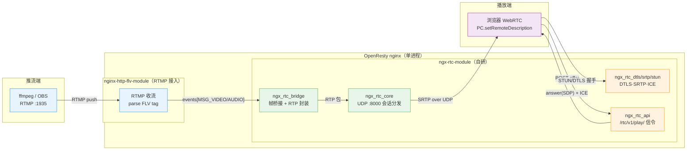
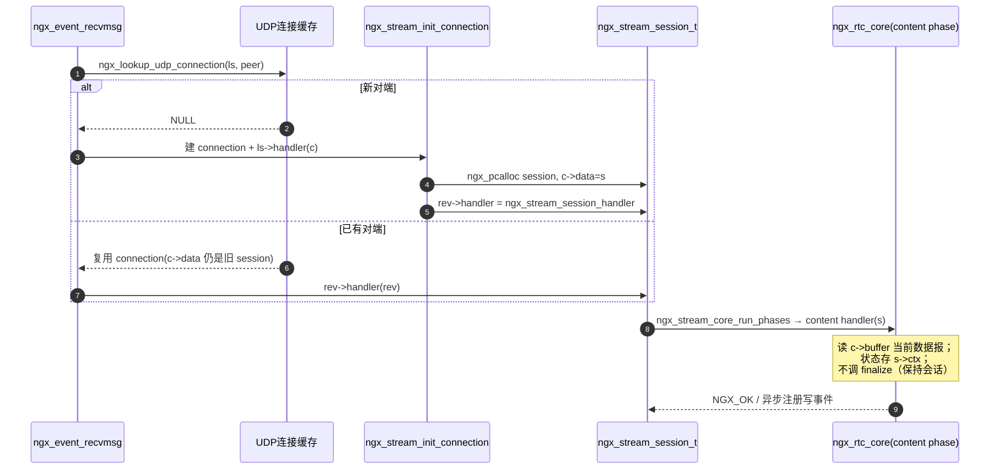
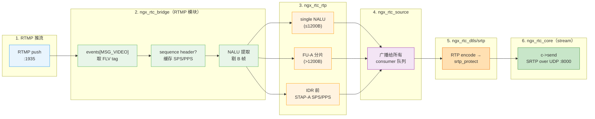
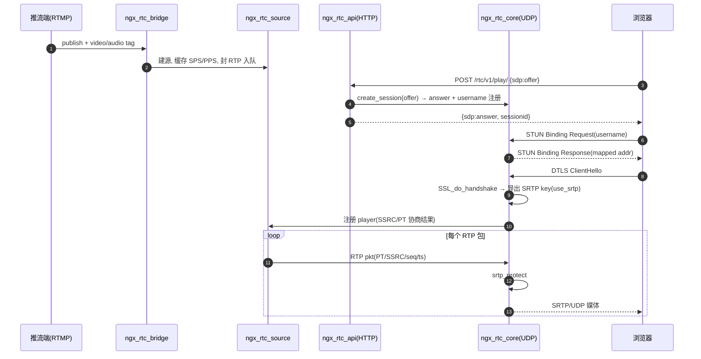

# 自研 nginx RTC 模块技术指导文档（ngx-rtc-module）

## 0. 结论

本项目的核心创新点是**在 nginx 进程内用 C 语言自研 RTC 服务**（替代 SRS），实现 RTMP 收流 → H264 NALU 提取 → RTP/FU-A 封装 → SRTP 加密 → UDP 发送的 WebRTC 低延迟直播。基于对 SRS 6.0 RTC 源码（`/home/dgliu/workspace/webrtc/srs-server-6.0-r1/trunk/`）与 nginx 1.25.3 源码（`/home/dgliu/workspace/webrtc/openresty-1.25.3.1/bundle/nginx-1.25.3/`）的逐一比对，得出三条结论：

1. **nginx 1.25.3 的 stream 模块已内置 `listen udp` 与「按对端 ip:port 复用连接」的 UDP 连接缓存**（`ngx_event_udp.c` 的 `ngx_lookup_udp_connection`/`ngx_insert_udp_connection`），`ngx_stream_session_t` 天然跨数据报持久存在——这正好承载 WebRTC 每 peer 一会话的 DTLS/SRTP 状态，无需自研 UDP 复用层。
2. **自研工作量集中在 5 块**：RTMP 帧桥接（RTMP 模块挂 `events[MSG_VIDEO/AUDIO]`）、H264→RTP 封装（参考 `SrsRtcRtpBuilder`，src/app/srs_app_rtc_source.cpp:830-1408）、DTLS-SRTP 密钥导出（RFC 5764 `SSL_export_keying_material`）、STUN Binding 应答、SDP offer/answer。AAC→Opus 转码可后置（MVP 只做 video-only）。
3. **密码学不重复造轮子**：DTLS 用 OpenSSL，SRTP 优先 libsrtp2（SRS 同款 `srtp_protect`/`srtp_unprotect`），只有密钥导出必须自写（`SrsDtlsImpl::get_srtp_key`，src/app/srs_app_rtc_dtls.cpp:647-676）。

---

## 1. 总体架构与组件映射表

### 1.1 目标架构

### 1.2 SRS → nginx 自研模块映射表

| SRS 6.0 组件（源码文件） | nginx 自研模块/文件 | 职责 | 依赖 |
| --- | --- | --- | --- |
| `SrsFrameToRtcBridge` + `SrsCompositeBridge`（srs_app_stream_bridge.cpp:66-158,231） | `ngx_rtc_bridge.c`（`NGX_RTMP_MODULE`） | 订阅 RTMP 音视频帧，按流创建 RTC 源，驱动 RTP 封装 | nginx-http-flv-module 的 `events[]` 钩子、ngx_rtc_source |
| `SrsRtcSource` / `SrsRtcSourceManager`（srs_app_rtc_source.cpp:326,554,732） | `ngx_rtc_source.c` | 每流一个源：保存 SPS/PPS、SSRC/PT、消费者列表，广播 RTP 包 | 共享内存/红黑树（跨模块进程内） |
| `SrsRtcRtpBuilder`（srs_app_rtc_source.cpp:830-1408） | `ngx_rtc_rtp.c` | H264 NALU → single/STAP-A/FU-A，AAC→Opus 后置 | ngx_rtc_source、FLV tag 解析 |
| `SrsRtpHeader` / `SrsRtpPacket`（srs_kernel_rtc_rtp.cpp:537-942） | `ngx_rtc_rtp.c`（同文件） | RTP 头 12 字节编解码、payload 编解码 | 无 |
| `SrsAudioTranscoder`（srs_app_rtc_codec.cpp:140-467） | `ngx_rtc_transcode.c` | AAC→Opus（FFmpeg libavcodec/libswresample），**MVP 后置** | libavcodec/libswresample |
| `SrsDtlsImpl` / `SrsSRTP`（srs_app_rtc_dtls.cpp:461-1074） | `ngx_rtc_dtls.c` + `ngx_rtc_srtp.c` | DTLS 握手、SRTP 密钥导出、加解密 | OpenSSL、libsrtp2 |
| `SrsRtcUdpNetwork` STUN 部分（srs_app_rtc_network.cpp:363-436） | `ngx_rtc_stun.c` | STUN Binding Request→Response、ICE candidate | ngx_rtc_core |
| `SrsSdp` / `negotiate_play_capability`（srs_app_rtc_sdp.cpp:763-830；srs_app_rtc_conn.cpp:3075-3237） | `ngx_rtc_sdp.c` | SDP offer 解析、answer 生成、PT/SSRC 协商 | ngx_rtc_source |
| `SrsRtcServer` / `SrsRtcConnection`（srs_app_rtc_server.cpp:337-456,497-623；srs_app_rtc_conn.cpp:2056-2593） | `ngx_rtc_core.c`（`NGX_STREAM_MODULE`） | UDP listen、会话注册表（username/ssrc/peer）、包分发、发送 | stream 框架、其余全部 |
| `SrsGoApiRtcPlay`（srs_app_rtc_api.cpp:52-278） | `ngx_rtc_api.c`（`NGX_HTTP_MODULE`） | `POST /rtc/v1/play/`：解析 offer → 建会话 → 返回 answer | ngx_rtc_core、ngx_rtc_sdp |

> 说明：与 SRS 多线程协程不同，nginx 是**单进程事件循环 + 分阶段（phase）回调**。上表每个「模块」编译进同一个 `ngx-rtc-module` addon，通过 nginx 的 `config` 脚本一次 `--add-module` 引入；非 nginx 模块的辅助文件（rtp/sdp/stun/source/transcode）作为普通 C 源文件链接进对应模块。

---

## 2. 各模块实现要点

### 2.1 RTMP→RTC 桥接（ngx_rtc_bridge，RTMP 模块）

SRS 参考：`SrsFrameToRtcBridge`（srs_app_stream_bridge.cpp:66-158）、挂载点 `SrsRtmpConn::start_publish`（srs_app_rtmp_conn.cpp:1122-1138）。

nginx 侧的等价钩子是 nginx-http-flv-module 的**原始消息事件表** `cmcf->events[NGX_RTMP_MSG_VIDEO/AUDIO]`（分发逻辑 `ngx_rtmp_receive_message`，ngx_rtmp_handler.c:792-849），以及 `ngx_rtmp_publish` / `ngx_rtmp_close_stream` 链（链式挂接范例 ngx_rtmp_live_module.c:1643-1647）。

关键实现细节：

1. **postconfiguration 里做两件事**：向 `cmcf->events[NGX_RTMP_MSG_VIDEO]` 和 `events[NGX_RTMP_MSG_AUDIO]` 各 push 一个 `ngx_rtmp_handler_pt`；再链住 `next_publish = ngx_rtmp_publish; ngx_rtmp_publish = ngx_rtc_publish;`（对照 SRS 在 publish 时 `bridge->append(new SrsFrameToRtcBridge(rtc))`，srs_app_rtmp_conn.cpp:1130）。
2. **publish 回调**里按 `app/name` 找到或创建 `ngx_rtc_source_t`，保存请求信息；SRS 对应 `_srs_rtc_sources->fetch_or_create(req, rtc)`（srs_app_rtmp_conn.cpp:1094）。
3. **video/audio 事件回调**里拿到 FLV tag 原始 payload：`h->timestamp` 即毫秒时间戳，`in->buf` 是 tag 体。视频 tag 结构为 `1B FrameType|CodecID + 1B AVCPacketType + 3B CompositionTime + NALUs`，`AVCPacketType==0` 是 sequence header（SPS/PPS），`==1` 是普通帧——SRS 用 `SrsFlvVideo::sh()` 判断 sequence header（srs_app_rtc_source.cpp:1059）。
4. **GOP 缓存 SPS/PPS**：sequence header 到达时解析出 SPS/PPS 存进源，供每个 IDR 前拼 STAP-A——SRS `SrsMetaCache::update_vsh`（srs_app_rtc_source.cpp:1060）。
5. **close_stream 回调**里清理源与消费者——SRS `SrsFrameToRtcBridge::on_unpublish`（srs_app_stream_bridge.cpp:134-143）。

> 桥接模块只做「取帧 + 判断音视频 + 转交封装」，不做 RTP 细节，保持单一职责。

### 2.2 H264 → RTP 封装（ngx_rtc_rtp）

SRS 参考：`SrsRtcRtpBuilder`（srs_app_rtc_source.cpp:830-1408）与 `SrsRtpHeader`/`SrsRtpPacket`/`SrsRtpFUAPayload2`（srs_kernel_rtc_rtp.cpp:537-942,1455-1527）。

关键实现细节（含常量）：

1. **NALU 提取与 B 帧过滤**：按 AVCC 长度前缀切 NALU；`keep_bframe=false` 时丢弃 B 帧（解析 slice_type），SEI 可选丢——SRS `SrsRtcRtpBuilder::filter`（srs_app_rtc_source.cpp:1131-1172）。**常量用固定宽度整型**：`kNalTypeMask=0x1F`。
2. **IDR 前拼 STAP-A（SPS+PPS）**：检测到 IDR（`has_idr`）先发一个 STAP-A 包（type=24），把缓存的 SPS/PPS 装入——SRS `package_stap_a`（srs_app_rtc_source.cpp:1174-1231）。
3. **单 NALU 直接打包**（`sample->size <= kRtpMaxPayloadSize`，即 1200 字节）：payload 为裸 NALU——SRS `package_single_nalu`（srs_app_rtc_source.cpp:1323-1345）。
4. **超长 NALU 切 FU-A**（type=28）：首字节拆成 FU indicator（`28 | (nri & ~0x1F)`）与 FU header（`type | S(0x80) | E(0x40)`），每片负载 `kRtpMaxPayloadSize=1200`——SRS `package_fu_a`（srs_app_rtc_source.cpp:1347-1387）、`SrsRtpFUAPayload2::encode`（srs_kernel_rtc_rtp.cpp:1455-1486）。
5. **RTP 头字段**：PT=102、SSRC=视频源 SSRC、`timestamp = FLV时间戳ms × 90`、sequence 自增、**最后一个分片的 marker=1**——SRS `on_video`（srs_app_rtc_source.cpp:1054-1128）与 `SrsRtpHeader::encode`（srs_kernel_rtc_rtp.cpp:608-652）。

> 常量清单：`kRtpMaxPayloadSize=1200`（=1500−300，srs_app_rtc_source.cpp:72）、`kRtpPacketSize=1500`（srs_kernel_rtc_rtp.hpp:22）、`kVideoPayloadType=102`、`kAudioPayloadType=111`（srs_app_rtc_source.hpp:48,50）。

### 2.3 AAC→Opus 转码（ngx_rtc_transcode，MVP 后置）

SRS 参考：`SrsAudioTranscoder`（srs_app_rtc_codec.cpp:87-467），触发点在 `SrsRtcRtpBuilder::on_audio`（srs_app_rtc_source.cpp:908-968）。

关键实现细节：

1. **FFmpeg 解码+编码管线**：`avcodec_find_decoder("aac")` → `avcodec_open2` → 每帧 `avcodec_send_packet`/`avcodec_receive_frame`；编码侧 `libopus`，输出 48kHz/2ch——SRS `init_dec`/`init_enc`（srs_app_rtc_codec.cpp:196-282）。
2. **重采样**：AAC 采样率（如 44100）→ 48000 用 `swr_convert`，结果先进 `av_audio_fifo`——SRS `init_swr`（284-315）、`decode_and_resample`（325-377）。
3. **Opus 帧打包**：Opus 输出 PT=111，`timestamp = dts_ms × 48`，marker 恒真——SRS `package_opus`（srs_app_rtc_source.cpp:1033-1052）。
4. **FLV AAC tag 转 ADTS**：解码器吃 ADTS 头，需要从 AAC sequence header（AudioSpecificConfig）构造 7 字节 ADTS——SRS `aac_raw_append_adts_header`（调用点 srs_app_rtc_source.cpp:949）。
5. **Opus 编码器配置**：`compression_level=1`、`strict_std_compliance=FF_COMPLIANCE_EXPERIMENTAL`、`opus_delay=25`（延迟优先）——SRS `init_enc`（srs_app_rtc_codec.cpp:246-253）。

> MVP 阶段此模块整体后置：先 video-only，音频转码作为第二步叠加。

### 2.4 DTLS 握手与 SRTP 密钥导出（ngx_rtc_dtls）

SRS 参考：`SrsDtlsImpl`（srs_app_rtc_dtls.cpp:461-676）、`SrsDtls::initialize`（922-932）。

关键实现细节：

1. **SSL_CTX 一次性构建**（进程级单例，复用给所有会话）：`SSL_CTX_new(DTLS_method())`，必须 `SSL_CTX_set_tlsext_use_srtp(ctx, "SRTP_AES128_CM_SHA1_80")` 声明 use_srtp——SRS `srs_build_dtls_ctx`（srs_app_rtc_dtls.cpp:181-182）。
2. **每会话用内存 BIO**（非 socket BIO，nginx 事件模型不允许阻塞 IO）：`SSL_new(dtls_ctx)` → 设 `BIO_s_mem()` 的 in/out → `SSL_set_bio`，并在 out BIO 上挂 write 回调把密文经 UDP 发出——SRS `SrsDtlsImpl::initialize`（srs_app_rtc_dtls.cpp:473-528，注释特别强调必须用 callback 而非 `BIO_get_mem_data` 以正确处理 MTU 分片）。
3. **MTU 控制**：`SSL_set_mtu(dtls, 1200)` + `DTLS_set_link_mtu(dtls, 1200)`，避免握手分片超 UDP 负载——SRS（srs_app_rtc_dtls.cpp:485-488）。
4. **角色**：服务端（我们）是 DTLS server 还是 client 由 SDP `a=setup` 决定；offer 默认 `actpass` → answer 取 `passive`（server 端）——SRS `do_create_session`（srs_app_rtc_server.cpp:595-607）。收包流程：`BIO_write(in, data)` → `SSL_read` 消费 → `SSL_is_init_finished()` 判断完成——SRS `do_on_dtls`（srs_app_rtc_dtls.cpp:570-619）。
5. **密钥导出（RFC 5764 use_srtp，本模块最核心的自写代码）**：握手完成后调 `SSL_export_keying_material(dtls, material, 60, "EXTRACTOR-dtls_srtp", ...)`，前 30 字节是 client 的 key(16)+salt(14)，后 30 字节是 server 的；再按自身是 client 还是 server 决定 recv_key/send_key——SRS `get_srtp_key`（srs_app_rtc_dtls.cpp:647-676）。

### 2.5 SRTP 加解密（ngx_rtc_srtp）

SRS 参考：`SrsSRTP`（srs_app_rtc_dtls.cpp:949-1074）。

关键实现细节：

1. **方案选择**：优先 libsrtp2（SRS 同款），避免自研 AES-CTR + HMAC-SHA1 的密码学风险；只 `srtp_create` 两个 context（recv=ssrc_any_inbound、send=ssrc_any_outbound）。
2. **策略固定**：`srtp_crypto_policy_set_aes_cm_128_hmac_sha1_80`（RTP 与 RTCP 都用），`window_size=8192`、`allow_repeat_tx=1`——SRS `SrsSRTP::initialize`（srs_app_rtc_dtls.cpp:966-1003）。
3. **加密在发包前、解密在收包后**：发送 `srtp_protect(send_ctx, buf, &len)`，接收 `srtp_unprotect(recv_ctx, buf, &len)`——SRS `protect_rtp`/`unprotect_rtp`（1008-1057）。注意 libsrtp2 就地加解密，`len` 入参为明文长、出参为密文长。
4. **发送顺序**：先 `SrsRtpPacket::encode` 成明文字节，再 `protect_rtp`，最后 UDP write——SRS `SrsRtcConnection::do_send_packet`（srs_app_rtc_conn.cpp:2504-2549）。
5. **DTLS 完成前不发送**：send_ctx 未就绪时保护失败直接返回——SRS `protect_rtp` 的 `if (!send_ctx_)`（srs_app_rtc_dtls.cpp:1013-1015）。

### 2.6 STUN / ICE（ngx_rtc_stun）

SRS 参考：`SrsRtcUdpNetwork::on_stun`/`on_binding_request`（srs_app_rtc_network.cpp:363-427）、`SrsRtcServer::on_udp_packet` 的分发（srs_app_rtc_server.cpp:369-456）。

关键实现细节：

1. **区分包类型**：UDP 收包先判 STUN（首字节前 2 bit==00 且 `0x2112` magic）、再判 DTLS（首字节 20-23）、再判 RTP/RTCP——SRS 用 `srs_is_stun`/`srs_is_dtls`/`srs_is_rtp_or_rtcp`（srs_app_rtc_server.cpp:375-376,394,450）。
2. **Binding Request → Response**：回包 message-type=BindingResponse、`local_ufrag=r->remote_ufrag`、`remote_ufrag=r->local_ufrag`、原样带回 transaction id、`mapped_address/mapped_port` 填对端 ip:port，并用本地 ice-pwd 做 MESSAGE-INTEGRITY——SRS `on_binding_request`（srs_app_rtc_network.cpp:388-427）。
3. **用户名校验**：STUN username 形如 `local_ufrag:remote_ufrag`，服务端凭此在注册表找会话（会话创建时用 `local_ufrag + ":" + remote_ufrag` 注册）——SRS `do_create_session`（srs_app_rtc_server.cpp:549-557）与 `find_session_by_username`（625-629）。
4. **对端地址刷新**：每收一个 Binding Request 就更新该会话的 peer ip:port（ICE 打洞/NAT 换端口）——SRS `update_sendonly_socket`（srs_app_rtc_network.cpp:315-361）。
5. **状态机**：`WaitingSTun → Dtls` 由第一个有效 Binding Request 触发，随后 `start_active_handshake`——SRS（srs_app_rtc_network.cpp:412-419）。ice-lite 模式下 peer 必须 `ice-controlling`，出现 `ice-controlled` 拒绝——SRS `on_binding_request`（srs_app_rtc_conn.cpp:2576-2593）。

### 2.7 SDP offer 解析 / answer 生成（ngx_rtc_sdp）

SRS 参考：`SrsSdp::parse/encode`（srs_app_rtc_sdp.cpp:763-830）、`SrsSessionInfo::parse_attribute`（103-162）、`negotiate_play_capability`（srs_app_rtc_conn.cpp:3075-3237）、`generate_play_local_sdp`（3289-3314）。

关键实现细节：

1. **offer 必须满足**：`group:BUNDLE`、media 只有 audio/video、每个 media 有 `rtcp-mux`、play 场景方向为 `sendrecv/recvonly`——SRS `check_remote_sdp`（srs_app_rtc_api.cpp:280-307）。
2. **解析出**：`a=ice-ufrag`/`a=ice-pwd`/`a=fingerprint`/`a=setup`/`a=mid`/`a=rtpmap`/`a=fmtp`（H264 需 `profile-level-id` 与 `packetization-mode=1`）——SRS `SrsSessionInfo::parse_attribute`（103-119）、`srs_parse_h264_fmtp`（srs_app_rtc_sdp.cpp:56-89）。
3. **协商 PT 与 SSRC**：从 offer 的 video media 选 H264 payload（优先 42e01f profile），**用 offer 的 PT 覆盖源 PT**（`track->media_->pt_ = remote_payload.payload_type_`），SSRC 由服务端重新生成（不能复用推流端 SSRC）——SRS `negotiate_play_capability`（3156-3175,3191,3220）。
4. **answer 生成**：逐 media 回 `m=video 9 UDP/TLS/RTP/SAVPF <pt>`，`a=mid` 对齐 offer，方向 `a=sendonly`，`a=ice-ufrag/pwd`、`a=fingerprint:sha-256 <证书指纹>`、`a=setup:<角色>`、`a=candidate`——SRS `video_track_generate_play_offer`（3239-3287）、`do_create_session` 的指纹/candidate 填充（srs_app_rtc_server.cpp:560-588）。
5. **DTLS 角色协商**：offer `setup` 为 actpass/active/passive 时，answer 分别取 passive/passive/active——SRS `do_create_session`（srs_app_rtc_server.cpp:595-607）。

### 2.8 UDP 会话管理与分发（ngx_rtc_core，stream 模块）

SRS 参考：`SrsRtcServer::on_udp_packet`（srs_app_rtc_server.cpp:369-456）、`SrsRtcConnection::initialize`/`on_dtls_handshake_done`（srs_app_rtc_conn.cpp:2056-2080,2253-2290）。

关键实现细节：

1. **会话注册表三级索引**：`username`（STUN 阶段）、`peer ip:port`（nginx 的 UDP 连接缓存天然提供）、`SSRC`（RTP 阶段找 publisher/player）——SRS 分别用 `_srs_rtc_manager->add_with_name/find_by_fast_id/find_by_id`（srs_app_rtc_server.cpp:378-386,620）与 `publishers_ssrc_map_`（srs_app_rtc_conn.cpp:2243）。
2. **每数据报的分发逻辑**（在 stream content 阶段实现）：判 STUN→on_stun；DTLS→on_dtls；RTP→unprotect 后 on_rtp；RTCP→unprotect 后 on_rtcp——SRS `on_udp_packet`（srs_app_rtc_server.cpp:394-455）。
3. **DTLS 完成回调**里启动所有 player 的发送循环（开始把 RTC 源的 RTP 队列灌给 SRTP）——SRS `on_dtls_handshake_done`（srs_app_rtc_conn.cpp:2253-2290）。
4. **超时与保活**：记录 `last_stun_time`，`session_timeout`（默认 STUN 超时）内无包则销毁——SRS `is_alive`/`alive`（srs_app_rtc_conn.cpp:2309-2317）与 `on_timer`（srs_app_rtc_server.cpp:631）。
5. **发送**：直接 `c->send(c, buf, len)`（UDP 连接已设 `c->send = ngx_udp_send`），且 `ngx_rtc_core` 应在 `listen udp` 的 `ls->handler` 流程后把自己注册为 content handler，避免默认 finalize 关闭会话。

---

## 3. nginx stream UDP 模块开发关键

### 3.1 核心 API

| 结构/函数 | 位置（nginx-1.25.3 源码） | 用途 |
| --- | --- | --- |
| `ngx_stream_module_t` | src/stream/ngx_stream.h:217-248 | stream 模块上下文（pre/postconfiguration、create/init/merge main+srv conf） |
| `ngx_stream_session_t` | src/stream/ngx_stream.h:190-230 | 会话对象，`s->connection`、`s->ctx[module.ctx_index]` 存模块私有状态 |
| `ngx_stream_core_srv_conf_t` / `listen` 解析 | src/stream/ngx_stream_core_module.c:600-700（`udp` 分支 631） | `listen 8000 udp;` → `ls->type=SOCK_DGRAM` |
| `ngx_stream_init_connection` | src/stream/ngx_stream_handler.c:21-202 | 新对端首个数据报时建 session，`rev->handler = ngx_stream_session_handler` |
| `ngx_stream_session_handler` | src/stream/ngx_stream_handler.c:284-293 | 每个数据报的读回调 → `ngx_stream_core_run_phases(s)` |
| `ngx_stream_core_run_phases` | src/stream/ngx_stream_handler.c（调用点 292） | 依序执行 preread→content→log 各 phase 的 handler |
| `ngx_event_recvmsg` / `ngx_lookup_udp_connection` | src/event/ngx_event_udp.c:25,153 | 收 UDP 包，按对端地址复用已有连接 |
| `ngx_insert_udp_connection` | src/event/ngx_event_udp.c:331 | 新对端插入 UDP 连接红黑树 |
| `ngx_udp_shared_recv` / `ngx_udp_send` | src/event/ngx_event_udp.c:368 / c->send 赋值 239 | UDP 收发（`c->buffer` 为当前数据报） |
| `ngx_stream_get_module_ctx` / `ngx_stream_set_ctx` | src/stream/ngx_stream.h:271-272 | 存取会话私有状态 |
| `ngx_stream_finalize_session` | src/stream/ngx_stream_handler.c:297-307 | 结束会话（UDP 下**别主动调**，否则销毁连接缓存） |

### 3.2 生命周期（含关键结论）

**关键结论（务必理解）**：

1. **nginx 已解决「UDP 无连接 vs WebRTC 长会话」矛盾**：`ngx_event_udp.c` 用红黑树按 `(peer ip:port, local addr)` 缓存连接，同对端后续数据报复用同一 `ngx_connection_t` 与 `ngx_stream_session_t`，会话状态（DTLS/SRTP/SSRC）放 `s->ctx` 即可跨数据报持久。
2. **content handler 每数据报被调一次**，自己负责读 `c->buffer`、分发、并在需要时调用 `ngx_handle_read_event(rev, 0)` 保持读事件活跃；UDP 场景不要在 content 阶段调 `ngx_stream_finalize_session`（那是 TCP 代理的收尾动作）。
3. **模块类型要声明 `NGX_STREAM_MODULE`**，main_conf 存全局单例（DTLS 证书、libsrtp、会话红黑树），srv_conf 存 `listen udp` 对应的端口与开关；`postconfiguration` 里向 `cmcf->phases[NGX_STREAM_CONTENT_PHASE].handlers` push 自己的 content handler。
4. **收发都走 nginx 事件模型**：收用 `c->buffer`/`ngx_udp_shared_recv`；发用 `c->send`（等价 SRS `SrsRtcUdpNetwork::write` → `sendto`，srs_app_rtc_network.cpp:429-436）。**禁止在 handler 里 `sendto`/`recvfrom` 直连 fd**，否则破坏 nginx 的连接缓存与统计。
5. **`listen 8000 udp;` 的 server 块要指向本模块**：stream 的 server 会生成 `ls->handler = ngx_stream_init_connection`（src/stream/ngx_stream.c:486），但 content 阶段由模块注册，所以 server 块只需保证 `ngx_rtc_core` 的 content handler 被挂上。

---

## 4. nginx HTTP 信令模块（ngx_rtc_api）

SRS 参考：`SrsGoApiRtcPlay`（srs_app_rtc_api.cpp:52-278）。请求协议为 `POST /rtc/v1/play/`，body `{"sdp":"<offer>","streamurl":"rtmp://.../app/stream"}`，返回 `{"sdp":"<answer>","sessionid":"<username>"}`。

### 4.1 核心 API

| 结构/函数 | 位置 | 用途 |
| --- | --- | --- |
| `ngx_http_module_t` | src/http/ngx_http_config.h:24-36 | http 模块上下文（多 create/merge loc_conf） |
| `ngx_http_core_loc_conf_t->handler` | src/http/ngx_http_core_module.h:340 | 挂 content handler（location 级） |
| `ngx_http_core_content_phase` | src/http/ngx_http_core_module.h:493 | content phase 入口 |
| `ngx_http_read_client_request_body` | src/http/ngx_http_request.h（声明） | 异步读 body，完成后回调 `post_handler` |
| `r->request_body->bufs` | ngx_http_request_t | 读完后取 body 字节 |
| `ngx_http_output_filter` / `ngx_http_send_header` | — | 回写 JSON answer |

### 4.2 实现要点

1. **postconfiguration 里**向 `ngx_http_core_main_conf_t->phases[NGX_HTTP_CONTENT_PHASE].handlers` push 本模块 handler（或在 location 用 `r->content_handler`），只处理匹配的 URI（`/rtc/v1/play/`）。
2. **content handler 流程**：先 `r->method==POST` 校验 → `ngx_http_read_client_request_body(r, ngx_rtc_api_body_handler)`；在 body_handler 里取 `r->request_body->bufs` 拼成字符串——对应 SRS `do_serve_http` 的 `body_read_all`（srs_app_rtc_api.cpp:78）。
3. **解析 JSON**（nginx 无内置 JSON，可用 OpenResty 的 lua-cjson 或自写最小解析器只取 `sdp`/`streamurl` 两字段），再 `ngx_rtc_sdp_parse(offer)`——SRS（srs_app_rtc_api.cpp:172-174）。
4. **建会话**：调 `ngx_rtc_core_create_session(streamurl, offer, &local_sdp)`，内部做 `check_remote_sdp` → `negotiate_play_capability` → `generate_play_local_sdp` → 注册 username——SRS（srs_app_rtc_api.cpp:196-257）。**会话在 HTTP 请求结束后必须存活**，所以会话对象要挂在全局注册表（ngx_rtc_core main_conf），不能挂在 `r->pool`。
5. **回包**：`{"code":0,"sdp":"<answer 转义 \\r\\n>","sessionid":"<username>"}`，`Connection: Close`，Content-Type application/json——SRS（srs_app_rtc_api.cpp:70-72,186-187,264-270）。

> 方向字段约定：play 场景 answer 的 audio/video media 为 `a=sendonly`（服务端只发不收）——SRS `negotiate_play_capability` 末尾 `track->set_direction("sendonly")`（srs_app_rtc_conn.cpp:3231）。

---

## 5. 完整数据流

端到端时序（含信令与 DTLS/SRTP 建立）：

对应 SRS 函数链条：`SrsRtmpConn::start_publish`(srs_app_rtmp_conn.cpp:1122) → `SrsFrameToRtcBridge::on_frame`(srs_app_stream_bridge.cpp:145) → `SrsRtcRtpBuilder::on_video`(srs_app_rtc_source.cpp:1054) → `SrsRtcSource::on_rtp`(732) → `SrsRtcPlayStream::send_packet`(srs_app_rtc_conn.cpp:702) → `SrsRtcConnection::do_send_packet`(2504) → `SrsRtcUdpNetwork::write`(srs_app_rtc_network.cpp:429)。

---

## 6. MVP video-only 最小实现路径

原则：先打通 H264→RTP→DTLS→SRTP→STUN 的视频通路，音频（AAC→Opus 转码）整体后置。分 5 步，每步有明确验证项。

| 步骤 | 内容 | 验证项 |
| --- | --- | --- |
| **Step 1 骨架** | 搭 `ngx-rtc-module` addon（config 脚本），写 `ngx_rtc_core`（stream 模块）：`listen 8000 udp;` 生效、content handler 收包打日志、`c->send` 回一个字节 | 用 `nc -u` 或自制 UDP 客户端发/收；`error.log` 出现包长与对端地址 |
| **Step 2 RTP 封装** | 写 `ngx_rtc_rtp`：FLV tag → NALU 切分 → single/FU-A/STAP-A，纯 C 单测（不接网络）；`ngx_rtc_bridge` 挂 RTMP 事件钩子 | 单测验证 FU-A 的 indicator/header、marker 位、`ts=ms*90`；推一路 H264 RTMP，日志打印每帧封出的包数/字节 |
| **Step 3 SDP 信令** | 写 `ngx_rtc_sdp` + `ngx_rtc_api`：解析 Chrome offer、生成 answer（固定 PT=102、sendonly、BUNDLE、ice-ufrag/pwd、fingerprint、candidate） | 用 Chrome 打开 test page，HTTP 返回合法 answer；浏览器 `setRemoteDescription` 不报错 |
| **Step 4 STUN + DTLS** | 写 `ngx_rtc_stun` + `ngx_rtc_dtls`：Binding Response、DTLS 握手、`SSL_export_keying_material` 导出 key（先打印 key 前 16 字节对比 RFC 5764 测试向量） | 浏览器日志进入 `oniceconnectionstatechange=connected`；服务端日志出现 DTLS handshake done + SRTP key 导出成功 |
| **Step 5 SRTP 收尾** | 写 `ngx_rtc_srtp`（libsrtp2）：把 Step 2 的 RTP 包在 DTLS 完成后 protect 后经 `c->send` 发出；play 会话与源消费者打通 | Chrome 画面出视频；`chrome://webrtc-internals` 显示 `bytesReceived` 持续增长、无 `decryption failure` |

每步的 SRS 参照：

- Step 2 → `SrsRtcRtpBuilder::on_video/package_fu_a`（srs_app_rtc_source.cpp:1054,1347）
- Step 3 → `SrsGoApiRtcPlay::serve_http` + `generate_play_local_sdp`（srs_app_rtc_api.cpp:192, srs_app_rtc_conn.cpp:3289）
- Step 4 → `SrsDtlsImpl::do_on_dtls/get_srtp_key`（srs_app_rtc_dtls.cpp:570,647）
- Step 5 → `SrsSRTP::protect_rtp` + `do_send_packet`（srs_app_rtc_dtls.cpp:1008, srs_app_rtc_conn.cpp:2504）

---

## 7. 关键风险与规避

| 风险 | 影响 | 规避方案（依据 SRS 实践） |
| --- | --- | --- |
| **DTLS-SRTP 密钥导出错误**（RFC 5764 use_srtp） | 握手成功但 SRTP 全错，浏览器报 `DTLS failure`/解密失败 | 严格按 `SSL_export_keying_material("EXTRACTOR-dtls_srtp")` 取 60 字节（client key16+salt14, server key16+salt14），**按自身角色分配 recv/send**——SRS `get_srtp_key`（srs_app_rtc_dtls.cpp:647-676）。必须在 `SSL_CTX_set_tlsext_use_srtp(ctx,"SRTP_AES128_CM_SHA1_80")` 声明后才能导出 |
| **SRTP 自研 vs libsrtp2** | 自研 AES-CTR/HMAC-SHA1 易错（序号回绕、认证 tag 80bit、ROC） | **用 libsrtp2**（SRS 同款 `srtp_protect/unprotect`，srs_app_rtc_dtls.cpp:1008-1074）；仅当移植环境受限再自研，且必须过 RFC 3711 测试向量 |
| **B 帧过滤时机** | 带 B 帧的流封成 RTP 后 WebRTC 解码花屏/卡顿；过滤过晚浪费 CPU | 在 NALU 切分后、RTP 封装前过滤（解析 slice_type 判断 B 帧），与 SEI 丢弃同处——SRS `filter`（srs_app_rtc_source.cpp:1131-1172）。MVP 可先 `keep_bframe=true` 全透传，遇花屏再开启过滤 |
| **SSRC / PT 分配冲突** | 多路流或多消费者 SSRC 重复 → 浏览器丢流；PT 与 offer 不符 → 解不出码 | PT 用 offer 协商值覆盖源 PT（不能固定写死 102）；SSRC 由服务端生成器统一分配（每路下行独立）——SRS `negotiate_play_capability`（srs_app_rtc_conn.cpp:3191,3220）。STAP-A/FU-A 的 RTP 头 PT 一律用协商后的视频 PT |
| **nginx stream UDP 会话被误销毁** | content 阶段默认 finalize 会关连接，DTLS 状态丢失 | content handler 处理完数据报**只返回 NGX_OK，不调 `ngx_stream_finalize_session`**；会话存活靠 UDP 连接缓存（src/event/ngx_event_udp.c:153,331） |
| **HTTP 会话对象随 request pool 释放** | 信令返回后 session 被回收，后续 STUN/DTLS 找不到会话 | 会话对象分配在 `ngx_cycle` 级或 `ngx_rtc_core` main_conf 的池，用引用计数/超时回收；HTTP request 只保留指向它的索引 |
| **RTMP 事件钩子拿到的是 FLV tag 而非裸 NALU** | 直接当 NALU 用会解析失败 | 先解 FLV video tag 头（1B type/codec + 1B AVCPacketType + 3B CTS），再按 AVCC 长度前缀切 NALU；SPS/PPS 从 `AVCPacketType==0` 的 AVCDecoderConfigurationRecord 里取——对应 SRS `SrsFormat::on_video` 解析、`SrsFlvVideo::sh` 判断（srs_app_rtc_source.cpp:1059） |

---

## 关键结论 3 条

1. **架构上 SRS 的每个 RTC 组件都能 1:1 映射到 nginx C 模块**：桥接用 RTMP 模块 `events[MSG_VIDEO/AUDIO]` 钩子，UDP 服务用 stream 模块 `listen udp`（nginx 1.25.3 已内置按 peer 复用的 UDP 连接缓存），信令用 HTTP content handler，密码学（DTLS/SRTP/STUN）与 RTP 封装作为普通 C 源文件链接。
2. **实现难度集中在 DTLS-SRTP 密钥导出与 H264→RTP 封装两处**，前者严格照 `SSL_export_keying_material("EXTRACTOR-dtls_srtp")` 60 字节 key/salt 切分（SRS `get_srtp_key`），后者照 `SrsRtcRtpBuilder::package_single_nalu/package_fu_a/package_stap_a` 的 PT=协商值、`ts=ms×90`、1200 字节分片阈值、末片 marker=1 规则。
3. **MVP 采用 video-only 五步走**（骨架→RTP 封装→SDP 信令→STUN+DTLS→SRTP 收尾），每步一个可观测验证项；AAC→Opus 转码与 B 帧过滤均为可后置的增量，先打通视频再叠加，风险最低。
