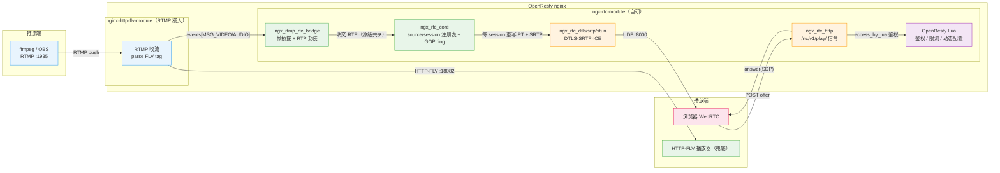
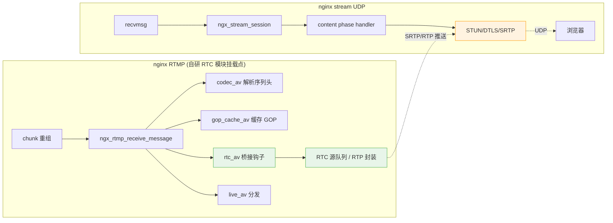

# ngx-rtc-module 技术指导文档

> 文档范围：在 nginx 进程内用 C 自研 RTC 模块（替代 SRS 独立服务）的完整技术指导——架构映射、各协议模块实现要点、nginx 集成机制、QoS 闭环、零拷贝与缓冲策略、风险规避。
> 本文档整合自六份调研与设计材料（桥接挂载点分析、SRS/nginx 源码对照、设计哲学审查、独立评审、改进方向、零拷贝优化设计），去除过程性表述，只保留仍然成立的指导结论。
> 关联代码：`ngx-rtc-module/src/`；SRS 参照：`srs-server-6.0-r1/trunk/src/`；nginx 源码：`openresty-1.31.1.1/bundle/nginx-1.31.1/`。

**核心定位**：本项目 = **SRS 6.0 RTC 协议栈（STUN/DTLS/SRTP/RTP/SDP/RTCP/AAC→Opus）+ `/rtc/v1/play/` 信令契约，直译进 nginx worker 进程**。在 nginx 框架内完成 RTMP 直播源到 WebRTC 播放的低延迟转换（RTMP 收流 → H264 NALU 提取 → RTP/FU-A 封装 → SRTP 加密 → UDP 发送），HTTP-FLV 分发保留作为兜底。这条路径**在开源社区无成熟先例**（nginx-rtmp 系模块均不支持 WebRTC，社区惯例是 nginx 做 RTMP/HTTP-FLV + 独立进程 SRS/Janus/mediasoup 两段式），技术依据与可借鉴先例见第 8 节。

---

## 1. 总体架构与组件映射

### 1.1 目标架构

**边界原则**（分工红线）：

- **信令与控制面**：OpenResty Lua——鉴权、限流、信令路由、动态配置热加载（`lua_shared_dict` + `ngx.timer.every`）。
- **媒体面与协议栈**：纯 C nginx 模块，参考 SRS 逐项实现。**媒体协议栈不能下放 Lua**（无 `lua-resty-webrtc/sdp/dtls/srtp` 可用模块，纯 Lua 拼 SFU 的成本与可靠性不可控）。
- **跨 worker 共享状态**：`ngx_shm_zone` + `ngx_slab_pool`，见第 7 节。

### 1.2 SRS → nginx 自研模块映射表

| SRS 6.0 组件（源码位置） | nginx 自研模块/文件 | 职责 |
| --- | --- | --- |
| `SrsFrameToRtcBridge`（srs_app_stream_bridge.cpp:66-158） | `ngx_rtmp_rtc_bridge_module.c`（`NGX_RTMP_MODULE`） | 订阅 RTMP 音视频帧，按流创建 RTC 源，驱动 RTP 封装 |
| `SrsRtcSource`（srs_app_rtc_source.cpp:326,554,732） | `ngx_rtc_core.c` | 每流一个源：SPS/PPS、SSRC/PT、订阅者队列、GOP ring |
| `SrsRtcRtpBuilder`（srs_app_rtc_source.cpp:830-1408） | `ngx_rtc_rtp.c` | H264 NALU → single/STAP-A/FU-A，B 帧过滤 |
| `SrsRtpHeader`/`SrsRtpPacket`（srs_kernel_rtc_rtp.cpp:537-942） | `ngx_rtc_rtp.c`（同文件） | RTP 头 12 字节编解码 |
| `SrsAudioTranscoder`（srs_app_rtc_codec.cpp:140-467） | `ngx_rtc_audio.c` | AAC→Opus（FFmpeg aac + libswresample + libopus） |
| `SrsDtlsImpl`/`SrsSRTP`（srs_app_rtc_dtls.cpp:461-1074） | `ngx_rtc_dtls.c` + `ngx_rtc_srtp.c` | DTLS 握手、SRTP 密钥导出、加解密 |
| `SrsRtcUdpNetwork` STUN 部分（srs_app_rtc_network.cpp:363-436） | `ngx_rtc_stun.c` | STUN Binding Request→Response、ICE |
| `SrsSdp`/`negotiate_play_capability`（srs_app_rtc_sdp.cpp:763-830） | `ngx_rtc_sdp.c` | SDP offer 解析、answer 生成、PT/SSRC 协商 |
| `SrsRtcServer`/`SrsRtcConnection`（srs_app_rtc_server.cpp:337-623） | `ngx_rtc_stream_module.c`（`NGX_STREAM_MODULE`） | UDP listen、会话注册表、包分发、发送 |
| `SrsGoApiRtcPlay`（srs_app_rtc_api.cpp:52-278） | `ngx_rtc_http_module.c`（`NGX_HTTP_MODULE`） | `POST /rtc/v1/play/`：解析 offer → 建 session → 返回 answer |

> 与 SRS 多线程协程不同，nginx 是**单进程事件循环 + 分阶段回调**。非 nginx 模块的协议单元（rtp/sdp/stun/dtls/srtp/audio/rtcp/hsm）作为普通 C 源文件链接进 addon，不引用 nginx 头文件、无全局可变状态，可脱离 nginx 在 host 上单测。

### 1.3 模块拆分与测试边界

| 模块 | 依赖 nginx | 可单测 |
| --- | --- | --- |
| `rtp`（AVCC→NALU、RFC 6184 打包）、`sdp`、`stun`、`rtcp`、`hsm`/`session_fsm` | 否 | 是 |
| `srtp`（libsrtp2 封装）、`dtls`（OpenSSL wrapper） | 否（链第三方库） | 是（真实库或 mock） |
| `audio`（AAC→Opus）、`core`（source/session 注册表） | 部分（注册表用 ngx_rbtree/ngx_queue） | audio 是 / core 否 |
| `ngx_rtmp_rtc_bridge_module`、`ngx_rtc_http_module`、`ngx_rtc_stream_module` | 是 | 否（薄胶水层） |

原则：**逻辑下沉到纯 C 模块，nginx 侧只做事件/配置/socket 翻译**。纯 C 单测用 host CMake + TDD（RED→GREEN→REFACTOR），RFC 位级代码（STUN 长度边界、FU-A 位级、SDP 解析）必须有单测覆盖，端到端测试只数包不校验语义，不足以暴露这类缺陷。

---

## 2. 桥接挂载点（RTMP 侧）

**结论**：在**新 RTMP 模块**的 `postconfiguration` 中，把处理器注册到 `cmcf->events[NGX_RTMP_MSG_AUDIO]` 与 `events[NGX_RTMP_MSG_VIDEO]`，与 `ngx_rtmp_gop_cache_av`（ngx_rtmp_gop_cache_module.c:804）、`ngx_rtmp_codec_av`（ngx_rtmp_codec_module.c:194）同一模式。该挂载点**不改动** `ngx_rtmp_live_module.c`、GOP 缓存、HTTP-FLV 分发逻辑。

关键事实：

1. **钩子内拿到的 `(s, h, in)` 即解析完成的 H264/AAC 帧**：`in` 为 FLV tag body，`pos[0]` 是帧类型字节、`pos[1]` 是 PacketType 字节；序列头（SPS/PPS/AudioSpecificConfig）从 `ngx_rtmp_codec_module` 的 ctx 读取。
2. **publish/close_stream 链式挂接**：`next_publish = ngx_rtmp_publish; ngx_rtmp_publish = ngx_rtc_publish;`（范例 ngx_rtmp_live_module.c:1643-1647），publish 回调里按 `app/name` 找到或创建 source，close_stream 回调里清理 source 与订阅者。
3. **SRS 的思路本质一致**："在 RTMP source 上挂 bridge，逐帧分叉到 RTC source"（srs_app_rtmp_conn.cpp:1122-1139 的 `SrsCompositeBridge` + `SrsFrameToRtcBridge`），本项目换成"在 publisher 帧上挂事件钩子"。
4. **桥接模块只做「取帧 + 判断音视频 + 转交封装」**，不做 RTP 细节，保持单一职责。

关键行号索引（nginx-http-flv-module）：

| 符号 | 位置 |
| --- | --- |
| `ngx_rtmp_receive_message`（事件分发循环） | `ngx_rtmp_handler.c:792-849` |
| `ngx_rtmp_fire_event` | `ngx_rtmp.c:1072-1090` |
| `ngx_rtmp_codec_av` / parse avc/aac header | `ngx_rtmp_codec_module.c:194-584` |
| `ngx_rtmp_gop_cache_av`（publisher 帧钩子范本） | `ngx_rtmp_gop_cache_module.c:804-855` |
| `ngx_rtmp_live_av`（直播分发） | `ngx_rtmp_live_module.c:849-1233` |
| 事件 handler 类型 / events 数组 | `ngx_rtmp.h:419-420` / `:432` |
| 模块加载顺序（codec 在 live 之前） | addon `config` 的 `RTMP_CORE_MODULES` |

---

## 3. 协议模块实现要点

### 3.1 H264 → RTP 封装（`ngx_rtc_rtp`）

SRS 参考：`SrsRtcRtpBuilder`（srs_app_rtc_source.cpp:830-1408）。

1. **NALU 提取与 B 帧过滤**：按 AVCC 长度前缀切 NALU；解析 slice_type 判断 B 帧，WebRTC 低延迟播放不支持 B 帧，过滤在 NALU 切分后、RTP 封装前做（srs_app_rtc_source.cpp:1131-1172）。
2. **IDR 前拼 STAP-A（SPS+PPS）**：检测到 IDR 先发 type=24 的 STAP-A 包，装入缓存的 SPS/PPS（`package_stap_a`，srs_app_rtc_source.cpp:1174-1231）。
3. **单 NALU 直接打包**（≤1200 字节）、**超长 NALU 切 FU-A**（type=28，首字节拆 FU indicator `28|(nri&~0x1F)` + FU header `type|S(0x80)|E(0x40)`，每片 1200 字节）。
4. **RTP 头**：PT=协商值（见 3.6）、SSRC=源 SSRC、`timestamp = FLV毫秒 × 90`、seq 自增、**末分片 marker=1**。
5. **常量**：`kRtpMaxPayloadSize=1200`（=1500−300）、NAL type mask `0x1F`，全部用固定宽度整型。

### 3.2 AAC → Opus 转码（`ngx_rtc_audio`）

SRS 参考：`SrsAudioTranscoder`（srs_app_rtc_codec.cpp:87-467）。

1. **FFmpeg 管线**：`aac` 解码 → `swr_convert` 重采样到 48kHz/2ch（经 `av_audio_fifo`）→ libopus 编码。
2. **FLV AAC tag 转 ADTS**：解码器吃 ADTS 头，从 AAC sequence header（AudioSpecificConfig）构造 7 字节 ADTS。
3. **Opus 帧打包**：PT=111、`timestamp = dts_ms × 48`、marker 恒真、一帧一包。**时间戳必须源级单调计数、每成功 emit 一帧 `+960`**——AAC 帧 1024 样本（21.33ms）与 Opus 帧 960 样本（20ms）不对齐，FIFO 会周期性多出一帧，若复用 AAC tag 时间戳会产生"多帧同 ts"，客户端 jitter buffer 去重后表现为规律性卡顿。
4. **编码器配置**：`compression_level=1`、`opus_delay=25`（延迟优先）。
5. **线程隔离**：FFmpeg 转码是 CPU 密集操作，不能长期同步跑在 nginx 事件循环内——多路推流时会互相挤压。方案是独立 pthread（每路一个，独占 FFmpeg 上下文）+ 有界环与主循环交换帧，参考 nginx-srt-module 的"side thread + eventfd 通知"模式（见第 8 节）。

### 3.3 DTLS 握手与 SRTP 密钥导出（`ngx_rtc_dtls`）

SRS 参考：`SrsDtlsImpl`（srs_app_rtc_dtls.cpp:461-676）。

1. **SSL_CTX 进程级单例**：`SSL_CTX_new(DTLS_method())` + `SSL_CTX_set_tlsext_use_srtp(ctx, "SRTP_AES128_CM_SHA1_80")`（声明 use_srtp 是密钥导出的前提）。
2. **每会话内存 BIO**（非 socket BIO，nginx 事件模型不允许阻塞 IO）：`SSL_new` → `BIO_s_mem()` in/out → out BIO 挂 write 回调经 UDP 发出（必须用 callback 而非 `BIO_get_mem_data`，否则 MTU 分片处理不对）。
3. **服务端必须显式 `SSL_set_accept_state(ssl)`**——OpenSSL 不会因 `DTLS_server_method()` 自动进入 accept 状态，漏掉报 `ssl_read_internal:uninitialized`，握手无感知失败。
4. **角色由 SDP `a=setup` 决定**：offer 默认 `actpass` → answer 取 `passive`（server）；收包流程 `BIO_write(in) → SSL_read → SSL_is_init_finished()`。
5. **密钥导出（RFC 5764 use_srtp，最核心的自写代码）**：握手完成后 `SSL_export_keying_material(dtls, material, 60, "EXTRACTOR-dtls_srtp", ...)`，前 30 字节 client key(16)+salt(14)、后 30 字节 server 的，按自身角色分配 recv/send。
6. **健壮性**：握手需要超时重传驱动（`DTLSv1_handle_timeout` + `ngx_add_timer`），不能只靠会话空闲回收兜底；首包可用 `DTLSv1_listen()` + HelloVerifyRequest cookie（HMAC-SHA1 绑定客户端地址）做无状态反欺骗——两者均来自 nginx 官方 2018 stream DTLS patch（未合并，见第 8 节）。

### 3.4 SRTP（`ngx_rtc_srtp`）

SRS 参考：`SrsSRTP`（srs_app_rtc_dtls.cpp:949-1074）。

1. **用 libsrtp2，不自研**：自研 RFC 3711 需实现 KDF/ROC/重放窗/RTCP index，与浏览器互通风险高。策略固定 `aes_cm_128_hmac_sha1_80`（RTP 与 RTCP 同）、`window_size=8192`、`allow_repeat_tx=1`（NACK 重传需要）。
2. **每会话两个 context**（recv=ssrc_any_inbound、send=ssrc_any_outbound），发送 `srtp_protect(send_ctx,...)`、接收 `srtp_unprotect(recv_ctx,...)`；libsrtp2 就地加解密，`len` 入参明文长、出参密文长。
3. **发送顺序**：明文 RTP encode → protect → UDP write；**DTLS 完成前不发送**（send_ctx 未就绪直接返回）。
4. **RTCP 同理**：SRTCP 也要 protect/unprotect（`srtp_protect_rtp` 对应 `srtp_protect_rtcp`），这是接收 NACK/PLI/RR/BYE 反馈的前提。

### 3.5 STUN / ICE（`ngx_rtc_stun`）

SRS 参考：`srs_app_rtc_network.cpp:363-427`、`srs_app_rtc_server.cpp:369-456`。

1. **包类型判别**（UDP 收包入口）：STUN（首字节前 2 bit==00 且 `0x2112` magic）→ DTLS（首字节 20-23）→ RTP/RTCP。
2. **Binding Request → Response**：message-type 换 BindingResponse、原样带回 transaction id、`mapped_address` 填对端 ip:port、本地 ice-pwd 做 MESSAGE-INTEGRITY。
3. **会话匹配靠 username 中的 ufrag**：标准写法 `client_ufrag:server_ufrag`，但实测 werift 发的是 `server_ufrag:client_ufrag`（服务端 ufrag 在前）——匹配逻辑要按实际客户端行为取对半。
4. **对端地址刷新**：每收一个 Binding Request 更新该会话的 peer ip:port（NAT 换端口场景）。
5. **编码安全**：BindingResponse 编码器必须对输出缓冲做边界检查（解码侧放宽的 ufrag 长度可达 63 字节，固定 128 字节栈缓冲会被 USERNAME 属性撑爆，越界写栈可被任意持合法 ufrag 的客户端触发）。

### 3.6 SDP offer 解析 / answer 生成（`ngx_rtc_sdp`）

SRS 参考：`srs_app_rtc_sdp.cpp:763-830`、`srs_app_rtc_conn.cpp:3075-3314`。

1. **offer 必须满足**：`group:BUNDLE`、media 只含 audio/video、每个 media 有 `rtcp-mux`、play 方向 `sendrecv/recvonly`。
2. **解析出**：ice-ufrag/pwd、fingerprint、setup、mid、rtpmap、fmtp（H264 需 `profile-level-id` + `packetization-mode=1`）。**单 media 的 PT 上限要给足**：Chrome 一个 m-line 可列 20+ 个 codec（VP8/VP9/H264/AV1 + rtx + red），上限太小直接信令 400。
3. **协商 PT**：**用 offer 的 PT 覆盖源 PT**（不能固定写死），SSRC 由服务端重新生成。
4. **answer 生成**：m 行对齐 offer 的媒体集合（子集关系，RFC 3264）、`a=mid` 对齐、play 场景方向 `a=sendonly`、ice-ufrag/pwd、fingerprint、setup 角色互补、**media 级 `a=candidate`**（缺失时 werift 不会发起 STUN，表现为信令成功零媒体）。
5. **rtcp-fb 声明**：若实现了 NACK/PLI 处理，answer 必须带 `a=rtcp-fb:<pt> nack` 与 `a=rtcp-fb:<pt> nack pli`——NACK/PLI 仅在 offer 与 answer 双方声明时生效，不声明则反馈链路休眠。

### 3.7 HTTP 信令（`ngx_rtc_http_module`）

SRS 参考：`SrsGoApiRtcPlay`（srs_app_rtc_api.cpp:52-278）。

1. 契约兼容 SRS：`POST /rtc/v1/play/`，body `{"sdp":"<offer>","streamurl":"rtmp://.../app/stream"}`，返回 `{"code":0,"sdp":"<answer>","sessionid":"<username>"}`——直接复用 SRS 系 werift/前端播放器。
2. **鉴权在 Lua access 阶段**（`access_by_lua_file` 做 stream key 校验 + `resty.limit.count` 限流），C 模块只做 content 阶段的 offer 解析与 answer 生成。
3. **session 必须跨 request 存活**：返回 answer 后还要在 UDP 侧完成 DTLS/SRTP，session 对象用 `ngx_alloc` 从进程堆分配并挂全局注册表，**绝不能用 `r->pool`**（请求结束即销毁，后续 STUN 匹配读到垃圾内存）。
4. body/sdp 缓冲要有明确上限并拒绝超限（静默截断会导致 JSON 解析失败变成难排查的 400）。

---

## 4. UDP 服务与 nginx stream 集成（`ngx_rtc_stream_module`）

### 4.1 核心机制：nginx 已解决「UDP 无连接 vs WebRTC 长会话」矛盾

`ngx_event_udp.c` 用红黑树按 `(peer ip:port, local addr)` 缓存 UDP 连接，同对端后续数据报复用同一 `ngx_connection_t` 与 `ngx_stream_session_t`——DTLS/SRTP/SSRC 会话状态放 `s->ctx` 即可跨数据报持久，**无需自研 UDP 复用层**。

### 4.2 生命周期与收发规则

1. **content handler 每数据报被调一次**，负责读 `c->buffer`、判别 STUN/DTLS/RTP/RTCP 并分发；**不要在 content 阶段调 `ngx_stream_finalize_session`**（那是 TCP 代理的收尾，会销毁 UDP 连接缓存）。
2. **收发都走 nginx 事件模型**：收用 `c->buffer`/`c->recv`，发用 `c->send`（等价 sendto）。**禁止在 handler 里直接 `sendto`/`recvfrom` 操作 fd**，否则破坏 nginx 的连接缓存与统计。高负载时应循环 drain（参照 `ngx_event_recvmsg` 的 `do{}while(ev->available)`），避免单事件多包滞留拖慢握手。
3. **会话关闭必须释放底层 UDP 连接**：只释放自研结构不调 finalize，`ngx_connection_t` 槽位会永久泄漏，累计到 `worker_connections` 后新观众无法建会话。正确做法是经 post event 延迟调用 `ngx_stream_finalize_session`（接收路径内同步关闭有 use-after-free 风险，官方有过同类修复）。
4. **周期任务一律 `ngx_event_timer`**（session 空闲回收、RTCP SR 周期发送），禁止自建线程/定时器。回收按 `last_active` 分级（握手中 10s、就绪 30s），就绪会话靠客户端 RTCP 保活。
5. **模块类型 `NGX_STREAM_MODULE`**：main_conf 存全局单例（DTLS 证书、libsrtp、会话注册表），`postconfiguration` 向 `cmcf->phases[NGX_STREAM_CONTENT_PHASE].handlers` push content handler。

关键行号索引（nginx stream/event）：

| 符号 | 位置 |
| --- | --- |
| `ngx_stream_core_listen`（`udp` → SOCK_DGRAM） | `ngx_stream_core_module.c:574,631` |
| `ngx_event_recvmsg`（UDP 收包/连接复用） | `ngx_event_udp.c:24-348` |
| `ngx_stream_finalize_session` | `ngx_stream_handler.c:296-307` |
| `ngx_stream_session_t` / `ngx_stream_module_t` | `ngx_stream.h:199-248` |
| 指令 setter 范本 | `ngx_stream_return_module.c:189-216` |

---

## 5. QoS 闭环：RTCP 反馈、NACK 重传与首帧加速

**与 SRS 的关键架构差异**：SRS 的推流端是浏览器（RTC 推流），PLI 关键帧请求可送回编码器；本方案推流端是 RTMP（TCP 可靠、无 RTC 上行），**PLI 无处可送，必须用「缓存最近 GOP + 订阅即发」替代**。因此只需要 SRS 发送侧 ARQ（NACK 重传）的一半，不需要接收侧丢包检测那一半。

| 机制 | SRS 实现参照 | 必要性 |
| --- | --- | --- |
| SRTCP 加解密 + RTCP 编解码（compound/NACK/PLI/RR/SR/BYE） | `srs_kernel_rtc_rtcp.cpp` | 必需（一切反馈的前提） |
| NACK 下行重传（发送侧 ARQ + 源级 RTP 环形缓存） | `SrsRtcSendTrack::on_nack`（srs_app_rtc_source.cpp:2905-2950） | 必需（丢包 >3% 时无 NACK 画面迅速劣化） |
| 首帧加速：GOP 缓存 + 订阅即发（替代 PLI） | IDR 前 STAP-A（已同款）；RTMP 场景须自建 GOP 缓存 | 必需（否则新观众等 2-5s 下一个 IDR） |
| Session 生命周期 + 超时回收 | `SrsRtcConnection::is_alive` + `session_timeout` | 必需（资源正确性） |
| Opus 封装（ts=dts×48、marker=1、一帧一包） | `package_opus`（srs_app_rtc_source.cpp:1033） | 必需（完整直播） |
| 每订阅者重写 PT（`rebuild_packet` 思路） | `SrsRtcSendTrack::rebuild_packet`（srs_app_rtc_source.cpp:2785-2903） | 必需（异构浏览器 PT 不同，见 6.1） |
| RR + NACK 间隔随 RTT 自适应 | `SrsRtpNackForReceiver::update_rtt` | 建议（弱网优化） |
| TWCC / GCC / REMB | SRS 对本场景同样空实现/忽略 | **不做**（RTMP→RTC 单向播放，无上行媒体、服务器无编码器可调码率） |
| 音视频 NTP/RTP 同步（avsync） | `SrsRtcRecvTrack` | 不需要（下行音视频 ts 均源自同一 RTMP timestamp，天然同步） |

**GOP 环形缓存设计要点**：

- source 内**定长槽数组**缓存明文 RTP（一次缓存、N 订阅者回放/NACK 用），DTLS 完成订阅时先回放最近一个 GOP（自最新 IDR 的 STAP-A 起），无需等下一个 IDR。
- **音视频分环或按 ssrc+seq 双重匹配**：音视频 seq 各自独立计数，混存一个 ring 时以最老槽 seq 为基准的差值定位基本失效，且不核对 `media_ssrc` 时可能重传出错误流的数据。
- **NACK 只服务视频且按 `media_ssrc` 过滤**；fetch 时校验 seq 完全一致再重传（避免 SRTP 失败），重发走 `allow_repeat_tx=1`。
- **回放需要 pacing**：GOP 回放一次可突发上千包，多观众同时加入时在单事件循环内串行突发会打爆客户端 jitter buffer，需要限速或提前终止。
- 借鉴 RT-Thread `rt_ringbuffer` 的「mirror bit 空满判定」与「满覆盖最旧」语义即可，**不引入 DPDK rte_ring 的 CAS 无锁结构**（单 worker 事件循环内是单生产者 + 多只读消费者，无并发竞争），也不必套用 `ngx_buf_t` 引用计数（多 worker 前是多余负担）。

---

## 6. 零拷贝边界与资源管理

### 6.1 不可消除的拷贝与可消除的拷贝

1. **SRTP 加密 N 次无法避免**：每 session 密钥独立（DTLS 导出），libsrtp2 in-place 加密且密文各不相同——「每 session 一次 memcpy + 一次 protect」是协议决定的下界。
2. **N>1 时每 session 的 memcpy 同样无法消除**：明文 RTP 是共享模板，in-place 加密会破坏它。可优化的只有：密文缓冲常驻 session（消除栈上 1600B 抖动）、单订阅者快路径省一次拷贝。
3. **PT 重写**：明文模板源级共享，每 session 加密前重写本 session 协商的 PT（1 字节写）。**源级 PT 单例化（首个观众固化 PT）是错误做法**——第二个观众 offer 的 PT 与第一个不同时协商失败，多观众场景必须每会话重写。
4. **媒体面不要引入 `ngx_chain_t`/`ngx_output_chain`**：`ngx_buf_t` 的 file/shadow/mmap 语义对 UDP 单包发送无收益，`c->send` 一条 sendto 已够；批量优化用 `ngx_udp_send_chain`（内部拼 iovec/sendmmsg）。HTTP 信令响应用 `ngx_create_temp_buf`/`ngx_alloc_chain_link` 没问题。
5. **NACK ring 的 RTP 包避免每包堆分配**：固定容量数组 slot（seq + 指针 + 长度）+ 预分配数据区，与 SRS `SrsRtpRingBuffer` 同构。

### 6.2 资源生命周期

1. **session/source 跨请求存活**：session 用 `ngx_alloc` + 显式回收（reap timer + close 释放）；source 要有 remove 路径（断流释放 ring/转码器/移出 rbtree），且断流重推要复位 seq/timestamp（否则 RTP 非单调，订阅者解码错乱）。
2. **UDP 连接槽位**：session 关闭必须连带结束底层 nginx stream 会话（见 4.2-3）。
3. **单 worker 下 source 用 `ngx_rbtree`（按 app/stream 名 O(log n) 查找）、session/订阅者用 `ngx_queue`**——按需取 nginx 既有数据结构，不自研。

---

## 7. 多 worker 扩展

**问题**：多 worker 下信令落在 worker A、UDP 落在 worker B 时，进程内注册表查不到 session（每个 worker 独立的 DTLS 证书还会导致 SDP fingerprint 与握手证书不一致）。

**方案约束**：

1. 共享状态进 `ngx_shm_zone` + `ngx_slab_pool` + `ngx_shmtx`：source/session 的**索引**（name、ssrc、pt、状态、owner worker）进 slab；**私有句柄（SSL/BIO、srtp_t、转码器、ngx_connection_t*）不进 shm**，留在各 worker 私有扩展表，按 session ID 反查。
2. 跨 worker 媒体：per-worker 媒体环 + eventfd 唤醒消费 worker，owner worker 做 SRTP 加密后发送；GOP 快照（关键帧 AU）下沉 shm，任意 worker 订阅可立即回放。
3. **共享结构必须在 `init_module`（fork 前）创建**——`init_process` 只在 worker 调、master 不调；DTLS 自签证书同理要在 fork 前生成一份，worker 靠 fork 继承。周期 timer 则必须放 `init_process`（master 无事件循环）。
4. worker 周期 timer（C 模块写共享状态）只能放 `init_process`；注意 `NGX_RTMP_MODULE` 类型模块的 `init_process` 不会被调用，挂在这类模块上的定时器要移到 http/stream 模块启动。
5. 消费端竞态：ring 条目存 shm session 指针会悬垂（出队后 session 可能已释放），改存单调递增 session ID，consumer 按 ID 反查。
6. **NGX_RTMP_MODULE 类型的 RTMP 分发跨 worker** 另有官方 `ngx_rtmp_auto_push_module`（unix socket 自动推给所有 worker），与自研 RTC 的 shm 路线并存、互不替代。
7. RTMP/HTTP-FLV 跨 worker 播放需 `rtmp_auto_push on`（live 状态 per-worker），与 RTC 侧方案独立。
8. UDP `reuseport` 下同一客户端的所有包必须落同一 worker（内核四元组哈希保证）。

详细设计（slab 布局、三段式初始化、双 registry 镜像）见 `multi-worker-shm-design.md`。

---

## 8. 开源先例与可借鉴实现

| 来源 | 可借鉴点 |
| --- | --- |
| **nginx 官方 stream DTLS patch**（Vladimir Homutov，2018 未合并） | `DTLSv1_listen()` + HelloVerifyRequest cookie（HMAC-SHA1 绑定客户端地址）无状态反欺骗；`DTLSv1_handle_timeout` 定时驱动重传；UDP SSL listener 的配置校验（ssl_protocols 交叉校验、DTLS listener 禁 TLS）；编译期探测 `DTLSv1_listen` 门控版本。印证「nginx 内做 DTLS/WebRTC」方向官方曾考虑 |
| **nginx-srt-module**（getpagespeed，商业） | 唯一「nginx 内集成带自有事件循环协议栈」的工业先例：libsrt 跑独立线程 + eventfd 通知 nginx 事件循环——音频转码/阻塞型 CPU 密集工作的参考答案 |
| **Cloudflare quiche 的 nginx patch** | 协议库自带 timer 回调接进 `ngx_add_timer` 的集成范式（「下一个超时时间」回调接口，事件循环内精确调度握手重传） |
| **SRS 6.0** | 协议栈事实参考系（本文档全篇的 file:line 参照） |
| **OpenResty 生态**（lua-resty 系） | 见 8.1 |

**否定性结论**（调研确认，避免重复调研）：

- 不存在可复用的成熟 nginx 进程内 RTMP→WebRTC 模块；不存在可承载 WebRTC 媒体面的 `lua-resty-webrtc/rtmp/sdp/dtls/stun/turn` 模块。
- nginx-rtmp-module / nginx-http-flv-module 只覆盖 RTMP/HTTP-FLV，适合继续承担推流接入与 HTTP-FLV 兜底，WebRTC 能力留在自研模块。

### 8.1 OpenResty 生态组件取舍

| 组件 | 决策 | 说明 |
| --- | --- | --- |
| `lua_shared_dict` | **可用（首选）** | 共享状态载体：stream_keys / rate_limit / 统计镜像 |
| `resty.limit.count`（lua-resty-limit-traffic） | **用** | 信令限流，OpenResty 内置，显式 count/window 语义规范 |
| cosocket | **可用** | 外接认证网关、`on_publish` 回调查外部服务 |
| lua-resty-lock | **可用** | 多 worker 协调、共享状态原子更新时引入 |
| lua-resty-redis / mysql | **排除** | 不引入外部存储依赖，stream key 本地表 + shared dict 热加载（10s `ngx.timer.every`） |
| session 超时/回收 | **保持 C 模块** | 归 stream 模块 reap timer，Lua 只做信令/限流/配置，不重复造 session 状态 |

---

## 9. 关键风险与规避

| 风险 | 影响 | 规避方案 |
| --- | --- | --- |
| DTLS-SRTP 密钥导出错误 | 握手成功但 SRTP 全错，浏览器报解密失败 | 严格按 `SSL_export_keying_material("EXTRACTOR-dtls_srtp")` 取 60 字节按角色切分；必须先 `SSL_CTX_set_tlsext_use_srtp` |
| DTLS server 未设 accept 状态 | `ssl_read_internal:uninitialized`，握手无感知失败 | 显式 `SSL_set_accept_state(ssl)`（OpenSSL 不因 `DTLS_server_method()` 自动进入） |
| STUN BindingResponse 越界写栈 | 持合法 ufrag 的客户端可触发 worker 栈破坏（单 worker 即全站 DoS） | 编码器内做 `out_len` 边界检查；ufrag 上下限与实际分配一致；请求校验 MESSAGE-INTEGRITY |
| B 帧过滤时机 | 带 B 帧流封 RTP 后 WebRTC 花屏/卡顿 | NALU 切分后、RTP 封装前解析 slice_type 过滤 |
| SSRC/PT 处理不当 | 多观众 PT 冲突协商失败；STUN 匹配不到 session | PT 用 offer 协商值、每 session 发送前重写；SSRC 服务端统一分配；STUN username 按 `server:client` 实际顺序取 ufrag |
| nginx stream UDP 会话被误销毁 | content 阶段 finalize 会关连接，DTLS 状态丢失 | 数据报处理完只返回 NGX_OK；会话存活靠 UDP 连接缓存 |
| session 随 request pool 释放 | 信令返回后 session 被回收，STUN/DTLS 找不到会话 | `ngx_alloc` 挂全局注册表 + reap timer 回收 |
| 事件钩子拿到 FLV tag 当裸 NALU | 解析失败 | 先解 FLV video tag 头（1B type/codec + 1B AVCPacketType + 3B CTS），再按 AVCC 长度前缀切 NALU；SPS/PPS 从 AVCDecoderConfigurationRecord 取 |
| SDP answer 缺 candidate / rtcp-fb | 信令成功但零媒体 / NACK-PLI 链路休眠 | answer 带 media 级 `a=candidate`；实现 NACK/PLI 就声明对应 `rtcp-fb` |
| 命令行 reload 不换二进制 | 改 C 代码后 `nginx -s reload` 仍跑旧 inode，新日志/修复不生效 | 模块变更需 stop + 全量重启（或 USR2 热升级）；排查"日志不打印"先查 `/proc/<master>/exe` |
| 事件循环内同步 CPU 密集工作 | 单 worker 下多路推流互相挤压，握手/分发延迟 | 音频转码独立 pthread + 有界环（nginx-srt 模式）；周期任务走 `ngx_event_timer` |

---

## 10. 落地路线（video-only 起步，逐层叠加）

| 阶段 | 内容 | 验证项 |
| --- | --- | --- |
| **Step 1 骨架** | addon `config` + stream 模块：`listen 8000 udp` 生效、content handler 收包打日志、`c->send` 回包 | UDP 客户端收发；error.log 出现包长与对端地址 |
| **Step 2 RTP 封装** | FLV tag → NALU 切分 → single/FU-A/STAP-A，纯 C 单测（不接网络）；bridge 挂 RTMP 事件钩子 | 单测验证 FU-A indicator/header、marker 位、`ts=ms*90`；推流后日志打印每帧包数 |
| **Step 3 SDP 信令** | offer 解析、answer 生成（协商 PT、sendonly、BUNDLE、ice-ufrag/pwd、fingerprint、candidate） | 浏览器 `setRemoteDescription` 不报错 |
| **Step 4 STUN + DTLS** | Binding Response、DTLS 握手、密钥导出 | 浏览器 `oniceconnectionstatechange=connected`；服务端 DTLS handshake done |
| **Step 5 SRTP 收尾** | libsrtp2 加密发送；play 会话与 source 订阅打通 | Chrome 画面出视频；webrtc-internals `bytesReceived` 增长、无 decryption failure |
| **叠加一：音频** | AAC→Opus 转码 + Opus RTP（ts 单调 +960） | 音频连续无规律卡顿 |
| **叠加二：QoS** | SRTCP + RTCP 编解码、NACK 重传、GOP 缓存订阅即发、answer 声明 rtcp-fb | 弱网（tc 丢包注入）下画面可恢复；新订阅者首帧不等 IDR |
| **叠加三：生产化** | session/UDP 连接/source 回收闭环、多观众 PT 重写、转码线程隔离、单测补齐 | 长时间运行无连接槽泄漏；异构浏览器多观众同时播放 |
| **叠加四：多 worker** | shm 注册表 + 媒体环 + eventfd（见第 7 节） | 信令与 UDP 分属不同 worker 时建链正常 |

**验收口径**：端到端以 werift 无头播放器收包为准（audio.pkts>0 && video.pkts>0 即 PASS），另观测首个 H264 IDR 到达时间（`first_keyframe_ms`，真实出图延迟口径）。

---

## 11. 三条核心结论

1. **架构上 SRS 的每个 RTC 组件都能 1:1 映射到 nginx C 模块**：桥接用 RTMP 模块 `events[MSG_VIDEO/AUDIO]` 钩子，UDP 服务用 stream 模块 `listen udp`（nginx 已内置按 peer 复用的 UDP 连接缓存），信令用 HTTP content handler，密码学与 RTP 封装作为无 nginx 依赖的纯 C 源文件链接——全链路可单测。
2. **实现难度集中在 DTLS-SRTP 密钥导出与 H264→RTP 封装两处**：前者严格照 RFC 5764 的 60 字节 key/salt 切分，后者照 single/FU-A/STAP-A 的 PT=协商值、`ts=ms×90`、1200 字节阈值、末片 marker=1 规则；两者都必须有位级单测。
3. **先 video-only 打通五步，再按「音频 → QoS → 生产化 → 多 worker」逐层叠加**：每层有独立验证项；不要提前引入多 worker 共享内存等过度设计，也不要在单 worker 阶段背负 shm 约束。
