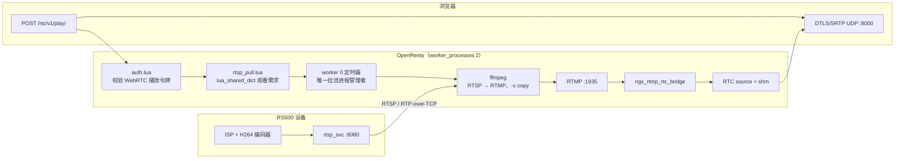
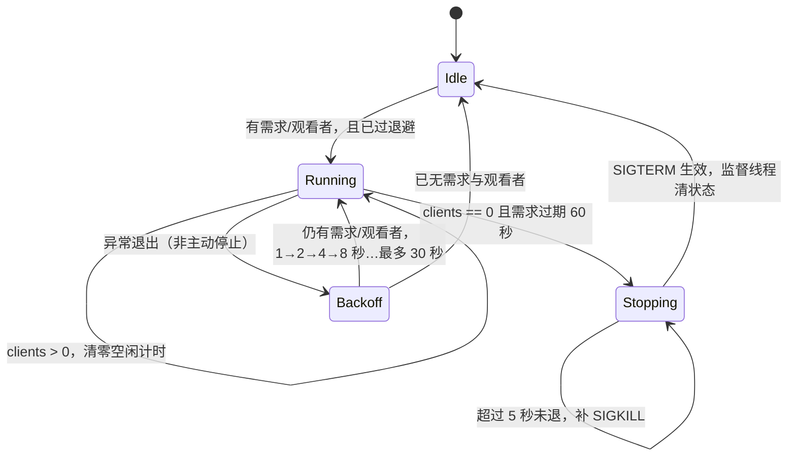

# RS500 红外 RTSP 按需接入 nginx-rtc 设计

> 起草日期：2026-09-14
> 目标仓库：`nginx-rtc-example`
> 上游依据：`RS500/docs/系统与链路/RS500_RTSP_Service_Design.md`
> 状态：已实现。软件侧由 `scripts/e2e-rtsp-pull.sh` 在真 RTSP 服务端上跑通十项断言；需要真机在场的验收项见 §5.2。

## 0. 结论先行

把「RTSP → RTMP」这一段交给 OpenResty 的 Lua 按需管理，而不是让 `run.sh` 常驻一个拉流守护：

- 第一个通过鉴权的 WebRTC 播放请求唤醒拉流，不需要人工 `push-ir`。
- `worker 0` 是唯一的进程所有者：用内置 `ngx.pipe` 启动、等待、终止 `ffmpeg`，两个 worker 不会各拉一路。
- `live/ir` 的 WebRTC 就绪订阅者持续为 0 达 60 秒，Lua 发 `SIGTERM` 并拆除 RTSP 会话；下一次播放再自动拉起。
- RTSP/RTP 解复用仍由 `ffmpeg` 完成（`-c copy`，不重编码），Lua 只负责鉴权后的按需调度、进程生命周期与断流重连。

本期只覆盖 WebRTC。HTTP-FLV、HLS、DASH 与裸 RTMP 没有可靠的跨 worker 长连接结束事件，不参与「无人回收」判定。

## 1. 背景与目标

RS500 的 `rtsp_svc` 输出红外 H264 活流；`nginx-rtc` 已具备 RTMP ingest、H264 NALU 到 RTC 的桥接与 WebRTC 播放。缺的是一层控制面：按需把 RTSP 拉进来，无人观看时把设备会话与主机带宽还回去。

目标链路：

```text
RS500 红外 H264 活流 → 浏览器 WebRTC 播放
```

目标行为：

1. 已鉴权的首个 WebRTC 播放请求在不阻塞 SDP 协商的前提下发起拉流。
2. 并发播放请求最多产生一个 `ffmpeg`。
3. RTSP 对端或 `ffmpeg` 异常退出时，只要还有观看者就自动重连。
4. 无 WebRTC 观看者 60 秒后释放 RTSP 会话、主机带宽与 `ffmpeg` 进程。
5. OpenResty 停止时不遗留 `ffmpeg` 子进程。

明确不含：设备端直推 RTMP、设备端 WHIP、多档转码、用 Lua 自行实现 RTSP/RTP。

## 2. 架构与数据流



控制面与媒体面分离：

| 路径 | 责任 | 关键约束 |
|---|---|---|
| `auth.lua` → `rtsp_pull.demand()` | 已鉴权播放请求声明需求 | 不启动进程、不等待 RTSP，不能拉长 SDP 响应 |
| `worker 0` 定时器 | 启动、监控、重连、空闲回收 | 唯一持有 `ngx.pipe` 进程对象 |
| `ffmpeg` | RTSP 会话、RTP 解包、FLV/RTMP 封装 | `-c copy`，不重编码 |
| `ngx_rtmp_rtc_bridge` | RTMP H264 NALU 转 RTC source | 复用既有模块，不改 C 代码 |

`ngx.pipe` 用 `fork`/`execvp` 起子进程并接进 nginx 事件循环。它不是 RTSP 客户端库，所以不存在「用 Lua socket 代替 ffmpeg」这个选项。

## 3. 生命周期设计

### 3.1 启动

1. 浏览器向 `/rtc/v1/play/` 发起带 HMAC 的 SDP 请求。
2. `auth.lua` 通过令牌校验后调用 `rtsp_pull.demand("live/ir")`。
3. `demand()` 在 `lua_shared_dict rtsp_pull` 写入观看需求与时间戳（TTL 10 秒），原子且跨 worker 可见。
4. `worker 0` 每 0.5 秒消费一次需求：进程不存在时，从 `stream_keys` 读取 `live/ir|publish`，现场签一份 RTMP publish token，再用 `ngx.pipe.spawn` 拉起 `ffmpeg`。
5. SDP 请求继续进入既有 `rtc_play` 处理器；首帧取决于 RTSP 建连与下一个 IDR。

0.5 秒这个周期决定「播放请求 → `ffmpeg` 起步」的延迟上限：取 2 秒会让空闲流的首次播放明显多等一拍。

进程命令固定如下，URL 与 token 都不来自客户端：

```text
ffmpeg
  -nostdin
  -loglevel warning
  -rtsp_transport tcp
  -allowed_media_types video
  -timeout 10000000
  -i "${RS500_RTSP_URL}"
  -c copy
  -f flv
  "rtmp://127.0.0.1:1935/live/ir?t=${exp}&sign=${sign}"
```

`RS500_RTSP_URL` 由 nginx 主进程环境提供，例如：

```sh
RS500_RTSP_URL='rtsp://192.168.1.50:8080/live/h264' ./run.sh start
```

配置里必须声明 `env PATH;` 与 `env RS500_RTSP_URL;`：nginx 默认不把环境传给 worker，而 `ngx.pipe` 要靠 `PATH` 找 `ffmpeg`。`spawn` 收参数数组、不经过 shell，因此 RTSP URL 与 token 不会被 shell 解释。

**必须持续排空子进程输出。** 进程按 `merge_stderr = true` 起，stdout/stderr 合成一路，由一个轻线程循环 `stdout_read_any(4096)` 读走；管道写满会阻塞 `ffmpeg`，表现是「pid 还在、媒体不动」。这个 `max` 参数不可省略，`stdout_read_any()` 无参会直接报 `bad max argument`。退出等待与读取放在同一个监督轻线程里：`proc:wait()` 返回后用 `proc:shutdown("stdout")` 中断读取线程并 `ngx.thread.wait` 收尾。

同一时刻的首次播放注定拿不到源：`rtc_play` 在源不存在时返回 `code != 0`，而拉流器才刚被唤醒。两条路径据此设计：

- 随包播放页 `deploy/nginx/html/rtcplayer.html` 在 `code != 0` 时重试信令（8 次 × 800 ms，约 6 秒，落在页面既有的 10 秒回退计时内），每次重试重新签 token 并再次声明需求。
- 直接调用 `/rtc/v1/play/` 的客户端需自行重试一次；`scripts/e2e-rtsp-pull.sh` 就是这么做的。

### 3.2 观看与回收

`/rtc/v1/stats` 由 C 模块每秒镜像进 `rtc_stats` 共享字典，其中 `streams[].clients` 是 `live/ir` 已完成 DTLS/SRTP 并订阅媒体的 WebRTC 客户端数，正是这里需要的真实观看计数。

| 条件 | 动作 |
|---|---|
| 有需求或 `clients > 0`，且进程不存在 | 启动 `ffmpeg` |
| `clients > 0` | 清除空闲计时 |
| `clients == 0` 且需求已过期 | 开始或继续 60 秒空闲计时 |
| 空闲满 60 秒 | 发 `SIGTERM`，等监督线程回收状态 |
| `ffmpeg` 退出且仍有需求或观看者 | 按退避重连 |

需求键用来覆盖「首个播放器还没握手完」的空窗（握手约 1 秒，期间 `clients` 仍是 0），运行期以 `clients` 为准。TTL 只有 10 秒：一次性播放请求或刚写完需求就挂掉的 worker，不会把设备会话长期钉住。

HTTP-FLV 的 `flvcnt:*` 计数在长连接中会自然过期，源码也把它定位为自愈的近似值。因此首版不用它决定 `ffmpeg` 的生死，也不让 HTTP-FLV 触发拉流；HLS、DASH、裸 RTMP 同理，不在本期范围。

### 3.3 状态机



### 3.4 异常与停止

每次启动把模块内的 `generation` 加一，监督轻线程记下自己的代次；`wait()` 返回后只有代次仍匹配当前进程时才清状态。否则一个旧进程的退出会把新进程的状态误删。

| 场景 | 行为 |
|---|---|
| RTSP 建连失败、I/O 超时、`ffmpeg` 异常退出 | 记退出原因与受限长度的 stderr 末尾；仍有需求或观看者时按 1、2、4、8…最多 30 秒退避重试 |
| 正常空闲回收 | 标记为主动停止，不触发重连，退避计数复位为 1 |
| 发 `SIGTERM` 5 秒后进程仍在 | 下一轮定时器补 `SIGKILL`，只升级一次 |
| nginx worker 0 退出 | `exit_worker_by_lua_block` 调 `rtsp_pull.stop()` 发 `SIGTERM`，让 `ffmpeg` 正常关闭 RTSP 会话 |
| worker 0 重启 | 新 worker 从共享字典读需求与统计，按常规路径启动；旧 worker 的退出钩子负责自己的子进程 |

日志只记流名、pid、退出原因与退避秒数；不记 RTSP URL（可能含凭据），也不记 publish token。

### 3.5 实现常量

| 常量 | 值 | 作用 |
|---|---|---|
| `TICK_SECONDS` | 0.5 | 管理定时器周期，同时是拉起延迟上限 |
| `DEMAND_TTL` | 10 | 一次播放请求让需求键存活多久 |
| `IDLE_SECONDS` | 60 | 无订阅者多久后回收 |
| `MAX_BACKOFF` | 30 | 连续失败后的重试间隔上限（起始 1 秒，逐次翻倍） |
| `TERM_GRACE` | 5 | `SIGTERM` 到 `SIGKILL` 的等待 |
| `READ_CHUNK` / `STDERR_KEEP` | 4096 / 2000 | 每次读子进程输出的字节数 / 日志保留的末尾字节数 |

## 4. 代码改动

| 文件 | 改动 | 原因 |
|---|---|---|
| `deploy/nginx/conf/rtsp_pull.lua` | 新增按需管理器 | 需求、单 worker 进程所有权、统计读取、重连与回收 |
| `deploy/nginx/conf/nginx.conf` | 声明 `PATH`、`RS500_RTSP_URL` 环境；新增 `rtsp_pull` shared dict；`init_worker_by_lua_block` 启动管理器；新增 `exit_worker_by_lua_block` 清理 | 把进程生命周期绑到 OpenResty |
| `deploy/nginx/conf/auth.lua` | 播放令牌校验通过后声明 `live/ir` 需求 | 只有授权播放能触发对外连接 |
| `deploy/nginx/conf/config.lua` | 新增服务端读取密钥的函数 | 拉流器自己签 ingest token，密钥不下发浏览器 |
| `deploy/nginx/conf/stream_keys.lua` | 新增 `live/ir` 独立 play/publish 密钥 | 保持观看与推流权限隔离 |
| `deploy/nginx/html/rtcplayer.html` | `code != 0` 时重试信令（8 × 800 ms） | 首次信令面对的是还没建立起来的源 |
| `run.sh` | 推流子进程带 `rtc-push-marker`，进程识别与 `stop()` 清理改为按标记匹配，删除 `pkill -x ffmpeg` | 原来的全局清理会把主机上任何 ffmpeg 一起杀掉，与本功能无关但同批发现 |
| `scripts/e2e-rtsp-pull.sh` | 新增守护脚本 | 覆盖拉起、共用、重连、回收、清理与降级 |
| `scripts/fetch-deps.sh` | 固定版本拉取 mediamtx（含 sha256 校验） | 守护脚本需要一台真 RTSP 服务端 |

自动拉流的全部状态都在 OpenResty 内：`run.sh` 不新增 `push-ir`、`keep-push-ir` 或 pidfile，它对 `run.sh` 的唯一改动是上面那条清理范围修正。

### 4.1 密钥要求

`stream_keys.lua` 中新增两份互不相同、也不复用示例值的密钥：

```lua
["live/ir|play"]    = "<independent play secret>",
["live/ir|publish"] = "<independent publish secret>",
```

`publish` 密钥只由 `rtsp_pull.lua` 在本机读取，播放器仍只持有 `play` 密钥；两者相同等于把推流权限发给每个观众。

## 5. 验证

### 5.1 软件侧：真 RTSP 守护脚本

```sh
OPENRESTY_PREFIX=build/nginx/nginx scripts/e2e-rtsp-pull.sh
```

脚本唯一的替身是 RS500 设备本身：`scripts/fetch-deps.sh` 缓存固定版本的 mediamtx 作为 RTSP 服务端，测试推一路真实 `testsrc2` H264 进去，再由 `rtsp_pull.lua` 真的按需拉取。mediamtx 只开 RTSP 且限定 `rtspTransports: [tcp]`，与设备侧的传输要求一致。十项断言覆盖：

1. 未鉴权播放不拉起拉流；空闲实例不拉起、无 `live/ir` 源。
2. 授权播放恰好拉起一个拉流进程，且 mediamtx 日志出现 `is reading from path ..., with TCP, 1 track (H264)`。
3. werift 观看者收到视频包，`clients` 计入 1。
4. 两个并发观看者仍共用一个拉流进程。
5. `kill -9` 拉流进程后，新观看者的授权播放能在 15 秒内拉起新进程。
6. 无人观看后（60 秒空闲 + 10 秒需求 TTL）进程退出，RTSP 会话被拆除。
7. `run.sh stop` 后无残留拉流进程，且 worker 退出钩子的日志在案；同一时刻另一个不相关的 `ffmpeg` 进程存活。
8. `PATH` 上没有 `ffmpeg` 时，播放请求仍返回 200、服务不挂，错误只进日志。

一轮约 3–4 分钟（含 60 秒空闲窗口），期间占用 1935 / 18082 / 8555 三个端口。

### 5.2 需要真机在场

| 步骤 | 动作 | 通过判据 |
|---|---|---|
| 1 | 板上 `rtsp_test init 8080`，主机 `ffplay "$RS500_RTSP_URL"` | 可见红外画面 |
| 2 | 以 `RS500_RTSP_URL` 启动 nginx，不打开播放器 | 无 `live/ir` 源，无拉流进程 |
| 3 | 打开已鉴权的 `webrtc://<host>:18082/live/ir` | 仅一个 `ffmpeg`；stats 出现 `live/ir` 且 `clients=1`；浏览器出画 |
| 4 | 并发打开多个播放器 | 仍只有一个拉流进程 |
| 5 | 关闭全部播放器并等待 | `ffmpeg` 退出；RTSP 会话在设备侧结束 |
| 6 | 播放中切断 RS500 网络再恢复 | 受控退避后自动重连出画 |
| 7 | 播放中执行 `./run.sh stop` | 无残留拉流进程 |
| 8 | 空闲时先 `curl /rtc/v1/stats`，再打开播放页 | 首次信令可能 `code != 0`，页面数秒内重试后出画 |

回归项：

- 原有 `live/livestream` 的 `keep-push` 与转码梯子行为不变。
- 错误 HMAC、错误流名与限流拒绝路径不写需求键。
- `ffmpeg` 缺失、`RS500_RTSP_URL` 未设置或密钥缺失时，播放请求仍返回既有 SDP 结果，错误只在服务端日志。
- `run.sh stop` 只结束它自己起的 ffmpeg（按 argv[0] 标记匹配），不波及其他实例或人工启动的 ffmpeg。

## 6. 风险与边界

| 风险 | 影响 | 缓解 |
|---|---|---|
| RS500 活流未起来 | 无法出画 | 先用 `ffplay` 验证 RTSP；文件流只用于链路诊断 |
| H264 缺可用 SPS/PPS 或 profile 浏览器不接受 | RTMP 已发布但黑屏 | 用独立一档 `ffmpeg` 转码兜底，不在管理器里隐式转码 |
| 首次播放等 IDR | 首帧延迟 | 设备端保持较短 GOP；管理器不伪造就绪 |
| 首次信令 `code != 0` | 需重试才出画 | 播放页内置 8 次重试；直连信令 API 的客户端自行重试一次 |
| 红外流无音轨 | 观看端只有视频轨 | `client/play.mjs` 的判定要音视频同时到达，验证红外流以视频轨为准 |
| HTTP-FLV/HLS/DASH 作为唯一观看者 | 拉流可能按 WebRTC 空闲策略停掉 | 本期不承诺这些协议的按需触发或保活 |
| nginx reload | 新旧 worker 的媒体面已知会分裂 | 改配置用 `./run.sh stop && ./run.sh start`，不用 reload |
| `run.sh` 的标记是常量 | 同一仓库起的多个实例共享清理范围（如 main 前缀与隔离前缀同时在跑） | 同时跑多实例时用不同前缀各自 `stop`，或把标记改成含前缀的变量 |

## 7. 后续扩展

若要让 HTTP-FLV、HLS、DASH 或裸 RTMP 也参与按需调度，必须先拿到可靠的跨 worker 订阅者生命周期统计，再扩展 `rtsp_pull.lua` 的 `viewer_count()`。不要把当前会过期的 `flvcnt:*` 直接拿来控制 RTSP 拉流的存活。
