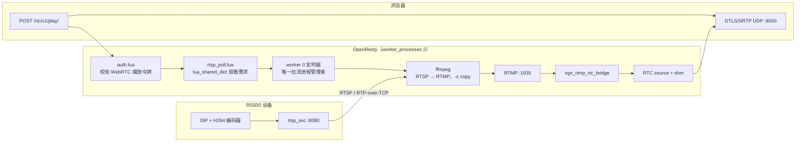

# RS500 红外 RTSP 按需接入 nginx-rtc 设计

> 起草日期：2026-09-14
> 目标仓库：`nginx-rtc-example`（`deploy/nginx/conf/`）
> 上游依据：`RS500/docs/系统与链路/RS500_RTSP_Service_Design.md`
> 状态：待实现

## 0. 结论先行

将「RTSP → RTMP」的 `ffmpeg` 进程改由 OpenResty 的 Lua 自动管理：

- 第一个通过鉴权的 WebRTC 播放请求触发拉流；不再依赖 `run.sh` 的常驻 `keep-push-ir` 守护。
- `worker 0` 是唯一进程所有者，使用内置 `ngx.pipe` 启动、等待、终止 `ffmpeg`，避免两个 nginx worker 重复拉流。
- 当 `live/ir` 的 WebRTC 就绪订阅者持续为 0 达 60 秒，Lua 向 `ffmpeg` 发送 `SIGTERM`；下一次播放再自动拉起。
- RTSP/RTP 解复用仍由 `ffmpeg` 完成，Lua 只承担鉴权后的按需调度、进程生命周期与断流重连。

本期范围只覆盖 WebRTC。HTTP-FLV、HLS、DASH 与裸 RTMP 播放没有可靠的跨 worker 长连接结束事件，不能用于“无人后回收”的正确判定。

## 1. 背景与目标

RS500 的 `rtsp_svc` 输出红外 H264 活流；`nginx-rtc` 已具备 RTMP ingest、H264 NALU 到 RTC 的桥接，以及 WebRTC 播放。缺少的是一个可按需拉取 RTSP 并向本机 RTMP 入口发布的控制面。

目标链路：

```text
RS500 红外 H264 活流 → 浏览器 WebRTC 播放
```

目标行为：

1. 已鉴权的首个 WebRTC 播放请求在不阻塞 SDP 协商的前提下发起 RTSP 拉流。
2. 多个并发播放请求最多启动一个 `ffmpeg`。
3. RTSP 对端或 `ffmpeg` 异常退出时，只要仍有观看者就自动重连。
4. 无 WebRTC 观看者 60 秒后释放 RS500 的 RTSP 会话、主机带宽和 `ffmpeg` 进程。
5. OpenResty 停止时不遗留 `ffmpeg` 子进程。

明确不含设备端直推 RTMP、设备端 WHIP、多档转码与 Lua 自行实现 RTSP/RTP。

## 2. 架构与数据流



控制面与媒体面分离：

| 路径 | 责任 | 关键约束 |
|---|---|---|
| `auth.lua` → `rtsp_pull.demand()` | 已鉴权播放请求声明需求 | 不启动进程、不等待 RTSP，不能拉长 SDP 响应 |
| `worker 0` 定时器 | 启动、监控、重连、空闲回收 | 唯一持有 `ngx.pipe` 进程对象 |
| `ffmpeg` | RTSP 会话、RTP 解包、FLV/RTMP 封装 | `-c copy`，不重编码 |
| `ngx_rtmp_rtc_bridge` | RTMP H264 NALU 转 RTC source | 复用既有模块，不改 C 代码 |

`ngx.pipe` 通过 `fork`/`execvp` 运行子进程并接入 nginx 事件循环。它不是 RTSP 客户端库，因此不能以 Lua socket 替代 `ffmpeg`。

## 3. 生命周期设计

### 3.1 启动

1. 浏览器向 `/rtc/v1/play/` 发起带 HMAC 的 SDP 请求。
2. `auth.lua` 完成现有令牌校验后调用 `rtsp_pull.demand("live/ir")`。
3. `demand()` 在 `lua_shared_dict rtsp_pull` 写入短时观看需求与时间戳；该写入原子、跨 worker 可见。
4. 仅 `worker 0` 的 2 秒定时器消费需求。进程不存在时，从 `stream_keys` 动态读取 `live/ir|publish` 密钥，生成一次性 RTMP publish 签名，再经 `ngx.pipe.spawn({...})` 启动 `ffmpeg`。
5. SDP 请求继续进入既有 `rtc_play` 内容处理器。首帧仍取决于 RTSP 连接与下一个 IDR，预期不超过一个 GOP 加建连时间。

定时器周期取 0.5 秒：它决定“播放请求 → `ffmpeg` 起步”的延迟上限，而 2 秒会让首次播放明显多等一拍。

同一时刻的首次播放拿不到源。`rtc_play` 在源不存在时返回 `code != 0`，而拉流器刚刚才被唤醒，因此**空闲流的第一次信令必然可能失败**。两条路径都据此设计：

- 随包播放页 `deploy/nginx/html/rtcplayer.html` 在 `code != 0` 时重试信令（8 次 × 800 ms，约 6 秒，落在页面既有的 10 秒回退计时之内），每次重试用新签的 token 重新声明需求。
- 直接调用 `/rtc/v1/play/` 的客户端需要自行重试一次；`scripts/e2e-rtsp-pull.sh` 就是这么做的。

进程命令的固定参数如下；URL 和 token 均不是客户端输入：

```text
ffmpeg
  -nostdin
  -loglevel warning
  -rtsp_transport tcp
  -allowed_media_types video
  -timeout 10000000
  -i "${RS500_RTSP_URL}"
  -c copy
  -f flv
  "rtmp://127.0.0.1:1935/live/ir?t=${exp}&sign=${sign}"
```

`RS500_RTSP_URL` 由 nginx 主进程环境提供，例如：

```sh
RS500_RTSP_URL='rtsp://192.168.1.50:8080/live/h264' ./run.sh start
```

配置中必须声明 `env PATH;` 和 `env RS500_RTSP_URL;`。`ngx.pipe.spawn` 使用参数数组，不执行 shell，避免 RTSP URL 或 token 进入 shell 解释。

管理器必须持有 `ngx.pipe` 返回的进程对象，并用独立轻线程持续读取
`stderr_read_any()`。否则 `ffmpeg` 的 stderr 管道写满会阻塞子进程，表现为
进程仍在但媒体不再流动。日志只保留受限长度的末尾错误文本；正常退出等待仍由
单独的 `ngx.timer.at` 回调执行。

### 3.2 观看与回收

`/rtc/v1/stats` 已由 C 模块每秒镜像到 `rtc_stats` 共享字典。其 `streams[].clients` 是 `live/ir` 已完成 DTLS/SRTP 并订阅媒体的 WebRTC 客户端数，正好是本方案所需的真实观看计数。

| 条件 | 动作 |
|---|---|
| 存在观看需求、拉流进程不存在 | 启动 `ffmpeg` |
| `live/ir.clients > 0` | 清除空闲计时，保持拉流 |
| `live/ir.clients == 0` | 开始或继续 60 秒空闲计时 |
| 空闲达到 60 秒 | 向该 `ngx.pipe` 进程发送 `SIGTERM`，清理状态 |
| `ffmpeg` 退出且仍有观看需求或客户端 | 按退避重连 |

“观看需求”用于覆盖首个播放器尚未完成握手的短窗口；实际运行期只相信 `clients`。这避免了无效请求、半开会话或老旧需求使拉流永久存活。

HTTP-FLV 的现有 `flvcnt:*` 计数会在长连接中自然过期，源码也明确将其定位为可自愈的近似计数。因此首版不得用它决定 `ffmpeg` 是否停止，也不得让 HTTP-FLV 触发本拉流器。HLS、DASH 和裸 RTMP 亦同理，不在本期支持范围内。

### 3.3 异常与停止

`rtsp_pull.lua` 对每次进程生成递增代次，并为该代次建立单独的 `ngx.timer.at` 等待回调。等待回调返回后，仅当代次仍匹配当前进程时才清空状态，避免旧进程的退出回调误删新进程状态。

| 场景 | 行为 |
|---|---|
| RTSP 建连失败、I/O 超时或 `ffmpeg` 异常退出 | 记录退出原因；有需求/观看者时按 1、2、4、8、最多 30 秒退避重试 |
| 正常空闲回收 | 标记为主动停止，不触发自动重连 |
| `SIGTERM` 后仍未退出 | 下一轮管理定时器发送 `SIGKILL`，随后清理状态 |
| nginx worker 0 退出 | `exit_worker_by_lua_block` 调用 `rtsp_pull.stop()` 发送 `SIGTERM` |
| worker 0 重启 | 新 worker 从共享字典读取需求和统计，按常规启动；旧 worker 的退出钩子负责其子进程 |

日志只记录流名、pid、退出原因与退避时间，不记录 RTSP URL 中可能存在的凭据，也不记录 publish token。

## 4. 代码改动

| 文件 | 改动 | 原因 |
|---|---|---|
| `deploy/nginx/conf/nginx.conf` | 声明 `PATH`、`RS500_RTSP_URL` 环境；新增 `rtsp_pull` shared dict；在 `init_worker_by_lua_block` 启动管理器；增加 `exit_worker_by_lua_block` 清理 | 将进程生命周期绑定到 OpenResty |
| `deploy/nginx/conf/rtsp_pull.lua` | 新增按需管理器 | 仅负责需求、单 worker 进程所有权、统计读取、重连和回收 |
| `deploy/nginx/conf/auth.lua` | 播放 HMAC 校验成功后声明 `live/ir` 需求 | 只有授权播放可触发外部设备连接 |
| `deploy/nginx/conf/config.lua` | 增加仅供服务端调用的 publish 密钥读取函数 | 拉流器生成 RTMP token，密钥不发送给浏览器 |
| `deploy/nginx/conf/stream_keys.lua` | 新增 `live/ir` 独立 play/publish 密钥 | 保持播放与推流权限隔离 |
| `deploy/nginx/html/rtcplayer.html` | `code != 0` 时重试信令（8 × 800 ms） | 拉流刚被唤起时源还不存在，首次信令必然可能失败 |
| `scripts/e2e-rtsp-pull.sh` | 新增守护脚本 | 用 stub `ffmpeg` 覆盖按需拉起、共用、重连、回收与降级 |

`run.sh` 不新增 `push-ir`、`keep-push-ir` 或 pidfile。它仍负责同步配置、启动/停止 nginx；自动拉流的全部状态属于 OpenResty。

### 4.1 密钥要求

`stream_keys.lua` 中新增两份互不相同且不复用示例值的密钥：

```lua
["live/ir|play"]    = "<independent play secret>",
["live/ir|publish"] = "<independent publish secret>",
```

`publish` 密钥只能由 `rtsp_pull.lua` 在本机读取。播放器继续只持有 `play` 密钥；两者相同会使任意观众具备推流能力。

## 5. 验收

软件侧已由 `scripts/e2e-rtsp-pull.sh` 覆盖（见 `docs/测试文档.md`）：唯一的替身是 RS500 设备本身——`scripts/fetch-deps.sh` 缓存固定版本的 mediamtx 作为 RTSP 服务端，脚本向它推一路真实 H264，再由 `rtsp_pull.lua` 真的按需拉取。因此被验证的是真实链路：RTSP 会话的建立与拆除、RTP-over-TCP 交织、`-c copy` 转封装进本机 RTMP、RTMP → RTC 桥、werift 订阅计入 `clients`、空闲回收、worker 退出清理与缺 `ffmpeg` 降级。mediamtx 只开 RTSP 且限定 `rtspTransports: [tcp]`，与设备侧的传输要求一致。下表是需要真机在场的部分。

| 步骤 | 动作 | 通过判据 |
|---|---|---|
| 1 | 板上启动 `rtsp_test init 8080`，主机执行 `ffplay "$RS500_RTSP_URL"` | 可见红外画面 |
| 2 | 以 `RS500_RTSP_URL` 启动 nginx，不打开播放器 | 没有 `live/ir` 源，无 `ffmpeg` 拉流进程 |
| 3 | 打开一个已鉴权的 `webrtc://<host>:18082/live/ir` 播放器 | 仅一个 `ffmpeg` 启动；stats 出现 `live/ir` 且 `clients=1`；浏览器出画 |
| 4 | 并发打开多个播放器 | 仍只有一个拉流进程；`clients` 与就绪播放者数量一致 |
| 5 | 关闭全部播放器并等待 60 秒 | `ffmpeg` 退出，`live/ir` 不再 publishing |
| 6 | 保持播放后断开 RS500 网络，再恢复 | 记录受控退避；恢复后自动重连并重新出画 |
| 7 | 播放中执行 `./run.sh stop` | nginx 退出后无残留本方案启动的 `ffmpeg` |
| 8 | 空闲时先 `curl` 一次 `/rtc/v1/stats`，再打开播放页 | 首次信令可能返回 `code != 0`，播放页在数秒内自动重试后出画 |

回归项：

- 原有 `live/livestream` 的 `run.sh keep-push` 与转码梯子行为不变。
- 错误 HMAC、错误流名和速率限制拒绝路径不会写入 `rtsp_pull` 需求。
- `ffmpeg` 不存在、`RS500_RTSP_URL` 未设置或密钥缺失时，播放请求仍返回既有 SDP 结果；错误仅记录在服务端日志，不泄露配置值。

## 6. 风险与边界

| 风险 | 影响 | 缓解 |
|---|---|---|
| RS500 活流未起来 | 无法出画 | 先用 `ffplay` 验证 RTSP；文件流仅用于链路诊断，不替代活流验收 |
| H264 没有可用 SPS/PPS、profile 不被浏览器接受 | RTMP 已发布但浏览器黑屏 | 用 `ffmpeg` 转码作为独立降级路径；不在按需管理器中隐式转码 |
| 首次播放等待 IDR | 首帧延迟 | 保持设备端较短 GOP；管理器不伪造媒体就绪 |
| 首次信令 `code != 0` | 页面需要重试才出画 | 播放页内置 8 次重试；直接调用信令 API 的客户端需自行重试一次 |
| 红外流无音轨 | 观看端只有视频轨 | `client/play.mjs` 的判定要求音视频同时到达，验证红外流时以视频轨为准 |
| HTTP-FLV/HLS/DASH 作为唯一观看者 | 拉流器可能按 WebRTC 空闲策略停止 | 本期不承诺这些协议的按需触发或保活 |
| nginx reload | 旧 worker 与新 worker 的媒体面已知会分裂 | 配置变更仍使用 `./run.sh stop && ./run.sh start`，不使用 reload |

## 7. 后续扩展

若需要 HTTP-FLV、HLS、DASH 或裸 RTMP 也参与按需调度，必须先提供可靠的跨 worker 订阅者生命周期统计，再扩展 `rtsp_pull.lua` 的 `viewer_count()`。不得以当前会过期的 `flvcnt:*` 值直接控制 RTSP 拉流的存活。
