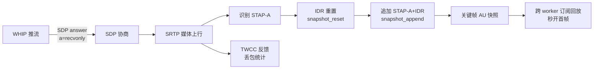

# WebRTC 直播关键技术概念详解

> 面向本仓库 `ngx-rtc-module`（RTMP → WebRTC 低延迟直播）的关键概念正式说明。
> 每个概念给出正式定义、协议依据、本项目的落地实现与相关代码位置。

## 目录

1. TWCC（Transport-Wide Congestion Control）
2. WHIP（WebRTC-HTTP Ingestion Protocol）
3. 关键帧 AU 快照（Keyframe Access Unit Snapshot）
4. IDR 重置（IDR Reset）
5. 追加 STAP-A + IDR 序列（Append STAP-A + IDR Sequence）
6. SDP answer（Session Description Protocol Answer）
7. 概念间关系
8. 扩展关键词速查（传输信令 · 媒体编码 · 浏览器播放 · 本仓库架构）

---

## 1. TWCC（Transport-Wide Congestion Control）

### 正式定义

TWCC 是 WebRTC 中一种传输层拥塞控制与丢包反馈机制，由 Google 提出并演化为 RFC 8888（RTP Control
Protocol (RTCP) Feedback for Congestion Control）。发送方在每一个 RTP 包上打一个单调递增的 transport
sequence number，接收方周期性回传一份覆盖一整段传输窗口的反馈，统一报告「哪些包收到、哪些包丢失、
各自的到达时间差」。

区别于 per-packet NACK 只报告「某一个包丢了」，TWCC 报告的是整段连续序列的完整状态，发送方可据此计算
丢包率、排队延迟变化，进而做带宽估计（GCC，Google Congestion Control）。

### 协议依据

- RFC 8285：RTP 头扩展，transport-cc 作为其中一种扩展 ID。
- RFC 8888：RTCP transport-wide feedback 报文格式。
- 前身：draft-holmer-rmcat-transport-wide-cc-extensions。

### 报文结构（RTCP 反馈，PT=205，FMT=15）

```text
 0                   1                   2                   3
 0 1 2 3 4 5 6 7 8 9 0 1 2 3 4 5 6 7 8 9 0 1 2 3 4 5 6 7 8 9 0 1
+-+-+-+-+-+-+-+-+-+-+-+-+-+-+-+-+-+-+-+-+-+-+-+-+-+-+-+-+-+-+-+-+
|V=2|P| FMT=15 |  PT=205        |          length               |
+-+-+-+-+-+-+-+-+-+-+-+-+-+-+-+-+-+-+-+-+-+-+-+-+-+-+-+-+-+-+-+-+
|                     SSRC of packet sender                     |
+-+-+-+-+-+-+-+-+-+-+-+-+-+-+-+-+-+-+-+-+-+-+-+-+-+-+-+-+-+-+-+-+
|                     SSRC of media source                      |
+-+-+-+-+-+-+-+-+-+-+-+-+-+-+-+-+-+-+-+-+-+-+-+-+-+-+-+-+-+-+-+-+
|      base sequence number     |      packet status count      |
+-+-+-+-+-+-+-+-+-+-+-+-+-+-+-+-+-+-+-+-+-+-+-+-+-+-+-+-+-+-+-+-+
|                 reference time                | fb pkt. count |
+-+-+-+-+-+-+-+-+-+-+-+-+-+-+-+-+-+-+-+-+-+-+-+-+-+-+-+-+-+-+-+-+
|          packet chunk         |           packet chunk        |
+-+-+-+-+-+-+-+-+-+-+-+-+-+-+-+-+-+-+-+-+-+-+-+-+-+-+-+-+-+-+-+-+
|         recv delta            |           recv delta          |
+-+-+-+-+-+-+-+-+-+-+-+-+-+-+-+-+-+-+-+-+-+-+-+-+-+-+-+-+-+-+-+-+
```

packet chunk 使用 run-length 或 status-vector 编码，把每个包的
not received / received small delta / received large or negative delta 状态压缩存储。

### 本项目落地

发送方向：`ngx_rtc_session_send_rtp` 对每个媒体包插入 transport-cc 头扩展，递增会话 `twcc_seq`。

接收方向：解析 TWCC 反馈并统计丢包/收到数。

```text
客户端 RTP 上行（带 transport-cc 扩展）
      → 服务端 srtp_unprotect_rtp 解密
      → ngx_rtc_rtcp_parse 识别 RTPFB/FMT=15
      → ngx_rtc_rtcp_parse_twcc 解析 chunk
      → sess->twcc_lost / twcc_received 累计
      → ngx_rtc_shm_session_set_twcc 镜像到 shm
      → render_stats 输出到 /rtc/v1/stats 与网页
```

相关代码：

- `src/ngx_rtc_core.c`：transport-cc 头扩展写入。
- `src/ngx_rtc_rtcp.c`：`ngx_rtc_rtcp_parse_twcc`。
- `src/ngx_rtc_rtcp.h`：`NGX_RTC_RTCP_FMT_TWCC` 与 twcc 字段。
- `src/ngx_rtc_stream_module.c`：累计与 shm 同步。
- `src/ngx_rtc_shm.h` / `src/ngx_rtc_shm.c`：`twcc_lost/twcc_received` 与同步函数。

---

## 2. WHIP（WebRTC-HTTP Ingestion Protocol）

### 正式定义

WHIP 是 IETF 定义的 WebRTC 推流标准协议，RFC 8224（WebRTC-HTTP Ingestion Protocol）。它规定 WebRTC
客户端如何通过一个简单 HTTP 请求把自己的音视频「推」到媒体服务器，而无需维护自定义信令服务。

### 协议流程

```text
客户端                               服务器
  │  POST /whip/endpoint               │
  │  Content-Type: application/sdp     │
  │  Body: SDP offer                   │
  │───────────────────────────────────▶│ 创建 source + publisher session
  │                                    │ 生成 SDP answer（recvonly）
  │  201 Created + SDP answer          │
  │◀───────────────────────────────────│
  │                                    │
  │  ICE/DTLS/SRTP 媒体上行            │
  │───────────────────────────────────▶│
```

### 与播放的本质区别

| 维度 | 播放 | WHIP 推流 |
|------|------|-----------|
| SDP 方向 | 服务端 sendonly | 服务端 recvonly |
| 媒体流向 | 服务器 → 客户端 | 客户端 → 服务器 |
| session 角色 | player（订阅） | publisher（媒体源） |

### 本项目落地

```text
POST /whip/endpoint?app=live&stream=xxx
  → ngx_rtc_http_whip_body_handler
      ├─ 解析 offer（video_pt/audio_pt/twcc ext）
      ├─ 创建/复用 source，source->publishing = 1
      ├─ 分配 publisher session（sess->publishing = 1）
      ├─ cfg.sendonly = -1 → a=recvonly
      └─ 返回 201 + SDP answer
  → 客户端 ICE/DTLS/SRTP 上行
  → ngx_rtc_stream_on_srtp 解密 + 解析 + 广播
```

相关代码：

- `src/ngx_rtc_http_module.c`：WHIP handler 与 body handler。
- `src/ngx_rtc_sdp.c`：`sendonly` 三态扩展。
- `src/ngx_rtc_stream_module.c`：`ngx_rtc_stream_on_srtp`。
- `src/ngx_rtc_core.h`：session 的 `publishing` 方向标记。

---

## 3. 关键帧 AU 快照（Keyframe Access Unit Snapshot）

### 正式定义

H.264 中 Access Unit（AU，访问单元）是一帧图像对应的全部 NAL 单元集合，解码器只有拿到完整 AU 才能输出
一帧画面。关键帧 AU 指以 IDR 为核心的 AU，是随机访问点：任何解码器从这里开始都能独立解码。

关键帧 AU 快照指：把最近一个关键帧 AU 的完整 RTP 序列缓存一份共享副本，供后续随机到达的订阅者（尤其
跨 worker）在本地无缓存时立即回放，避免首帧等待下一个自然关键帧。

### 为什么需要快照

直播出图前提是「先拿到关键帧」。原实现把 GOP 环放在发布 worker 进程内存，多 worker 时播放请求落在另一
worker，该 worker 本地 source 的 GOP 环为空，回放落空，首帧只能等源的下一个 IDR。

把关键帧 AU 快照下沉到 shm，任意 worker 可读，消除 worker 亲和性对首帧的影响。

### 本项目落地

```text
shm source 内
  snapshot_count : 当前快照包数
  snapshot_cap   : 固定容量（256）
  snapshot[]     : 明文 RTP 包数组
```

```c
typedef struct {
    u_char     data[NGX_RTC_RING_RTP_MAX];
    ngx_uint_t len;
} ngx_rtc_shm_gop_snapshot_pkt_t;
```

生产者每遇 IDR 重置一次快照，逐包追加；消费者（订阅/PLI 回放）遍历快照逐包发送。

相关代码：

- `src/ngx_rtc_shm.h`：快照结构。
- `src/ngx_rtc_shm.c`：`snapshot_reset/append/replay`。
- `src/ngx_rtmp_rtc_bridge_module.c`：RTMP 生产者累积。
- `src/ngx_rtc_stream_module.c`：WHIP 生产者累积 + 订阅回放。

---

## 4. IDR 重置（IDR Reset）

### 正式定义

IDR（Instantaneous Decoder Refresh）是 H.264 的一种特殊帧，包含一张完整可独立解码的图像，并强制解码器
清空参考帧缓冲。IDR 重置指：每当新的 IDR 关键帧 AU 到来，就把关键帧快照的写入位置清零，从这一帧重新
开始累积，保证快照始终对应最新的一张关键帧。

### 作用

- 快照内容单调更新，不残留旧帧。
- 订阅/PLI 回放时拿到的永远是当前可用的最新关键帧。
- 避免新旧关键帧混叠导致解码错乱。

### 本项目落地

生产者判断到 H264 STAP-A（SPS/PPS 聚合包，标志关键帧 AU 开始）时调用：

```c
ngx_rtc_shm_gop_snapshot_reset(ctx, name, len);
```

该函数在锁内把 `src->snapshot_count` 置 0，随后进入累积状态（snapshot_active = 1）。

相关代码：

- `src/ngx_rtmp_rtc_bridge_module.c`：RTMP 生产者 is_gop_start 触发 reset。
- `src/ngx_rtc_stream_module.c`：WHIP 生产者识别 STAP-A 触发 reset。

---

## 5. 追加 STAP-A + IDR 序列（Append STAP-A + IDR Sequence）

### 正式定义

STAP-A（Single-Time Aggregation Packet type A，RFC 6184）是 H.264 RTP 封装的一种聚合包，把 SPS（序列
参数集）和 PPS（图像参数集）等小 NAL 单元合并到一个 RTP 包。SPS/PPS 是解码 IDR 必需的配置元信息。

IDR 序列指一个 IDR 帧被拆成多个 RTP 包（通常是 FU-A 分片）后的包序列。

追加 STAP-A + IDR 序列指：快照不是只存一个包，而是按顺序把「STAP-A（SPS/PPS 元信息）+ IDR 的每一个
FU-A 分片」依次追加，直到该帧结束，得到一份完整、可立即解码的关键帧数据。

### 为什么必须整体

只有 IDR 主体没有 SPS/PPS，解码器不知道分辨率、profile 等参数，无法解码；只有 SPS/PPS 没有 IDR 图像
数据，也没有画面。二者必须一起缓存。

### 本项目落地

```text
STAP-A 到达（is_gop_start=1）
  ├─ snapshot_reset（清空）
  ├─ snapshot_append（存 SPS/PPS）
  └─ snapshot_active = 1
IDR 的 FU-A 逐个到达
  └─ snapshot_append（逐个追加主体分片）
最后一个 FU-A（RTP marker 位 = 1）
  └─ snapshot_active = 0（本关键帧 AU 完成）
```

关键判定：`rtp[1] & 0x80` 即 RTP 头 M（marker）位，为 1 表示该帧最后一个包。

相关代码：

- `src/ngx_rtmp_rtc_bridge_module.c`：快照累积逻辑。
- `src/ngx_rtc_stream_module.c`：WHIP 侧快照累积逻辑。

---

## 6. SDP answer（Session Description Protocol Answer）

### 正式定义

SDP（Session Description Protocol，RFC 4566）是描述多媒体会话参数的文本协议。WebRTC 连接建立遵循
RFC 3264 的 Offer/Answer 模型：Offer 描述「我支持哪些媒体、编码、传输参数」，Answer 描述「我接受哪些、
用哪些参数配合」。只有 offer 和 answer 匹配成功，ICE、DTLS、SRTP 才能建立。

### 本项目中的两种 answer 方向

| 场景 | 服务端方向属性 | 含义 |
|------|--------------|------|
| WebRTC 播放 | a=sendonly | 服务端只发媒体 |
| WHIP 推流 | a=recvonly | 服务端只收媒体 |

### answer 的关键字段

```text
a=ice-ufrag        ICE 用户名片段，STUN 校验用
a=ice-pwd          ICE 密码
a=fingerprint      DTLS 证书指纹
a=setup:passive    服务端被动等待客户端发起 DTLS
a=rtpmap           音视频 payload type → 编码/时钟频率
a=fmtp             编码参数（H264 profile-level-id、packetization-mode）
a=ssrc             同步源标识
a=candidate        服务端 ICE 候选地址
```

### 本项目落地

```text
ngx_rtc_sdp_answer_init(&cfg)
cfg.ice_ufrag / ice_pwd          会话 ICE 凭据
cfg.fingerprint = dtls_fingerprint()
cfg.setup = "passive"
cfg.sendonly = 1 或 -1          播放/推流方向
cfg.video_ssrc / audio_ssrc     源 SSRC
cfg.video_pt / audio_pt         payload type
ngx_rtc_sdp_generate_answer(&cfg, ...)
```

相关代码：

- `src/ngx_rtc_sdp.h`：`ngx_rtc_sdp_answer_t` 与生成接口。
- `src/ngx_rtc_sdp.c`：answer 生成、sendonly 三态。
- `src/ngx_rtc_http_module.c`：播放与 WHIP handler 各自填充 answer 参数。

---

## 7. 概念间关系



一句话概括：WHIP 让客户端能推流，SDP answer 谈好方向和参数；服务端接收媒体时，遇 IDR 重置快照，把
STAP-A+IDR 序列追加成关键帧 AU 快照，供跨 worker 订阅秒开；TWCC 则持续反馈这条链路的丢包状况。

---

## 8. 扩展关键词速查

> 把第 1~7 节未展开、但在全链路（推流 → 服务端 → 浏览器播放）频繁出现的词统一给出定义与本仓库关联，
> 按「传输与信令 / 媒体与编码 / 浏览器播放与延迟 / 本仓库架构与工程」四层分组。与上文重复的概念只作指引。

### A. 传输与信令

**RTP（Real-time Transport Protocol，RFC 3550）**：承载音视频的实时传输协议，每个包有 12 字节固定头
（版本/标志、PT、16 位 sequence number、32 位 timestamp、SSRC/CSRC）。WebRTC 媒体全部走 RTP（外层再
加 SRTP 加密）。本仓库的拆帧/组帧、transport-cc 扩展、加密都以 RTP 包为操作对象。

**Payload Type（PT）**：RTP 头 7 位负载类型字段，配合 SDP `a=rtpmap` 决定编码格式。本仓库视频固定协商
H264（answer 常用 PT 102）、音频 Opus（111），按 offer 实际可用负载收敛。

**SSRC（同步源标识）**：同一时间轴的一路媒体；视频与音频分属不同 SSRC，RTCP 的 SR / NACK / PLI / TWCC
都按 SSRC 决定作用于哪一路。本仓库每个 source 分配 video_ssrc/audio_ssrc，见 `/rtc/v1/stats`。

**RTP sequence number / timestamp / marker**：序号供排序与丢包检测（丢包 = 序号跳变）；时间戳为媒体采样
时刻；marker（M 位）标记一帧的最后一个包。本仓库快照累积的「帧末判定」即读 M 位（`rtp[1] & 0x80`）。

**FU-A（RFC 6184）**：单帧超过 MTU 时的分片封装，一个 NAL 拆成多个 RTP 包，头内 S/E 位标记首/末片。
H.264 关键帧这类大帧几乎必然走 FU-A。

**STAP-A（RFC 6184）**：把多个小 NAL（典型为 SPS+PPS）聚合进一个 RTP 包以省包头。本仓库以「收到
STAP-A」作为关键帧 AU 起点（is_gop_start），触发快照重置（见第 4 节）。

**RTCP（RFC 3550）**：与 RTP 同路的控制报文（PT 200~207），承载统计与反馈。播放场景中客户端正是靠
RTCP 反馈让服务端获知下行质量。

**RTCP SR / RR（Sender / Receiver Report）**：发送方报告（含 NTP 时间戳 + RTP 时间戳 + 累计包/字节）与
接收方报告（最高序号、累计丢包、抖动）。服务端周期性向播放端发 SR，客户端据此估算 RTT 并对表做 A/V
同步。

**RTCP NACK（RFC 4585，PT=205 FMT=1）**：接收端按序号逐包请求重传，属通用 RTP 反馈（RTPFB）。

**RTCP PLI / FIR（RFC 4585）**：接收端「请给我新的可解码关键帧」请求，用于首帧或关键帧丢失后的恢复；
PLI 不指定具体丢哪个包。本仓库收到 PLI 会回放最近关键帧快照。

**REMB（Google 草案，非标准）**：接收端把「下行带宽最多约 XX bps」反馈给发送端，与 TWCC 互补/被其演
替。本仓库以 TWCC 为主。

**DTLS-SRTP**：DTLS（RFC 6347，UDP 上的 TLS）负责双向认证（证书指纹）并协商出 SRTP 主密钥；随后媒体切
到对称的 SRTP 加解密。是 WebRTC 里 ICE 之后、媒体之前的一步。

**SRTP / SRTCP（RFC 3711）**：对 RTP/RTCP 的加密与完整性保护；WebRTC 的媒体与 RTCP 反馈全部加密。

**ICE（RFC 8445）**：候选地址收集 + STUN Binding 连通性检测，选出可用且最优的路径。服务端候选由
`rtc_candidate_ip / rtc_candidate_port` 注入 answer 的 `a=candidate`。

**ice-lite**：服务端侧轻量 ICE —— 不主动发包检查、不维护候选对状态机，只应答检查，适合固定地址媒体服
务器。本仓库 answer 声明 `a=ice-lite`。

**STUN（RFC 5389）**：NAT 会话穿透工具；ICE 检查的基础报文。服务端据 STUN 中的 remote ufrag 定位会话；
收到未知 ufrag 的包会告警并忽略（error.log 中常见 `unknown ICE ufrag`）。

**BUNDLE（RFC 8843）**：把多条 `m=` 媒体合并进同一条传输（同一 ICE/DTLS 连接），只打一个洞。SDP 以
`a=group:BUNDLE` 声明。

**rtcp-mux / rtcp-rsize**：RTCP 与 RTP 同端口复用（RFC 5761）与精简 RTCP（RFC 5506）。本仓库 answer 默
认两者都开（`a=rtcp-mux`、`a=rtcp-rsize`）。

**SDP（RFC 4566）+ Offer/Answer（RFC 3264）**：文本会话描述 + 协商模型，WebRTC 建连第一步，见第 6 节。

**DataChannel（RFC 8831）**：复用同一 DTLS 的数据通道；本仓库为纯音视频直播，未使用。

### B. 媒体与编码

**H.264 NAL（RFC 6184）**：编码器输出按「网络抽象层单元」组织，type 决定含义（SPS/PPS/IDR/非关键帧/
SEI/AUD）。

**SPS / PPS**：序列/图像参数集，含分辨率、profile、熵编码等解码必需元数据，通常随关键帧以 STAP-A 发
出。

**IDR（Instantaneous Decoder Refresh）**：独立可解码且清空参考帧缓冲的关键帧，是随机接入点（见第 4 节）。

**AUD / SEI**：访问单元定界符 / 补充增强信息，可标记帧边界或附带调试信息。

**profile-level-id / packetization-mode（H264 fmtp）**：SDP 中声明的 H.264 档次级别与封装模式；
`packetization-mode=1` 表示非交错（每片立即可解），是本仓库协商目标。

**时钟频率（clock rate）**：RTP timestamp 每秒滴答数——视频 90000，Opus 48000，AAC 视采样率。跨媒体
对表必须先换算到同一时基。

**Opus（RFC 6716）**：WebRTC 默认语音编码，48 kHz / 20 ms 帧 / 可带 FEC；本仓库音频 answer 默认
`opus/48000/2`。

**AAC / ASC（AudioSpecificConfig）**：RTMP/FLV 常见音频编码；FLV 中每个音轨带 2 字节 ASC（对象类型 +
采样率 + 声道）。HTTP-FLV 播放依赖 FLV 头的 AAC sequence header。

**A/V 同步（lip sync）**：让画面与声音对齐 —— 用 RTCP SR 把各路 RTP 时间戳映射到同一播放时钟，算出偏
斜。本仓库每 2s 输出 `avsync vskew/askew/av`；漂移恒定（skew 稳定）即对齐良好。

**GOP / 关键帧间隔**：相邻关键帧之间的帧组。间隔大则码率省，但首帧、随机跳转、丢包恢复都变慢。本仓库
演示源 `-g 60`（30fps → 每 2s 一个 IDR）。

**gop_cache / 秒开**：订阅时先把最近关键帧发给新观众，使其立刻可解码而不必等下一个自然 IDR。HTTP-FLV
模块自带 gop cache；本仓库 WebRTC 侧用关键帧快照回放实现同一目标（第 3~5 节）。

**TTFF（time-to-first-frame，首帧耗时）**：点击播放到第一帧上屏的毫秒数，直播体验关键指标，由信令
RTT + ICE 连通 + DTLS 握手 + 关键帧等待共同决定。

**直转 vs 重编码**：直转（passthrough）只改封装不重编码，低延迟低 CPU；重编码动辄引入数百 ms。本仓库
RTMP→WebRTC、RTMP→HTTP-FLV 均为直转。

### C. 浏览器播放与延迟

**MSE（Media Source Extensions）**：浏览器 API，让 JS 主动喂媒体字节给 `<video>`；flv.js、HLS.js 依赖它。

**flv.js**：纯 JS 的 HTTP-FLV 播放器：拉取 FLV 字节 → 解封装 → 喂 MSE，是浏览器端低延迟播放的事实方案。

**enableStashBuffer**：flv.js 是否先内部缓冲再喂 MSE。开启 = 平滑但增加延迟；关闭 = 贴直播边缘但任何微
抖动都直接 rebuffer 转圈。本仓库 flvplayer 在两者间反复权衡，最终取「开启 + 主动跳直播边缘」。

**直播边缘（live edge）**：播放器当前能播到的最「新」位置。若缓冲积压而播放器不主动追赶，画面会越来
越「旧」，甚至比墙钟晚几分钟；需周期性监测缓冲年龄并跳到直播边缘。

**为什么转圈**：等可解码数据（无关键帧）或缓冲耗尽。若服务端持续在发、播放器仍频繁转圈，多为 MSE 缓冲
/时序策略问题而非链路问题。

### D. 本仓库架构与工程

**nginx 多进程（master/worker）**：master 管生命周期，worker 各自 accept；HTTP/RTMP/WebRTC UDP 随机分
布到不同 worker，由此引出共享内存与跨 worker 话题。

**共享内存 shm / ngx_slab**：master 预分配、所有 worker 共享的内存 zone（本仓库 `rtc_zone`），存放
source/session 注册表、关键帧快照与媒体环。

**跨 worker 发布/订阅**：推流与播放落在不同 worker 时的媒体搬运。本仓库 WebRTC 用共享媒体环（生产者
enqueue，归属 worker dequeue 后广播）打通；HTTP-FLV 靠模块自带的跨进程 relay（error.log 里
`client: ngx-relay`）。

**锁层级 L1/L2/L3**：共享数据的加锁顺序约束（单向获取、禁止反向），避免死锁；本仓库 C 模块沿用此规
范。Lua 层用 shared dict（自带锁）代替手写锁。

**RTMP**：经典直播推流协议，FFmpeg `-f flv rtmp://…` 即此。本仓库 bridge 模块把 RTMP/FLV 侧解析成
RTP 供 WebRTC 使用，并把发布流镜像进 shm。

**HTTP-FLV**：把 FLV 以 HTTP 流下发（`flv_live on`），浏览器用 flv.js 播放；比 RTMP 更适合 Web/穿墙，
比 HLS 延迟低。

**HLS / DASH（切片直播）**：服务端切片成 2~10s 的 ts/mp4 与播放列表，兼容最好但固有 1~3 个切片延迟；
本仓库作多协议输出。

**HMAC 鉴权 token**：本仓库三端（RTMP 推流 / WebRTC 播放 / HTTP-FLV 播放）统一 URL 签名：
`t` = 过期秒，`sign` = base64url(HMAC-SHA256(`<app>/<stream>|t=<t>`))，每流配 secret 不下发明文。
实现见 conf/hmac.lua 与 config.lua。

**rtmp_stat / stat.xsl**：nginx-rtmp 自带的 `/stat` XML 统计与其 XSLT 展示模板。因统计为 worker 本地数
据，多 worker 下 HTTP 请求随机落点会漏数，本仓库播放页改用 Lua shared-dict 聚合计数端点
`/rtc/v1/flvcnt`（见 conf/flvcnt.lua、flv_auth.lua、flv_close.lua）。

**send_failed / send_eagain**：服务端向某会话 UDP 发送失败的累计指标，暴露在 `/metrics` 与播放页服务端
卡，用于判断弱网丢帧/拥塞是否由服务端发送瓶颈引起。
