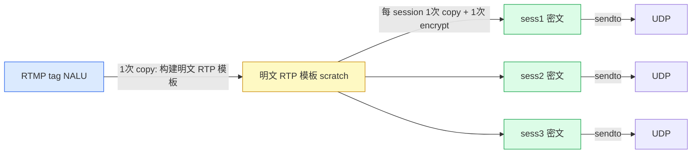
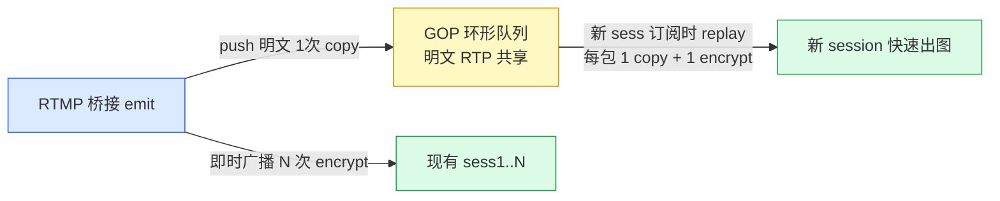

# WebRTC RTC 模块零拷贝 + 环形队列优化设计

> 结论先行，正式技术风格。本文为调研 + 设计文档，不改动现有代码。

## 0. 结论摘要

1. **SRTP 加密 N 次无法避免**。每个 session 有独立的 SRTP key（DTLS 导出），libsrtp2 `srtp_protect` 为 in-place 且密文各不相同，因此「每 session 一次加密」是协议决定的硬成本。当前 `ngx_rtmp_rtc_emit` 已是最小成本结构：N 次 memcpy + N 次加密。
2. **每 session 的 memcpy 同样无法完全消除（N>1 时）**。明文 RTP 是共享模板，in-place 加密会破坏它，每个 session 必须拥有独立可写 buffer。可优化的是：消除栈上 1600B `cipher` 抖动、单订阅者快路径省掉一次「模板→密文」拷贝。
3. **真正的收益在 GOP 环形缓存**。当前无缓存，新订阅者要等下一个 IDR，首帧延迟不可控。在 source 内加一个**定长数组环形队列缓存明文 RTP**（一次缓存，N 个订阅者共享），DTLS 完成后回放当前 GOP，可把首帧延迟压到「一个关键帧间隔」以下。
4. **不要引入无锁/锁复杂度**。单 worker 事件循环内是「单生产者（桥接）+ 多只读消费者（session 订阅时回放）」，无并发竞争，定长数组 + head/tail 索引即可，无需 DPDK rte_ring 的 CAS、无需 ngx_shm。**RT-Thread `rt_ringbuffer`（无锁 SPSC 字节环）与 `ngx_buf_t` 引用计数均不必直接套用**：字节环无包边界、无法 O(1) 定位最近 IDR，引用计数在多 worker 前是多余负担；只借鉴其「mirror bit 空满判定」与「满覆盖最旧」语义，落到槽数组实现上（详见 2.4）。
5. **分阶段**：阶段一（单 worker）落地 prealloc buffer + GOP 环形缓存 + HTTP body chain 解析；阶段二（单 worker 深化）单订阅者快路径、可变长 slot；阶段三（多 worker）才考虑 `ngx_shm_zone`/`ngx_slab_pool` 跨进程共享环形队列。

---

## 1. nginx 零拷贝数据结构最佳实践

### 1.1 ngx_buf_t 的 flag 语义（`core/ngx_buf.h`）

ngx_buf_t 结构体（`/home/dgliu/workspace/webrtc/openresty-1.31.1.1/bundle/nginx-1.31.1/src/core/ngx_buf.h`）核心字段：

| 字段 | 语义 | 对本项目含义 |
|------|------|-------------|
| `pos` / `last` | 当前有效数据区间 | RTP 包的有效字节 |
| `start` / `end` | buffer 完整内存区间（含 headroom） | FLV 头/预分配留白 |
| `temporary:1` | 内容**可写**、归本 buf 所有 | 每 session 的密文 buffer |
| `memory:1` | 内容**只读**、不得修改 | 指向共享明文模板 |
| `mmap:1` | mmap 只读 | 不适用 |
| `in_file:1` | 文件缓冲（`file_pos/file_last`） | 不适用 |
| `shadow` | 指向另一个 buf，复用其底层内存做子区间引用 | NALU 子区间引用（理论） |
| `recycled:1` | 已回收、可复用 | buffer 池复用标记 |
| `flush` / `last_buf` / `sync` | 流控制特殊标记 | UDP 数据报边界 |
| `last_in_chain` / `last_shadow` / `temp_file` | 链尾/影子链尾/临时文件 | 少见 |

**重要澄清**：ngx_buf_t **没有 `clone` 标志位**。任务描述里提到的 "clone 语义" 在 nginx 中通过 `shadow`（引用同一底层内存）与 `ngx_chain_add_copy`（共享 buf 指针、只复制链节点）组合实现。缓存命中判定宏：

```c
#define ngx_buf_in_memory(b)   ((b)->temporary || (b)->memory || (b)->mmap)
#define ngx_buf_size(b)        (ngx_buf_in_memory(b) ? (off_t)((b)->last - (b)->pos) \
                                                     : ((b)->file_last - (b)->file_pos))
```

### 1.2 ngx_chain_t 链操作（`core/ngx_buf.c`）

关键点：**`ngx_chain_add_copy` 不拷贝数据，只拷贝链节点**。它遍历 `in`，为每个 buf 分配一个新的 `ngx_chain_t` 节点，`cl->buf = in->buf` 直接共享同一个 `ngx_buf_t` 指针。这正是「一份明文、多个消费者各自持有链」的零拷贝基础。但注意其名称里的 copy 指的是链链接的复制，不是字节复制。

`ngx_chain_update_chains` 是 nginx 标准的 buffer 回收三链表（free/busy/out）机制：已消费完（`pos == last`）的 buf 按 `tag` 归还 free 链表，供下次复用。本项目若要做「每 session 发送 buffer 复用」，可借用这个 free 链表思路，但单 worker 下直接每 session 常驻一块 buffer 更简单（见 3.1）。

### 1.3 ngx_pool 分配器（`core/ngx_palloc.c`）

- `NGX_MAX_ALLOC_FROM_POOL = ngx_pagesize - 1`（x86 上 4095 字节）。
- 小于该阈值的分配走 `ngx_palloc_small`：**bump 分配器**，从当前 pool 块末尾 16 字节对齐地切一块，O(1)，无 per-allocation 开销。
- **小分配无法单独 `ngx_pfree`**（只有 `ngx_pfree` 对 large 分配生效），只能整个 `ngx_reset_pool`/`ngx_destroy_pool`。这决定了 pool 适合「同生命周期批量分配/释放」，不适合「每包分配、每包释放」。

**结论**：RTP 包约 12~1224 字节，落在 small 区间，用 `ngx_create_temp_buf`（内部 `ngx_palloc` + `temporary=1`）分配快。但广播是高频热路径，**不应每包分配**；正确做法是 session 订阅时**一次性分配常驻 buffer 并复用**，或在 source 里预分配一块 scratch 模板反复覆盖。

### 1.4 UDP send：chain 还是连续 buffer（`os/unix/ngx_udp_send.c` + `ngx_udp_sendmsg_chain.c`）

- `c->send = ngx_udp_unix_send`：`sendto(fd, buf, size, ...)`，**只支持单一连续 buffer**。
- `c->send_chain = ngx_udp_unix_sendmsg_chain`：`sendmsg` + iovec，把链上相邻内存 buf 合并进 iovec，**一次系统调用发一个数据报**（以 `flush`/`last_buf` 为数据报边界）。`ngx_udp_output_chain_to_iovec` 会合并 `prev == in->buf->pos` 的相邻 buf（即物理连续的 buf 合并成一个 iov）。
- nginx 核心**没有 sendmmsg 批量发送多数据报**的封装（QUIC 模块 `ngx_event_quic_udp.c` 也只用单 iov）。

**结论**：SRTP 输出本来就是**连续的一段密文**，直接 `c->send` 最简、无额外收益于 chain；只有当我们想「RTP 头 + 加密后的 payload 分两段 iov 拼一个数据报」时 chain 才有意义——但 libsrtp2 要求整包连续，所以不适用。**RTP 广播场景 chain 帮不上忙，关键是 buffer 复用与分配策略。**

### 1.5 RTP 广播的零拷贝边界（结论）



- 「构建明文模板」1 次 copy：因 RTP 头（12B）必须前置到 NALU 前，且 SRTP 需要整包连续，无法用 chain 引用 NALU 内存直接拼（拼出来的链最终仍要拷一次去加密）。
- 「每 session 1 次 copy + 1 次 encrypt」：in-place SRTP + 独立 key，**不可消除**。当前代码 `ngx_rtmp_rtc_emit` 已经就是这个最小结构（栈上 `cipher[1600]` 复用，N 次 memcpy + N 次 encrypt），所以广播本身没有大的拷贝冗余。
- 可优化项：栈 `cipher[1600]` 改为 session 常驻 buffer；单订阅者时省掉「模板→密文」这 1 次 copy（见 3.1）。

---

## 2. 零拷贝环形队列现成方案

### 2.1 nginx 生态

#### nginx-rtmp-module：`ngx_rtmp_shared.c`（引用计数 buffer 池）

`/home/dgliu/workspace/webrtc/nginx-http-flv-module/ngx_rtmp_shared.c` 是本项目最值得借鉴的模板：

- 一块 buffer = `[4B refcount][ngx_chain_t][ngx_buf_t][MAX_CHUNK_HEADER + chunk_size]`，refcount 存在 chain 指针**前面 4 字节**（`ngx_rtmp_ref(b) = *((uint32_t*)(b) - 1)`）。
- `ngx_rtmp_alloc_shared_buf`：从 `cscf->free` 空闲链表取，或 `ngx_pcalloc` 新分配，`ngx_rtmp_ref_set(out, 1)`。
- `ngx_rtmp_free_shared_chain`：`ngx_rtmp_ref_put(in)` 递减，归零才放回 free 链表。
- 注意：**这里的 "shared" 是进程内、同 buffer 被「发布路径 + 多个发送队列」共同引用计数的复用，不是 `ngx_shm` 跨进程共享内存**（它用的是 `cscf->pool`）。这个语义差异要记牢。

#### nginx-rtmp-module：live 广播 + FLV 零拷贝头（`ngx_rtmp_live_module.c` / `ngx_http_flv_live_module.c`）

- `ngx_rtmp_live_av`（fan-out）：遍历 `stream->ctx` 里的每个订阅者，调用 `proc_handler->append_message_pt`，把发布者的 `in` 链派发给每个协议 handler。**对 RTMP 协议本身，每个订阅者都要重新拷贝**（各自 chunk stream 头压缩状态不同）——这与我们的 SRTP「每 session 必须独立密文」本质相同。
- FLV 协议的零拷贝技巧（`ngx_http_flv_live_append_shared_bufs`，最有借鉴价值）：
  1. 先算 `in` 链总长 `data_size`；
  2. `ngx_rtmp_append_shared_bufs` 把帧字节拷进共享 buffer（**只拷一次**）；
  3. 把 `tag->buf->pos -= NGX_FLV_TAG_HEADER_SIZE`，在**预留的 headroom 里就地写 11B FLV 头 + 4B PreviousTagSize**，最终得到 `[FLV 头][帧数据][PrevTagSize]` 一段连续内存，**头不用再额外拷贝**。

**启示**：分配一块「带 headroom 的 buffer」，头就地写入 headroom，帧数据拷一次，就能避免「头 + 体」两次拷贝。对应到本项目的 STAP-A/FU-A/RTP 头，同样的「预留 headroom + 一次拷贝」可以复用。

#### nginx-http-flv-module：HTTP 订阅者零拷贝转发

`ngx_http_flv_live_module` 作为 `NGX_RTMP_PROTOCOL_HTTP` 的 proc handler，复用了 live 的 fan-out 框架；`append_message` 只做一次帧拷贝 + FLV 头就地写入，`send` 走 `c->send`（单连续 buffer）。它没有 GOP 缓存，靠 `wait_key` 指令让新订阅者等下一个关键帧——这正是本项目拷贝点 4 要补的能力。

#### nginx 原生：`ngx_output_chain` + `sendmsg_chain` + `ngx_shm`/`ngx_slab_pool`

- `ngx_output_chain`（`core/ngx_output_chain.c`）是通用的「in 链 → 可发送 out 链」过滤器：`ngx_output_chain_as_is` 判断 buf 能否原样透传（不拷贝），否则 `ngx_output_chain_copy_buf` 拷到 `ctx->bufs` 配置的 buffer。**它默认会按需拷贝**，零拷贝只在 `sendfile`/`directio` 等特定条件成立。对内存 buf 的 UDP 发送不适用。
- `ngx_udp_unix_sendmsg_chain`：见 1.4，一次 sendmsg 一个数据报，不支持多数据报 batch（无 sendmmsg）。
- `ngx_shm_zone` + `ngx_slab_pool`（`core/ngx_slab.h`）：nginx 跨 worker 共享内存分配器，基于锁的分块分配，是**多 worker 阶段跨进程环形队列的载体**。单 worker 阶段不需要。

### 2.2 开源 WebRTC 媒体服务器队列

| 项目 | 队列/缓存结构 | 关键点 | 对本项目可借鉴 |
|------|--------------|--------|---------------|
| **SRS** `SrsRtcQueue`（`srs_app_rtc_queue.cpp`） | `SrsRtpRingBuffer`：定长 `SrsRtpPacket*` 数组，按 RTP seq 取模索引 | 用 16-bit seq 距离运算 `srs_rtp_seq_distance` 处理回绕；用于 NACK 重传而非 GOP 缓存 | 定长数组 + seq 索引、回绕处理 |
| **SRS** `SrsRtcConsumer`（`srs_app_rtc_source.cpp`） | `std::vector<SrsRtpPacket*> queue`，`enqueue(pkt->copy())` 每消费者拷一份 | 代码注释自认 `// TODO: Refine performance by ring buffer`；`dump_packet` 是 O(n) `erase(begin)` | 反例：per-consumer copy + vector 头删要避免 |
| **SRS** `SrsRtcFrameBuilder` | `cache_video_pkts_[s_cache_size]` 定长数组按 seq 缓存，凑齐一帧后清空 | 目的是 RTP→RTMP 组帧，不是出图缓存 | 定长 slot 复用模式 |
| **mediasoup** | `RTC::RTP::RetransmissionBuffer`：`std::deque<Item*>`，默认 2500 包，按 ms 窗口淘汰（视频 2000ms/音频 1000ms） | 按 RTT 窗口 + 时间窗淘汰，NACK 命中直接取 | 时间窗淘汰策略 |
| **Janus** | `GQueue`（FIFO）+ `GHashTable`（seq→packet，O(1) 查找）双结构；`nack_queue_ms` 按 RTT 动态调窗口 | 队列 + 哈希并存，兼顾 FIFO 淘汰与随机命中 | 若要做 NACK 重传，seq→slot 索引可借鉴 |
| **LiveKit / ion-sfu** | 每订阅者一个 `DownTrack`，`Sequencer` 存 `packetMeta`（**内联 `[8]byte` 定长 struct，避免热路径堆分配**），`Pacer` 控速 | 单 worker goroutine 处理重传；内联定长结构避免分配 | 内联定长 slot 思想 |
| **OWT（Intel）** | 基于 libwebrtc，媒体管道走 libwebrtc 的 PacketBuffer/RTPSender，无自研独立 ring | 依赖成熟库，可借鉴点少 | 不采用 |

**共性结论**：所有成熟实现都用「定长/有界缓存 + seq 或时间窗口淘汰」，且都把「缓存的是**明文/未加密的共享拷贝**」与「每个发送目标独立编码/加密」分离。这正是本项目的设计骨架。

### 2.3 无锁 SPSC 环形队列（RT-Thread rt_ringbuffer / DPDK rte_ring / moodycamel / io_uring）

#### RT-Thread rt_ringbuffer（`components/drivers/ipc/ringbuffer.c/h`，5.2.1/5.2.2 同构）

结构（`struct rt_ringbuffer`）：

```c
struct rt_ringbuffer {
    rt_uint8_t *buffer_ptr;
    rt_uint32_t read_mirror : 1;   /* msb of index doubles as mirror bit */
    rt_uint32_t read_index : 31;
    rt_uint32_t write_mirror : 1;
    rt_uint32_t write_index : 31;
    rt_int32_t buffer_size;
};
```

核心机制与评价：

1. **字节流 SPSC、无锁无原子**：`read_index`/`write_index` + **mirror bit**（用索引的 msb 当「镜像位」区分空/满，这是经典技巧：`read_index == write_index` 且同 mirror 为空、异 mirror 为满）。头文件注释明确「**has no thread wait or resume feature**」——它只是一个无锁 SPSC 数据搬运原语，不参与调度。
2. **绕回用两次 memcpy**：`rt_ringbuffer_put/get` 在数据跨越 buffer 尾部时做「尾段 + 头段」两段拷贝（`buffer_size - index` 一段、剩余归零一段），然后翻转 mirror bit。
3. **`rt_ringbuffer_put_force` = GOP 缓存要的「满则覆盖最旧」**：空间不足时把 `read_index` 推到 `write_index` 丢弃最旧数据——正是「最近 N 包」缓存语义。
4. **关键限制：它是字节流，不是「包/槽」环形**。没有记录边界、没有按序随机访问、无法 O(1) 定位「最近 IDR」。`rt_ringbuffer_peek` 还会**消费**数据（推进 read_index），并非纯只读窥探，名字有误导性，不能直接用于「回放但不删」的场景。

#### DPDK rte_ring

定长、容量 2 的幂、`prod_head/prod_tail/cons_head/cons_tail` 四游标。SP/SC 模式下**生产者和消费者各改各自 head/tail，无需 CAS**；索引用 32-bit 无符号自动回绕，槽位 `index & mask`。它是为**多核、跨线程**设计的；本模块单 worker 单线程，天然比 SPSC 更简单，**不需要原子操作**。

#### moodycamel ReaderWriterQueue

C++ SPSC 无锁队列，定长 block + 免逐元素分配 + 内存回收；同样是跨线程场景。

#### io_uring zero-copy TX

`MSG_ZEROCOPY`/`sendmsg` 零拷贝发送，节省的是**内核态套接字发送路径**的一次拷贝，与用户态 SRTP 加密无关，不能消除我们的 per-session memcpy。

**小结**：rt_ringbuffer 是「无锁字节环」的最小正确实现，mirror bit 空满判定值得借鉴；rte_ring 是「槽数组环」的跨线程泛化。本模块单 worker 场景下，两者都**不需要其无锁部分**，退化成一个普通数组 + 游标。

### 2.4 rt_ringbuffer + ngx_buf_t 引用计数：能否组合成最小 GOP 环形队列？

**结论：不组合，槽数组 + 无引用计数才是最小实现。** rt_ringbuffer 只贡献「mirror bit 空满判定」这一个思想，字节流形态不适合本场景。理由：

1. **GOP 缓存需要「随机定位最近 IDR」**。rt_ringbuffer 是字节流，无法 O(1) 拿到「最新 IDR 记录的字节偏移」。若要支持回放从 `gop_start` 开始，必须在外部再维护一份「记录描述符数组」（`offset + seq + is_gop_start`）——这本身就已经是槽数组了，rt_ringbuffer 反而变成多余的一层。
2. **GOP 缓存要「回放不删除」**。新 session 订阅时回放当前 GOP，多个 session 可能先后订阅、各自从头回放，谁都不消费 ring；rt_ringbuffer 的 `get/peek` 都推进 `read_index`（消费语义），不符合「共享只读历史」。
3. **可变长包在字节环里要「长度前缀 + 两段 memcpy 绕回」**，而槽数组是「一次 memcpy 进一个槽 + `& (cap-1)` 取槽」，更简单、cache 更友好，且无需处理绕回跨段。
4. **ngx_buf_t 引用计数在单 worker 阶段是多余的**。`ngx_rtmp_ref`（`ngx_rtmp_shared.c`）解决的是「同一块 buffer 被发布路径 + 多个发送队列异步引用」的释放时序问题；本模块单 worker 内，ring 由 source 独占持有，订阅者回放在同一事件循环内同步完成，**不需要引用计数**。引用计数只在阶段三（多 worker + `ngx_shm` 跨进程共享）才派上用场。

因此：**阶段一最简实现 = 定长槽数组 + `head/count/gop_start` 游标**（即 4.3 的 `ngx_rtc_rtp_ring_t`），本质是 rte_ring SP/SC 特例 + rt_ringbuffer 的「满覆盖」语义，去掉所有无锁/引用计数复杂度。若后续要 NACK 重传（随机按 seq 取包），再演进为 SRS `SrsRtpRingBuffer`/Janus `GHashTable` 的「seq → 槽」索引。

### 2.5 推荐方案

**单 worker、单生产者（桥接）多只读消费者（订阅时回放）→ 定长数组环形队列，明文共享、无锁、无原子。** 具体数据结构见 3.4 / 4.3。

---

## 3. 针对本项目的优化设计

### 3.1 RTP 广播（拷贝点 1）

现状（`ngx_rtmp_rtc_emit`，`src/ngx_rtmp_rtc_bridge_module.c:269-293`）：

```
packetize -> scratch[1500]（栈） -> 每 session: memcpy cipher[1600]（栈）-> srtp_protect(in-place) -> c->send
```

优化方案（按收益排序）：

1. **session 常驻发送 buffer（必做，简单）**：在 `ngx_rtc_session_t` 内加 `uint8_t cipher[1600]`（或订阅时 `ngx_alloc` 一次），替代 emit 里的栈 `cipher[1600]`。每次广播复用，无栈抖动、无分配。
2. **单订阅者快路径（可选）**：当 `src->subscribers` 只有一个 session 时，把 packetize 的目标 buffer 直接指向该 session 的 `cipher`，省掉「scratch 模板 → cipher」这 1 次 copy。收益约 1 次 1KB memcpy（几十 ns），相对 AES-CM 的 1~2µs 占比 <5%，属微优化；但接口只需把 emit 语义从「const 只读模板」改为「写入请求 buffer」，复杂度可控。
3. **不做**：用 ngx_buf_t/ngx_chain_t 表达明文 RTP 再 per-session 引用——因为 SRTP 必须整包连续 + in-place，chain 引用最终仍要拷，无收益。

评估：`srtp_protect` in-place + 每 session key → **N 次加密不可避免**；`N>1` 时 **N 次 memcpy 不可避免**；用 `ngx_pool` 分配可替代栈 buffer（`ngx_create_temp_buf` 一次分配、常驻复用），但**不能省掉 memcpy**。

### 3.2 SPS/PPS 缓存（拷贝点 2）

现状（`ngx_rtc_core.h:59-62`、`ngx_rtmp_rtc_bridge_module.c:147-194`）：`sps[256]`/`pps[256]` 固定数组，序列头到达时 `ngx_memcpy` 一次。

结论：**这是非热路径**（每个 AVC 序列头只发生一次，SPS/PPS 仅几十字节），memcpy 成本可忽略。**不建议为它做零拷贝**：

- 若 `ngx_str_t` 直指 RTMP tag 内存，tag buffer 在 handler 返回后被 nginx RTMP 复用/释放，悬垂；要安全必须「引用计数 pin 住」该 tag（参考 SRS `SrsSharedPtrMessage` 或 nginx-rtmp `ngx_rtmp_ref`），复杂度和风险远大于收益。
- 推荐：保持 `src` 自有 256B 存储，语义上改为 `ngx_str_t`（`data`/`len`）以便与 packetizer 统一。SPS/PPS 的「零拷贝」收益为 0，仅作类型整洁化。

### 3.3 HTTP body（拷贝点 3）

现状（`ngx_rtc_http_body_handler`，`src/ngx_rtc_http_module.c:155-217`）：把 `r->request_body->bufs` 链逐段 `ngx_memcpy` 进栈上 `body_buf[8192]` 再解析。

优化：**直接遍历 ngx_chain_t，用链游标跨 buf 读取，消除 8KB 栈缓冲 + memcpy**。JSON 解析只需按字节扫描 `"key":"value"`，实现一个 `ngx_rtc_chain_reader`（游标持 `cl` + `offset`，`peek/read` 自动跨 buf）。骨架见 4.4。注意：SDP offer 可能跨 buf 边界，游标必须处理跨 buf 的逐字节读取；这是纯软件复杂度，无协议障碍。

### 3.4 GOP 缓存 / 环形队列（拷贝点 4，最大收益）

现状：无缓存，`ngx_rtc_stream_dtls_done` 订阅后，只能等下一个 IDR。

设计（单 worker 定长数组环形队列，明文共享）：

- source 内加 `ngx_rtc_rtp_ring_t`，容量 2 的幂（如 2048，覆盖一个典型 GOP；按 1080p 关键帧 ~100 FU-A + P 帧，1~2 秒 @30fps 约数百包足够）。
- 每个 slot 是定长结构（内联 `uint8_t data[1214+12]`，避免热路径分配，借鉴 LiveKit `packetMeta` 内联定长思想）：存**明文 RTP 包** + 长度 + 扩展 seq + `is_gop_start` 标志。
- 广播时：`ngx_rtc_rtp_ring_push` 把明文 RTP **拷一次**进 ring（这是为「晚到订阅者」付出的唯一一次缓存拷贝）；同时照常即时广播给现有订阅者。
- 新 session 订阅（DTLS done）：`ngx_rtc_rtp_ring_replay` 从 `gop_start`（最近一次 IDR 的首包，即 STAP-A SPS/PPS）回放到 `head`，每包走 `ngx_rtc_session_send_rtp`（memcpy + protect + send）。
- 关键：ring 存**明文**（共享），回放时才做 per-session 加密——把「每 session 的加密成本」从「每包都发生」延迟到「订阅时一次性 burst」。
- 无锁：单 worker，`head`/`count`/`gop_start` 仅桥接模块写，回放在同一事件循环内读，无竞争。



GOP 起点标记：`ngx_rtmp_rtc_video` 在 IDR 且已有 SPS/PPS 时，先发 STAP-A（SPS/PPS）再发 IDR 本体；把「STAP-A 发射前」置 `is_gop_start=1`，即可让 ring 记录当前 GOP 起点。emit 通过一个小的上下文结构传递该标志（见 4.2）。

---

## 4. 数据结构与接口草案（C11 骨架，英文注释）

### 4.1 source / session 结构（`ngx_rtc_core.h` 增量）

```c
#define NGX_RTC_MAX_RTP_PKT    (NGX_RTC_RTP_HEADER_SIZE + 2u + NGX_RTC_H264_MTU) /* 1214 */
#define NGX_RTC_SRTP_TAG_LEN   10u                                            /* AES-CM-128-HMAC-SHA1-80 */
#define NGX_RTC_CIPHER_CAP     (NGX_RTC_MAX_RTP_PKT + NGX_RTC_SRTP_TAG_LEN + 32u)
#define NGX_RTC_GOP_RING_CAP   2048u                                          /* power of two */

typedef struct {
    uint8_t  data[NGX_RTC_MAX_RTP_PKT]; /* plaintext RTP packet (shared template copy) */
    uint16_t len;
    uint32_t seq;                       /* extended 32-bit seq, avoids 16-bit wrap in index */
    uint8_t  is_gop_start;              /* first packet of an IDR access unit (STAP-A SPS/PPS) */
} ngx_rtc_rtp_cache_slot_t;

typedef struct {
    ngx_rtc_rtp_cache_slot_t *slots;    /* fixed array, allocated once per source */
    uint32_t capacity;                  /* power of two, slots[head & (cap-1)] */
    uint32_t head;                      /* next absolute write index */
    uint32_t count;                     /* valid entries in [head-count, head) */
    uint32_t gop_start;                 /* absolute index of the latest GOP first packet */
} ngx_rtc_rtp_ring_t;

struct ngx_rtc_session_s {
    /* ... existing fields ... */
    uint8_t  cipher[NGX_RTC_CIPHER_CAP]; /* per-session SRTP cipher buffer (reused, no stack) */
};

struct ngx_rtc_source_s {
    /* ... existing fields ... */
    ngx_rtc_rtp_ring_t gop;             /* plaintext RTP ring for fast-start replay */
};
```

### 4.2 广播接口（`ngx_rtmp_rtc_bridge_module.c` 改造）

emit 上下文，传递 GOP 起点标志：

```c
typedef struct {
    ngx_rtc_source_t *src;
    uint8_t           is_gop_start; /* set to 1 right before the STAP-A SPS/PPS emit */
} ngx_rtc_emit_ctx_t;

/* One session send path: copy + in-place SRTP + send.
 * The memcpy + N encryptions are irreducible (per-session key, in-place srtp_protect). */
static void
ngx_rtc_session_send_rtp(ngx_rtc_session_t *sess, const uint8_t *rtp, uint32_t len)
{
    ngx_connection_t *c;
    int n;

    c = (ngx_connection_t *)sess->conn;
    if (NULL == c || 0 == sess->srtp_ready) {
        return;
    }

    ngx_memcpy(sess->cipher, rtp, len);                  /* copy #1: plaintext -> per-session buf */
    n = (int)len;
    if (ngx_rtc_srtp_protect_rtp(&sess->srtp, sess->cipher, &n) != 0) {
        return;
    }
    c->send(c, sess->cipher, (size_t)n);                 /* contiguous -> sendto, no chain needed */
}

static int32_t
ngx_rtmp_rtc_emit(void *opaque, const uint8_t *rtp, uint32_t len)
{
    ngx_rtc_emit_ctx_t *ctx = opaque;
    ngx_rtc_source_t   *src = ctx->src;
    ngx_rtc_session_t  *sess;

    /* Cache plaintext once (copy for late subscribers only). */
    ngx_rtc_rtp_ring_push(&src->gop, rtp, len, ctx->is_gop_start);

    for (sess = src->subscribers; NULL != sess; sess = sess->sub_next) {
        ngx_rtc_session_send_rtp(sess, rtp, len);        /* copy #2..N + encrypt #1..N */
    }

    return NGX_RTC_OK;
}
```

### 4.3 GOP 环形队列（`ngx_rtc_core.c` 或新文件，单 worker，无锁）

```c
static void
ngx_rtc_rtp_ring_push(ngx_rtc_rtp_ring_t *r, const uint8_t *rtp, uint32_t len,
                      uint8_t is_gop_start)
{
    ngx_rtc_rtp_cache_slot_t *slot;
    uint32_t idx;

    if (NULL == r || NULL == r->slots || 0 == r->capacity || len > NGX_RTC_MAX_RTP_PKT) {
        return;
    }

    idx = r->head & (r->capacity - 1);
    slot = &r->slots[idx];

    ngx_memcpy(slot->data, rtp, len);
    slot->len = (uint16_t)len;
    slot->seq = r->head;
    slot->is_gop_start = is_gop_start;

    if (0 != is_gop_start) {
        r->gop_start = r->head;
    }

    r->head++;
    if (r->count < r->capacity) {
        r->count++;
    }
}

/* Replay the current GOP to a freshly subscribed session (fast startup). */
static void
ngx_rtc_rtp_ring_replay(ngx_rtc_rtp_ring_t *r, ngx_rtc_session_t *sess)
{
    uint32_t i;
    uint32_t start;
    uint32_t idx;

    if (NULL == r || NULL == sess || 0 == r->count) {
        return;
    }

    start = r->head - r->count;             /* oldest retained */
    if (r->gop_start > start) {
        start = r->gop_start;               /* clamp to latest IDR */
    }

    for (i = start; i < r->head; i++) {
        idx = i & (r->capacity - 1);
        ngx_rtc_session_send_rtp(sess, r->slots[idx].data, r->slots[idx].len);
    }
}
```

接入点：`ngx_rtc_stream_dtls_done`（`ngx_rtc_stream_module.c:264-285`）在 `sess->srtp_ready=1` 且加入 `source->subscribers` 后，调用 `ngx_rtc_rtp_ring_replay(&sess->source->gop, sess)`。注意 `ngx_rtc_session_send_rtp` 需放到 `ngx_rtc_core.c`（core 已 include `ngx_rtc_srtp.h`）并导出，供 bridge 的即时广播与 stream 的回放共用，避免跨模块重复实现。

### 4.4 HTTP body 链游标（`ngx_rtc_http_module.c`）

```c
typedef struct {
    ngx_chain_t *cl;
    u_char      *p;      /* current read pos within cl->buf */
} ngx_rtc_chain_reader_t;

/* Read one byte across the chain; returns NGX_OK or NGX_ERROR at chain end. */
static ngx_int_t
ngx_rtc_chain_reader_get(ngx_rtc_chain_reader_t *rd, u_char *out)
{
    for (;;) {
        if (NULL == rd->cl || NULL == rd->cl->buf) {
            return NGX_ERROR;
        }
        if (rd->p < rd->cl->buf->last) {
            *out = *rd->p++;
            return NGX_OK;
        }
        rd->cl = rd->cl->next;
        rd->p = (rd->cl && rd->cl->buf) ? rd->cl->buf->pos : NULL;
    }
}

/* Initialize reader on r->request_body->bufs; the JSON field extractor then
 * calls ngx_rtc_chain_reader_get() instead of indexing a contiguous body_buf. */
```

原 `ngx_rtc_http_json_string` 改为接受 `ngx_rtc_chain_reader_t *`，内部逐字节读取并做 `"key":"value"` 匹配与 `\"` 反转义，彻底去掉 `body_buf[8192]` 与拷贝。

---

## 5. 零拷贝 vs 不可避免加密 标注

| 拷贝点 | 零拷贝可行性 | 落地动作 | 标注 |
|--------|-------------|---------|------|
| RTP 广播每 session memcpy | **不可消除**（N>1，in-place SRTP + 独立 key） | session 常驻 buffer；单订阅者快路径省 1 次 | SRTP 加密 N 次不可避免 |
| RTP 广播栈 cipher[1600] | 消除栈抖动 | 常驻 `sess->cipher` | 非零拷贝，是分配优化 |
| SPS/PPS memcpy | 理论可零拷贝（pin tag） | **不做**，保持 256B 拷贝 | 非热路径，收益 0 |
| HTTP body memcpy | **可消除** | chain 游标跨 buf 解析 | 纯软件复杂度 |
| GOP 缓存 | 缓存明文 1 次/包，N 订阅者共享 | 定长数组环形队列 + 回放 | 回放时每 session 加密不可避免 |

---

## 6. 分阶段实施与风险

| 阶段 | 内容 | 触发条件 | 风险 |
|------|------|---------|------|
| 一（单 worker，本次） | ① session 常驻 cipher buffer；② GOP 环形队列 + 订阅回放；③ HTTP body chain 解析 | 功能可行即可落地 | GOP 容量与内存权衡；回放 burst 过大需限速 |
| 二（单 worker 深化） | ① 单订阅者快路径；② 可变长 slot 省内存；③ 若需 NACK 重传，加 seq→slot 索引（借鉴 Janus） | 出现明显内存/CPU 压力 | 接口改动影响 packetizer |
| 三（多 worker） | ① `ngx_shm_zone` + `ngx_slab_pool` 承载跨进程 ring；② 借用 `ngx_rtmp_ref` 引用计数 pin 共享 buffer | 需要「RTMP worker 与 UDP 媒体 worker 分离」架构 | 引入锁/原子，复杂度显著上升；需评估是否真有必要 |

关键风险提示：

1. **回放 burst**：整 GOP 一次性 `sendto` 可能瞬间拥塞订阅者的接收窗口（网络侧），必要时加简单 pacing 或仅回放最近 N 包。
2. **GOP 容量**：2048 slot × 1226B ≈ 2.5MB/source，多个 source 时内存线性增长；可按实际码率调小，或改可变长 slot（阶段二）。
3. **seq 回绕**：用 32-bit 扩展 seq 作 ring 索引（`head` 单调递增，`& (cap-1)` 取槽），天然规避 16-bit 回绕，无需 SRS 的 `srs_rtp_seq_distance` 技巧。
4. **多 worker 误判**：当前单 worker 事件循环下引入 ngx_shm/无锁队列属过度设计，先验证单 worker 吞吐是否已够。

---

## 附：关键源码位置

- 本项目：`/home/dgliu/workspace/webrtc/ngx-rtc-module/src/ngx_rtmp_rtc_bridge_module.c`（广播）、`ngx_rtc_core.c/h`（source/session）、`ngx_rtc_http_module.c`（body）、`ngx_rtc_stream_module.c`（DTLS done 订阅）
- nginx：`/home/dgliu/workspace/webrtc/openresty-1.31.1.1/bundle/nginx-1.31.1/src/core/ngx_buf.h`、`core/ngx_palloc.c`、`os/unix/ngx_udp_send.c`、`os/unix/ngx_udp_sendmsg_chain.c`
- nginx-rtmp/flv：`/home/dgliu/workspace/webrtc/nginx-http-flv-module/ngx_rtmp_shared.c`、`ngx_rtmp_live_module.c`、`ngx_http_flv_live_module.c`、`ngx_rtmp_gop_cache_module.c`
- SRS：`/home/dgliu/workspace/webrtc/srs-server-6.0-r1/trunk/src/app/srs_app_rtc_queue.cpp`、`srs_app_rtc_source.cpp`（`SrsRtcConsumer`、`SrsRtcFrameBuilder::cache_video_pkts_`）
- RT-Thread rt_ringbuffer：`/home/dgliu/renode_rtthread/rtos_kernel/rt-thread-5.2.2/components/drivers/ipc/ringbuffer.c`、`components/drivers/include/ipc/ringbuffer.h`；5.2.1 版本 `/home/dgliu/rtthread_521/rt-thread-5.2.1/components/drivers/ipc/ringbuffer.c`；RS500 封装 `/home/dgliu/RS500/rs_driver_framework/include/ipc/ringbuffer.h`（与 5.2.2 头文件同构，无额外抽象）
