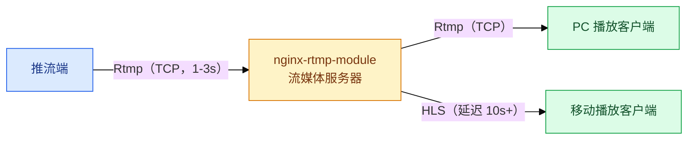
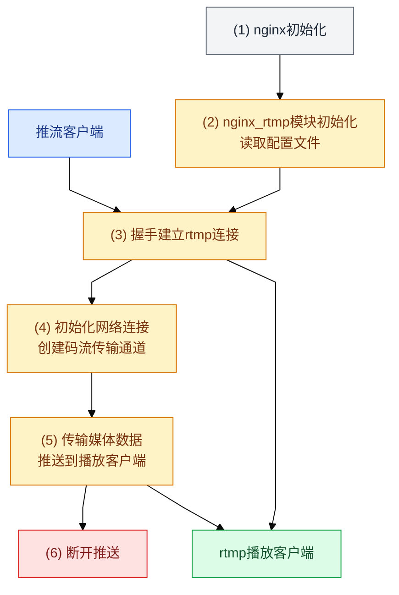
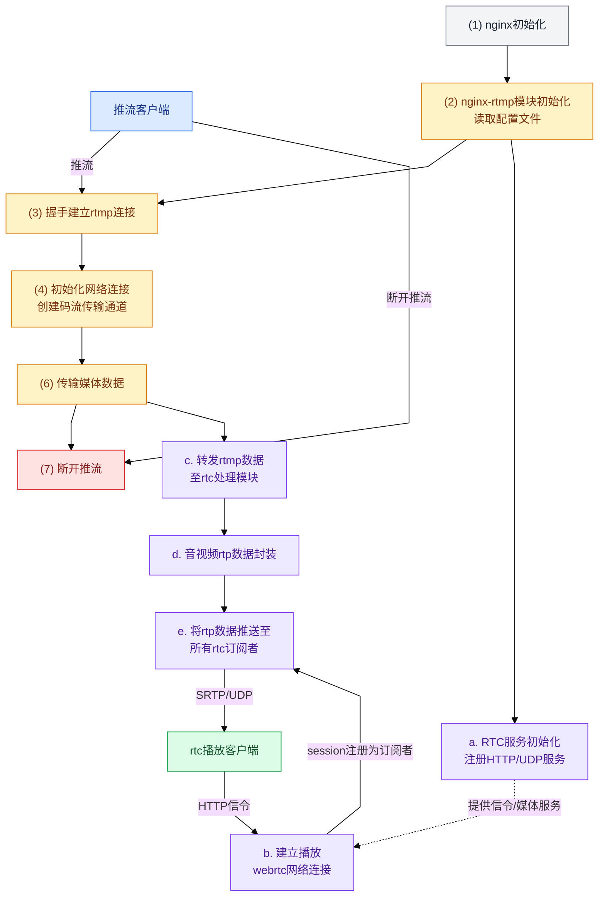
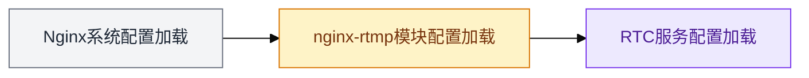
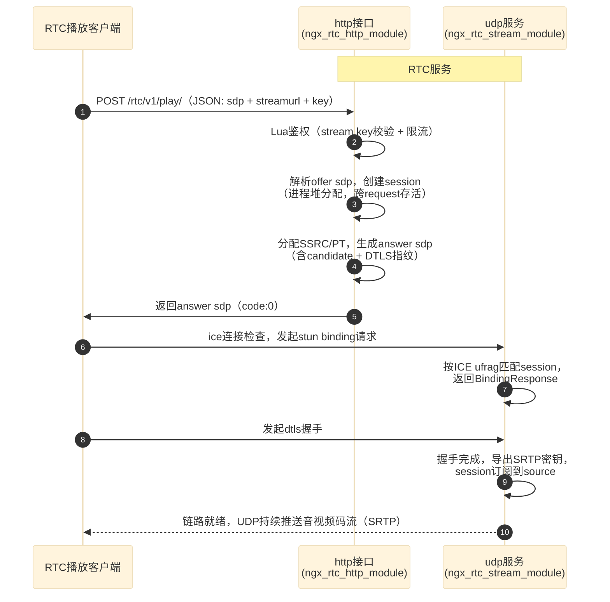
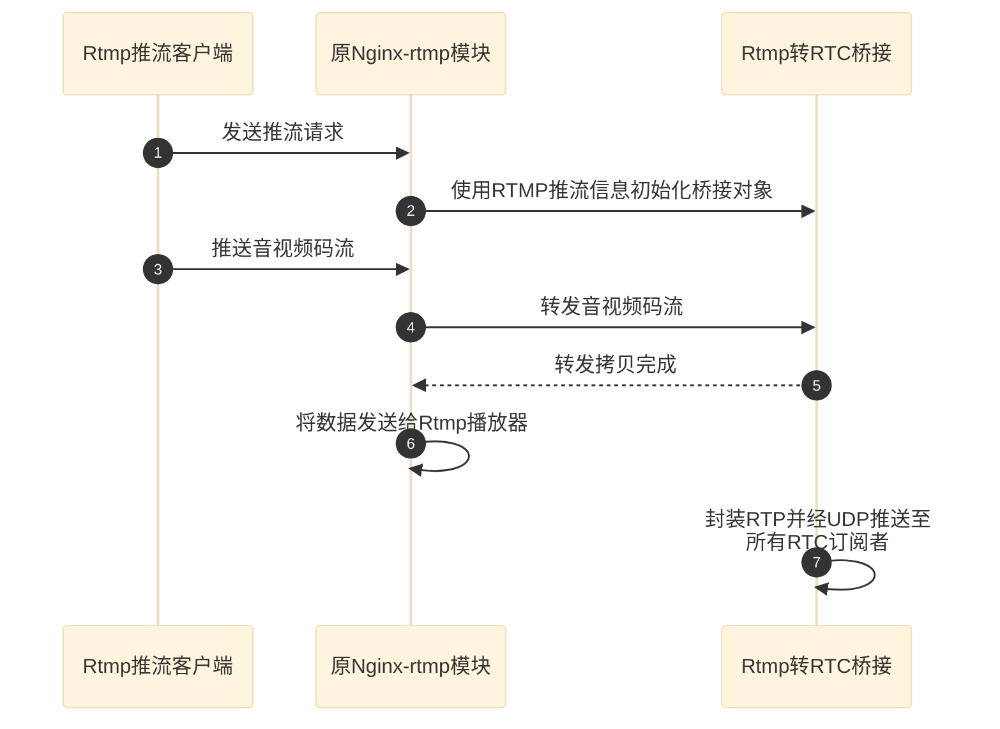

# 在 Nginx 里做 WebRTC 低延迟直播：从方案到落地

> 本文源自技术交底书《一种基于 Nginx-rtmp 的 webrtc 低延迟直播方法》，结合本仓库 `ngx-rtc-module` 的实际实现整理而成。
>
> 结论先行：**不引入 SRS 这类独立 RTC 服务，在 nginx 框架内直接完成 RTMP→WebRTC 转换**，延迟从 RTMP/HLS 的 1~10 秒降到 0.5 秒以内；端到端实测首包约 560 ms，视频 H264 761 包 / 362 KB、音频 Opus 389 包 / 67 KB 全链路可达。

## 1 为什么延迟降不下来

直播分发最常见的组合是 Nginx-rtmp 模块（支持 RTMP、HLS）和它的扩展 Nginx-http-flv-module。三者都绕不开一个前提：码流走 TCP。

RTMP 是 Adobe 为 Flash 平台设计的应用层协议，靠 TCP 保证可靠传输，局域网内延迟一般在 1~3 秒；主流浏览器早已放弃 Flash，iOS 端还需要第三方解码器。HLS 走 HTTP/80，穿透防火墙没问题，但服务端要把流切成 ts 小文件、客户端按序播放，延迟普遍在 10 秒以上，还会产生海量小文件。Http-Flv 把 RTMP 码流重新封装成 HTTP 长连接流，浏览器免插件就能播，实时性与 RTMP 相当——本质上仍是 TCP，1~3 秒的瓶颈没有解决，且客户端本地会缓存流媒体资源，保密性差。

三条典型链路如下：



图 1：现有技术一，Nginx-rtmp 的 RTMP/HLS 分发


图 2：现有技术二，Http-Flv 分发

问题归结为两点：**TCP 的重传与队头阻塞决定了延迟下界；客户端缓存决定了保密性上限**。WebRTC 基于 UDP，面向无连接，天然规避 TCP 拥塞控制的开销，且为浏览器原生设计——免插件、免安装、不在播放端落盘。这正是本方案选择的突破口。

## 2 方案设计与落地实现的对应关系

交底书给出的目标架构只有一句话：推流端照旧走 RTMP，播放端换成 WebRTC。


图 3：方案总体架构

对照本仓库的实际实现（`docs/架构设计.md`），方案中的抽象模块 `Nginx-WebRtc-module` 落地为挂在 OpenResty 1.31.1.1 上的一组模块，概念一一对应：

| 方案角色 | 落地实现 | 职责 |
| --- | --- | --- |
| HTTP 服务接口 | `ngx_rtc_http_module` | `/rtc/v1/play/` 信令，offer/answer 收发 |
| UDP 服务 | `ngx_rtc_stream_module` | UDP :8000 上 STUN/DTLS/SRTP 媒体收发 |
| 转发 RTC 处理模块 | `ngx_rtmp_rtc_bridge_module` | RTMP 类型模块，经 events 钩子订阅 RTMP 音视频消息 |
| RTC 协议处理 | 纯 C 核心 `rtp/sdp/stun/dtls/srtp/audio` | 无 nginx 依赖，可 host 单测 |
| 转码/封装 | AAC→Opus（FFmpeg+libopus）、NALU→RTP（RFC 6184） | 对应方案设计中的封装要求 |

一个值得注意的落地约束：桥接模块通过 `postconfiguration` 把处理器注册进 `cmcf->events[]`，**不改动 nginx-http-flv-module 一行源码**，HTTP-FLV 分发与 WebRTC 分发并行存在、互为兜底。

## 3 RTC 服务如何嵌进 nginx

### 3.1 业务流程的扩展

先看原 Nginx-rtmp 模块的工作流程，启动、初始化、握手、建通道、传数据、断开，六步线性：



图 4：原有 Nginx-rtmp 流程

方案的扩展在四个位置插入 RTC 环节：rtmp 初始化后并行做 RTC 服务初始化（a）；播放端经 HTTP 建立 WebRTC 连接（b）；传输媒体数据时把 RTMP 码流转发给 RTC 处理模块（c），做 RTP 封装（d）后推送给所有订阅者（e）。下图按实际实现校正——RTC 服务初始化与推流主流程并无先后耦合（交底书原图把它画成流入 rtmp 握手），播放端建链也是与推流解耦的独立路径，其结果是 session 注册为该流的订阅者，在推送环节（e）与主流程汇合：



图 5：扩展后的 RTC 工作流程（紫色为新增环节）

落地实现与图 5 的对应：a 对应 stream/http/bridge 三个模块的 nginx 标准初始化钩子；b 对应 `/rtc/v1/play/` 信令；c/d/e 对应桥接模块订阅 `NGX_RTMP_MSG_VIDEO / NGX_RTMP_MSG_AUDIO` 事件后进入纯 C 核心的 RTP 封装与逐订阅者 SRTP 加密广播。

### 3.2 配置项与加载顺序

交底书最初设想的 RTC 配置项（`stun_timeout`、`bframe`、`aac`）只是概念占位。落地后按 nginx 的模块体系重新分配到了 rtmp / http / stream 三个上下文，真实指令如下：

```nginx
# RTMP 侧（bridge 模块，nginx-http-flv-module 的 rtmp 上下文）
rtmp {
    rtc_audio_bitrate 64000;       # AAC→Opus 目标码率
    rtc_rtcp_sr_interval 2000ms;   # RTCP SR 发送周期
    server {
        listen 1935;
        application live { live on; gop_cache on; }
    }
}

# HTTP 信令侧（ngx_rtc_http_module）
http {
    server {
        listen 18082;
        location /rtc/v1/play/ {
            access_by_lua_file conf/auth.lua;  # stream key 校验 + 限流
            rtc_candidate_ip   172.16.48.122;  # answer 下发的 candidate
            rtc_candidate_port 8000;
            rtc_play;
        }
    }
}

# UDP 媒体侧（ngx_rtc_stream_module）
stream {
    server {
        listen 8000 udp reuseport;
        rtc;                       # 交给 stream 模块处理
        rtc_handshake_timeout 10s; # 握手中 session 空闲回收阈值
        rtc_ready_timeout     30s; # 就绪 session 空闲回收阈值
    }
}
```

对应关系：交底书的 `stun_timeout` 拆成了 `rtc_handshake_timeout`/`rtc_ready_timeout` 两级超时；`bframe` 没有做成开关，实现里对 B 帧是**无条件丢弃**（`ngx_rtc_h264_is_b_frame`，因为 WebRTC 低延迟播放不支持 B 帧）；`aac` 同理固定转 Opus，只保留 `rtc_audio_bitrate` 一个可调参数。

配置加载遵循 nginx 模块体系的固有顺序——先系统级、再已加载模块、最后新模块，RTC 服务配置自然排在 nginx-rtmp 之后：



图 6：系统配置加载顺序（交底书原图 7）

HTTP 播放接口按 nginx 自定义模块规范创建 `ngx_command_t`、`ngx_http_module_t`、`ngx_module_t` 注册进 http 体系；UDP 服务同理走 stream 体系。需要澄清一点：交底书写的是"连接完成后为每个播放器建立播放协程与数据缓存队列，从队列读取数据发出"，落地时**没有引入协程和自建线程/队列**——媒体热路径全部跑在 nginx 单事件循环内，桥接（生产者）与 stream（消费者）同处一个地址空间，每个 session 挂 source 的订阅者队列上，RTP 到达时直接遍历订阅者逐个 SRTP 加密发送，回收交给 `ngx_event_timer` 周期 reap。这也符合方案"在 nginx 框架内完成转换、不引入独立 RTC 服务"的定位。

## 4 建链与桥接

### 4.1 与播放客户端建链

一次 WebRTC 播放要跨三个协议面：HTTP 信令交换 SDP、STUN 做 ICE 连通性检查、DTLS 建安全通道，最后才是 SRTP 媒体。落地后的实际建链时序如下（交底书原图 6 把创建 session、生成 local SDP 画在 udp 服务侧，实测中这些全部收敛到 HTTP 信令模块一次完成，udp 侧只负责按 ICE ufrag 匹配 session）：



图 7：与 RTC 播放客户端建立连接（按实际实现校正）

要点：

1. 播放客户端一次 POST 同时携带播放 URL 和 offer SDP（信令契约兼容 SRS `/rtc/v1/play/` JSON 格式，offer 与 play 请求合并），RTC 服务校验 key 后返回 answer SDP；
2. session 由信令侧创建并从进程堆分配——它的生命周期跨越 HTTP 请求（返回 answer 后还要在 UDP 侧完成 DTLS/SRTP），不能用 request pool；
3. 播放端解析 answer 发起 STUN binding，udp 服务按 ICE ufrag 匹配到 session 返回成功——匹配键是 answer 下发的 ufrag，所以 answer 必须携带 media 级 `a=candidate`，否则播放器（实测 werift）根本不会发起 STUN，表现为信令成功但零媒体；
4. DTLS 握手完成后导出 SRTP 密钥，session 订阅到对应 source，进入订阅者列表，由 udp 服务推送加密后的音视频码流。

### 4.2 RTMP→RTC 桥接

方案的关键洞察是：**不改 nginx-rtmp 的分发主干，只在推送码流前插一个旁路**。



图 8：Rtmp 转 RTC 桥接模块

桥接模块做两件事：推流连接建立后用推流信息初始化桥接对象；在原发送逻辑把码流给 RTMP 播放器之前，先拷一份给 RTC 服务处理。封装细节：音频按标准转成 Opus，视频将 NALU 打包成 RTP single/STAP-A/FU-A 包，B 帧在封装前剔除。

落地实现中，这一步对应 `ngx_rtmp_rtc_bridge_module`（`NGX_RTMP_MODULE` 类型）：它在 `postconfiguration` 阶段把视频/音频处理器注册进 `cmcf->events[]` 的 `NGX_RTMP_MSG_VIDEO / NGX_RTMP_MSG_AUDIO` 事件数组，只在 `publishing` 会话上激活，不改动 nginx-http-flv-module 源码。产出的明文 RTP 以 source 级共享（一份缓存、N 个订阅者），每个 session 加密前拷贝到自身缓冲并重写本 session 协商的 payload type——SRTP 密文逐 session 不同（DTLS 导出密钥独立），这是协议决定的拷贝下界。

## 5 实测效果与实现要点

端到端实测（单 worker MVP，局域网口径）：

| 指标 | 结果 |
| --- | --- |
| 首包延迟 | 约 560 ms（对比 RTMP/Http-Flv 1~3 s、HLS 10 s+） |
| 视频链路 | H264 → RTP 761 包 / 362 KB，含 B 帧过滤与 FU-A 分片 |
| 音频链路 | AAC → Opus 389 包 / 67 KB |
| 信令鉴权 | 正确 stream key 返回 `code=0`，RTMP/HTTP-FLV/WebRTC 三路同源鉴权 |
| 兜底能力 | HTTP-FLV 分发保留，与 WebRTC 并行 |

从方案设计到可运行的代码，骨架（图 5/7/8）与设计一致，真正花时间的是几处协议细节，分享三个最容易踩的：

1. **session 不能用 request pool 分配**。session 生命周期跨越 HTTP 请求——返回 answer 之后还要在 UDP 侧完成 DTLS/SRTP。用 `r->pool` 会在响应返回后内存失效，后续 STUN 匹配读到垃圾。正确做法是 `ngx_alloc` 从进程堆分配，配合空闲 reap 定时器回收。
2. **DTLS server 要显式 `SSL_set_accept_state`**。OpenSSL 不会因为用了 `DTLS_server_method()` 就自动进入 accept 状态，漏掉这一步报 `ssl_read_internal:uninitialized`，握手无感知失败。
3. **STUN username 的顺序不一定是 RFC 里那个**。UDP 侧要靠 ICE ufrag 从 username 里匹配 session，标准写法是 `client_ufrag:server_ufrag`，但实测 werift 发出来的是 `server_ufrag:client_ufrag`——前半是服务端 ufrag。取错一半，STUN 永远匹配不到 session，媒体零包且没有任何报错。

其余约束（GOP 环形缓存、RTCP 反馈、跨 worker 演进等）见 `docs/架构设计.md` 与 `docs/详细设计.md`。

方案的四个核心技术点，在落地中全部得到验证：与 RTC 客户端建链并推送码流的机制（图 7）、HTTP 接口 + UDP 服务的 RTC 服务模块（图 5 的 a/b）、nginx 体系内的 RTC 配置加载与初始化（图 6）、以及不改动原模块的 RTMP 码流转 RTC 桥接方案（图 8）。
