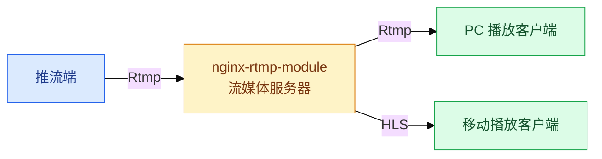
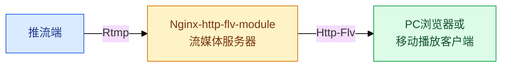
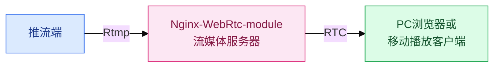
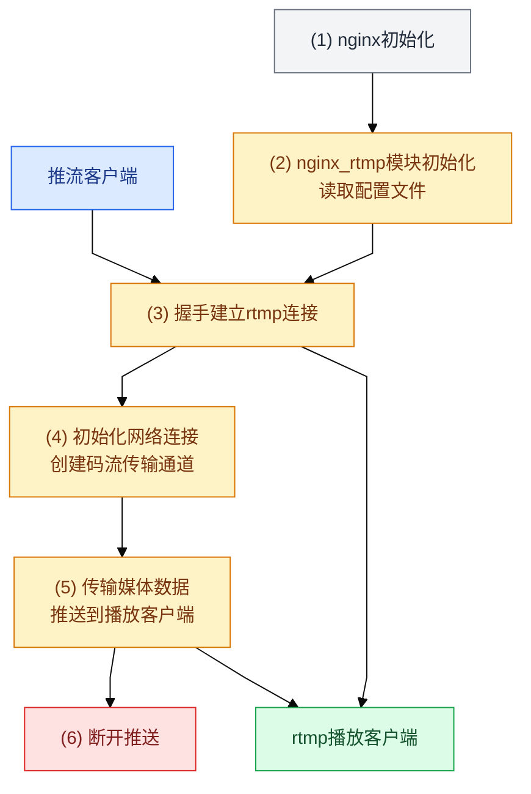
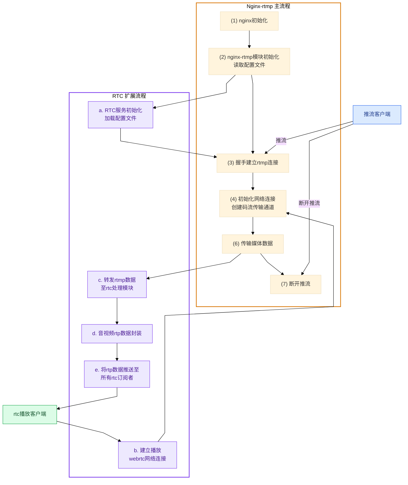
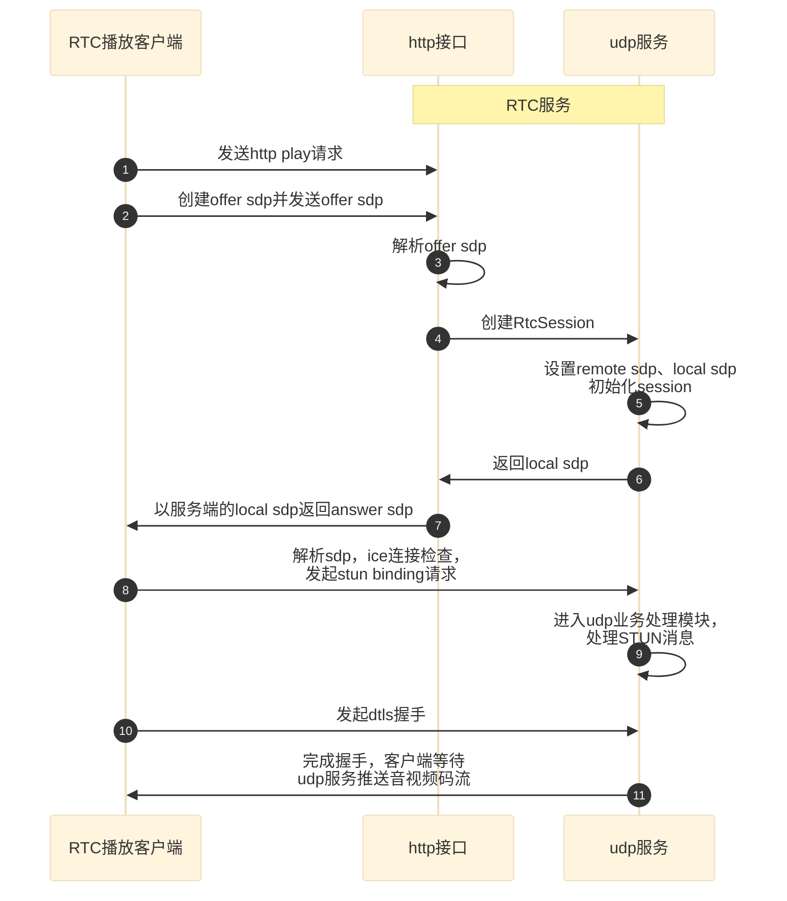
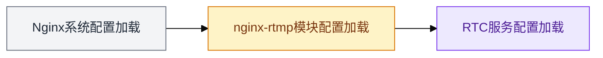
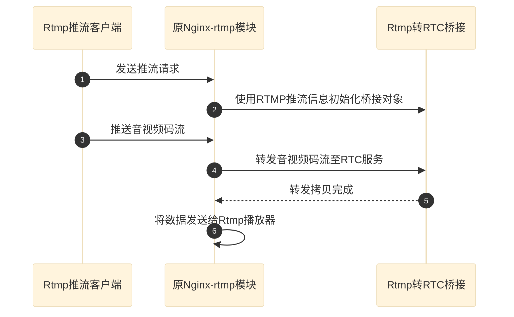

# 一种基于Nginx-rtmp的WebRTC低延迟直播方法

> 交底书模板
>
> - 公司名称：中科睿芯
> - 发明创造名称：一种基于Nginx-rtmp的webrtc低延迟直播方法
> - 技术联系人：刘德贵
> - 联系电话：13013803917
> - E-mail：liudegui@smart-core.cn

## 1 相关技术背景（背景技术），与本发明最相近似的现有实现方案（现有技术）

### 1.1 背景技术

Nginx同Apache、Tomcat一样，是一种开源服务器软件。它是一个高性能的HTTP和反向代理服务器，有着高并发、性能好和占用内存少等特点。

Nginx-rtmp模块是Nginx的一个著名的第三方开源模块，广泛应用于直播系统中。Nginx-rtmp-module包含以下特性：

- 支持Rtmp、HLS直播；
- 可将直播视频分段存储；
- 支持 H.264 视频编解码、AAC 音频编解码；
- 具有强大的缓冲功能，可确保在效率与码率间达到平衡；
- 支持多种操作系统。

Nginx-http-flv-module是在Nginx-rtmp-module基础上开发的一个直播模块：

- 兼容Nginx-rtmp-module所有功能，基于[Nginx-rtmp-module](https://github.com/arut/nginx-rtmp-module)的流媒体服务器；
- 支持Http-Flv 方式的直播；
- 支持GOP缓存，以减少首屏时间。

Rtmp协议是应用层协议，是为了在Adobe flash平台技术之间高性能传输音频、视频和数据而设计的，靠底层可靠的传输层协议（通常是TCP）来保证信息传输的可靠性的。Rtmp 是专为流媒体开发的协议，基本上所有的编码器都支持 Rtmp 输出。

Http-Flv 依靠 MIME 的特性，根据协议中的 Content-Type 来选择相应的程序去处理相应的内容，使得流媒体可以通过 HTTP 传输。相较于 Rtmp 协议，Http-Flv 能够好的穿透防火墙，它是基于 HTTP/80 传输，有效避免被防火墙拦截；能够兼容支持 Android、iOS 的移动端。

WebRtc是一个开源项目，旨在创建简单、标准化的流程通过Web提供实时通信（RTC）。它是基于UDP面向无连接的，可避免TCP做网络质量控制所需要的开销，能够做到比较低的延迟。WebRtc的特点：

- 基于浏览器，不需要安装插件，只要调用就可以实现音视频互动；
- 被纳入了HTML5标准，主流浏览器全面支持WebRtc。

### 1.2 与本发明相关的现有技术一

#### 1.2.1 现有技术一的技术方案

[Nginx-rtmp](https://github.com/arut/nginx-rtmp-module)是应用广泛的直播系统，Rtmp协议是基于TCP协议，逻辑结构本质上和普通的TCP服务器类似。



图1

如图1，Nginx-rtmp模块主要支持Rtmp和HLS直播：

1. Rtmp：Rtmp 是专为流媒体开发的协议，在局域网环境下延时一般在 1-3s 之间，且需要使用Rtmp客户端播放；
2. HLS：相对于Rtmp，HLS并不是一下请求完整的数据流，而是在服务器端将流媒体数据切割成连续的时长较短的ts小文件；播放客户端只要不停的按序播放从服务器获取到的文件，从而实现播放音视频，主要特点如下：
   - 能够兼容支持 Android、iOS 的移动端；
   - 基于 HTTP/80 传输，有效避免防火墙拦截；
   - 延迟一般在10秒以上。

#### 1.2.2 现有技术一的缺点

使用Nginx-rtmp模块的Rtmp和HLS缺点分别如下：

1. 播放Rtmp码流的劣势：
   - 它是基于 TCP 传输，非公共端口，可能会被防火墙阻拦；
   - Rtmp 为 Adobe 私有协议，很多设备无法播放，特别是在iOS端，需要使用第三方解码器才能播放；
   - 目前主流浏览器已经不支持flash播放器；
   - 延迟1-3秒对于实时性要求比较高的场景仍然达不到要求；
2. 播放HLS码流的劣势：
   - 实时性差，延迟高；
   - ts 切片会造成海量小文件，对存储和缓存都有一定的挑战；
   - 由于在本地客户端存在流媒体资源缓存，在保密性方面不够好。

### 1.3 与本发明相关的现有技术二

#### 1.3.1 现有技术二的技术方案

Nginx-http-flv-module是在Nginx-rtmp-module基础上开发的一个直播模块，增加了对Http-Flv方式的直播支持；使用类似 Rtmp流式的 HTTP 长连接，可以复用现有 HTTP 分发资源的流式协议。使得浏览器无需Flash播放插件就能播放流媒体码流。将Rtmp转为Http-Flv，浏览器拉取是HTTP类型的流，不再是Rtmp格式。



图2

如图2，相对于方法一，方法二有如下优点：

1. 基于HTTP/80传输，有效避免方案一Rtmp码流可能会被防火墙拦截的问题；
2. 避免Rtmp码流需要客户端才能播放的问题；
3. 实时性和直接播放Rtmp码流相当，相比于方案一播放HLS码流，播放Http-flv码流，延迟有较大的降低。

#### 1.3.2 现有技术二的缺点

1. 与HLS类似，由于传输特性，该方案会在本地客户端缓存流媒体资源，在保密性方面不够好；
2. 尽管方案二将Rtmp码流封装成Http-Flv，但是与播放客户端之间本质上还是传输TCP流，由于TCP协议特性限制，延迟仍然较大（1-3秒）。

## 2 本发明技术方案的详细阐述（发明内容）

### 2.1 本发明所要解决的技术问题（发明目的）

本发明寻求在Nginx-rtmp模块的基础上，实现一种低延迟且保密性较好的直播方案，以解决方案一和方案二的如下问题：

1. 基于TCP传输码流导致播放延迟较大；
2. 由于需要缓存流媒体资源在本地客户端，导致保密性不够好；
3. 需要安装第三方客户端才能播放码流。

由于WebRtc协议基于是UDP/IP协议传输的，相对于基于TCP的Rtmp推拉流方式，支持UDP的WebRtc方式延时低，延迟可控制在0.5秒内；由于WebRtc本身就是为浏览器设计的，无需安装客户端，且无需在播放端缓存资源，可以解决保密问题。

因而，本专利将基于Nginx-rtmp模块和WebRtc协议设计直播方案，如图3所示：



图3

### 2.2 本发明提供的完整技术方案（发明方案）

基于Nginx-rtmp-module实现WebRtc直播，关键部分主要是如下几点：

1. 管理HTTP请求生成的WebRtc链路，需要设计HTTP服务接口；
2. 设计RTC服务并与原Nginx-rtmp模块关联；
3. 转换接收到的Rtmp码流数据为RTC格式；
4. 将音视频数据分别发送给播放客户端。

#### 2.2.1 整体业务流程调整

原Nginx-rtmp模块工作大致流程图如下：



图4

图4解释如下：

1. Nginx启动时完成一些配置并加载第三方模块，包括Nginx-rtmp模块；
2. Nginx-Rtmp模块初始化，读取配置文件；
3. 与推流客户端建立Rtmp连接，保存链路信息；需要说明的是，Rtmp播放客户端连接流程与推流客户端建立连接过程类似；
4. 建立发送码流数据通道，服务器和播放客户端间只建立一个网络链路，且该链路多个推流端复用；
5. 传输媒体数据；该过程接受命令消息，处理音视频头部信息；最后广播音视频码流数据到所有订阅者（Rtmp播放客户端）；
6. 当推送客户端关闭推送时，整个推送流程结束。

基于Nginx-rtmp原有方案上扩展的流程如图5：



图5

解释如下：

1. 在（2）Nginx-rtmp初始化完成后，紧接着做RTC服务模块初始化，加载配置文件；
2. 创建HTTP服务接口，接受播放客户端请求，建立播放webrtc网络连接；
3. 在（6）传输Rtmp音视频数据时，转发rtmp数据至rtc处理模块；
4. 对音视频数据分别做封装，如音频AAC转Opus，封装视频码流为Rtp格式；
5. 将RTP数据推送至所有RTP播放器。

#### 2.2.2 与RTC播放客户端建立连接设计



图6

如图6，整个连接过程简单描述为：

1. 播放客户端通过 HTTP 发送连接请求，携带播放URL和offer SDP；RTC服务收到播放的接入请求后，记录offer SDP和URL，返回answer sdp；
2. 播放端解析sdp，ice连接检查，发起stun binding请求，UDP业务收到STUN请求后，处理STUN消息，返回成功；
3. 播放端发送DTLS握手，握手成功后整个码流传输链路完成；
4. RTC服务将播放端连接session加入到RTC订阅者列表。

#### 2.2.3 RTC服务设计

RTC服务设计主要提供HTTP接口和UDP服务，并将这两个模块注册原Nginx-rtmp模块。具体如下：

**1、添加RTC服务配置项**

基于Nginx系统添加RTC服务的主要配置项如下：

```nginx
stream {
    server {
        listen 8000 udp;
        stun_timeout 1s;
        bframe true;
        aac true;
    }
}
```

- listen：侦听的RTC端口，注意是UDP协议。
- 根据需要配置如下项：
  - stun_timeout：会话超时时间，单位秒
  - bframe：是否保留B帧，Rtmp流中一般会有B帧，而RTC没有，默认丢弃B帧。
  - aac：如何处理AAC音频包，默认转码成Opus，可以选择丢弃（无声音）。

整个系统配置加载顺序如图7：



图7

**2、创建HTTP播放接口并注册进Nginx系统**

按照Nginx规范创建HTTP业务处理模块，同时创建ngx_command_t、ngx_http_module_t和ngx_module_t对象，按照Nginx自定义配置（config）规范，将HTTP服务接口注册进Nginx系统；

**3、创建UDP服务并注册进Nginx系统**

1. WebRtc中音视频数据是通过UDP传输，所以须创建一个UDP服务进行发送音视频码流；该UDP提供如下功能：
   - RTC服务监听端口，等待播放客户端连接；
   - 在与播放器完成连接后，为每个播放器创建播放协程和数据缓存队列，协程中启动一个while循环，从队列中读取封装好的音视频数据，发送给所有的播放器。
2. 封装RTP数据。需要封装来自Nginx-rtmp模块的音频和视频码流数据，具体：
   - 音频数据：按照标准规范，将AAC音频转码成符合RTC的OPUS格式；注意，如果配置文件选择丢弃音频，则无需转换；
   - 视频数据：按照标准规范，将NALU数据打包成RTP或FUA包；注意，如果配置文件中设置跳过B帧的话，需将B帧剔除。
3. 注册进Nginx。基于Nginx规范创建UDP业务处理模块，同时创建ngx_command_t、ngx_stream_module_t和ngx_module_t对象，按照Nginx自定义配置（config）规范，并将RTC服务模块注册进Nginx系统。

**4、RTC服务关联Nginx-rtmp模块**

创建Rtmp转RTC桥接模块，该模块主要作用是：在Nginx-rtmp模块传输音视频码流时，转发Rtmp这些码流数据到RTC服务模块；



图8

具体如图8，桥接模块需要：

1. 在推流客户端与原Nginx-rtmp服务建立后，使用Rtmp推流信息初始化桥接对象；
2. 修改Nginx-rtmp原发送音视频码流逻辑，在推流给Rtmp播放器之前，先将Rtmp码流数据发送给RTC服务模块处理。

## 3 本发明的技术关键点和欲保护点是什么

本专利基于Nginx-rtmp系统设计基于WebRtc协议的直播方案，解决因Rtmp底层TCP协议限制导致延迟较高的问题；使用普通浏览器即可实现播放，兼容移动端；且不会缓存流媒体资源，保密性较好。

具体：

1. 设计与RTC客户端建立连接并推送码流机制；
2. 设计RTC服务模块，提供HTTP接口和UDP服务；
3. 基于Nginx系统，设计加载RTC服务配置项和RTC初始化逻辑；
4. 基于Nginx-Rtmp模块框架，设计Rtmp码流转给RTC服务的方案。
