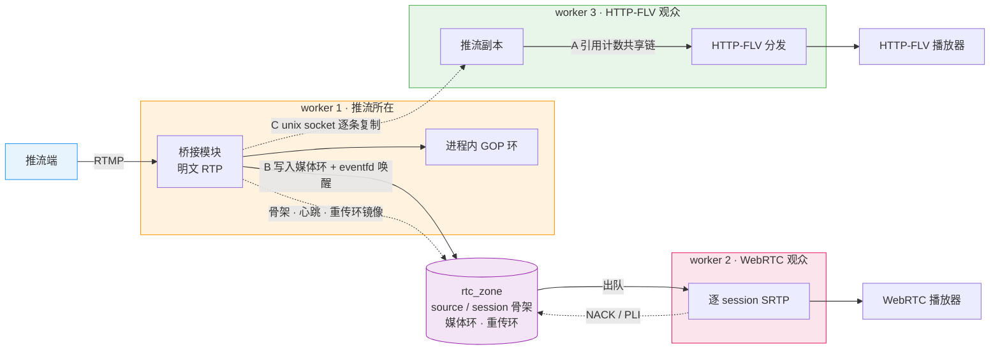
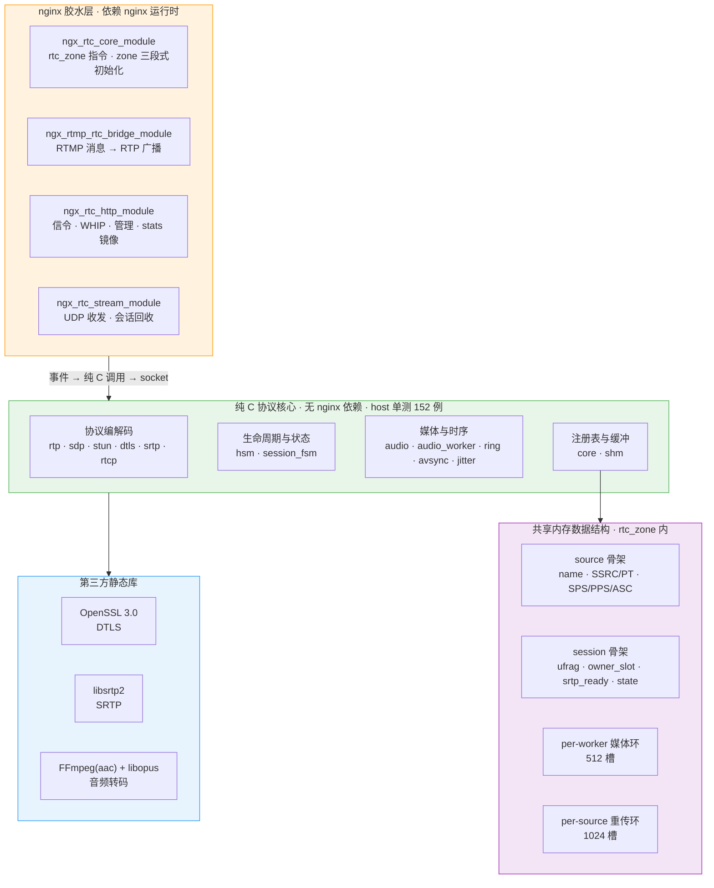

# 多 worker 共享内存与零拷贝技术说明

> 范围：[nginx-rtc-module](https://github.com/DeguiLiu/nginx-rtc-module)（自研模块，MIT 许可）的跨进程共享内存机制，以及全链路的零拷贝边界。文中引用的代码行号均指该仓库的当前工作树。
> 关联文档：`multi-worker-shm-design.md`（slab 布局细节）、`零拷贝与共享内存.md`（叙述版）、`架构设计.md`、`详细设计.md`。

## 1 结论

**其一，共享内存的存在理由是多进程模型，不是性能。** nginx 的 worker 是独立进程，RTMP 推流是长连接（固定挂在某个 worker）、WebRTC 信令是短 HTTP 请求（可能落在另一个）、UDP 媒体由内核按四元组哈希分配（与信令所在 worker 无关）。三者的落点互不相关，因此必须有一块公共状态区。共享内存解决的是"能不能做"，减少拷贝只是它的附带效果。

**其二，共享内存只承载值类型。** 流名、SSRC、PT、序列号、ufrag、状态等骨架进 slab；DTLS 会话、SRTP 上下文、连接对象、转码器句柄一律留在进程内。判断标准是能否安全复制，而非数据大小。

**其三，零拷贝的边界由共享范围决定。** 同进程订阅者走引用计数共享链（真零拷贝）；跨进程只能写入对方的媒体环（一次拷贝）；跨 worker 的推流复制另走 unix socket。三种策略并存，按"数据要送达谁"选择。

**其四，无法消除的拷贝只有三处**：RTMP 分片链连续化、逐订阅者的 SRTP 加密、跨进程传递。

上述四个模块、协议核心与共享内存数据结构全部实现在 [DeguiLiu/nginx-rtc-module](https://github.com/DeguiLiu/nginx-rtc-module)；HTTP-FLV 分发与 RTMP 接入来自第三方 nginx-http-flv-module。

## 2 部署与数据流拓扑

图中的 worker 1 / 2 / 3 是按**角色**划分的示意，实际进程数由 `worker_processes` 决定（本部署为 2，此时部分角色会落在同一进程内）。

A / B / C 对应第 4 节的三种共享策略。注意 A 与 C 的关系：策略 A 要求数据链与消费者处于同一进程，这正是策略 C 存在的理由——先把推流副本送到别的 worker，那边的 HTTP-FLV 观众才能走 A 路径。策略 B 是唯一一条把原始媒体送过进程边界的路径。虚线为跨进程路径。端口固定为：RTMP 1935 接收推流，HTTP 18082 承载信令与 HTTP-FLV，UDP 8000 承载媒体。

## 3 模块与单元层次

分层的实际约束是**依赖方向单向**：胶水层只依赖核心层，核心层不引用 nginx 头文件、无全局可变状态，输入输出全部经参数传入。这条约束是核心层能在 host 上编译并运行单测的前提。四层全部位于 [DeguiLiu/nginx-rtc-module](https://github.com/DeguiLiu/nginx-rtc-module)（第四层的第三方静态库除外）。

## 4 共享内存承载内容与零拷贝边界

### 4.1 存放内容

下表右列每一项都是无法跨进程复制的句柄；左列骨架的定义见 [DeguiLiu/nginx-rtc-module](https://github.com/DeguiLiu/nginx-rtc-module) 的 `src/ngx_rtc_shm.h`。

| 存放于 `rtc_zone` | 保留在各自进程 |
| --- | --- |
| source 骨架：流名、SSRC/PT、序列号、时间戳、SPS/PPS/ASC、订阅关系 | `SSL*` / `BIO*`（DTLS 会话） |
| session 骨架：ufrag/pwd、`owner_slot`、`srtp_ready`、状态、过期时间 | `srtp_t`（libsrtp2 不透明句柄） |
| per-worker 媒体环（`ngx_rtc_shm.h:233-241`） | `ngx_connection_t*`、对端地址 |
| per-source 跨进程重传环（`ngx_rtc_shm.h:77-83`） | 音频转码器（FFmpeg/libopus 句柄与线程） |
| 心跳与计数：`publisher_seen_ms`、音视频包数与字节数 | 每 session 的 cipher 缓冲、进程内 GOP 环 |

### 4.2 三种共享策略

| 策略 | 适用范围 | 实现 | 代价 |
| --- | --- | --- | --- |
| A 引用计数共享链 | HTTP-FLV 同进程多订阅者 | 一条数据链被 N 个订阅者共用，仅加引用计数 | 真零拷贝，仅限单一进程 |
| B 共享内存环 + eventfd | 自研 RTC 跨进程媒体分发 | 明文 RTP 一次写入目标 worker 的环并唤醒；对方出队后逐订阅者加密 | 跨进程一次拷贝；环满丢帧 |
| C unix socket 逐条复制 | `rtmp_auto_push on` | 为每个其它 worker 建连并重新推送 | 拷贝次数与 worker 数成正比 |

### 4.3 逐包拷贝路径

跨进程订阅者经过七次数据移动：分片链连续化 → RTP 封装 → 写入 GOP 环 → 写入目标 worker 的 shm 环 → 出队到栈 → 拷入 `cipher` → SRTP 原地加密 → `c->send()`。其中第 7 步的密文与明文同处一块内存，不产生额外搬运（`ngx_rtc_srtp.c:75-86`）；同进程订阅者不经过 shm 环的两步（`ngx_rtmp_rtc_bridge_module.c:1190` 注释 `No per-session copy`）。

**无法消除的三处**：分片链必须连续化才能解析 NALU；SRTP 原地加密会破坏明文模板，而该模板需被 N 个订阅者共用；跨进程传递必须复制。

## 5 收益、代价与取舍顺序

### 5.1 收益

- 信令与媒体可分属不同 worker：STUN 仍能查到会话，DTLS 仍能完成握手。
- 无需轮询：eventfd 唤醒消费方。
- 快速起播不依赖推流所在 worker：重传环下沉后任意 worker 可应答 NACK/PLI 并回放最近 GOP。
- 推流进程异常退出后可自动恢复：心跳冻结超过宽限期即被判死并回收。
- 热路径无内存分配：各环均为预分配定长槽。

### 5.2 代价

- **两份注册表的一致性维护**：骨架与进程内结构按流名/ufrag 关联，需遵守 `owner_slot` 校验、指针不可混用、结构变更必须递增布局版本号等约束。
- **进程边界拷贝无法消除**：可压缩至一次并直接落至最终位置，环满时丢帧而非阻塞。
- **重传环仍受 slab 全局锁约束**：代码埋入 `retx_*` 耗时统计并经 `/rtc/v1/stats` 暴露（`ngx_rtc_shm.h:145-149`）。
- **共享内存与阻塞式发送冲突**：GOP 回放需在锁内将整段数据拷至锁外堆缓冲（约 1.5 MB）后再发送（`ngx_rtc_shm.c:1272-1319`）。
- **容量须按峰值预留**：每 worker 约 1 MB 媒体环，每个跨进程 source 约 1.5 MB 重传环。
- **Lua 读取共享字典必然拷贝**：`/rtc/v1/stats` 的整段 JSON 经 C 渲染入 shm、Lua 读出、`cjson.decode`，共三次数据移动；计数器走 `incr` 数值路径可规避。

### 5.3 取舍顺序

1. 能否不共享？同进程订阅者走引用计数共享链。
2. 必须共享时共享什么？只共享可复制的元数据与定长环。
3. 跨进程拷贝无法消除时，使其只发生一次并直接落至最终位置。
4. 可原地完成的就地完成：SRTP 原地加密、PT 原地改写、TWCC 扩展一并写入。
5. 确需拷贝才能避免持锁的场景接受该成本，但必须可测量。

零拷贝在这套系统中不是通用目标，而是由数据分发范围反向推导出的设计准则。

本文涉及的全部实现、host 单测与设计文档见 [DeguiLiu/nginx-rtc-module](https://github.com/DeguiLiu/nginx-rtc-module)。
