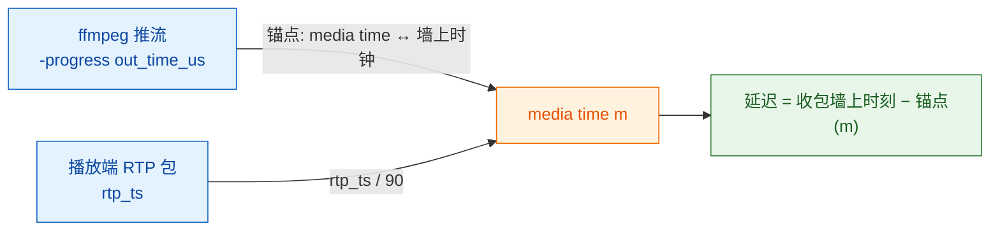

# WebRTC 稳态延迟测量：方法与数据

> 范围：RTMP → WebRTC 链路的**稳态端到端延迟**，定义为「源端编码器把某一帧交给 muxer 的墙上时刻」到「播放端收到该帧最后一个 RTP 包的墙上时刻」。
>
> 与 `测试文档.md` 里的 `first_packet_ms` / `first_keyframe_ms` 是**不同口径**：那两个包含 ICE/DTLS 握手与等首个 IDR，属于启动延迟，实测 476~560 ms；本文量的是直播稳定播放期间每一帧的新鲜度。
>
> 环境：单机回环，1920x1080@30，werift 无头播放端。除特别注明外，测量窗口 25 s，有效帧 683~684，每路独立重复 2 次以上。

## 结论

1. **直推 1920x1080@30 的稳态延迟中位从 173 ms 降到 45 ms**，改动是一行 `run.sh`。
2. **延迟全部在推流端 ffmpeg 进程内部**，服务端 RTC 段（bridge → SRTP → 播放端）贡献约 0，有独立于 ffmpeg 的口径佐证。
3. **根因**：`-re` 是逐输入的选项，原推流命令只加在第一个 lavfi 输入上，第二个 `sine` 音频输入未被节流。
4. **本方法可用于归因，不可用于给出面向用户的绝对延迟指标**，理由见 §6。

## 1 测量原理

单机上所有进程共用同一个墙上时钟，因此只要拿到「源端 media time ↔ 墙上时钟」的锚点，就能把播放端收到的 RTP 时间戳折算回源端出帧时刻。



两个映射的成立依据：

| 环节 | 依据 | 验证 |
| --- | --- | --- |
| RTP 时间戳 ↔ RTMP 毫秒 | `ngx_rtc_h264_timestamp_from_ms()`，即 `ms × 90`，无重基 | 模块自身 `avsync` 日志的 `vskew = video_ts/90 − last_video_rtmp_ms` 恒为 `0ms` |
| media time ↔ 墙上时钟 | `ffmpeg -progress` 的 `out_time_us` 与读取该行的墙上时刻配对，二分插值 | 用输出文件字节增长对拍，见 §5 |

同一台机器上不存在时钟偏移问题，因此不涉及 NTP 同步或单/双向延迟假设。

## 2 工具

新增 `client/latency_probe.mjs`。仓库此前只有启动口径的指标，没有稳态延迟工具。

行为要点：

- 记录每个视频 RTP 包的 `(Date.now(), rtp.header.timestamp)`。
- 按 RTP 时间戳聚合成帧；取**该帧最后一个包**的到达时刻作为「可解码」时刻，另留首包时刻做对照。
- **排除建流期的 GOP 回放**：从该 track 首包起 `--warmup`（默认 2000 ms）内的帧不计入，单独上报数量。与 `测试文档.md` 的丢包窗口口径同源（见 §3.2）。
- 可选 `--raw` 导出逐帧 `arrival / media / anchor_wall / lat` 四列。
- 订阅 `RTCPeerConnection.getReceivers()` 的 `onRtcp`，解析 RTCP SR（PT=200），用作**不依赖 ffmpeg 的独立锚点**。

调用示例：

```bash
node client/latency_probe.mjs --anchor /tmp/rtc_anchor.txt --duration 25000 [--raw] [--json]
```

锚点文件由带时间戳的读取器生成（`progress` 逐行进 `EPOCHREALTIME`）：

```bash
ffmpeg ... -progress pipe:1 -f flv "rtmp://127.0.0.1:1935/live/livestream?t=..&sign=.." 2>/dev/null \
  | while IFS= read -r line; do v=${EPOCHREALTIME/./}; printf '%s %s\n' "${v:0:13}" "$line"; done > /tmp/rtc_anchor.txt
```

## 3 数据

### 3.1 主结果

推流端 1920x1080@30，同一台机器，同一播放端。延迟单位 ms。

| 配置 | p50 | p90 | p99 | min | max |
| --- | --- | --- | --- | --- | --- |
| 音频输入未节流（修复前） | **173.4** | 216.8 | 238.6 | 84.1 | 264.3 |
| 音频输入加 `-re`（修复后） | **44.7 / 45.0** | 57.2 | 68.2 | 22.0 | 92.5~102.9 |
| 去掉音频输入（对照） | **18.5** | 30.5 | 34.5 | 0.5 | 60.5 |
| 生产 640x360 推流，修复后 | **47.7** | 59.5 | 68.0 | 28.3 | 69.5 |

「修复后」一行是两个独立运行的 p50（44.7 与 45.0，各 683/684 帧）。

### 3.2 链路分段（RTCP SR，独立于 ffmpeg 锚点）

SR 的 NTP 字段由服务端用自身墙上时钟在发送时刻填充，`rtp_ts` 为服务端当前最新视频时间戳，因此 SR 自身构成一个服务端侧锚点。

| 量 | p50 | 说明 |
| --- | --- | --- |
| SR 单向延迟（到达 − SR 内 NTP） | −0.3 ~ +0.3 ms | 服务端与播放端时钟一致，且网络段≈0 |
| `server → client` 段 | −8.4 ms | 负值来自 SR 间隔 2 s 的量化误差，实质量级为 0 |
| `source → server` 段 | 183 ms | 延迟集中在此段的前半（见 §4） |

### 3.3 锚点可信性对拍

用输出文件的字节增长（Node `statSync` 2 ms 轮询）对拍 `-progress` 声称的 `total_size`，得到「progress 声称某字节数存在的墙上时刻」与「该字节数真正出现在文件里的墙上时刻」之差。

| 配置 | lead p50 | lead min/max |
| --- | --- | --- |
| 无 `-flush_packets`（默认） | 276 ms | 0 / 599 ms |
| 加 `-flush_packets 1` | 46 ms | 0 / 85 ms |
| lavfi 输入，加 `-flush_packets 1` | 25 ms | 0 / 51 ms |

未刷包时的大 lead 是 avio 缓冲，不是报告失真。**残余 25~46 ms 是 progress 固有的报告滞后**，它使本方法的测得值**偏低**同样的量级——即上表的 45 ms 对应真值约 70 ms 量级。

## 4 假设排除

每一项都做了对照实验或代码路径核查，不是推断。

| 假设 | 手段 | 结果 |
| --- | --- | --- |
| muxer 交织队列持包 | `-max_interleave_delta 20000`（默认 10 s） | 174 ms，无变化 |
| 同上，关闭提前刷新 | `-max_interleave_delta 0` | 174 ms，无变化 |
| ffmpeg 输出缓冲 | `-flush_packets 1` | 174 ms，无变化 |
| 服务端跨 worker 批处理 | 代码路径：eventfd 事件驱动，非定时轮询 | 排除 |
| 服务端视频发送排队 | 代码路径：RTMP→RTC 同步 emit；pacer 只丢包不延迟 | 排除 |
| 服务端 jitter buffer | 代码路径：仅 WHIP 上行使用 | 排除 |
| 转码档编码参数 | 把梯子档参数（`-b:v/-minrate/-maxrate/-bufsize/-x264-params`）套到平滑 lavfi 输入 | 45 ms，与基线相同 |
| 转码输入未节流 | 转码输入加 `-re` | 170 ms，无变化 |
| `fps=30` 滤镜 | 去掉该滤镜 | 159 ms，仅占约 15 ms |

`-max_interleave_delta` 与 `-flush_packets` 两项阴性结果说明：被推迟的是**编码器之前**的读帧环节，不是 muxer 持包。

### 4.1 未定论

- 延迟集中在该分段的「源端 ffmpeg 内部」，但 **ffmpeg 内部为何因未节流的第二输入而推迟视频，未验证到机理**。最初「音频抢跑拖住视频」的说法只是合理猜测，未被证据支持，不应作为结论引用。
- **梯子 1080p 档（`livestream_1080p`）无法给出可信绝对值。** 实测约 174 ms，但该档转码 ffmpeg 的 `-progress` 呈阶梯状（media 每 50 ms 跳约 150 ms，再平 150~200 ms），而直推的锚点是平滑推进；阶梯会让插值把出帧时刻估偏、从而虚高延迟。
- 转码环节的占比无法可靠测量：nginx 对每个订阅者重基时间戳，使「同一 media time 对应同一内容」的前提失效，基于媒体时间的跨段对比会得到恒定偏移（实测 4053 ms）而非延迟。

## 5 已修复问题

`run.sh` 的推流命令补上第二个输入的 `-re`：

```diff
 TZ=Asia/Shanghai ffmpeg -re -f lavfi -i testsrc2=size=640x360:rate=30 \
-    -f lavfi -i sine=frequency=1000:sample_rate=48000 \
+    -re -f lavfi -i sine=frequency=1000:sample_rate=48000 \
```

修复后 `./run.sh start` + `./run.sh verify` 全流程 `[PASS]`。

## 6 方法局限

**可用于归因，不可用于验收。** 原因：

- 回环链路没有 RTT、没有丢包与拥塞，**无法体现任何网络延迟**。
- 播放端是 werift 无头库，**没有 jitter buffer**；真实浏览器会额外叠加 100~300 ms 的 playout 缓冲。
- 测得值本身偏低 25~46 ms（§3.3）。

因此 §3.1 的 45 ms **不是用户感知延迟**，而是一个便于归因、可复现、可做同条件对照的下界。

值得一提的是，被修掉的那 ~128 ms 位于 ffmpeg 进程内部，与网络无关，在真实链路上会照常存在并叠加在网络延迟之上，所以该修复的收益可以迁移到真机。

要得到有说服力的绝对数字，需要换成**内容时钟口径**：把墙上时钟烧进画面，用真实接收端（浏览器）解码后读回画面上的时间戳再比对，并且跨真实网络运行。

## 7 附：本次会话中发现的 C 侧缺陷（与上述延迟无关）

`ngx_rtmp_rtc_send_sr_sdes()`（`ngx_rtmp_rtc_bridge_module.c:356`）发送 SR 时读取的是**本 worker 的** `ngx_rtc_source_t`：

```c
sr.ssrc         = src->video_ssrc;
sr.rtp_ts       = src->video_ts;
sr.packet_count = src->video_pkts;
sr.octet_count  = src->video_octets;
```

而 shm → 本地 source 的回填点（`ngx_rtmp_rtc_bridge_module.c:661`、`ngx_rtc_stream_module.c:478`、`ngx_rtc_http_module.c:859`、`ngx_rtc_http_module.c:1557`）**只复制 `video_ssrc / audio_ssrc / video_pt / audio_pt`，从不复制 `video_ts / video_pkts / video_octets`**。这三个字段只在推流端 worker 的 `ngx_rtmp_rtc_bridge_module.c:910`（`src->video_ts = ts`）与 `shm_stats()` 的单向写入中被维护。

后果：**播放端与推流端落在不同 worker 时，SR 带出 `rtp_ts = 0`、`packet_count = 0`、`octet_count = 0`**。`worker_processes 2` 配 `reuseport`，UDP 四元组哈希决定落点，因此约一半观看者会拿到坏 SR。

实测：同一份代码同一个流，多次运行中既有 12/12 个 SR 全为 `rtpTs=0` 的情况，也有全字段正常的情况（`ssrc=0x5d5951dc pkts=8037 rtpTs=868860`），变化因素只有 worker 落点。

影响：客户端用 SR 建立 RTP↔NTP 映射、估算发送码率与做 A/V 同步；`rtp_ts=0` 会让基于它的时间映射整体失真。注意 `/rtc/v1/stats` 读的是 `shm_src->video_pkts`（正确的来源），所以该接口不受影响，SR 是这条路径上的例外。
