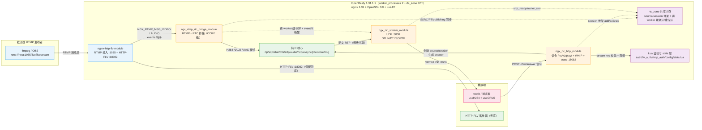

# RTMP 转 WebRTC 低延迟直播方案：架构设计

> 文档范围：自研 `nginx-rtc-module`（挂在 OpenResty 1.31.1.1 之上的 RTMP→WebRTC 桥接）的整体架构、模块分层、进程/端口模型与设计原则。
> 关联代码：`/home/dgliu/workspace/webrtc/nginx-rtc-module/`；配套文档：`详细设计.md`、`编译文档.md`、`测试文档.md`、`docs/multi-worker-shm-design.md`。

**结论**：方案的核心是**在 Nginx 框架内自研 RTC 模块**，而非依赖 SRS 等外部 RTC 服务。在 OpenResty 1.31.1.1（bundle nginx-1.31.1）上，参考 SRS 6.0 的实现思路，用纯 C11 自研 RTC 模块静态编译进 nginx 进程，通过三个 nginx 胶水模块（RTMP 桥接 / HTTP 信令 / UDP 媒体）加一组纯 C11 核心单元（rtp/sdp/stun/dtls/srtp/audio/rtcp/avsync/jitter/hsm/session_fsm/core/ring/shm）与 `rtc_zone` 共享内存，实现「RTMP 推流 → H264 NALU 拆解与 AAC→Opus 转码 → RTP 封装 → SRTP → UDP 8000 → WebRTC 播放器」的低延迟链路，同时保留 HTTP-FLV 兜底。RTCP 反馈（2s SR + NACK/PLI/BYE + TWCC）、source 级 GOP 环形缓存、session HSM 状态机、WHIP 上行与多 worker 共享内存均集成在 bridge/stream/core/http；RTMP 推流、HTTP-FLV 取流与 `/rtc/v1/play/` 三路 stream key 鉴权已闭合。端到端实测两轮结果见第 7 节（两轮数据不完全一致，均予保留）。

## 1 结论与定位

### 1.1 一句话定位

在 **nginx 框架内**（而非独立 RTC 服务）完成 RTMP 直播源到 WebRTC 播放的低延迟转换，是相对 SRS 等独立服务方案的核心差异点。模块用纯 C11 实现、静态编译进 nginx 进程，协议核心可脱离 nginx 在 host 上单测。

### 1.2 能力边界

| 能力 | 依据 |
| --- | --- |
| RTMP 接入 + HTTP-FLV 兜底 | nginx-http-flv-module，RTMP :1935，HTTP-FLV :18082（HTTP 200） |
| H264 → RTP（single/STAP-A/FU-A + B 帧过滤） | `ngx_rtc_rtp.c`；实测见第 7 节 |
| AAC → Opus 转码并封装 RTP（线程隔离） | `ngx_rtc_audio.c` + `ngx_rtc_audio_worker.c` + `ngx_rtc_ring.c` |
| STUN/DTLS/SRTP 媒体建链 | 局域网 candidate `172.16.48.122:8000`（由 `rtc_candidate_ip`/`rtc_candidate_port` 配置） |
| 信令鉴权（stream key + 限流） | Lua `auth.lua`（`resty.limit.req` 官方限流），`t`/`sign` 校验通过返回 `code=0` |
| 推流/播放三路鉴权 | RTMP `on_publish` + HTTP-FLV `flv_auth.lua` + `/rtc/v1/play/` 同源 stream key |
| WHIP 上行 | `rtc_whip` 端点；`ngx_rtc_jitter` 上行重排缓冲 |
| RTCP（SR/RR/SDES/NACK/PLI/BYE + TWCC） | bridge 2s 周期 SR+SDES；stream 解码 SRTCP 并驱动 NACK/PLI/BYE；TWCC 走 GCC-lite AIMD |
| session HSM 状态机 | `ngx_rtc_session_fsm` 纯状态跟踪；状态经 `/rtc/v1/stats` 暴露（见 6.2） |
| GOP 环形缓存 / NACK 重传 / 订阅即发 | source 级 `source->gop`（明文 RTP，默认 2048 槽）+ 跨 worker shm 重传环 |
| 多 worker 共享内存 | `rtc_zone` + `ngx_rtc_core_module` + shm 骨架/媒体环，部署 `worker_processes 2`；见 `docs/multi-worker-shm-design.md` |
| 统计端点 | `/rtc/v1/stats`（`conf/stats.lua` 读 `rtc_stats` shdict，C 模块每秒镜像，无内部子请求） |
| 纯 C 协议核心 host 单测 | `nginx-rtc-module/test/` 145 用例，Linux 下按真实 nginx 头文件构建 |

### 1.3 端到端延迟预算

首包延迟的构成未做逐段拆分；链路为全 UDP 出网、IDR 前以 STAP-A 携带 SPS/PPS。GOP 环形缓存使新订阅者在 DTLS/SRTP 就绪并订阅时先回放最近一个 GOP（自最新 IDR 的 STAP-A 起），无需等待下一个 IDR；真实出图延迟以播放器首帧 IDR 到达口径 `first_keyframe_ms` 衡量（见测试文档）。

## 2 总体架构与数据流

### 2.1 数据面

- **媒体面（低延迟，UDP 出网）**：推流端 RTMP :1935 → nginx-http-flv-module 事件钩子 → 桥接模块拆 FLV tag → H264 NALU 逐个做 B 帧过滤并 RTP 封装、AAC 帧经 FFmpeg 解码 + libopus 转码后封装为 Opus RTP → source 级明文 RTP 广播（同 worker 直发、跨 worker 经 shm 媒体环 + eventfd 唤醒）→ 每订阅者独立 SRTP 加密 → UDP :8000。
- **信令面（HTTP 控制）**：播放器 POST `/rtc/v1/play/`（JSON：`sdp` + `streamurl` + `t` + `sign`）→ Lua `access_by_lua_file` 完成签名校验与限流 → HTTP 模块解析 offer、创建 source/session、分配 SSRC/PT、生成含 candidate/fingerprint 的 answer SDP 返回 `{code:0,sdp:...}` → 播放器据 answer 发起 STUN/DTLS。WHIP 上行走 `rtc_whip` 端点，媒体经上行重排缓冲后广播。
- **元数据同步面（多 worker）**：http/stream/bridge 三处 glue 与 `rtc_zone` 的 shm 骨架双向同步 SSRC/PT/ufrag/pwd/srtp_ready/owner_slot/publishing，媒体热路径不跨 shm（同 worker 直发，跨 worker 才进媒体环）。

### 2.2 与 HTTP-FLV 的关系

HTTP-FLV 分发与 WebRTC 信令/媒体并行存在：RTMP 的 video/audio 消息同时被 live 模块（GOP cache + FLV 分发）和桥接模块消费。桥接模块通过 `postconfiguration` 把处理器注册进 `cmcf->events[]`，不改动 nginx-http-flv-module 源码（`gop_cache on` 仅用于 HTTP-FLV 首帧加速，RTC 侧自建缓存，二者互不依赖）。多 worker 下 `rtmp_auto_push on` 经 unix socket 把推流复制到各 worker，使 HTTP-FLV 播放不依赖与推流同 worker。

## 3 模块分层与职责

代码分两层，物理上都在 `nginx-rtc-module/src/` 下，由 addon `config` 脚本决定编译归属。

| 层 | 单元 | 职责 | 参考 SRS 6.0 实现 |
| --- | --- | --- | --- |
| 纯 C 核心（可 host 单测、无 nginx 依赖） | `ngx_rtc_rtp` | H264 NALU→RTP single/STAP-A/FU-A、B 帧过滤、Opus 封装 | `srs_app_rtc_source.cpp` / `srs_kernel_rtc_rtcp` |
| | `ngx_rtc_sdp` | SDP offer 解析、answer 生成（H264+Opus 最小集，含 transport-cc extmap） | `srs_app_rtc_sdp.cpp` |
| | `ngx_rtc_stun` | STUN BindingRequest 解码 / BindingResponse 编码 | `srs_protocol_rtc_stun.cpp` |
| | `ngx_rtc_dtls` | DTLS 服务端握手、自签名证书、SRTP 密钥导出 | `srs_app_rtc_dtls.cpp` |
| | `ngx_rtc_srtp` | libsrtp2 SRTP protect/unprotect 封装 | SRS `SrsSRTP` |
| | `ngx_rtc_audio` + `ngx_rtc_audio_worker` + `ngx_rtc_ring` | AAC→Opus 转码（FFmpeg aac + libswresample + libopus）、每路 pthread 隔离、有界环 | `srs_app_rtc_codec.cpp` |
| | `ngx_rtc_rtcp` | RTCP SR/RR/SDES/NACK/PLI/BYE + TWCC 反馈解析 | `srs_kernel_rtc_rtcp.cpp` |
| | `ngx_rtc_avsync` | RTP 时间戳→NTP 墙钟映射（RTCP SR 锚点、精确有理斜率） | `SrsRtcRecvTrack` |
| | `ngx_rtc_jitter` | WHIP 上行视频重排缓冲（按 seq 有序出队、gap 超时跳过） | — |
| | `ngx_rtc_hsm` + `ngx_rtc_session_fsm` | 层次状态机引擎 + session 生命周期状态机（纯状态跟踪） | SRS 连接生命周期 |
| | `ngx_rtc_core` | 进程内 source/session 注册表（source 为 `ngx_rbtree`，session/订阅者为 `ngx_queue`）、GOP 环、发送/重传/背压 | `SrsRtcSource` / `SrsRtcQueue` |
| | `ngx_rtc_shm` | slab 注册表：shm source/session 骨架、跨 worker 媒体环与重传环、reaper | — |
| nginx 胶水层 | `ngx_rtc_core_module` | `rtc_zone` 指令、核心配置与 nginx module 身份（`NGX_CORE_MODULE`） | limit_req zone 模板 |
| | `ngx_rtmp_rtc_bridge_module` | RTMP FLV tag→RTP 广播，CORE 类型模块 | SRS FrameToRtcBridge |
| | `ngx_rtc_http_module` | `/rtc/v1/play/`、`rtc_whip`、`rtc_kick`/`rtc_disconnect`、stats 镜像，指令 `rtc_play`/`rtc_candidate_ip`/`rtc_candidate_port` | `srs_app_rtc_api.cpp` |
| | `ngx_rtc_stream_module` | UDP :8000 STUN/DTLS/SRTP 媒体收发，STREAM 类型模块 | SRS RtcUdpNetwork |

> `ngx_rtc_core_module` 已从 `ngx_rtc_shm.c` 拆出：`rtc_zone` 指令、模块骨架与指令表独立成文件，使 `ngx_rtc_shm.c` 只保留可被 host 单测覆盖的纯数据结构代码。

### 3.1 分层原则

- 纯 C 协议核心（`rtp/sdp/stun/dtls/srtp/audio/rtcp/avsync/jitter/hsm/session_fsm/core/ring/shm`）**不引用 nginx 头文件、无全局可变状态**，输入输出全部经参数传入（`emit`/`rtcp_decode_cb` 回调、调用者持有的 scratch buffer），因此可脱离 nginx 在 host 上单测（`nginx-rtc-module/test/`，145 用例）。`core` 注册表在 nginx 编译下使用 `ngx_rbtree`/`ngx_queue`；`shm` 在 host 单测下由 slab/shmtx stub 提供。
- nginx 胶水层只做「事件 → 纯 C 调用 → socket 发送」的翻译，业务逻辑（RTP 拆包、SDP 生成、加解密、RTCP 反馈动作）一律下沉到核心层或由胶水模块按核心层回调执行。
- 依赖方向单向：桥接/HTTP/stream 三个胶水模块都只依赖核心层；核心层内部 `core`（注册表）持有 `dtls`/`srtp`/`fsm` 结构体，其余单元互不依赖。

## 4 进程、端口与共享内存模型

### 4.1 端口一览

| 端口 | 协议 | 方向 | 模块 | 用途 |
| --- | --- | --- | --- | --- |
| 1935 | TCP | RTMP 推流 | nginx-http-flv-module | `application live` 接入发布者 |
| 18082 | TCP/HTTP | 播放器→服务端 | ngx_rtc_http_module + nginx http | WebRTC 信令 `/rtc/v1/play/`、WHIP、HTTP-FLV `/live`、管理 API `/admin/keys`、静态页 |
| 8000 | UDP | 双向 | ngx_rtc_stream_module | 媒体面 STUN/DTLS/SRTP（`listen 8000 udp reuseport; rtc;`） |

candidate IP/端口由 `/rtc/v1/play/` location 的 `rtc_candidate_ip`/`rtc_candidate_port` 指令控制（默认 `127.0.0.1:8000`）；`run.sh` 启动（`nginx`/`start`）时自动探测默认路由网卡 IP（可用 `RTC_CANDIDATE_IP` 覆盖）sed 生成 `conf/nginx.rtc.conf` 后以 `-c` 启动，`nginx.conf` 中的 IP 仅为模板占位。

### 4.2 进程模型（多 worker）

- 部署固定 `worker_processes 2`（`nginx.conf`）并开启 `rtc_zone rtc 32m;`，配合 `rtmp_auto_push on`；UDP 侧 `listen 8000 udp reuseport`。
- 进程内 `ngx_rtc_core.c` 用 `ngx_rbtree`（按 `app/stream` 名）保存 source，用 `ngx_queue` 保存全局 session 链表与每 source 订阅者队列；同时 `ngx_rtc_shm.c` 在 `rtc_zone` 内维护 shm source/session 骨架，作为跨 worker 的共享视图。
- 进程级初始化：`ngx_rtc_dtls_global_init()` 生成自签名证书 + 共享 SSL_CTX，`ngx_rtc_srtp_global_init()` 初始化 libsrtp2，由 stream 模块 init module（fork 前）收敛；HTTP 模块 init process 幂等调用 DTLS 初始化；bridge 模块 init process 启动 2s RTCP SR 定时器；stream 模块启动 reap 定时器。
- **关键生命周期约束**：session 跨 HTTP request 存活（绑定到 UDP DTLS/SRTP 连接），因此 HTTP 模块用 `ngx_alloc` 从进程堆分配 session 而非 request pool；stream 模块周期 reap 定时器按 `last_active` 回收（握手中 10 s、就绪 30 s 超时），关闭时经 post event 延迟 `ngx_stream_finalize_session` 释放底层 UDP 连接槽，避免孤儿 UDP 连接占满 `worker_connections`。

### 4.3 多 worker 共享内存（已落地）

`rtc_zone` 指令 + `ngx_rtc_core_module`（`NGX_CORE_MODULE`）完成 slab zone 三段式初始化（`ngx_rtc_core_init_zone`，照 limit_req 模板）。落地方案为**双 registry 镜像**：进程内 `ngx_rtc_source_t`/`ngx_rtc_session_t` 完整保留（dtls/srtp/fsm/gop/conn 私有状态，媒体热路径主用），另建 shm 骨架 `ngx_rtc_shm_source_t`/`ngx_rtc_shm_session_t`（name/SSRC/PT/seq/ts/SPS/PPS/ASC/ufrag/pwd/srtp_ready/owner_slot/subscribers），按 name/ufrag 关联。

跨 worker 媒体分发已实现：bridge 把明文 RTP 一次写入目标 worker 的 shm MPSC 媒体环并 `write()` 该 worker 的 eventfd 唤醒（同 worker 走直发快路径），stream 模块的 notify handler 读取 eventfd 后 drain 媒体环、按 session 发送；跨 worker 的 NACK/PLI 由 per-source shm 重传环应答而不是逐个 session 缓存。glue 同步点：http 的 SSRC/PT 权威与 session 骨架 add、stream 的 attach_from_shm/DTLS done/owner_slot 删除、bridge 的 sync_shm/release_publish。媒体热路径不跨 shm；SSL/BIO、srtp_t、转码器、`ngx_connection_t*` 等私有句柄不进 shm。设计细节与偏差说明见 `docs/multi-worker-shm-design.md`。

## 5 弱网、背压与线程模型

- **UDP 背压**：`ngx_rtc_session_send_rtp` 返回 1（成功）/0（失败），区分 `NGX_ERROR`/`NGX_AGAIN`/短写并分别计数（`send_failed`/`send_eagain`），满 socket 直接丢包，让客户端经 NACK/PLI 恢复。
- **drop-to-GOP 背压**：连续视频 EAGAIN 达 `rtc_eagain_streak`（默认 3）后置 `drop_until_gop`，整段 GOP 丢弃到下一个 IDR，避免向满 socket 持续突发；静默 `NGX_RTC_EAGAIN_STREAK_IDLE_MS`（1000 ms）后计数重置，防止静止画面冻住旧计数。
- **回放背压**：`ngx_rtc_rtp_ring_replay` 循环 send 失败即提前终止，避免向满 socket 突发整段 GOP；跨 worker 回放同理在 shm GOP send 回调失败时停止。
- **NACK 重传退避与预算**：每 session 每窗口最多 `NGX_RTC_NACK_BUDGET`（128）次重传；窗口饱和后窗口宽度从 `rtc_nack_window`（默认 100 ms）翻倍至 `rtc_nack_window_max`（默认 800 ms），静默窗口重置；同一窗口内已重传的 seq 去重。
- **TWCC 与 GCC-lite 速率自适应**：每 session 在发送路径一次拷贝到最终偏移时顺带写入 transport-wide-cc 扩展（RFC 8285 one-byte form，不额外拷贝）；`on_twcc` 按 500 ms / 20 包窗口统计丢失率，>5% 乘性降速 ×0.85、<2% 加性升速 +8%，按 token bucket（`ngx_rtc_session_pacer_*`）整形发送。
- **WHIP 上行重排缓冲**：`ngx_rtc_jitter` 按 RTP seq 缓存视频，乱序到达的 WAN 包有序出队；gap 超过 `rtc_jitter_timeout`（默认 50 ms）跳过缺失包，避免单包丢失永久卡住上行。音频有意绕过该缓冲（Opus 单包即整帧）。
- **转码线程隔离**：`ngx_rtc_audio_worker` 每路 pthread 独占 FFmpeg，nginx worker 只 push raw AAC / drain Opus，转码不阻塞事件循环。

## 6 配置指令与可观测性

### 6.1 指令一览

模块的所有运行时指令如下（`rtc_zone` 及 `rtc_*` 调优在主配置/RTMP/stream 语境，`rtc_play` 等在 location 语境）：

| 指令 | 归属模块 | 作用 | 默认 |
| --- | --- | --- | --- |
| `rtc_zone <name> <size>` | `ngx_rtc_core_module`（main/direct） | 分配 shm zone（≥ 8×pagesize） | 无（多 worker 必配） |
| `rtc_ring_slots <n>` | `ngx_rtc_core_module` | 每 worker shm 媒体环槽数 | 512 |
| `rtc_jitter_timeout <time>` | `ngx_rtc_core_module` | WHIP 上行 gap 超时 | 50 ms |
| `rtc_nack_window <time>` | `ngx_rtc_core_module` | NACK 重传基础窗口 | 100 ms |
| `rtc_nack_window_max <time>` | `ngx_rtc_core_module` | NACK 窗口退避上限 | 800 ms |
| `rtc_eagain_streak <n>` | `ngx_rtc_core_module` | 连续 EAGAIN 触发 drop-to-IDR | 3 |
| `rtc_gop_ring_slots <n>` | `ngx_rtc_core_module` | source GOP 环容量（必须为 2 的幂） | 2048 |
| `rtc_audio_bitrate <n>` | `ngx_rtmp_rtc_bridge_module`（rtmp） | Opus 目标码率 | 64000 |
| `rtc_rtcp_sr_interval <time>` | `ngx_rtmp_rtc_bridge_module`（rtmp） | RTCP SR 周期 | 2000 ms |
| `rtc` | `ngx_rtc_stream_module`（stream server） | 声明该 server 为 RTC UDP 媒体验证 | 无 |
| `rtc_handshake_timeout <time>` | `ngx_rtc_stream_module` | 握手中 session 回收超时 | 10 s |
| `rtc_ready_timeout <time>` | `ngx_rtc_stream_module` | 就绪 session 回收超时 | 30 s |
| `rtc_reap_interval <time>` | `ngx_rtc_stream_module` | 空闲 session 回收节拍 | 2000 ms |
| `rtc_play` | `ngx_rtc_http_module`（location） | 注册 `/rtc/v1/play/` 信令处理器 | 无 |
| `rtc_candidate_ip <ip>` | `ngx_rtc_http_module`（location） | answer 中 candidate IP | 127.0.0.1 |
| `rtc_candidate_port <port>` | `ngx_rtc_http_module`（location） | answer 中 candidate 端口 | 8000 |
| `rtc_whip` | `ngx_rtc_http_module`（location） | 注册 RFC 8224 WHIP 上行端点 | 无 |
| `rtc_kick` | `ngx_rtc_http_module`（location，internal） | 踢出指定 session | 无 |
| `rtc_disconnect` | `ngx_rtc_http_module`（location，internal） | 断开指定 session | 无 |

> 注意：`rtc_stats` **不是**配置指令。`/rtc/v1/stats` 由 `conf/stats.lua` 读取 `lua_shared_dict rtc_stats` 提供；C 模块每秒把统计 JSON 镜像进该 shdict，不触发内部子请求。

### 6.2 统计端点 `/rtc/v1/stats`

C 模块每秒遍历 shm 注册表渲染 JSON，`conf/stats.lua` 读出后返回。要点：

- `streams[].sessions[].state`：该 source 的**每一个** session 的生命周期状态，而非仅订阅者；`NEW`/`ICE_BOUND`/`DTLS_HANDSHAKE` 阶段尚未订阅的 session 也可见，WHIP 发布者（不订阅自己）同样计入。
- 顶层 `session_states` 聚合（`UNKNOWN`/`NEW`/`ICE_BOUND`/`DTLS_HANDSHAKE`/`SRTP_READY`）：遍历整个 shm session 列表统计，含 source 已被回收的孤儿 session。
- `CLOSED` **永不可观测**：关闭的骨架直接从 session 列表摘除并释放，计数恒为 0 的序列只会误导（“从未关闭”），因此不输出；关闭的可观测形式就是该 session 从列表消失。
- 每 session 还带 `twcc_lost`/`twcc_received`/`pacer_bps`/`drop_pacer`/`drop_gop`；source 级带 `send_failed`/`send_eagain`/`retx_lock.*`（跨 worker 重传环锁成本）等计数器。
- `deploy/nginx/conf/metrics.lua` 暴露 Prometheus gauge `rtc_sessions{state=...}`，状态集同样不含 `CLOSED`。

## 7 实测与验证结果

两轮独立端到端实测的原始数字不一致，均予保留（本表不合并、不取平均）：

| 量 | 实测 A（原 `架构设计.md`） | 实测 B（原 `Design_webrtc_low_latency_live.md`） |
| --- | --- | --- |
| 视频 H264 接收 | 761 包 / 362 KB | 765 包 / 363 KB |
| 音频 Opus 接收 | 389 包 / 67 KB | 记录为“AAC→Opus 线程隔离转码后正常出流”（未给数字） |
| 首包延迟 | 约 560 ms | ~522 ms |
| candidate | 局域网 `172.16.48.122:8000` | — |

> 差异原因未见记录：两轮可能使用不同客户端/时长/码流，数字未做归一化。引用时请连同轮次上下文。

验证项（含功能验证，与上面数字表互补）：

| 验证项 | 结果 |
| --- | --- |
| RTMP 推流接入 | `live/livestream` 发布成功（H264 640x360 + AAC） |
| 信令 `/rtc/v1/play/` | offer→answer 协商成功，`code=0` |
| STUN | binding request/response，ice ufrag 匹配 |
| DTLS 握手 | ClientHello→ServerHello→Finished 完整走完 |
| SRTP | 视频/音频 RTP 加密传输 |
| B 帧过滤 | `-bf 0` 推流验证，过滤逻辑就绪 |
| HTTP-FLV 兜底 | HTTP 200，FLV 头正确（保留） |
| 音频转码 | AAC→Opus 线程隔离转码，Opus RTP 正常出流 |
| 多 worker shm | HTTP 与 UDP 分属不同 worker 时 STUN 可找到 session、DTLS 可完成 |
| stats 端点 | `/rtc/v1/stats` 输出 JSON（`code=0` + `streams` + `session_states`） |
| host 单测 | 145 用例全通过（真实 nginx 头文件构建） |

验证工具：`client/play.mjs`（werift headless 客户端，useH264/useOPUS 协商），`client/whip_push.mjs`（WHIP 上行），`client/probe_stuck_session.mjs`（手发 STUN + DTLS 记录把 session 卡在 `DTLS_HANDSHAKE`，用于验证状态序列）。

## 8 技术选型与设计原则

### 8.1 技术选型对照（为什么这么选）

| 选型 | 方案 | 理由 |
| --- | --- | --- |
| 底座 | OpenResty 1.31.1.1（nginx 1.31 + OpenSSL 3.0 + LuaJIT） | 一次获得 RTMP/HTTP/stream 三种模块体系 + Lua 鉴权，不引入独立 RTC 服务 |
| RTMP/HTTP-FLV | nginx-http-flv-module | 桥接模块复用其事件注册模式，HTTP-FLV 作为降级兜底 |
| RTP 封装 | 自研 `ngx_rtc_rtp`（RFC 6184） | 参考 SRS 6.0，纯 C 可单测，规避 GPL/版权风险与外部库耦合 |
| 媒体安全 | OpenSSL 3.0 DTLS + libsrtp2 | nginx 已链 OpenSSL；libsrtp2 静态编译进进程（`third/lib/libsrtp2.a`） |
| 音频转码 | FFmpeg `aac` 解码 + libswresample + libopus 编码 | 目标码流为 WebRTC Opus/48k/2ch；FFmpeg 从 SRS 的 `ffmpeg-4-fit` 裁剪源码静态编译，只启用 `aac` 解码器；pthread 隔离避免阻塞事件循环 |
| 信令 | 兼容 SRS `/rtc/v1/play/` JSON 契约 | 直接复用 SRS 系 werift/前端播放器 |
| 鉴权 | OpenResty `access_by_lua_file`/`on_publish` + `lua_shared_dict` | 推流/HTTP-FLV/信令三路同源 stream key + 信令 IP 限流（`resty.limit.req`）+ 10 s 定时热加载，免 reload |
| 多 worker 状态 | `rtc_zone` + slab + shm 骨架/媒体环/eventfd | nginx 原生 shm 原语，私有句柄留进程内，媒体热路径不跨 shm |

### 8.2 关键设计原则

1. **反过度设计**：注册表与缓冲按需取 nginx 既有数据结构而非自研/堆补丁——source 用 `ngx_rbtree`（O(log n) 查找）、session 与订阅者用 `ngx_queue`；每 session 常驻 `cipher[NGX_RTC_CIPHER_CAP]` 复用密文缓冲（不用栈上临时大缓冲），GOP ring 为定长槽数组。指令表、状态机转移表全部 const 静态。
2. **const 静态表驱动**：状态机（HSM）的状态、转移表全部为 `const ngx_rtc_hsm_state_t`/`ngx_rtc_hsm_transition_t` 编译期表；RTP/SDP/STUN/jitter 等单元以函数指针回调（`ngx_rtc_rtp_emit_fn`、`ngx_rtc_audio_frame_fn`、`ngx_rtc_rtcp_decode_cb`、`ngx_rtc_jitter_emit_fn`）解耦 I/O，符合嵌入式「静态函数表」风格。
3. **零拷贝边界明确**：SRTP 密文逐 session 不同（DTLS 导出密钥独立），「每 session 一次 memcpy + 一次 `srtp_protect`」是协议决定的下界，不可跨订阅者共享密文；明文 RTP 源级共享一次，同时写入 source 的 GOP 环形缓存（默认 2048 槽，一次缓存、N 订阅者回放/NACK 用），各 session 加密前拷贝到自身 cipher 缓冲并重写本 session 协商的 PT、顺带写入 transport-wide-cc 扩展。`ngx_rtc_vring_*` 以 `[len][data]` 紧凑存放变长音频帧；媒体帧出缓存走指针（`ngx_rtc_rtp_ring_get` 返回环内指针，不复制）。
4. **共享内存按需、私有句柄留进程内**：shm 只放可拷贝的元数据骨架与固定槽媒体/重传环，SSL/BIO、srtp_t、转码器、`ngx_connection_t*` 不进 shm；跨 worker 走 MPSC 环 + eventfd，避免轮询。
5. **纯函数可测性**：核心单元「无全局状态、buffer 全部由调用者提供」，为 host 单测（`测试文档.md` 分层策略）预留最小侵入的测试面；Linux 下按真实 nginx 头文件编译。

### 8.3 安全模型与已知边界

- DTLS 证书为进程启动时生成的 RSA-2048 自签名证书，跳过对端证书校验（`SSL_VERIFY_NONE`），浏览器场景的标准做法；指纹经 SDP answer 下发给播放器。
- STUN 短期凭据使用 answer 下发的服务端 `ice-ufrag/ice-pwd` 与客户端 offer 携带的 ufrag 组成 `server:client` username，`MESSAGE-INTEGRITY` 用本地 `ice_pwd` 计算，`FINGERPRINT` 校验未实现（是否需要由部署环境决定）。
- 当前仅服务端出流（`a=sendonly`），客户端上行仅 STUN/DTLS/RTCP；SRTCP 上行解析（RR/NACK/PLI/BYE）已启用，驱动 NACK 重传、PLI 关键帧回放与 BYE 回收。WHIP 上行时服务端接收发布者的 SRTP 媒体。
- 鉴权三路覆盖同一份 stream key：RTMP 推流端经 `on_publish` 回调 `rtmp_auth.lua`、HTTP-FLV 取流经 `/live` 的 `access_by_lua_file conf/flv_auth.lua`、WebRTC 信令经 `/rtc/v1/play/` 的 `auth.lua`；密钥存 `lua_shared_dict`，由 `config.lua` 每 10 s 热加载；admin API（loopback-only）管理密钥。

## 9 关键实现约束（踩坑）

1. session 不能用 request pool 分配（生命周期跨 HTTP request，用 `ngx_alloc`）。
2. DTLS server 必须 `SSL_set_accept_state`。
3. werift STUN username 是 `server:client` 顺序（匹配用 local_ufrag）。
4. SDP answer 必须含 media 级 `a=candidate`。
5. shm 骨架删除必须校验 `owner_slot == ngx_worker`，防止 signaling worker 僵尸 session 被 reaper 误删活跃骨架。
6. shm 内 `ngx_rtc_shm_session_t->source` 指向 shm source，不能与进程内 `ngx_rtc_source_t*` 混用。
7. DTLS 完成回调不能在自己内部关闭 session：它运行在 `ngx_rtc_dtls_on_data()`/`ngx_rtc_dtls_handle_timeout()` 的调用栈中，两处调用方在返回后仍使用 `sess`；回调改为置 `sess->close_pending`，由调用方负责关闭，避免 use-after-free 与二次释放。

## 10 部署侧配套

- **多分辨率转码阶梯**：`run.sh` 的 `RES_LADDER`（源流不动，每档从源回环独立 RTMP 转码；转码进程 argv[0] 改写为 `rtc-transcode-marker` 供 supervisor 识别）。
- **服务生命周期脚本**：`run.sh sync|start|stop|nginx|push|transcode|keep-push|keep-transcode|verify|ngxtop`，`start` 拉起 nginx 并 detach push/transcode 两个 supervisor，`stop` 整体回收。
- **端到端回归脚本**：`scripts/e2e-asan.sh`（ASan 版 nginx 跑 e2e 后恢复常规实例）、`scripts/e2e-play-json.sh`（信令响应必须是可解析 JSON）、`scripts/e2e-whip-release.sh`（WHIP 发布者离开后释放 shm publish 权）。
- **可观测性**：`deploy/nginx/conf/metrics.lua` 的 `rtc_sessions{state=...}` Prometheus gauge；`client/probe_stuck_session.mjs` 原始 UDP 探针制造卡死 session。
- **Windows 打包**：`deploy/win32/`（`start.bat`/`stop.bat`/`nginx-flv.conf`/`push_test.bat` 及说明）。

## 11 后续演进

1. registry 完全迁入 shm：当前为「进程内完整注册表 + shm 骨架」双镜像，`nginx.conf` 注明后续阶段把注册表本体移入 zone。
2. 媒体热路径锁成本优化：跨 worker 重传环/媒体环分别走 slab pool mutex / ring mtx，`/rtc/v1/stats` 的 `retx_lock.*` 即为其成本指标（见 `docs/multi-worker-shm-design.md`）。
3. 鉴权与限流继续收敛在 Lua（`resty.limit.req`），stream key 校验统一在 `access_by_lua_file`。
