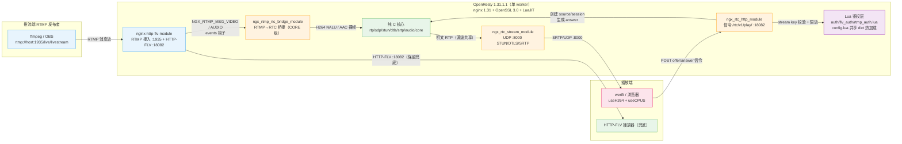

# RTMP 转 WebRTC 低延迟直播方案：架构设计

> 文档范围：自研 `ngx-rtc-module`（挂在 OpenResty 1.31.1.1 之上的 RTMP→WebRTC 桥接）的整体架构、模块分层、进程/端口模型与设计原则。
> 关联代码：`/home/dgliu/workspace/webrtc/ngx-rtc-module/`；配套文档：`详细设计.md`、`编译文档.md`、`测试文档.md`。

**结论**：方案在 OpenResty 1.31.1.1（nginx 1.31 底座）进程内，通过三个 nginx 胶水模块（RTMP 桥接 / HTTP 信令 / UDP 媒体）加一组纯 C11 核心单元（rtp/sdp/stun/dtls/srtp/audio/rtcp/hsm/session_fsm/core），实现「RTMP 推流 → H264 NALU 拆解与 AAC→Opus 转码 → RTP 封装 → SRTP → UDP 8000 → WebRTC 播放器」的低延迟链路，同时保留 HTTP-FLV 兜底。端到端实测：视频 H264 761 包/362KB、音频 Opus 389 包/67KB、首包约 560 ms、信令鉴权 `code=0`、服务端 candidate 为局域网地址 `172.16.48.122:8000`。RTCP 反馈（2s SR + NACK/PLI/BYE）、GOP 环形缓存、session HSM 状态机均集成在 bridge/stream/core；RTMP 推流、HTTP-FLV 取流与 `/rtc/v1/play/` 三路 stream key 鉴权已闭合。

## 1 结论与定位

### 1.1 一句话定位

在 **nginx 框架内**（而非独立 RTC 服务）完成 RTMP 直播源到 WebRTC 播放的低延迟转换，是相对 SRS 等独立服务方案的核心差异点。

### 1.2 能力边界

| 能力 | 依据 |
| --- | --- |
| RTMP 接入 + HTTP-FLV 兜底 | nginx-http-flv-module，RTMP :1935，HTTP-FLV :18082（HTTP 200） |
| H264 → RTP（single/STAP-A/FU-A + B 帧过滤） | `ngx_rtc_rtp.c`；实测 761 包 / 362 KB |
| AAC → Opus 转码并封装 RTP | `ngx_rtc_audio.c` + `ngx_rtc_opus_packetize`；实测 389 包 / 67 KB |
| STUN/DTLS/SRTP 媒体建链 | 局域网 candidate `172.16.48.122:8000`，首包约 560 ms |
| 信令鉴权（stream key + 限流） | Lua `auth.lua`，正确 key 返回 `code=0` |
| 推流/播放三路鉴权 | RTMP `on_publish` + HTTP-FLV `flv_auth.lua` + `/rtc/v1/play/` 同源 stream key |
| RTCP（SR/RR/SDES/NACK/PLI/BYE） | bridge 2s 周期 SR+SDES；stream 解码 SRTCP 并按 NACK/PLI/BYE 动作 |
| session HSM 状态机 | `ngx_rtc_session_fsm` 纯状态跟踪；source 状态机已删除（bridge `publishing` 为准） |
| GOP 环形缓存 / NACK 重传 / 订阅即发 | `source->gop` 2048 槽环形缓存明文 RTP；DTLS 完成回放、NACK/PLI 走 ring |
| 纯 C 协议核心 host 单测 | `ngx-rtc-module/test/` 37 用例，覆盖 rtp/stun/sdp/rtcp/hsm/session_fsm |
| 多 worker 共享内存 | 见 `docs/multi-worker-shm-design.md` |

### 1.3 端到端延迟预算

首包约 560 ms 的构成未做逐段拆分；链路为全 UDP 出网、IDR 前以 STAP-A 携带 SPS/PPS。GOP 环形缓存使新订阅者在 DTLS/SRTP 就绪并订阅时先回放最近一个 GOP（自最新 IDR 的 STAP-A 起），无需等待下一个 IDR；真实出图延迟以播放器首帧 IDR 到达口径 `first_keyframe_ms` 衡量（见测试文档）。

## 2 总体架构与数据流

### 2.1 两条数据面

- **媒体面（低延迟，UDP 出网）**：推流端 RTMP :1935 → nginx-http-flv-module 事件钩子 → 桥接模块拆 FLV tag → H264 NALU 逐个做 B 帧过滤并 RTP 封装、AAC 帧经 FFmpeg 解码 + libopus 转码后封装为 Opus RTP → 源级明文 RTP 广播 → 每订阅者独立 SRTP 加密 → UDP :8000。
- **信令面（HTTP 控制）**：播放器 POST `/rtc/v1/play/`（JSON：`sdp` + `streamurl` + `key`）→ Lua `access_by_lua_file` 完成 key 校验与限流 → HTTP 模块解析 offer、创建 source/session、分配 SSRC/PT、生成含 candidate/fingerprint 的 answer SDP 返回 `{code:0,sdp:...}` → 播放器据 answer 发起 STUN/DTLS。

### 2.2 与 HTTP-FLV 的关系

HTTP-FLV 分发与 WebRTC 信令/媒体并行存在：RTMP 的 video/audio 消息同时被 live 模块（GOP cache + FLV 分发）和桥接模块消费。桥接模块通过 `postconfiguration` 把处理器注册进 `cmcf->events[]`，不改动 nginx-http-flv-module 源码（`gop_cache on` 仅用于 HTTP-FLV 首帧加速，RTC 侧自建缓存，二者互不依赖）。

## 3 模块分层与职责

代码分两层，物理上都在 `ngx-rtc-module/src/` 下，由 addon `config` 脚本决定编译归属。

| 层 | 单元 | 职责 | 参考 SRS 6.0 实现 |
| --- | --- | --- | --- |
| 纯 C 核心（可 host 单测、无 nginx 依赖） | `ngx_rtc_rtp` | H264 NALU→RTP single/STAP-A/FU-A、B 帧过滤、Opus 封装 | `srs_app_rtc_source.cpp` / `srs_kernel_rtc_rtcp` |
| | `ngx_rtc_sdp` | SDP offer 解析、answer 生成（H264+Opus 最小集） | `srs_app_rtc_sdp.cpp` |
| | `ngx_rtc_stun` | STUN BindingRequest 解码 / BindingResponse 编码 | `srs_protocol_rtc_stun.cpp` |
| | `ngx_rtc_dtls` | DTLS 服务端握手、自签名证书、SRTP 密钥导出 | `srs_app_rtc_dtls.cpp` |
| | `ngx_rtc_srtp` | libsrtp2 SRTP protect/unprotect 封装 | SRS `SrsSRTP` |
| | `ngx_rtc_audio` | AAC→Opus 转码（FFmpeg aac + libswresample + libopus） | `srs_app_rtc_codec.cpp` |
| | `ngx_rtc_core` | source/session 进程级注册表（source 为 `ngx_rbtree`，session/订阅者为 `ngx_queue`）+ GOP 环形缓存 | `SrsRtcSource` |
| | `ngx_rtc_rtcp` | RTCP SR/RR/SDES/NACK/PLI/BYE 编解码 | `srs_kernel_rtc_rtcp.cpp` |
| | `ngx_rtc_hsm` + `ngx_rtc_session_fsm` | 层次状态机引擎 + session 生命周期状态机（纯状态跟踪） | SRS 连接生命周期 |
| nginx 胶水层 | `ngx_rtmp_rtc_bridge_module` | RTMP FLV tag→RTP 广播，CORE 类型模块 | SRS FrameToRtcBridge |
| | `ngx_rtc_http_module` | `/rtc/v1/play/` offer/answer + 指令 `rtc_play`/`rtc_candidate_ip`/`rtc_candidate_port` | `srs_app_rtc_api.cpp` |
| | `ngx_rtc_stream_module` | UDP :8000 STUN/DTLS/SRTP 媒体收发，STREAM 类型模块 | SRS RtcUdpNetwork |

### 3.1 分层原则

- 纯 C 协议核心（`rtp/sdp/stun/dtls/srtp/audio/rtcp/hsm/session_fsm`）**不引用 nginx 头文件、无全局可变状态**，输入输出全部经参数传入（`emit`/`rtcp_decode_cb` 回调、调用者持有的 scratch buffer），因此可脱离 nginx 在 host 上单测（`ngx-rtc-module/test/`，37 用例）。`core` 注册表在 nginx 编译下使用 `ngx_rbtree`/`ngx_queue`，不在 host 单测范围。
- nginx 胶水层只做「事件 → 纯 C 调用 → socket 发送」的翻译，业务逻辑（RTP 拆包、SDP 生成、加解密、RTCP 反馈动作）一律下沉到核心层或由胶水模块按核心层回调执行。
- 依赖方向单向：桥接/HTTP/stream 三个胶水模块都只依赖核心层；核心层内部 `core`（注册表）持有 `dtls`/`srtp`/`fsm` 结构体，其余单元互不依赖。

## 4 进程与端口模型

### 4.1 端口一览

| 端口 | 协议 | 方向 | 模块 | 用途 |
| --- | --- | --- | --- | --- |
| 1935 | TCP | RTMP 推流 | nginx-http-flv-module | `application live` 接入发布者 |
| 18082 | TCP/HTTP | 播放器→服务端 | ngx_rtc_http_module + nginx http | WebRTC 信令 `/rtc/v1/play/`、HTTP-FLV `/live`、管理 API `/admin/keys`、静态页 |
| 8000 | UDP | 双向 | ngx_rtc_stream_module | 媒体面 STUN/DTLS/SRTP（`listen 8000 udp; rtc;`） |

candidate IP/端口由 `/rtc/v1/play/` location 的 `rtc_candidate_ip`/`rtc_candidate_port` 指令控制；`run.sh` 启动（`nginx`/`start`）时自动探测默认路由网卡 IP（可用 `RTC_CANDIDATE_IP` 覆盖）sed 生成 `conf/nginx.rtc.conf` 后以 `-c` 启动，`nginx.conf` 中的 IP 仅为模板占位。

### 4.2 进程模型（单 worker）

- `nginx.conf` 固定 `worker_processes 1`；`ngx_rtc_core.c` 用进程内 `ngx_rbtree`（按 `app/stream` 名）保存 source，用 `ngx_queue` 保存全局 session 链表与每 source 订阅者队列，单 worker 无锁。
- 进程级初始化收敛在 `ngx_rtc_stream_init_process`（stream 模块 init process）：`ngx_rtc_dtls_global_init()` 生成自签名证书 + 共享 SSL_CTX，`ngx_rtc_srtp_global_init()` 初始化 libsrtp2，并启动 2s 空闲 reap 定时器；HTTP 模块的 init process 也幂等调用 DTLS 初始化，bridge 模块 init process 启动 2s RTCP SR 定时器。
- **关键生命周期约束**：session 跨 HTTP request 存活（绑定到 UDP DTLS/SRTP 连接），因此 HTTP 模块用 `ngx_alloc` 从进程堆分配 session 而非 request pool；stream 模块 2s 周期 reap 定时器按 `last_active` 回收（握手中 10 s、就绪 30 s 超时），关闭时经 post event 延迟 `ngx_stream_finalize_session` 释放底层 UDP 连接槽，避免孤儿 UDP 连接占满 `worker_connections`。
- **单 worker 的优势**：桥接（生产者）与 stream（消费者）在同一事件循环、同一地址空间，source/session 注册表无需加锁，RTP 明文为源级共享模板。

### 4.3 多 worker 扩展

多 worker 场景下信令落在 worker A、UDP 落在 worker B 时，进程内注册表会查不到 session。`docs/multi-worker-shm-design.md` 给出 `ngx_shm_zone` + `ngx_slab_pool` + `ngx_shmtx` 的状态共享方案与媒体环形队列设计；私有句柄（SSL/BIO、srtp_t、转码器、ngx_connection_t*）不进 shm。当前不实现，仅作为架构约束被记录：**凡会跨进程共享的结构，字段必须能被拷入 slab，句柄类字段留在私有扩展表**。

## 5 技术选型与设计原则

### 5.1 技术选型对照（为什么这么选）

| 选型 | 方案 | 理由 |
| --- | --- | --- |
| 底座 | OpenResty 1.31.1.1（nginx 1.31 + OpenSSL 3.0 + LuaJIT） | 一次获得 RTMP/HTTP/stream 三种模块体系 + Lua 鉴权，不引入独立 RTC 服务 |
| RTMP/HTTP-FLV | nginx-http-flv-module | 桥接模块复用其事件注册模式，HTTP-FLV 作为降级兜底 |
| RTP 封装 | 自研 `ngx_rtc_rtp`（RFC 6184） | 参考 SRS 6.0，纯 C 可单测，规避 GPL/版权风险与外部库耦合 |
| 媒体安全 | OpenSSL 3.0 DTLS + libsrtp2 | nginx 已链 OpenSSL；libsrtp2 静态编译进进程（`third/lib/libsrtp2.a`） |
| 音频转码 | FFmpeg `aac` 解码 + libswresample + libopus 编码 | 目标码流为 WebRTC Opus/48k/2ch；FFmpeg 从 SRS 的 `ffmpeg-4-fit` 裁剪源码静态编译，只启用 `aac` 解码器 |
| 信令 | 兼容 SRS `/rtc/v1/play/` JSON 契约 | 直接复用 SRS 系 werift/前端播放器 |
| 鉴权 | OpenResty `access_by_lua_file`/`on_publish` + `lua_shared_dict` | 推流/HTTP-FLV/信令三路同源 stream key + 信令 IP 限流 + 10 s 定时热加载，免 reload |

### 5.2 关键设计原则

1. **反过度设计**：注册表与缓冲按需取 nginx 既有数据结构而非自研/堆补丁——source 用 `ngx_rbtree`（O(log n) 查找）、session 与订阅者用 `ngx_queue`；每 session 常驻 `cipher[NGX_RTC_CIPHER_CAP]` 复用密文缓冲（不用栈上临时大缓冲），GOP ring 为定长槽数组。不做跨 worker 共享内存。
2. **const 静态表驱动**：状态机（HSM）的状态、转移表全部为 `const ngx_rtc_hsm_state_t`/`ngx_rtc_hsm_transition_t` 编译期表；RTP/SDP/STUN 等单元以函数指针回调（`ngx_rtc_rtp_emit_fn`、`ngx_rtc_audio_frame_fn`、`ngx_rtc_rtcp_decode_cb`）解耦 I/O，符合嵌入式「静态函数表」风格。
3. **零拷贝边界明确**：SRTP 密文逐 session 不同（DTLS 导出密钥独立），「每 session 一次 memcpy + 一次 `srtp_protect`」是协议决定的下界，不可跨订阅者共享密文；明文 RTP 源级共享一次，同时写入 source 的 GOP 环形缓存（2048 槽，一次缓存、N 订阅者回放/NACK 用），各 session 加密前拷贝到自身 cipher 缓冲并重写本 session 协商的 PT。
4. **无锁事件驱动**：媒体热路径运行在 nginx 单事件循环内，单生产者（桥接）+ 多只读消费者（session 订阅），不引入锁；禁止自建线程/定时器，周期任务一律用 `ngx_event_timer`。
5. **纯函数可测性**：核心单元「无全局状态、buffer 全部由调用者提供」，为 host 单测（`测试文档.md` 分层策略）预留了最小侵入的测试面。

### 5.3 安全模型与已知边界

- DTLS 证书为进程启动时生成的 RSA-2048 自签名证书，跳过对端证书校验（`SSL_VERIFY_NONE`），浏览器场景的标准做法；指纹经 SDP answer 下发给播放器。
- STUN 短期凭据使用 answer 下发的服务端 `ice-ufrag/ice-pwd` 与客户端 offer 携带的 ufrag 组成 `server:client` username，`MESSAGE-INTEGRITY` 用本地 `ice_pwd` 计算，`FINGERPRINT` 校验未实现（是否需要由部署环境决定）。
- 当前仅服务端出流（`a=sendonly`），客户端上行仅 STUN/DTLS/RTCP；SRTCP 上行解析（RR/NACK/PLI/BYE）已启用，驱动 NACK 重传、PLI 关键帧回放与 BYE 回收。
- 鉴权三路覆盖同一份 stream key：RTMP 推流端经 `on_publish` 回调 `rtmp_auth.lua`、HTTP-FLV 取流经 `/live` 的 `access_by_lua_file conf/flv_auth.lua`、WebRTC 信令经 `/rtc/v1/play/` 的 `auth.lua`；密钥存 `lua_shared_dict`，由 `config.lua` 每 10 s 热加载；admin API（loopback-only）管理密钥。
