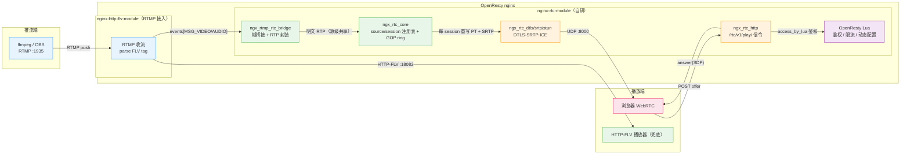
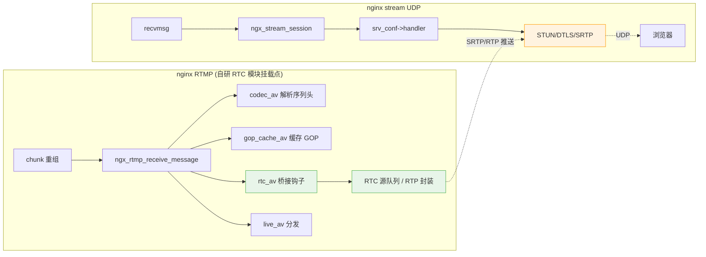
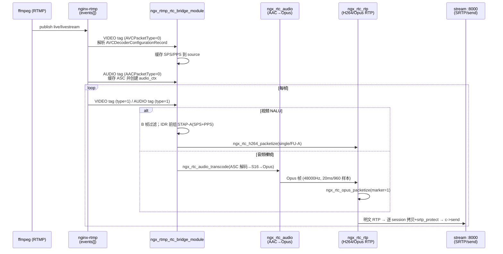
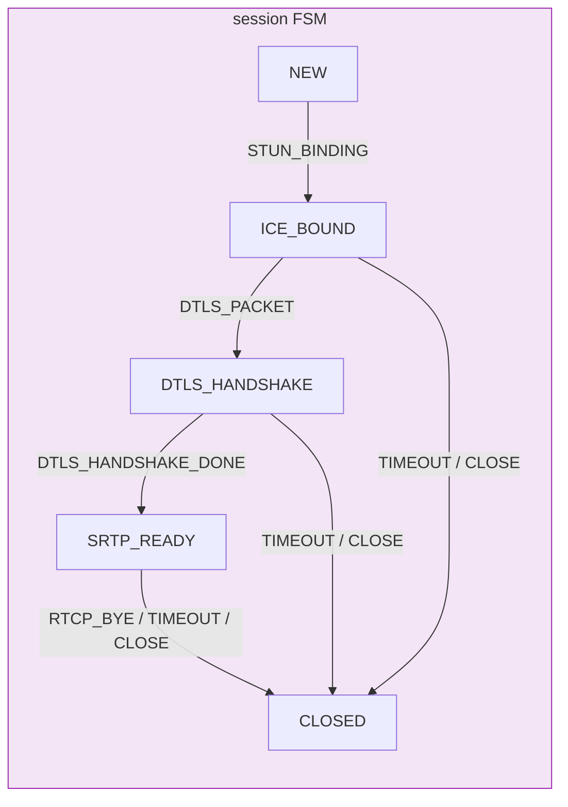
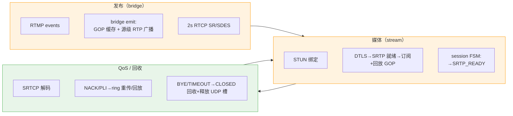

# RTMP 转 WebRTC 低延迟直播方案：详细设计

> 文档范围：自研 `nginx-rtc-module` 的总体架构与组件映射、桥接层、RTP 封装、信令与媒体安全、UDP 服务与 nginx stream 集成、状态机/RTCP/GOP 缓存，以及零拷贝边界、多 worker 扩展、开源先例与落地路线。每个主题给出关键数据结构、函数 API 与 Mermaid 图。
> 关联代码：`../nginx-rtc-module/src/*.c/.h` 真实实现；SRS 参照：`references/srs-server-6.0-r1/trunk/src/`；nginx 源码：OpenResty 1.31.1.1 bundle nginx-1.31.1。配套文档：`架构设计.md`、`multi-worker-shm-design.md`、`编译文档.md`、`测试文档.md`。
> 集成状态：桥接/RTP/信令/媒体安全为已打通链路，RTCP、GOP 环形缓存与 session HSM 均已集成进 bridge/stream/core。

**结论**：本项目把 **SRS 6.0 RTC 协议栈（STUN/DTLS/SRTP/RTP/SDP/RTCP/AAC→Opus）与 `/rtc/v1/play/` 信令契约直译进 nginx worker 进程**，在 nginx 框架内完成 RTMP 直播源到 WebRTC 播放的低延迟转换，HTTP-FLV 分发保留作为兜底；这条路径在开源社区无成熟先例（nginx-rtmp 系模块均不支持 WebRTC，社区惯例是 nginx 做 RTMP/HTTP-FLV + 独立进程 SRS/Janus/mediasoup 两段式），依据与可借鉴先例见第 9 节。媒体链路分四段：(1) 桥接模块以 RTMP events 钩子读取 FLV tag body，视频拆 AVCC 长度前缀 NALU、音频取 AAC 裸帧；(2) RTP 层按 RFC 6184 将 NALU 封装为 single/STAP-A/FU-A，IDR 前用 STAP-A 携带 SPS/PPS，AAC 经 FFmpeg 解码 + libopus 转码后按 RFC 7587 一帧一包；(3) 信令走 SRS 兼容的 `/rtc/v1/play/` offer/answer，媒体安全依次完成 STUN 绑定、DTLS 握手（`EXTRACTOR-dtls_srtp` 导出 60 字节）、libsrtp2 SRTP；(4) session HSM（纯状态跟踪）、RTCP（默认 2s SR + NACK/PLI/BYE/TWCC）与 GOP 环形缓存（进程内 + shm）均已接入；source 状态机已删除。

三条核心结论：

1. **架构上 SRS 的每个 RTC 组件都能 1:1 映射到 nginx C 模块**：桥接用 RTMP 模块 `events[MSG_VIDEO/AUDIO]` 钩子，UDP 服务用 stream 模块 `listen udp`（nginx 已内置按 peer 复用的 UDP 连接缓存），信令用 HTTP content handler，密码学与 RTP 封装作为无 nginx 依赖的纯 C 源文件链接——全链路可单测。
2. **实现难度集中在 DTLS-SRTP 密钥导出与 H264→RTP 封装两处**：前者严格照 RFC 5764 的 60 字节 key/salt 切分，后者照 single/FU-A/STAP-A 的 PT=协商值、`ts=ms×90`、1200 字节阈值、末片 marker=1 规则；两者都必须有位级单测。
3. **先 video-only 打通五步，再按「音频 → QoS → 生产化 → 多 worker」逐层叠加**：每层有独立验证项；不要提前引入多 worker 共享内存等过度设计，也不要在单 worker 阶段背负 shm 约束。

## 1 总体架构与模块全景

### 1.1 目标架构



**边界原则**（分工红线）：

- **信令与控制面**：OpenResty Lua——鉴权、限流、信令路由、动态配置热加载（`lua_shared_dict` + `ngx.timer.every`）。
- **媒体面与协议栈**：纯 C nginx 模块，参考 SRS 逐项实现。**媒体协议栈不能下放 Lua**（无 `lua-resty-webrtc/sdp/dtls/srtp` 可用模块，纯 Lua 拼 SFU 的成本与可靠性不可控）。
- **跨 worker 共享状态**：`ngx_shm_zone` + `ngx_slab_pool`，见第 8 节。

### 1.2 SRS 6.0 → nginx 自研模块映射表

| SRS 6.0 组件（源码位置） | nginx 自研模块/文件 | 职责 |
| --- | --- | --- |
| `SrsFrameToRtcBridge`（srs_app_stream_bridge.cpp） | `ngx_rtmp_rtc_bridge_module.c`（`NGX_RTMP_MODULE`） | 订阅 RTMP 音视频帧，按流创建 RTC 源，驱动 RTP 封装 |
| `SrsRtcSource`（srs_app_rtc_source.cpp） | `ngx_rtc_core.c` | 每流一个源：SPS/PPS、SSRC/PT、订阅者队列、GOP ring |
| `SrsRtcRtpBuilder`（srs_app_rtc_source.cpp） | `ngx_rtc_rtp.c` | H264 NALU → single/STAP-A/FU-A，B 帧过滤 |
| `SrsRtpHeader`/`SrsRtpPacket`（srs_kernel_rtc_rtp.cpp） | `ngx_rtc_rtp.c`（同文件） | RTP 头 12 字节编解码 |
| `SrsAudioTranscoder`（srs_app_rtc_codec.cpp） | `ngx_rtc_audio.c` | AAC→Opus（FFmpeg aac + libswresample + libopus） |
| `SrsDtlsImpl`/`SrsSRTP`（srs_app_rtc_dtls.cpp） | `ngx_rtc_dtls.c` + `ngx_rtc_srtp.c` | DTLS 握手、SRTP 密钥导出、加解密 |
| `SrsRtcUdpNetwork` STUN 部分（srs_app_rtc_network.cpp） | `ngx_rtc_stun.c` | STUN Binding Request→Response、ICE |
| `SrsSdp`/`negotiate_play_capability`（srs_app_rtc_sdp.cpp） | `ngx_rtc_sdp.c` | SDP offer 解析、answer 生成、PT/SSRC 协商 |
| `SrsRtcServer`/`SrsRtcConnection`（srs_app_rtc_server.cpp） | `ngx_rtc_stream_module.c`（`NGX_STREAM_MODULE`） | UDP listen、会话注册表、包分发、发送 |
| `SrsGoApiRtcPlay`（srs_app_rtc_api.cpp） | `ngx_rtc_http_module.c`（`NGX_HTTP_MODULE`） | `POST /rtc/v1/play/`：解析 offer → 建 session → 返回 answer |

> 与 SRS 多线程协程不同，nginx 是**单进程事件循环 + 分阶段回调**。非 nginx 模块的协议单元（rtp/sdp/stun/dtls/srtp/audio/rtcp/hsm）作为普通 C 源文件链接进 addon，不引用 nginx 头文件、无全局可变状态，可脱离 nginx 在 host 上单测。

### 1.3 模块拆分与测试边界

| 模块 | 依赖 nginx | 可单测 |
| --- | --- | --- |
| `rtp`（AVCC→NALU、RFC 6184 打包）、`sdp`、`stun`、`rtcp`、`hsm`/`session_fsm` | 否 | 是 |
| `srtp`（libsrtp2 封装）、`dtls`（OpenSSL wrapper） | 否（链第三方库） | 是（真实库或 mock） |
| `audio`（AAC→Opus）、`ring`（定长环 + `ngx_rtc_vring_t` 变长字节环）、`jitter`（WHIP 上行重排）、`avsync`（SR→NTP 映射） | 否 | 是 |
| `core`（source/session 注册表、pacer/TWCC）、`shm`（`rtc_zone` 注册表骨架、publish 所有权、重传环/媒体环） | 部分（`ngx_rtc_shm.c` 用 nginx 类型） | 是（`test_rtc_core`/`test_shm` 在 host 编译运行） |
| `audio_worker`（转码 pthread，vring + mutex/cond） | pthread | 是（`test_audio_worker`） |
| `ngx_rtc_core_module`（`rtc_zone` 指令与 core 模块定义，由 shm.c 拆出） | 是 | 否（仅 nginx 配置路径） |
| `ngx_rtmp_rtc_bridge_module`、`ngx_rtc_http_module`、`ngx_rtc_stream_module` | 是 | 否（薄胶水层；`test_stream_module` 以 #include 覆盖静态 close/DTLS 回调） |

原则：**逻辑下沉到纯 C 模块，nginx 侧只做事件/配置/socket 翻译**。纯 C 单测用 `test/Makefile` + TDD（RED→GREEN→REFACTOR）：Linux 下 `NGX_SRC` 默认指向已 configure 的 openresty/nginx 源码树，生产 TU 直接用真实 nginx 头编译；`test/nginx_stub.c` 在真实头构建里只补 nginx 未链接的符号，无 nginx 头（Windows 交叉构建）时它才提供完整的桩对象。RFC 位级代码（STUN 长度边界、FU-A 位级、SDP 解析）必须有单测覆盖，端到端测试只数包不校验语义，不足以暴露这类缺陷。

### 1.4 代码布局与编译归属

| 文件 | 类型 | 归属 | 集成状态 |
| --- | --- | --- | --- |
| `ngx_rtmp_rtc_bridge_module.c` | CORE 胶水 | nginx RTMP | 已接入，广播明文 RTP |
| `ngx_rtc_http_module.c` | HTTP 胶水 | nginx HTTP | 已接入，信令 |
| `ngx_rtc_stream_module.c` | STREAM 胶水 | nginx stream | 已接入，UDP STUN/DTLS/SRTP |
| `ngx_rtc_core.c/.h` | 纯 C | 注册表 + 本地 GOP ring + 发送 pacing/TWCC AIMD | 已接入（source rbtree、session/订阅 ngx_queue、NACK 窗口退避） |
| `ngx_rtc_core_module.c` | CORE 胶水 | nginx core | 已接入，`rtc_zone` 指令与 core 模块定义（由 `ngx_rtc_shm.c` 拆出） |
| `ngx_rtc_shm.c/.h` | 纯 C + nginx 类型 | shm 注册表 | 已接入（shm source/session 骨架、publish 所有权、跨 worker 重传环/媒体环、reaper） |
| `ngx_rtc_ring.c/.h` | 纯 C | 定长环 / 变长字节环 | 已接入（`ngx_rtc_vring_t` 作音频转码线程收发队列） |
| `ngx_rtc_rtp.c/.h` | 纯 C | RTP 封装 | 已接入 |
| `ngx_rtc_sdp.c/.h` | 纯 C | SDP | 已接入 |
| `ngx_rtc_stun.c/.h` | 纯 C | STUN | 已接入 |
| `ngx_rtc_dtls.c/.h` | 纯 C | DTLS | 已接入 |
| `ngx_rtc_srtp.c/.h` | 纯 C | SRTP | 已接入 |
| `ngx_rtc_audio.c/.h` | 纯 C | AAC→Opus | 已接入（bridge 调用） |
| `ngx_rtc_audio_worker.c/.h` | pthread | 音频转码线程 | 已接入（bridge 调用；vring + mutex/cond 隔离 FFmpeg） |
| `ngx_rtc_jitter.c/.h` | 纯 C | WHIP 上行重排 | 已接入（stream 模块 WHIP 上行按 seq 重排） |
| `ngx_rtc_avsync.c/.h` | 纯 C | SR→NTP 映射 | 未接入（host 单测；nginx 路径暂无调用方） |
| `ngx_rtc_rtcp.c/.h` | 纯 C | RTCP 编解码 | 已接入（bridge 周期 SR；stream NACK/PLI/TWCC/BYE） |
| `ngx_rtc_hsm.c/.h` + `ngx_rtc_session_fsm.c/.h` | 纯 C | 状态机 | 已接入（session 纯状态跟踪；source 机已删除） |

### 1.5 共享常量与约定

| 常量 | 值 | 含义 |
| --- | --- | --- |
| `NGX_RTC_H264_CLOCK_RATE` | 90000 | H264 RTP 时钟（由 RTMP ms 时间戳换算） |
| `NGX_RTC_OPUS_CLOCK_RATE` | 48000 | Opus RTP 时钟 |
| `NGX_RTC_PAYLOAD_TYPE_H264/OPUS` | 102 / 111 | 服务端默认 PT |
| `NGX_RTC_H264_MTU` | 1200 | RTP 载荷上限（1500 预留 UDP/IP 与扩展头） |
| `NGX_RTC_SRTP_KEY_LEN/SALT_LEN` | 16 / 14 | AES_CM_128_HMAC_SHA1_80 主密钥/盐长度 |
| 返回码 | `NGX_RTC_OK=0`，`ERR_INVALID=-1`，`ERR_TOO_SMALL=-2`，`ERR_TOO_LARGE=-3`，`ERR_PARSE=-4` | 全模块统一错误码 |

时间戳换算内联函数：`ngx_rtc_h264_timestamp_from_ms(ms)`、`ngx_rtc_opus_timestamp_from_ms(ms)`，均以 64 位中间量乘除防溢出。

## 2 桥接层设计（RTMP FLV → RTC）

### 2.1 接入方式

`ngx_rtmp_rtc_bridge_module` 在 `postconfiguration` 中把 `ngx_rtmp_rtc_av` 追加进 `cmcf->events[NGX_RTMP_MSG_VIDEO]` 与 `[NGX_RTMP_MSG_AUDIO]`。该模式与 nginx-http-flv-module 的 gop_cache 模块相同，不改动任何现有模块源码。处理器只关心发布者会话（`ngx_rtmp_live_ctx_t->publishing` 非零）。

挂载点的两条关键事实：

1. **钩子内 `(s, h, in)` 的 `in` 即解析完成的 FLV tag body**：`pos[0]` 是帧类型字节、`pos[1]` 是 PacketType 字节，SPS/PPS 与 AudioSpecificConfig 由桥接模块自己从 tag body 解析（`ngx_rtmp_rtc_parse_avc_header`），**不读** `ngx_rtmp_codec_module` 的 ctx。
2. **发布方 teardown 挂在 `cmcf->events[NGX_RTMP_DISCONNECT]`，不用 `ngx_rtmp_close_stream` 指针**：cmd 与 live 模块在本模块之后 postconfigure，且把该指针整体赋新（无 next 保存），此处挂 hook 会被覆盖而永不触发；`events[]` 是数组追加，注册必执行。干净 deleteStream 与客户端直接断 socket 都收敛到这一个 handler。

SRS 的做法本质一致：在 RTMP source 上挂 `SrsCompositeBridge` + `SrsFrameToRtcBridge` 逐帧分叉到 RTC source（srs_app_rtmp_conn.cpp:1129），本项目换成 publisher 帧上的事件钩子。桥接模块只做「取帧 + 判音视频 + 交封装」，RTP 细节留在 `ngx_rtc_rtp.c`，保持单一职责。



关键行号索引（nginx-http-flv-module，行号以本工作区 `_archive/nginx-http-flv-module` 快照核对）：

| 符号 | 位置 |
| --- | --- |
| `ngx_rtmp_receive_message`（事件分发循环） | `ngx_rtmp_handler.c:792` |
| `ngx_rtmp_fire_event` | `ngx_rtmp.c:1072` |
| `ngx_rtmp_codec_av` / parse avc/aac header | `ngx_rtmp_codec_module.c:195` |
| `ngx_rtmp_gop_cache_av`（publisher 帧钩子范本） | `ngx_rtmp_gop_cache_module.c:804` |
| `ngx_rtmp_live_av`（直播分发） | `ngx_rtmp_live_module.c:850` |
| 事件 handler 类型 / events 数组 | `ngx_rtmp.h:419` / `ngx_rtmp.h:432` |
| 模块加载顺序（codec 在 live 之前） | addon `config` 的 `RTMP_CORE_MODULES` |

发布所有权以 shm source 为权威，进程内 `ngx_rtc_source_t` 只作无锁镜像，且仅允许 `ngx_rtc_publish_claim()` / `ngx_rtc_publish_release()` / `ngx_rtc_publish_mirror()` 写 `publishing` / `publisher_kind`：claim 原子取得（RTMP/WHIP 互斥，冲突返回 `NGX_BUSY`），release 幂等，mirror 供媒体 worker 采纳他进程已持有的所有权。发布 worker 每包刷新 shm source 的 `publisher_seen_ms` 心跳；reaper 在心跳超过 `NGX_RTC_SHM_PUBLISH_GRACE_MS`（10000 ms）未更新时回收该 publishing 源——崩溃 worker 来不及 release 的 source 由此被收集。

### 2.2 FLV tag body 布局与处理分支

| 媒体 | tag body 布局 | 处理 |
| --- | --- | --- |
| 视频（H264） | `[0]`=FrameType(高4)+CodecID(低4，7=H264)；`[1]`=AVCPacketType（0=序列头，1=NALU）；`[2..4]`=CTS；`[5..]`=AVCC 长度前缀 NALU | 序列头→`ngx_rtmp_rtc_parse_avc_header` 缓存 SPS/PPS；NALU→`ngx_rtmp_rtc_video` 拆 NALU 并 RTP 封装 |
| 音频（AAC） | `[0]`=SoundFormat(高4，10=AAC)+采样率等；`[1]`=AACPacketType（0=序列头 ASC，1=裸 AAC 帧）；`[2..]`=数据 | 序列头→缓存 AudioSpecificConfig 并创建转码器；裸帧→`ngx_rtc_audio_transcode` |

关键代码常量：`NGX_RTC_VIDEO_H264=7`、`NGX_RTC_AUDIO_AAC=10`、`NGX_RTC_MAX_NALUS=16`（Opus 目标码率由 `rtc_audio_bitrate` 指令给出，默认 64000）。

音频 RTP 时间戳源级单调：首个裸 AAC tag 播种 48k 时钟（`audio_ts_valid`），此后每成功 emit 一帧 Opus 由 `ngx_rtmp_rtc_audio_frame` 回调 `audio_ts += NGX_RTC_AUDIO_OPUS_FRAME_SIZE(960)`，替代「每 AAC tag 用同一次 tag 时间戳」。这修复了早期 P1：一帧 AAC（1024 样本）经 FIFO 可转出两帧 Opus，若共用 tag 时间戳会被对端按时间戳去重、规律性丢 20 ms 音频。

### 2.3 关键数据结构

AVC 序列头（AVCDecoderConfigurationRecord）解析后缓存于 source（关键字段摘录，完整定义见 `ngx_rtc_core.h`）：

```c
struct ngx_rtc_source_s {              /* ngx_rtc_core.h */
    char     name[128];                /* "app/stream" */
    uint8_t  publishing;               /* 1 = 有发布者 */
    uint8_t  publisher_kind;           /* 0=none / 1=RTMP / 2=WHIP 所有权标签 */
    uint32_t video_ssrc; uint8_t video_pt;
    uint32_t audio_ssrc; uint8_t audio_pt;
    uint16_t video_seq, audio_seq;     /* 源级共享 RTP 序号 */
    uint32_t video_ts,  audio_ts;      /* 90k/48k RTP 时间戳 */
    uint8_t  audio_ts_valid;
    uint32_t video_pkts, video_octets; /* SR 统计，bridge emit 累计 */
    uint32_t audio_pkts, audio_octets;
    uint8_t  sps[256]; uint32_t sps_len;   /* SPS/PPS（IDR 前组 STAP-A） */
    uint8_t  pps[256]; uint32_t pps_len;
    uint8_t  audio_asc[64]; uint32_t audio_asc_len;  /* AAC AudioSpecificConfig */
    void    *audio_ctx;                /* ngx_rtc_audio_t * */
    ngx_rtc_rtp_ring_t gop;           /* 本进程明文 RTP 环形缓存（2048 槽，rtc_gop_ring_slots 可配） */
    ngx_rtc_jitter_t jitter;          /* WHIP 上行重排缓冲 */
    void    *shm_src;                  /* shm source 指针缓存（跨 worker 用，非所有权） */
#ifdef NGX_PTR_SIZE
    ngx_str_node_t sn;                 /* source rbtree 节点（key="app/stream"） */
    ngx_queue_t    subscribers;        /* 订阅者 ngx_queue 队头 */
#endif
};
```

视频 NALU 处理伪逻辑（`ngx_rtmp_rtc_video`）：遍历 AVCC 4 字节长度前缀 NALU，`ngx_rtc_h264_is_b_frame()==1` 的 NALU 丢弃；NALU 类型为 IDR(5) 且 SPS/PPS 已缓存时，先发一包 STAP-A（SPS+PPS），再逐个 `ngx_rtc_h264_packetize`，访问单元末 NALU 置 marker=1。

### 2.4 广播发送（每 session SRTP）

```c
static int32_t ngx_rtmp_rtc_emit(void *opaque, const uint8_t *rtp, uint32_t len);
/* 视频：先 ngx_rtc_rtp_ring_push 入本进程 GOP ring（is_gop_start 标记 STAP-A），
 *       并 ngx_rtc_shm_retransmit_append 镜像进 shm 源级重传环（跨 worker）；
 * 累计 video/audio_pkts 与 octets 供 SR 用；
 * ngx_rtc_broadcast_rtp 按 shm 订阅快照分组：
 *   同 worker 目标直接 ngx_rtc_session_send_rtp（不经过 per-session 重传缓存，NACK/PLI 读 src->gop）；
 *   跨 worker 目标 ngx_rtc_shm_ring_enqueue 写入该 worker 的媒体环并 eventfd 唤醒，
 *   由 owner worker 出队后逐 session：
 *     明文拷贝到常驻 sess->cipher[NGX_RTC_CIPHER_CAP]
 *     -> 按该 session 协商 PT 重写 RTP header（协商了 transport-cc 时插入 TWCC 扩展）
 *     -> pacer 准入 -> ngx_rtc_srtp_protect_rtp -> c->send()。 */
```

### 2.5 桥接时序



## 3 RTP 封装设计

### 3.1 RTP 头与错误码

```c
typedef struct {                  /* ngx_rtc_rtp.h */
    uint8_t  version_cc;          /* V=2, CC=0 (0x80) */
    uint8_t  marker_pt;           /* M + 7bit PT */
    uint16_t seq;
    uint32_t timestamp;
    uint32_t ssrc;
} ngx_rtc_rtp_header_t;
/* 大端上线；固定头 12 字节；writer 提供字节序序列化 */
int32_t ngx_rtc_rtp_header_write(const ngx_rtc_rtp_header_t *hdr, uint8_t *buf, uint32_t cap);
```

### 3.2 封装函数族（核心 API）

| 函数 | 用途 | 关键规则 |
| --- | --- | --- |
| `ngx_rtc_h264_packetize` | 入口分发 | `len <= MTU` → single；`len > MTU` → FU-A |
| `ngx_rtc_h264_packetize_single` | 单 NAL 单元包 | NALU 紧跟 12B 头，无额外载荷头 |
| `ngx_rtc_h264_packetize_fu_a` | FU-A 分片 | FU indicator 保留原 NRI、类型=28；首片 S=1、末片 E=1；marker 只在末片 |
| `ngx_rtc_h264_packetize_stap_a` | 聚合 SPS/PPS | STAP-A 头取首 NALU 的 NRI + 类型 24；每子 NALU 前 2B 大端长度；marker 清零 |
| `ngx_rtc_opus_packetize` | Opus 单帧单包 | RFC 7587 无载荷头；marker 通常置 1 |
| `ngx_rtc_h264_nalu_type` / `ngx_rtc_h264_find_nalu` | 工具 | NAL 类型提取 / Annex-B 起始码定位 |
| `ngx_rtc_h264_is_b_frame` | B 帧判定 | 见 3.3 |

所有封装函数签名统一：`(nalu/opus, len, timestamp, uint16_t *seq, ssrc, pt, marker, scratch, scratch_cap, emit, opaque)`。调用者持有 `seq` 计数器（源级 `src->video_seq/audio_seq`）与 scratch 缓冲，每次发包 `(*seq)++` 并回调 `emit`。

### 3.3 B 帧识别算法

对 NAL 类型 ∈ {1(NON_IDR), 2, 3, 4(DP_A/B/C)} 的 slice NALU：跳过 1 字节 NALU 头后，按 H.264 9.1 读 Exp-Golomb `first_mb_in_slice` 与 `slice_type`，`slice_type ∈ {1, 6}`（B / B1）判为 B 帧丢弃。位读取与 `srs_avc_nalu_read_uev` 同源。WebRTC 低延迟播放不支撑 B 帧重排序，故推流侧也建议 `-bf 0`。单测曾以回归断言发现早期实现用「按位或」累加 Exp-Golomb 后缀导致 `slice_type 6/2` 误判，现改为加法并回归转绿（见测试文档 §1）。

### 3.4 场景表（实测命中）

| 场景 | 封装形态 | 说明 |
| --- | --- | --- |
| IDR 关键帧首包 | STAP-A（SPS+PPS）→ single/FU-A（IDR slice） | marker=0 的 STAP-A 先行，保证解码器首帧可解 |
| 普通小 NALU（P 帧等） | single | ≤1200 B |
| 超大 NALU | FU-A 多分片 | 每片 ≤1200 B 载荷，总包 ≤1214 B |
| 音频 | Opus RTP 一帧一包 | 960 样本/20 ms @48 kHz |

## 4 信令与媒体安全（SDP / 鉴权 / STUN / DTLS / SRTP）

### 4.1 信令契约与数据结构

HTTP 模块实现 `POST /rtc/v1/play/`，请求 JSON `{sdp, streamurl, t, sign,...}`，响应 JSON `{code:0,sdp:"<answer>"}`（SDP 内换行转义 `\n`）。URL `webrtc://host/app/stream` 被切分为 `app/stream`。请求体解析用 `ngx_rtc_chain_reader_t` 游标直接在 `ngx_chain_t` 上逐字节读 JSON 字段（跨 buf 边界），避免把 body 整体拷入固定栈缓冲（请求体上限 `NGX_RTC_MAX_SDP_LEN` = 16 KB，`sdp` 按实际长度从 request pool 分配）；`sdp`/`streamurl` 按字段各自重新初始化游标，不依赖 JSON 字段顺序。

```c
typedef struct {                          /* ngx_rtc_sdp.h */
    char ice_ufrag[64]; char ice_pwd[256];
    char fingerprint_algo[32]; char fingerprint[160];
    char setup[32];
} ngx_rtc_sdp_session_t;

typedef struct {                          /* 解析后的远端 offer */
    ngx_rtc_sdp_session_t session;
    uint8_t video_pt; uint32_t video_ssrc; char video_encoding[64];
    uint32_t video_clock_rate; char video_fmtp[256];
    uint8_t audio_pt; uint32_t audio_ssrc; ...
} ngx_rtc_sdp_offer_t;

typedef struct {                          /* answer 配置 */
    const char *ice_ufrag, *ice_pwd, *fingerprint_algo, *fingerprint;
    const char *setup, *proto;            /* "passive", "UDP/TLS/RTP/SAVPF" */
    const char *candidate_ip; uint32_t candidate_port;
    uint32_t video_ssrc, audio_ssrc; uint8_t video_pt, audio_pt;
    ... int32_t sendonly, rtcp_mux, rtcp_rsize;
} ngx_rtc_sdp_answer_t;

int32_t ngx_rtc_sdp_parse_offer(const char *sdp, uint32_t len, ngx_rtc_sdp_offer_t *out);
void    ngx_rtc_sdp_answer_init(ngx_rtc_sdp_answer_t *cfg);
int32_t ngx_rtc_sdp_generate_answer(const ngx_rtc_sdp_answer_t *cfg,
                                    char *buf, uint32_t cap, uint32_t *out_len);
```

answer 内容：`a=ice-lite`（服务端 ICE-lite）、session 级 `ice-ufrag/ice-pwd/fingerprint(sha-256)/setup:passive`、每个媒体段内写 `a=candidate`（`candidate_ip:8000`，IP 由 run.sh 自动探测主网卡注入）、`a=sendonly`、`a=rtcp-mux`、`a=rtcp-rsize`、`a=rtcp-fb:<pt> nack pli`（视频）/`a=rtcp-fb:<pt> nack`，视频默认 `profile-level-id=42e01f;packetization-mode=1`，音频 `minptime=10;useinbandfec=1`。SSRC 由首个 play 会话用 `ngx_random()` 分配并固化到 source；PT 则在每个会话按其 offer 协商值记录（`sess->video_pt/audio_pt`），发送时由 `ngx_rtc_session_send_rtp` 重写 RTP 头 PT，支持异构观众。

控制与观测端点（同为 `ngx_rtc_http_module` 的 `NGX_HTTP_LOC_CONF` 指令）：`rtc_play`、`rtc_whip`（WHIP 推流信令）、`rtc_kick`（`POST ?id=<session id>` 请求关闭单个会话）、`rtc_disconnect`（`POST ?name=<app/stream>` 标记该源全部观看者待关闭，owner worker 在下一回收 tick 清理）。`GET /rtc/v1/stats` 由 Lua 读 C 模块每 1 s 镜像进 `lua_shared_dict rtc_stats` 的快照（`rtc_stats` 是 dict 名，不是 C 指令），输出 `streams[].sessions[].state` 与顶层 `session_states` 聚合；`sessions[]` 含该源全部 session（未完成握手者与 WHIP 发布者也在内），`CLOSED` 不可观测（见 6.2）。

### 4.2 鉴权链

同一份 stream key 保护三条路径，均查 `lua_shared_dict stream_keys`（由 `config.lua` 每 10 s 从 `stream_keys.lua` 热加载）：

- **WebRTC 信令**：`/rtc/v1/play/` 上 `access_by_lua_file conf/auth.lua;`，IP 级限流（60 s 内 30 次，超限 429）→ 解析 body `streamurl` → `config.verify("app/stream", t, sign)`，失败 403。
- **RTMP 推流**：`application live` 配置 `on_publish http://127.0.0.1:18082/rtmp/on_publish;`，`rtmp_auth.lua` 解析 notify 回调表单里的 `app/name/t/sign`（来自 RTMP URL 查询串 `?t=...&sign=...`），`config.verify` 不通过返回 403 拒绝发布。
- **HTTP-FLV 取流**：`/live` 上 `access_by_lua_file conf/flv_auth.lua;`，取 `?app=&stream=&t=&sign=` 参数 `config.verify`，失败 403。

密钥管理经 loopback-only 的 `/admin/keys`（`admin_keys.lua`）增删改查。

### 4.3 媒体安全握手

STUN：`ngx_rtc_stun_decode` 解析 BindingRequest（校验 magic cookie 与长度），取 USERNAME 拆 `local_ufrag:remote_ufrag`（两端都截断到 `NGX_RTC_STUN_UFRAG_MAX`）；stream 模块用 `local_ufrag` 在全局 session 链表 `ngx_rtc_session_find` 定位会话并绑定 `sess->conn/peer_addr`；`ngx_rtc_stun_encode_binding_response` 回 XOR-MAPPED-ADDRESS + MESSAGE-INTEGRITY（HMAC-SHA1，key=本地 `ice_pwd`）+ FINGERPRINT（CRC32 XOR `0x5354554E`）。编码器对每个属性写前做 `out_len - pos` 边界检查，调用方缓冲为 256 字节（原 128 字节栈缓冲越界 P0 已修复）。

DTLS：进程级自签名 RSA-2048 证书 + 共享 `SSL_CTX`（`DTLS_server_method`，曲线 `P-256:P-384:P-521`，`SSL_CTX_set_tlsext_use_srtp("SRTP_AES128_CM_SHA1_80")`，`SSL_VERIFY_NONE`）。每 session `ngx_rtc_dtls_create` 建内存 BIO，`SSL_set_accept_state()` 置 server 角色，`SSL_set_mtu(1200)` 分片；`ngx_rtc_dtls_on_data` 以 `SSL_read` 驱动握手，结束后回调 `done_cb`（`ngx_rtc_stream_dtls_done`）。该回调不再自行关闭 session：密钥导出或 `srtp_create` 失败时只置 `sess->close_pending`，由 `ngx_rtc_dtls_on_data` / `ngx_rtc_dtls_handle_timeout` 的调用方在拿回控制权后关闭，避免在同步回调内释放调用方仍在使用的 `sess`。

SRTP 密钥导出（`ngx_rtc_dtls_get_srtp_key`）：`SSL_export_keying_material("EXTRACTOR-dtls_srtp")` 取 60 字节；RFC 5764 顺序 `[client_key16][server_key16][client_salt14][server_salt14]`，服务端 recv=client、send=server，各 30 字节交 `ngx_rtc_srtp_create` 建 libsrtp2 收发上下文（策略 `AES_CM_128_HMAC_SHA1_80`，`ssrc_any_*`，窗口 8192）。DTLS 完成后订阅 session 到 source 的 `subscribers` 链表，广播随即开始。

WHIP 发布方向另有上行重排：stream 模块把收到的上行视频 RTP 先交 `ngx_rtc_jitter_push` 按 seq 重排（gap 超时取 `rtc_jitter_timeout`），再进入广播/GOP 路径，避免丢包 WAN 上乱序 H264 直接进入解码链。

### 4.4 播放器建链时序


## 5 UDP 服务与 nginx stream 集成

### 5.1 核心机制：nginx 已解决「UDP 无连接 vs WebRTC 长会话」矛盾

`ngx_event_udp.c` 用红黑树按 `(peer ip:port, local addr)` 缓存 UDP 连接，同对端后续数据报复用同一 `ngx_connection_t` 与 `ngx_stream_session_t`——DTLS/SRTP/SSRC 会话状态放 `s->ctx` 即可跨数据报持久，**无需自研 UDP 复用层**。

```mermaid
sequenceDiagram
    autonumber
    participant U as ngx_event_recvmsg
    participant C as UDP连接缓存
    participant I as ngx_stream_init_connection
    participant S as ngx_stream_session_t
    participant M as ngx_rtc_stream(handler)

    U->>C: ngx_lookup_udp_connection(ls, peer)
    alt 新对端
        C-->>U: NULL
        U->>I: 建 connection + ls->handler(c)
        I->>S: ngx_pcalloc session, c->data=s
        I->>S: rev->handler = ngx_stream_session_handler
    else 已有对端
        C-->>U: 复用 connection(c->data 仍是旧 session)
        U->>S: rev->handler(rev)
    end
    S->>M: srv_conf->handler(s)（`rtc;` 指令注册）
    Note over M: 读 c->buffer 当前数据报；<br/>状态存 s->ctx；<br/>不调 finalize（保持会话）
    M-->>S: NGX_OK / 异步注册写事件
```

### 5.2 生命周期与收发规则

1. **handler 每数据报被调一次**，负责读 `c->buffer`、判别 STUN/DTLS/RTP/RTCP 并分发；**不要在 handler 内调 `ngx_stream_finalize_session`**（那是 TCP 代理的收尾，会销毁 UDP 连接缓存）。
2. **收发都走 nginx 事件模型**：收用 `c->buffer`/`c->recv`，发用 `c->send`（等价 sendto）。**禁止在 handler 里直接 `sendto`/`recvfrom` 操作 fd**，否则破坏 nginx 的连接缓存与统计。高负载时应循环 drain，避免单事件多包滞留拖慢握手。
3. **会话关闭必须释放底层 UDP 连接**：只释放自研结构不调 finalize，`ngx_connection_t` 槽位会永久泄漏，累计到 `worker_connections` 后新观众无法建会话。正确做法是经 post event 延迟调用 `ngx_stream_finalize_session`（接收路径内同步关闭有 use-after-free 风险）。
4. **周期任务一律 `ngx_event_timer`**：session 空闲回收按 `rtc_handshake_timeout`（默认 10 s，未完成握手）与 `rtc_ready_timeout`（默认 30 s，就绪后停止上行）分级，`rtc_reap_interval` 定回收节拍；就绪会话靠客户端 RTCP 保活。禁止自建线程/定时器。
5. **模块类型 `NGX_STREAM_MODULE`，由 `rtc;` 指令注册 handler**：setter 置 `cscf->handler = ngx_rtc_stream_handler`（不是 postconfiguration content phase）；`init_module` 做进程级 DTLS/libsrtp 初始化，`init_process` 仅在真 worker 起 eventfd 读侧与 reap timer。
6. **跨 worker 媒体投递走 eventfd 唤醒**：bridge 入环后写一字节，owner worker 的出队 handler 被立即唤醒，非轮询。

关键行号索引（nginx 1.31.1.1）：

| 符号 | 位置 |
| --- | --- |
| `ngx_stream_core_listen`（`udp` → SOCK_DGRAM） | `ngx_stream_core_module.c:990`（SOCK_DGRAM 在 :1045） |
| `ngx_event_recvmsg`（UDP 收包/连接复用） | `ngx_event_udp.c:25` |
| `ngx_stream_finalize_session` | `ngx_stream_handler.c:301` |
| `ngx_stream_session_t` / `ngx_stream_module_t` | `ngx_stream.h:262` / `ngx_stream.h:313` |
| `ngx_udp_send_chain`（io 宏） | `ngx_event.h:425` |
| 指令 setter 范本 | `ngx_stream_return_module.c:189` |

## 6 状态机、RTCP 与 GOP 缓存设计

> 本节三个主题均已集成进 bridge/stream/core；状态机定位为「纯状态跟踪、真实动作留在 stream 模块」，source 状态机作为死代码已删除。

### 6.1 HSM 层次状态机引擎

`ngx_rtc_hsm` 是数据驱动的层次状态机（Andreas Misje lightweight HSM 的 C 移植）：状态带父链，事件先交给当前状态，未消费则沿父链上浮；转移分 EXTERNAL（退出源路径/进入目标路径）与 INTERNAL（仅执行 action 不换状态）。

```c
struct ngx_rtc_hsm_state {                       /* const 静态表 */
    const ngx_rtc_hsm_state_t *parent;
    ngx_rtc_hsm_action_fn entry_action, exit_action;
    const ngx_rtc_hsm_transition_t *transitions; /* {event_id,target,guard,action,type}[] */
    size_t num_transitions; const char *name;
};
void ngx_rtc_hsm_init(ngx_rtc_hsm_t *sm, const ngx_rtc_hsm_state_t *initial,
                      const ngx_rtc_hsm_state_t **entry_path_buffer,
                      uint8_t buffer_size, void *user_data,
                      ngx_rtc_hsm_action_fn unhandled_hook);
bool ngx_rtc_hsm_dispatch(ngx_rtc_hsm_t *sm, const ngx_rtc_hsm_event_t *event);
bool ngx_rtc_hsm_is_in_state(const ngx_rtc_hsm_t *sm, const ngx_rtc_hsm_state_t *state);
```

引擎仅依赖 C 标准库，无 nginx/RT-Thread 依赖，可 host 单测。`entry_path_buffer` 由调用者提供，容量按最大层深（本方案 2）定。

### 6.2 session 状态机（纯状态跟踪）

状态表（`ngx_rtc_session_fsm.h`）：

| 状态机 | 层次 | 状态 | 事件 |
| --- | --- | --- | --- |
| session | `SESSION(root)` → `NEW/ICE_BOUND/DTLS_HANDSHAKE/SRTP_READY/CLOSED` | 查询用 `NGX_RTC_SESSION_STATE_*` | `EVT_STUN_BINDING`、`EVT_DTLS_PACKET`、`EVT_DTLS_HANDSHAKE_DONE`、`EVT_SRTP_READY`、`EVT_TIMEOUT`、`EVT_CLOSE`、`EVT_RTCP_BYE` |

CLOSE/TIMEOUT/RTCP_BYE 三个事件在根状态 `SESSION` 上定义，任何叶子状态未消费都会沿父链上浮收敛到 CLOSED；CLOSED 状态内部吞掉同类事件避免重复执行。

设计取向：**HSM 只回答「当前处于什么状态」，不做副作用**（各状态 entry/exit action 均为空）。真实动作全部留在 `ngx_rtc_stream_module.c`——DTLS 创建、SRTP 密钥导出、订阅/退订与 teardown 都在该模块内联，`ngx_rtc_session_fsm_is_ready()` 用于广播/RTCP/回收判定。source 状态机已删除：bridge 的 `ctx->publishing` 已完整描述 RTMP 发布生命周期，再建第二台机只会重复维护。

状态已随 `/rtc/v1/stats` 导出：`streams[].sessions[].state` 直接给出上述状态名，顶层 `session_states` 汇总 `UNKNOWN/NEW/ICE_BOUND/DTLS_HANDSHAKE/SRTP_READY` 计数。`sessions[]` 覆盖该 source 的**全部** session（含尚未订阅、永不订阅的 WHIP 发布者），不限于订阅者。`CLOSED` 从不出现在任一输出：关闭的 skeleton 由 `ngx_rtc_shm_expire_locked` 直接摘链释放，「已关闭」的可观测形式是该 session 从 `session_list` 消失。



驱动点（已接入）：HTTP 模块 `ngx_rtc_session_fsm_init` 置 NEW；stream 模块在 STUN 命中时 dispatch `STUN_BINDING`、首个 DTLS record 时 dispatch `DTLS_PACKET`、`ngx_rtc_stream_dtls_done` 导出密钥后 dispatch `DTLS_HANDSHAKE_DONE`；`ngx_rtc_stream_session_close` 在释放前 dispatch `CLOSE/TIMEOUT/RTCP_BYE`。session 结构体内嵌 `fsm` 与 `fsm_path[NGX_RTC_SESSION_FSM_MAX_DEPTH]`（层深 2）。

### 6.3 RTCP 编解码核心

`ngx_rtc_rtcp` 纯 C 覆盖：解码 RR(201)/SDES(202)/BYE(203)/NACK(RTPFB FMT=1)/PLI(PSFB FMT=1)，编码 SR(200)/SDES(202)，支持 compound 拼接。

| API | 用途 |
| --- | --- |
| `ngx_rtc_rtcp_parse` / `ngx_rtc_rtcp_decode` | 单包解析 / compound 游走（回调 `ngx_rtc_rtcp_decode_cb`） |
| `ngx_rtc_rtcp_nack_expand` | PID+BLP 展开为丢失 seq 列表 |
| `ngx_rtc_rtcp_encode_sr` / `encode_sdes` | SR（可选报告块，`ntp=0` 时取墙钟）/ SDES CNAME |
| `ngx_rtc_rtcp_compound_append` | 子包追加进一个 UDP 数据报 |
| `ngx_rtc_rtcp_ntp_from_unix_us` / `ntp_now` | NTP 时间换算 |

RTCP 反馈消息类型 `NGX_RTC_RTCP_SR=200/RR=201/SDES=202/BYE=203/RTPFB=205/PSFB=206`，`NGX_RTC_RTCP_FMT_NACK/PLI=1`，`TWCC=15`（`ngx_rtc_rtcp_parse_twcc` 解析 transport-cc 反馈，驱动 `ngx_rtc_session_on_twcc` 的丢包 AIMD 变速）。

接入方式：bridge 模块 init process 启动周期 `ngx_rtmp_rtc_rtcp_timer`（`rtc_rtcp_sr_interval`，默认 2 s），遍历订阅者 `ngx_rtmp_rtc_send_sr_sdes` 发 compound SR+SDES（`ssrc=video_ssrc`、`rtp_ts=video_ts`、`ntp=0` 取墙钟、packet/octet 用源级累计）；stream 模块 handler 对 `data[0]&0xc0==0x80 && 200<=pt<=207` 的 SRTCP 报文先 `srtp_unprotect_rtcp` 再 `ngx_rtc_rtcp_decode`，回调处理 NACK（仅视频 `media_ssrc`、`nack_expand` + ring 重传，响应窗口随 NACK 饱和翻倍退避、静默复位）、PLI（重发最近关键帧）、TWCC（累计丢包/收包，按 500 ms 或 20 包窗口做 AIMD 变速）、BYE（置 `ctx.bye`，walk 返回后延迟关闭 session）。

发送侧背压：每 session 一个 token-bucket pacer（`pacer_target_bps` 由 TWCC AIMD 调），token 不足的视频包被丢弃并计 `drop_pacer`；socket 连续 EAGAIN 达 `rtc_eagain_streak`（上限 `rtc_eagain_streak_max`，默认 3，空闲 1 s 复位）后置 `drop_until_gop`，后续视频丢到下一个 IDR 才恢复（音频不受影响），计 `drop_gop`。`pacer_bps`/`drop_pacer`/`drop_gop` 每 1 s 镜像进 `/rtc/v1/stats`。

### 6.4 GOP 环形缓存与首帧加速（已实现）

面向「RTMP 推流无 PLI 可送」的现实（关键帧请求无法回送到推流端），用「缓存最近一个 GOP + 订阅即发」替代 PLI。与 SRS 的关键架构差异：SRS 推流端是浏览器（RTC 推流），PLI 可送回编码器；本方案推流端是 RTMP（TCP 可靠、无 RTC 上行），因此只需 SRS 发送侧 ARQ（NACK 重传）的一半，不需要接收侧丢包检测那一半。实现要点（`ngx_rtc_core.h/.c`）：

| 项 | 实现 |
| --- | --- |
| 载体 | 双份：发布 worker 进程内 `source->gop`（`ngx_rtc_rtp_ring_t`，定长槽数组，缓存**明文 RTP**，首包到达懒分配）；以及 shm 内每 source 一份 `ngx_rtc_shm_retransmit_t` 重传环（`NGX_RTC_SHM_RETX_RING_CAP` = 1024 槽，尾部 `slots[]` 变长数组），供跨 worker 订阅与 NACK/PLI 使用。两者都只缓存视频 |
| 满策略 | 本地环 `head`/`count` 覆盖最旧；shm 环同样 `head`/`count` 覆盖最旧；`gop_start` 记录最近一次 IDR 访问单元起始（STAP-A 的 `is_gop_start` 置位） |
| 回放时机 | `ngx_rtc_stream_dtls_done` 导出密钥并 `ngx_rtc_source_subscribe` 后调用 `ngx_rtc_stream_replay_gop`：本进程有 `source->gop` 时走 `ngx_rtc_rtp_ring_replay`，否则走 shm `ngx_rtc_shm_retransmit_replay_gop` |
| NACK 定位 | 本地 `ngx_rtc_rtp_ring_get` / shm `ngx_rtc_shm_retransmit_get` 以 16 位模差定位并校验 seq；仅视频入环（音频 seq 独立计数，混存会破坏 NACK 定位，且音频无需快起） |
| 复杂度 | 本地环单生产者 + 多只读消费者，无锁；shm 重传环所有读写持 slab pool mutex（读写段带 `retx_*_us` 锁开销测量） |
| 上限/遗留 | 本地 2048 槽（`rtc_gop_ring_slots` 可配）× ~1224 B ≈ 2.4 MB/source；shm 环 1024 槽/source；回放/PLI 只发关键帧访问单元（marker 截止），该 AU 全程豁免 pacer，故仍是同步突发（已知上限），socket 满时提前终止 |

### 6.5 数据流与生命周期闭环



状态机 + RTCP + GOP 缓存三块已合一：session 生命周期具备显式状态、超时回收（`rtc_reap_interval`，默认 2 s）与丢包反馈闭环；关闭时延迟 `ngx_stream_finalize_session` 释放底层 UDP 连接槽，避免孤儿 UDP 占满 `worker_connections`。多 worker 下跨进程状态进 `rtc_zone`：registry 操作持 slab pool mutex，媒体环各自持 `ngx_shmtx_t`；进程内快路径（订阅快照、同 worker 直发）仍无锁。

## 7 零拷贝边界与资源管理

### 7.1 不可消除的拷贝与可消除的拷贝

1. **SRTP 加密 N 次无法避免**：每 session 密钥独立（DTLS 导出），libsrtp2 in-place 加密且密文各不相同——「每 session 一次 memcpy + 一次 protect」是协议决定的下界。
2. **N>1 时每 session 的 memcpy 同样无法消除**：明文 RTP 是共享模板，in-place 加密会破坏它。现状是 `ngx_rtc_session_send_rtp` 对每个订阅者先 `ngx_memcpy(sess->cipher, rtp, len)`，再重写 PT、`ngx_rtc_srtp_protect_rtp`、`c->send`。可优化空间：密文缓冲已常驻 session（`sess->cipher[NGX_RTC_CIPHER_CAP]`，无栈上抖动）；单订阅者跳过该次拷贝属尚未实现的可选项。
3. **PT 重写是 1 字节写**：明文模板源级共享，每 session 加密前重写本 session 协商的 PT。**源级 PT 单例化（首个观众固化 PT）是错误做法**——第二个观众 offer 的 PT 与第一个不同时协商失败，多观众场景必须每会话重写。
4. **媒体面不要引入 `ngx_chain_t`/`ngx_output_chain`**：`ngx_buf_t` 的 file/shadow/mmap 语义对 UDP 单包发送无收益，`c->send` 一条 sendto 已够；批量优化用 `ngx_udp_send_chain`（内部拼 iovec/sendmmsg）。HTTP 信令响应用 `ngx_create_temp_buf`/`ngx_alloc_chain_link` 没问题。
5. **NACK ring 的 RTP 包避免每包堆分配**：本地环是定长槽数组缓存明文 RTP，shm 重传环尾部为变长字节区，均按容量预分配（见 6.4），无每包 malloc。

### 7.2 资源生命周期

1. **session/source 跨请求存活**：session 用 `ngx_alloc` + 显式回收（reap timer + close 释放）；source 走 `ngx_rtc_source_remove`（订阅者、发布者、转码器任一仍在则拒绝释放，见 `ngx_rtc_core.c`），重推时 `ngx_rtc_source_get` 新建 source（`ngx_calloc`），seq/timestamp 自零起。
2. **UDP 连接槽位**：session 关闭必须连带结束底层 nginx stream 会话（见 5.2 第 3 条）。
3. **进程内 source 用 `ngx_rbtree`（按 app/stream 名 O(log n) 查找）、session/订阅者用 `ngx_queue`；跨 worker 索引另在 `rtc_zone` 的 shm registry**——按需取 nginx 既有数据结构，不自研。

## 8 多 worker 扩展

**问题**：多 worker 下信令落在 worker A、UDP 落在 worker B 时，进程内注册表查不到 session（每个 worker 独立的 DTLS 证书还会导致 SDP fingerprint 与握手证书不一致）。

**状态：已实现**——`rtc_zone` + `ngx_rtc_core_module` + `ngx_rtc_shm.c`（shm source/session 骨架、publish 所有权、per-worker 媒体环、publisher 心跳回收）。以下约束仍成立：

1. 共享状态进 `ngx_shm_zone` + `ngx_slab_pool` + `ngx_shmtx`：source/session 的**索引**（name、ssrc、pt、状态、owner worker）进 slab；**私有句柄（SSL/BIO、srtp_t、转码器、ngx_connection_t*）不进 shm**，留在各 worker 私有扩展表，按 session ID 反查。
2. 跨 worker 媒体：per-worker 媒体环 + eventfd 唤醒消费 worker，owner worker 做 SRTP 加密后发送；GOP 快照（关键帧 AU）下沉 shm，任意 worker 订阅可立即回放。
3. **共享结构必须在 `init_module`（fork 前）创建**——`init_process` 只在 worker 调、master 不调；DTLS 自签证书同理要在 fork 前生成一份，worker 靠 fork 继承。周期 timer 则必须放 `init_process`（master 无事件循环）。
4. worker 周期 timer（C 模块写共享状态）放 `init_process`：nginx 对 `cycle->modules[]` 中所有注册了该回调的模块统一调用，与模块类型无关（bridge 的 RTCP SR timer 即由此启动），`NGX_RTMP_MODULE` 并不例外。
5. 消费端竞态：ring 条目存 shm session 指针会悬垂（出队后 session 可能已释放），改存单调递增 session ID，consumer 按 ID 反查。
6. UDP `reuseport` 下同一客户端的所有包必须落同一 worker（内核四元组哈希保证）；RTMP/HTTP-FLV 跨 worker 播放另需 `rtmp_auto_push on`（live 状态 per-worker），与 RTC 侧方案独立。

详细设计（slab 布局、三段式初始化、双 registry 镜像）见 `multi-worker-shm-design.md`。

## 9 开源先例与可借鉴实现

| 来源 | 可借鉴点 |
| --- | --- |
| **nginx 官方 stream DTLS patch**（Vladimir Homutov，2018 未合并） | `DTLSv1_listen()` + HelloVerifyRequest cookie（HMAC-SHA1 绑定客户端地址）无状态反欺骗；`DTLSv1_handle_timeout` 定时驱动重传；UDP SSL listener 的配置校验（ssl_protocols 交叉校验、DTLS listener 禁 TLS）；编译期探测 `DTLSv1_listen` 门控版本。印证「nginx 内做 DTLS/WebRTC」方向官方曾考虑 |
| **nginx-srt-module**（getpagespeed，商业） | 唯一「nginx 内集成带自有事件循环协议栈」的工业先例：libsrt 跑独立线程 + eventfd 通知 nginx 事件循环——音频转码/阻塞型 CPU 密集工作的参考答案 |
| **Cloudflare quiche 的 nginx patch** | 协议库自带 timer 回调接进 `ngx_add_timer` 的集成范式（「下一个超时时间」回调接口，事件循环内精确调度握手重传） |
| **SRS 6.0** | 协议栈事实参考系（本文档全篇的 SRS file:line 参照） |
| **OpenResty 生态**（lua-resty 系） | 见 9.1 |

**否定性结论**（调研确认，避免重复调研）：

- 不存在可复用的成熟 nginx 进程内 RTMP→WebRTC 模块；不存在可承载 WebRTC 媒体面的 `lua-resty-webrtc/rtmp/sdp/dtls/stun/turn` 模块。
- nginx-rtmp-module / nginx-http-flv-module 只覆盖 RTMP/HTTP-FLV，适合继续承担推流接入与 HTTP-FLV 兜底，WebRTC 能力留在自研模块。

### 9.1 OpenResty 生态组件取舍

| 组件 | 决策 | 说明 |
| --- | --- | --- |
| `lua_shared_dict` | **可用（首选）** | 共享状态载体：stream_keys / rate_limit / 统计镜像 |
| `resty.limit.req`（lua-resty-limit-traffic） | **用** | 信令限流，OpenResty 内置，rate/burst 漏桶语义 |
| cosocket | **可用** | 外接认证网关、`on_publish` 回调查外部服务 |
| lua-resty-lock | **可用** | 多 worker 协调、共享状态原子更新时引入 |
| lua-resty-redis / mysql | **排除** | 不引入外部存储依赖，stream key 本地表 + shared dict 热加载（10s `ngx.timer.every`） |
| session 超时/回收 | **保持 C 模块** | 归 stream 模块 reap timer，Lua 只做信令/限流/配置，不重复造 session 状态 |

## 10 关键风险与规避

| 风险 | 影响 | 规避方案 |
| --- | --- | --- |
| DTLS-SRTP 密钥导出错误 | 握手成功但 SRTP 全错，浏览器报解密失败 | 严格按 `SSL_export_keying_material("EXTRACTOR-dtls_srtp")` 取 60 字节按角色切分；必须先 `SSL_CTX_set_tlsext_use_srtp` |
| DTLS server 未设 accept 状态 | `ssl_read_internal:uninitialized`，握手无感知失败 | 显式 `SSL_set_accept_state(ssl)`（OpenSSL 不因 `DTLS_server_method()` 自动进入），见 4.3 |
| STUN BindingResponse 越界写栈 | 持合法 ufrag 的客户端可触发 worker 栈破坏（单 worker 即全站 DoS） | 编码器内做 `out_len` 边界检查；调用方缓冲 256 字节；请求校验 MESSAGE-INTEGRITY，见 4.3 |
| B 帧过滤时机 | 带 B 帧流封 RTP 后 WebRTC 花屏/卡顿 | NALU 切分后、RTP 封装前解析 slice_type 过滤，见 2.3 / 3.3 |
| SSRC/PT 处理不当 | 多观众 PT 冲突协商失败；STUN 匹配不到 session | PT 用 offer 协商值、每 session 发送前重写；SSRC 服务端统一分配；STUN username 按 `server:client` 实际顺序取 ufrag，见 4.1 / 4.3 |
| nginx stream UDP 会话被误销毁 | handler 内 finalize 会关连接，DTLS 状态丢失 | 数据报处理完只返回 NGX_OK；会话存活靠 UDP 连接缓存，见 5.2 |
| session 随 request pool 释放 | 信令返回后 session 被回收，STUN/DTLS 找不到会话 | `ngx_alloc` 挂全局注册表 + reap timer 回收，见 4.1 / 7.2 |
| 事件钩子拿到 FLV tag 当裸 NALU | 解析失败 | 先解 FLV video tag 头（1B type/codec + 1B AVCPacketType + 3B CTS），再按 AVCC 长度前缀切 NALU；SPS/PPS 从 AVCDecoderConfigurationRecord 取，见 2.2 |
| SDP answer 缺 candidate / rtcp-fb | 信令成功但零媒体 / NACK-PLI 链路休眠 | answer 带 media 级 `a=candidate`；实现 NACK/PLI 就声明对应 `rtcp-fb`，见 4.1 |
| 命令行 reload 不换二进制 | 改 C 代码后 `nginx -s reload` 仍跑旧 inode，新日志/修复不生效 | 模块变更需 stop + 全量重启（或 USR2 热升级）；排查"日志不打印"先查 `/proc/<master>/exe` |
| 事件循环内同步 CPU 密集工作 | 单 worker 下多路推流互相挤压，握手/分发延迟 | 音频转码独立 pthread + 有界环（nginx-srt 模式）；周期任务走 `ngx_event_timer`，见 5.2 / 6.3 |

## 11 落地路线（video-only 起步，逐层叠加）

| 阶段 | 内容 | 验证项 |
| --- | --- | --- |
| **Step 1 骨架** | addon `config` + stream 模块：`listen 8000 udp` 生效、handler 收包打日志、`c->send` 回包 | UDP 客户端收发；error.log 出现包长与对端地址 |
| **Step 2 RTP 封装** | FLV tag → NALU 切分 → single/FU-A/STAP-A，纯 C 单测（不接网络）；bridge 挂 RTMP 事件钩子 | 单测验证 FU-A indicator/header、marker 位、`ts=ms*90`；推流后日志打印每帧包数 |
| **Step 3 SDP 信令** | offer 解析、answer 生成（协商 PT、sendonly、BUNDLE、ice-ufrag/pwd、fingerprint、candidate） | 浏览器 `setRemoteDescription` 不报错 |
| **Step 4 STUN + DTLS** | Binding Response、DTLS 握手、密钥导出 | 浏览器 `oniceconnectionstatechange=connected`；服务端 DTLS handshake done |
| **Step 5 SRTP 收尾** | libsrtp2 加密发送；play 会话与 source 订阅打通 | Chrome 画面出视频；webrtc-internals `bytesReceived` 增长、无 decryption failure |
| **叠加一：音频** | AAC→Opus 转码 + Opus RTP（ts 单调 +960） | 音频连续无规律卡顿 |
| **叠加二：QoS** | SRTCP + RTCP 编解码、NACK 重传、GOP 缓存订阅即发、answer 声明 rtcp-fb | 弱网（tc 丢包注入）下画面可恢复；新订阅者首帧不等 IDR |
| **叠加三：生产化** | session/UDP 连接/source 回收闭环、多观众 PT 重写、转码线程隔离、单测补齐 | 长时间运行无连接槽泄漏；异构浏览器多观众同时播放 |
| **叠加四：多 worker** | shm 注册表 + 媒体环 + eventfd（见第 8 节） | 信令与 UDP 分属不同 worker 时建链正常 |

**验收口径**：端到端以 werift 无头播放器收包为准（audio.pkts>0 && video.pkts>0 即 PASS），另观测首个 H264 IDR 到达时间（`first_keyframe_ms`，真实出图延迟口径）。
