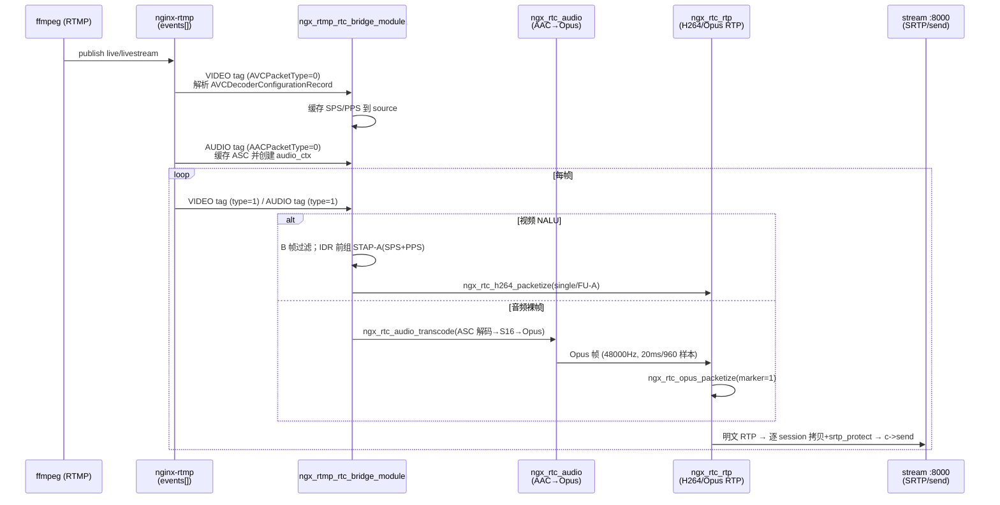
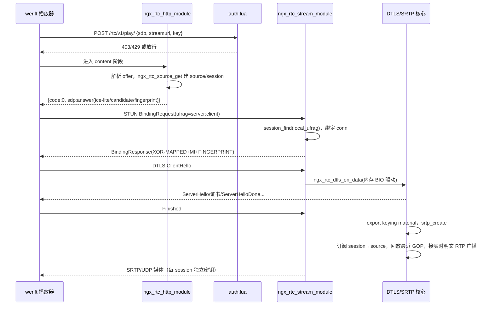
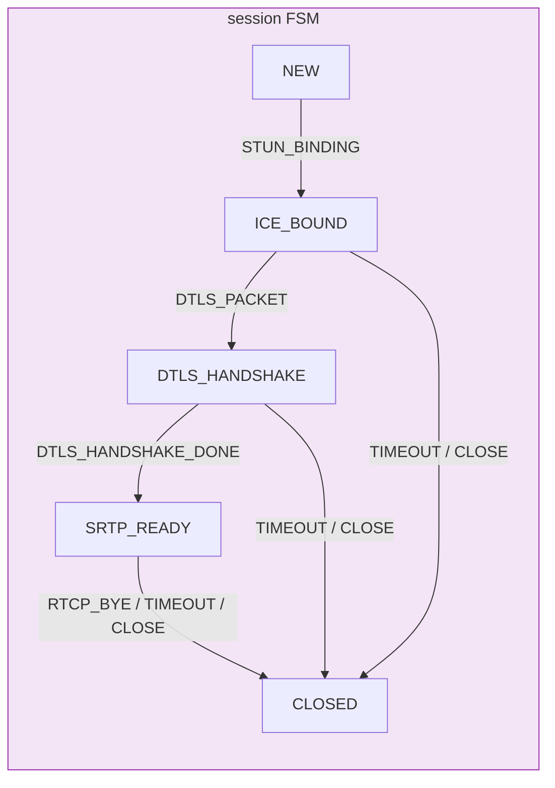
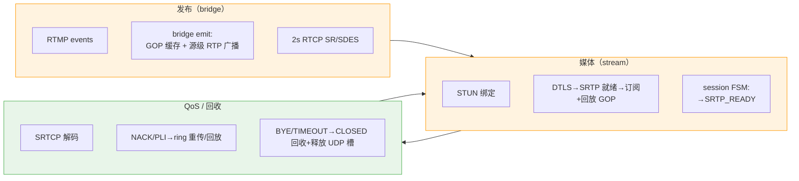

# RTMP 转 WebRTC 低延迟直播方案：详细设计

> 文档范围：`ngx-rtc-module` 各模块的详细设计——桥接、RTP 封装、信令与媒体安全、状态机与 RTCP/GOP 缓存。每个主题给出关键数据结构、函数 API 与 Mermaid 时序图。
> 依据：`ngx-rtc-module/src/*.c/.h` 真实实现；状态与集成分工：桥接/RTP/信令/媒体安全为已打通链路，RTCP、GOP 环形缓存与 session HSM 均已集成进 bridge/stream/core。

**结论**：媒体链路分四段：(1) 桥接模块以 RTMP events 钩子读取 FLV tag body，视频拆 AVCC 长度前缀 NALU、音频取 AAC 裸帧；(2) RTP 层按 RFC 6184 将 NALU 封装为 single/STAP-A/FU-A，IDR 前用 STAP-A 携带 SPS/PPS，AAC 经 FFmpeg 解码 + libopus 转码后按 RFC 7587 一帧一包；(3) 信令走 SRS 兼容的 `/rtc/v1/play/` offer/answer，媒体安全依次完成 STUN 绑定、DTLS 握手（`EXTRACTOR-dtls_srtp` 导出 60 字节）、libsrtp2 SRTP；(4) session HSM（纯状态跟踪）、RTCP（2s SR + NACK/PLI/BYE）与 GOP 环形缓存均已接入；source 状态机已删除。

## 1 结论与模块全景

### 1.1 代码布局与编译归属

| 文件 | 类型 | 归属 | 集成状态 |
| --- | --- | --- | --- |
| `ngx_rtmp_rtc_bridge_module.c` | CORE 胶水 | nginx RTMP | 已接入，广播明文 RTP |
| `ngx_rtc_http_module.c` | HTTP 胶水 | nginx HTTP | 已接入，信令 |
| `ngx_rtc_stream_module.c` | STREAM 胶水 | nginx stream | 已接入，UDP STUN/DTLS/SRTP |
| `ngx_rtc_core.c/.h` | 纯 C | 注册表 + GOP ring | 已接入（source rbtree、session/订阅 ngx_queue） |
| `ngx_rtc_rtp.c/.h` | 纯 C | RTP 封装 | 已接入 |
| `ngx_rtc_sdp.c/.h` | 纯 C | SDP | 已接入 |
| `ngx_rtc_stun.c/.h` | 纯 C | STUN | 已接入 |
| `ngx_rtc_dtls.c/.h` | 纯 C | DTLS | 已接入 |
| `ngx_rtc_srtp.c/.h` | 纯 C | SRTP | 已接入 |
| `ngx_rtc_audio.c/.h` | 纯 C | AAC→Opus | 已接入（bridge 调用） |
| `ngx_rtc_rtcp.c/.h` | 纯 C | RTCP 编解码 | 已接入（bridge 2s SR；stream NACK/PLI/BYE） |
| `ngx_rtc_hsm.c/.h` + `ngx_rtc_session_fsm.c/.h` | 纯 C | 状态机 | 已接入（session 纯状态跟踪；source 机已删除） |

### 1.2 共享常量与约定

| 常量 | 值 | 含义 |
| --- | --- | --- |
| `NGX_RTC_H264_CLOCK_RATE` | 90000 | H264 RTP 时钟（由 RTMP ms 时间戳换算） |
| `NGX_RTC_OPUS_CLOCK_RATE` | 48000 | Opus RTP 时钟 |
| `NGX_RTC_PAYLOAD_TYPE_H264/OPUS` | 102 / 111 | 服务端默认 PT |
| `NGX_RTC_H264_MTU` | 1200 | RTP 载荷上限（1500 预留 UDP/IP 与扩展头） |
| `NGX_RTC_SRTP_KEY_LEN/SALT_LEN` | 16 / 14 | AES_CM_128_HMAC_SHA1_80 主密钥/盐长度 |
| 返回码 | `NGX_RTC_OK=0`，`ERR_INVALID=-1`，`ERR_TOO_SMALL=-2`，`ERR_TOO_LARGE=-3`，`ERR_PARSE=-4` | 全模块统一错误码 |

时间戳换算内联函数：`ngx_rtc_h264_timestamp_from_ms(ms)`、`ngx_rtc_opus_timestamp_from_ms(ms)`，均以 64 位中间量乘除防溢出。

## 2 桥接层设计（RTMP FLV → RTC）

### 2.1 接入方式

`ngx_rtmp_rtc_bridge_module` 在 `postconfiguration` 中把 `ngx_rtmp_rtc_av` 追加进 `cmcf->events[NGX_RTMP_MSG_VIDEO]` 与 `[NGX_RTMP_MSG_AUDIO]`。该模式与 nginx-http-flv-module 的 gop_cache 模块相同，不改动任何现有模块源码。处理器只关心发布者会话（`ngx_rtmp_live_ctx_t->publishing` 非零）。

### 2.2 FLV tag body 布局与处理分支

| 媒体 | tag body 布局 | 处理 |
| --- | --- | --- |
| 视频（H264） | `[0]`=FrameType(高4)+CodecID(低4，7=H264)；`[1]`=AVCPacketType（0=序列头，1=NALU）；`[2..4]`=CTS；`[5..]`=AVCC 长度前缀 NALU | 序列头→`ngx_rtmp_rtc_parse_avc_header` 缓存 SPS/PPS；NALU→`ngx_rtmp_rtc_video` 拆 NALU 并 RTP 封装 |
| 音频（AAC） | `[0]`=SoundFormat(高4，10=AAC)+采样率等；`[1]`=AACPacketType（0=序列头 ASC，1=裸 AAC 帧）；`[2..]`=数据 | 序列头→缓存 AudioSpecificConfig 并创建转码器；裸帧→`ngx_rtc_audio_transcode` |

关键代码常量：`NGX_RTC_VIDEO_H264=7`、`NGX_RTC_AUDIO_AAC=10`、`NGX_RTC_AUDIO_BITRATE=64000`、`NGX_RTC_MAX_NALUS=16`。

音频 RTP 时间戳源级单调：首个裸 AAC tag 播种 48k 时钟（`audio_ts_valid`），此后每成功 emit 一帧 Opus 由 `ngx_rtmp_rtc_audio_frame` 回调 `audio_ts += NGX_RTC_AUDIO_OPUS_FRAME_SIZE(960)`，替代「每 AAC tag 用同一次 tag 时间戳」。这修复了早期 P1：一帧 AAC（1024 样本）经 FIFO 可转出两帧 Opus，若共用 tag 时间戳会被对端按时间戳去重、规律性丢 20 ms 音频。

### 2.3 关键数据结构

AVC 序列头（AVCDecoderConfigurationRecord）解析后缓存于 source（关键字段摘录，完整定义见 `ngx_rtc_core.h`）：

```c
struct ngx_rtc_source_s {              /* ngx_rtc_core.h */
    char     name[128];                /* "app/stream" */
    uint32_t video_ssrc; uint8_t video_pt;
    uint32_t audio_ssrc; uint8_t audio_pt;
    uint16_t video_seq, audio_seq;     /* 源级共享 RTP 序号 */
    uint32_t video_ts,  audio_ts;      /* 90k/48k RTP 时间戳 */
    uint8_t  audio_ts_valid;
    uint32_t video_pkts, video_octets; /* SR 统计，bridge emit 累计 */
    uint32_t audio_pkts, audio_octets;
    uint8_t  sps[256]; uint32_t sps_len;   /* SPS/PPS（IDR 前组 STAP-A） */
    uint8_t  pps[256]; uint32_t pps_len;
    uint8_t  audio_asc[64]; uint32_t audio_asc_len;  /* AAC AudioSpecificConfig */
    void    *audio_ctx;                /* ngx_rtc_audio_t * */
    ngx_rtc_rtp_ring_t gop;           /* 明文 RTP 环形缓存（2048 槽） */
#ifdef NGX_PTR_SIZE
    ngx_str_node_t sn;                 /* source rbtree 节点（key="app/stream"） */
    ngx_queue_t    subscribers;        /* 订阅者 ngx_queue 队头 */
#endif
};
```

视频 NALU 处理伪逻辑（`ngx_rtmp_rtc_video`）：遍历 AVCC 4 字节长度前缀 NALU，`ngx_rtc_h264_is_b_frame()==1` 的 NALU 丢弃；NALU 类型为 IDR(5) 且 SPS/PPS 已缓存时，先发一包 STAP-A（SPS+PPS），再逐个 `ngx_rtc_h264_packetize`，访问单元末 NALU 置 marker=1。

### 2.4 广播发送（每 session SRTP）

```c
static int32_t ngx_rtmp_rtc_emit(void *opaque, const uint8_t *rtp, uint32_t len);
/* 视频：先 ngx_rtc_rtp_ring_push 入源级 GOP ring（is_gop_start 标记 STAP-A）；
 * 累计 video/audio_pkts 与 octets 供 SR 用；
 * 遍历 src->subscribers，逐 session ngx_rtc_session_send_rtp：
 *   拷贝明文到常驻 sess->cipher[NGX_RTC_CIPHER_CAP]
 *   -> 按该 session 协商 PT 重写 RTP header
 *   -> ngx_rtc_srtp_protect_rtp -> c->send()。 */
```

### 2.5 桥接时序



## 3 RTP 封装设计

### 3.1 RTP 头与错误码

```c
typedef struct {                  /* ngx_rtc_rtp.h */
    uint8_t  version_cc;          /* V=2, CC=0 (0x80) */
    uint8_t  marker_pt;           /* M + 7bit PT */
    uint16_t seq;
    uint32_t timestamp;
    uint32_t ssrc;
} ngx_rtc_rtp_header_t;
/* 大端上线；固定头 12 字节；writer 提供字节序序列化 */
int32_t ngx_rtc_rtp_header_write(const ngx_rtc_rtp_header_t *hdr, uint8_t *buf, uint32_t cap);
```

### 3.2 封装函数族（核心 API）

| 函数 | 用途 | 关键规则 |
| --- | --- | --- |
| `ngx_rtc_h264_packetize` | 入口分发 | `len <= MTU` → single；`len > MTU` → FU-A |
| `ngx_rtc_h264_packetize_single` | 单 NAL 单元包 | NALU 紧跟 12B 头，无额外载荷头 |
| `ngx_rtc_h264_packetize_fu_a` | FU-A 分片 | FU indicator 保留原 NRI、类型=28；首片 S=1、末片 E=1；marker 只在末片 |
| `ngx_rtc_h264_packetize_stap_a` | 聚合 SPS/PPS | STAP-A 头取首 NALU 的 NRI + 类型 24；每子 NALU 前 2B 大端长度；marker 清零 |
| `ngx_rtc_opus_packetize` | Opus 单帧单包 | RFC 7587 无载荷头；marker 通常置 1 |
| `ngx_rtc_h264_nalu_type` / `ngx_rtc_h264_find_nalu` | 工具 | NAL 类型提取 / Annex-B 起始码定位 |
| `ngx_rtc_h264_is_b_frame` | B 帧判定 | 见 3.3 |

所有封装函数签名统一：`(nalu/opus, len, timestamp, uint16_t *seq, ssrc, pt, marker, scratch, scratch_cap, emit, opaque)`。调用者持有 `seq` 计数器（源级 `src->video_seq/audio_seq`）与 scratch 缓冲，每次发包 `(*seq)++` 并回调 `emit`。

### 3.3 B 帧识别算法

对 NAL 类型 ∈ {1(NON_IDR), 2, 3, 4(DP_A/B/C)} 的 slice NALU：跳过 1 字节 NALU 头后，按 H.264 9.1 读 Exp-Golomb `first_mb_in_slice` 与 `slice_type`，`slice_type ∈ {1, 6}`（B / B1）判为 B 帧丢弃。位读取与 `srs_avc_nalu_read_uev` 同源。WebRTC 低延迟播放不支撑 B 帧重排序，故推流侧也建议 `-bf 0`。单测曾以回归断言发现早期实现用「按位或」累加 Exp-Golomb 后缀导致 `slice_type 6/2` 误判，现改为加法并回归转绿（见测试文档 §1）。

### 3.4 场景表（实测命中）

| 场景 | 封装形态 | 说明 |
| --- | --- | --- |
| IDR 关键帧首包 | STAP-A（SPS+PPS）→ single/FU-A（IDR slice） | marker=0 的 STAP-A 先行，保证解码器首帧可解 |
| 普通小 NALU（P 帧等） | single | ≤1200 B |
| 超大 NALU | FU-A 多分片 | 每片 ≤1200 B 载荷，总包 ≤1214 B |
| 音频 | Opus RTP 一帧一包 | 960 样本/20 ms @48 kHz |

## 4 信令与媒体安全（SDP / 鉴权 / STUN / DTLS / SRTP）

### 4.1 信令契约与数据结构

HTTP 模块实现 `POST /rtc/v1/play/`，请求 JSON `{sdp, streamurl, key,...}`，响应 JSON `{code:0,sdp:"<answer>"}`（SDP 内换行转义 `\n`）。URL `webrtc://host/app/stream` 被切分为 `app/stream`。请求体解析用 `ngx_rtc_chain_reader_t` 游标直接在 `ngx_chain_t` 上逐字节读 JSON 字段（跨 buf 边界），避免把 body 整体拷入 8KB 栈缓冲；`sdp`/`streamurl` 按字段各自重新初始化游标，不依赖 JSON 字段顺序。

```c
typedef struct {                          /* ngx_rtc_sdp.h */
    char ice_ufrag[64]; char ice_pwd[256];
    char fingerprint_algo[32]; char fingerprint[160];
    char setup[32];
} ngx_rtc_sdp_session_t;

typedef struct {                          /* 解析后的远端 offer */
    ngx_rtc_sdp_session_t session;
    uint8_t video_pt; uint32_t video_ssrc; char video_encoding[64];
    uint32_t video_clock_rate; char video_fmtp[256];
    uint8_t audio_pt; uint32_t audio_ssrc; ...
} ngx_rtc_sdp_offer_t;

typedef struct {                          /* answer 配置 */
    const char *ice_ufrag, *ice_pwd, *fingerprint_algo, *fingerprint;
    const char *setup, *proto;            /* "passive", "UDP/TLS/RTP/SAVPF" */
    const char *candidate_ip; uint32_t candidate_port;
    uint32_t video_ssrc, audio_ssrc; uint8_t video_pt, audio_pt;
    ... int32_t sendonly, rtcp_mux, rtcp_rsize;
} ngx_rtc_sdp_answer_t;

int32_t ngx_rtc_sdp_parse_offer(const char *sdp, uint32_t len, ngx_rtc_sdp_offer_t *out);
void    ngx_rtc_sdp_answer_init(ngx_rtc_sdp_answer_t *cfg);
int32_t ngx_rtc_sdp_generate_answer(const ngx_rtc_sdp_answer_t *cfg,
                                    char *buf, uint32_t cap, uint32_t *out_len);
```

answer 内容：`a=ice-lite`（服务端 ICE-lite）、session 级 `ice-ufrag/ice-pwd/fingerprint(sha-256)/setup:passive`、每个媒体段内写 `a=candidate`（`candidate_ip:8000`，IP 由 run.sh 自动探测主网卡注入）、`a=sendonly`、`a=rtcp-mux`、`a=rtcp-rsize`、`a=rtcp-fb:<pt> nack pli`（视频）/`a=rtcp-fb:<pt> nack`，视频默认 `profile-level-id=42e01f;packetization-mode=1`，音频 `minptime=10;useinbandfec=1`。SSRC 由首个 play 会话用 `ngx_random()` 分配并固化到 source；PT 则在每个会话按其 offer 协商值记录（`sess->video_pt/audio_pt`），发送时由 `ngx_rtc_session_send_rtp` 重写 RTP 头 PT，支持异构观众。

### 4.2 鉴权链

同一份 stream key 保护三条路径，均查 `lua_shared_dict stream_keys`（由 `config.lua` 每 10 s 从 `stream_keys.lua` 热加载）：

- **WebRTC 信令**：`/rtc/v1/play/` 上 `access_by_lua_file conf/auth.lua;`，IP 级限流（60 s 内 30 次，超限 429）→ 解析 body `streamurl` → `config.check("app/stream", key)`，失败 403。
- **RTMP 推流**：`application live` 配置 `on_publish http://127.0.0.1:18082/rtmp/on_publish;`，`rtmp_auth.lua` 解析 notify 回调表单里的 `app/name/key`（key 来自 RTMP URL 查询串 `?key=...`），`config.check` 不通过返回 403 拒绝发布。
- **HTTP-FLV 取流**：`/live` 上 `access_by_lua_file conf/flv_auth.lua;`，取 `?app=&stream=&key=` 参数 `config.check`，失败 403。

密钥管理经 loopback-only 的 `/admin/keys`（`admin_keys.lua`）增删改查。

### 4.3 媒体安全握手

STUN：`ngx_rtc_stun_decode` 解析 BindingRequest（校验 magic cookie 与长度），取 USERNAME 拆 `local_ufrag:remote_ufrag`（两端都截断到 `NGX_RTC_STUN_UFRAG_MAX`）；stream 模块用 `local_ufrag` 在全局 session 链表 `ngx_rtc_session_find` 定位会话并绑定 `sess->conn/peer_addr`；`ngx_rtc_stun_encode_binding_response` 回 XOR-MAPPED-ADDRESS + MESSAGE-INTEGRITY（HMAC-SHA1，key=本地 `ice_pwd`）+ FINGERPRINT（CRC32 XOR `0x5354554E`）。编码器对每个属性写前做 `out_len - pos` 边界检查，调用方缓冲为 256 字节（原 128 字节栈缓冲越界 P0 已修复）。

DTLS：进程级自签名 RSA-2048 证书 + 共享 `SSL_CTX`（`DTLS_server_method`，曲线 `P-256:P-384:P-521`，`SSL_CTX_set_tlsext_use_srtp("SRTP_AES128_CM_SHA1_80")`，`SSL_VERIFY_NONE`）。每 session `ngx_rtc_dtls_create` 建内存 BIO，`SSL_set_accept_state()` 置 server 角色，`SSL_set_mtu(1200)` 分片；`ngx_rtc_dtls_on_data` 以 `SSL_read` 驱动握手，结束后回调 `done_cb`。

SRTP 密钥导出（`ngx_rtc_dtls_get_srtp_key`）：`SSL_export_keying_material("EXTRACTOR-dtls_srtp")` 取 60 字节；RFC 5764 顺序 `[client_key16][server_key16][client_salt14][server_salt14]`，服务端 recv=client、send=server，各 30 字节交 `ngx_rtc_srtp_create` 建 libsrtp2 收发上下文（策略 `AES_CM_128_HMAC_SHA1_80`，`ssrc_any_*`，窗口 8192）。DTLS 完成后订阅 session 到 source 的 `subscribers` 链表，广播随即开始。

### 4.4 播放器建链时序



## 5 状态机、RTCP 与 GOP 缓存设计

> 本节三个主题均已集成进 bridge/stream/core；状态机定位为「纯状态跟踪、真实动作留在 stream 模块」，source 状态机作为死代码已删除。

### 5.1 HSM 层次状态机引擎

`ngx_rtc_hsm` 是数据驱动的层次状态机（Andreas Misje lightweight HSM 的 C 移植）：状态带父链，事件先交给当前状态，未消费则沿父链上浮；转移分 EXTERNAL（退出源路径/进入目标路径）与 INTERNAL（仅执行 action 不换状态）。

```c
struct ngx_rtc_hsm_state {                       /* const 静态表 */
    const ngx_rtc_hsm_state_t *parent;
    ngx_rtc_hsm_action_fn entry_action, exit_action;
    const ngx_rtc_hsm_transition_t *transitions; /* {event_id,target,guard,action,type}[] */
    size_t num_transitions; const char *name;
};
void ngx_rtc_hsm_init(ngx_rtc_hsm_t *sm, const ngx_rtc_hsm_state_t *initial,
                      const ngx_rtc_hsm_state_t **entry_path_buffer,
                      uint8_t buffer_size, void *user_data,
                      ngx_rtc_hsm_action_fn unhandled_hook);
bool ngx_rtc_hsm_dispatch(ngx_rtc_hsm_t *sm, const ngx_rtc_hsm_event_t *event);
bool ngx_rtc_hsm_is_in_state(const ngx_rtc_hsm_t *sm, const ngx_rtc_hsm_state_t *state);
```

引擎仅依赖 C 标准库，无 nginx/RT-Thread 依赖，可 host 单测。`entry_path_buffer` 由调用者提供，容量按最大层深（本方案 2）定。

### 5.2 session 状态机（纯状态跟踪）

状态表（`ngx_rtc_session_fsm.h`）：

| 状态机 | 层次 | 状态 | 事件 |
| --- | --- | --- | --- |
| session | `SESSION(root)` → `NEW/ICE_BOUND/DTLS_HANDSHAKE/SRTP_READY/CLOSED` | 查询用 `NGX_RTC_SESSION_STATE_*` | `EVT_STUN_BINDING`、`EVT_DTLS_PACKET`、`EVT_DTLS_HANDSHAKE_DONE`、`EVT_SRTP_READY`、`EVT_TIMEOUT`、`EVT_CLOSE`、`EVT_RTCP_BYE` |

CLOSE/TIMEOUT/RTCP_BYE 三个事件在根状态 `SESSION` 上定义，任何叶子状态未消费都会沿父链上浮收敛到 CLOSED；CLOSED 状态内部吞掉同类事件避免重复执行。

设计取向：**HSM 只回答「当前处于什么状态」，不做副作用**（各状态 entry/exit action 均为空）。真实动作全部留在 `ngx_rtc_stream_module.c`——DTLS 创建、SRTP 密钥导出、订阅/退订与 teardown 都在该模块内联，`ngx_rtc_session_fsm_is_ready()` 用于广播/RTCP/回收判定。source 状态机已删除：bridge 的 `ctx->publishing` 已完整描述 RTMP 发布生命周期，再建第二台机只会重复维护。



驱动点（已接入）：HTTP 模块 `ngx_rtc_session_fsm_init` 置 NEW；stream 模块在 STUN 命中时 dispatch `STUN_BINDING`、首个 DTLS record 时 dispatch `DTLS_PACKET`、`ngx_rtc_stream_dtls_done` 导出密钥后 dispatch `DTLS_HANDSHAKE_DONE`；`ngx_rtc_stream_session_close` 在释放前 dispatch `CLOSE/TIMEOUT/RTCP_BYE`。session 结构体内嵌 `fsm` 与 `fsm_path[NGX_RTC_SESSION_FSM_MAX_DEPTH]`（层深 2）。

### 5.3 RTCP 编解码核心

`ngx_rtc_rtcp` 纯 C 覆盖：解码 RR(201)/SDES(202)/BYE(203)/NACK(RTPFB FMT=1)/PLI(PSFB FMT=1)，编码 SR(200)/SDES(202)，支持 compound 拼接。

| API | 用途 |
| --- | --- |
| `ngx_rtc_rtcp_parse` / `ngx_rtc_rtcp_decode` | 单包解析 / compound 游走（回调 `ngx_rtc_rtcp_decode_cb`） |
| `ngx_rtc_rtcp_nack_expand` | PID+BLP 展开为丢失 seq 列表 |
| `ngx_rtc_rtcp_encode_sr` / `encode_sdes` | SR（可选报告块，`ntp=0` 时取墙钟）/ SDES CNAME |
| `ngx_rtc_rtcp_compound_append` | 子包追加进一个 UDP 数据报 |
| `ngx_rtc_rtcp_ntp_from_unix_us` / `ntp_now` | NTP 时间换算 |

RTCP 反馈消息类型 `NGX_RTC_RTCP_SR=200/RR=201/SDES=202/BYE=203/RTPFB=205/PSFB=206`，`NGX_RTC_RTCP_FMT_NACK/PLI=1`，`TWCC=15`（本方案不解码）。

接入方式：bridge 模块 init process 启动 2 s 周期 `ngx_rtmp_rtc_rtcp_timer`，遍历订阅者 `ngx_rtmp_rtc_send_sr_sdes` 发 compound SR+SDES（`ssrc=video_ssrc`、`rtp_ts=video_ts`、`ntp=0` 取墙钟、packet/octet 用源级累计）；stream 模块 handler 对 `data[0]&0xc0==0x80 && 200<=pt<=207` 的 SRTCP 报文先 `srtp_unprotect_rtcp` 再 `ngx_rtc_rtcp_decode`，回调处理 NACK（仅视频 `media_ssrc`、`nack_expand` + `ring_get` 重传）、PLI（`ring_replay` 重发最近关键帧）、BYE（置 `ctx.bye`，walk 返回后延迟关闭 session）。

### 5.4 GOP 环形缓存与首帧加速（已实现）

面向「RTMP 推流无 PLI 可送」的现实（关键帧请求无法回送到推流端），用「缓存最近一个 GOP + 订阅即发」替代 PLI。实现要点（`ngx_rtc_core.h/.c`）：

| 项 | 实现 |
| --- | --- |
| 载体 | `source->gop`（`ngx_rtc_rtp_ring_t`），定长槽数组环形队列，缓存**明文 RTP**；首包到达时 `calloc(2048 × slot)` 懒分配，一次缓存、N 订阅者共享回放 |
| 满策略 | `head`/`count` 覆盖最旧；`gop_start` 记录最近一次 IDR 访问单元起始（STAP-A 的 `is_gop_start` 置位） |
| 回放时机 | `ngx_rtc_stream_dtls_done` 导出密钥并 `ngx_rtc_source_subscribe` 后 `ngx_rtc_rtp_ring_replay`，从 `max(oldest, gop_start)` 回放到 `head` |
| NACK 定位 | `ngx_rtc_rtp_ring_get(r, rtp_seq, ...)` 以 16 位模差定位并校验 seq；仅视频入 ring（音频 seq 独立计数，混存会破坏 NACK 定位，且音频无需快起） |
| 复杂度 | 单 worker 单生产者 + 多只读消费者，无锁；无需 `ngx_shm` |
| 上限/遗留 | 2048 槽 × ~1224 B ≈ 2.4 MB/source；回放与 PLI 全量重发无 pacer（突发无 pacer，为已知上限） |

### 5.5 数据流与生命周期闭环



状态机 + RTCP + GOP 缓存三块已合一：session 生命周期具备显式状态、超时回收（2s reap）与丢包反馈闭环；关闭时延迟 `ngx_stream_finalize_session` 释放底层 UDP 连接槽，避免孤儿 UDP 占满 `worker_connections`。当前单 worker 事件循环内无需锁。
