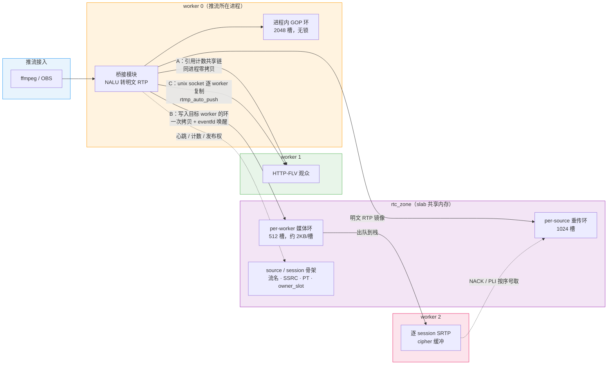
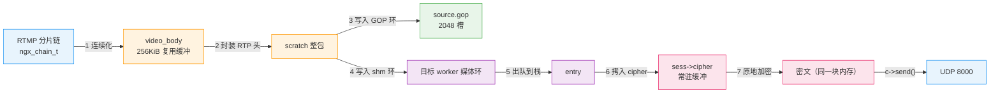

# 零拷贝与共享内存：RTMP 转 WebRTC 链路的数据通路分析

本文提到的实现细节均可在代码中核对，行号对应当前工作树。

## 1 模块简介与结论

### 1.1 nginx-rtc-module（自研）

一个用纯 C11 编写的 nginx 模块，静态编译进 nginx 进程，将 RTMP 或 WHIP 推流转为 WebRTC 播放。它不引入独立的 RTC 服务，全部工作在 nginx 框架内完成，实现思路参考 SRS 6.0。

代码分两层。下层是纯 C 协议核心，包含 RTP 封装（RFC 6184）、SDP 协商、STUN、DTLS、SRTP（libsrtp2）、RTCP、音视频同步、上行重排、会话状态机、注册表、环形缓冲与共享内存等单元。该层不引用 nginx 头文件、无全局可变状态，因此可以脱离 nginx 在主机上编译并运行单元测试（当前 149 例）。上层是四个 nginx 胶水模块，只负责"事件到纯 C 调用到 socket 发送"的转换：

| 胶水模块 | 职责 |
| --- | --- |
| `ngx_rtc_core_module` | 提供 `rtc_zone` 指令，初始化共享内存区 |
| `ngx_rtmp_rtc_bridge_module` | 消费 RTMP 的音视频消息，拆分 NALU、转码音频、封装 RTP 并广播 |
| `ngx_rtc_http_module` | WebRTC 信令 `/rtc/v1/play/`、WHIP 上行端点、管理接口与统计镜像 |
| `ngx_rtc_stream_module` | UDP 端口上的 STUN/DTLS/SRTP 收发与会话回收 |

对外端口共三个：RTMP 1935 接收推流，HTTP 18082 承载信令与播放页，UDP 8000 承载媒体。

### 1.2 nginx-http-flv-module（第三方）

负责 RTMP 接入本身：维护 `application live` 的发布与订阅、将推流转为 HTTP-FLV，并提供 HLS、DASH、FLV 录制三个复用器，以及 GOP 缓存与 `rtmp_auto_push`。自研模块不修改它的源码，而是通过 nginx 的 postconfiguration 钩子把自己的处理器注册进它的事件表（`架构设计.md` 第 2.2 节），两者经由 nginx-rtmp 的事件机制协作。

### 1.3 两者的协作关系

一条 RTMP 推流的音视频消息会被两边同时消费：live 模块负责 HTTP-FLV 分发与 GOP 缓存，桥接模块负责将其转为 RTP 送入 RTC 链路。因此同一路流可以同时提供 WebRTC 与 HTTP-FLV 两种播放方式，播放页在 WebRTC 失败或超时时降级至 HTTP-FLV。

部署形态为 OpenResty 1.31.1.1（nginx 1.31 + OpenSSL 3.0 + LuaJIT），配置 `worker_processes 2` 与 `rtc_zone rtc 32m`；鉴权与可观测性由部署侧 Lua 承担。

### 1.4 结论

链路上无法消除的内存拷贝只有三处：RTMP 分片链必须连续化才能解析、每个订阅者必须各自执行一次 SRTP 加密、跨进程传递的数据必须复制一份。其余拷贝均已消除或合并。

共享内存中只存放可安全复制的元数据（流名、SSRC、payload type、序列号等）与定长环形缓冲；TLS 会话、加密上下文、连接对象等句柄一律保留在各进程内。判断标准只有一条：值类型进入共享内存，指向资源的句柄留在进程内。

这套设计的主要收益不是减少一次内存拷贝，而是使 HTTP 信令与 UDP 媒体可以落在不同的 worker 进程上。缺少共享内存时该场景无法实现，减少拷贝只是附带收益。主要代价也不是内存占用，而是两份注册表之间的一致性维护，以及无法消除的跨进程拷贝。

## 2 共享内存的必要性：三种跨进程共享策略

### 2.1 多进程模型与直播长连接的矛盾

nginx 的高性能建立在多进程模型上。普通 HTTP 请求生命周期很短，处理完毕即结束，worker 之间无需了解彼此的状态。直播不满足这一前提：

- 一路 RTMP 推流是长连接，可持续数小时，固定挂在某一个 worker 上；
- 观众发起的播放信令是一次 HTTP 请求，可能落在另一个 worker 上；
- 媒体走 UDP，`reuseport` 由内核按四元组哈希决定目标 worker，与信令所在的 worker 无关。

由此产生的问题不只是查找失败：信令进程创建的会话，媒体进程并不存在对应记录；媒体进程收到的 STUN 包需要在本地会话表中查询 ufrag。另有一个更隐蔽的问题：每个 worker 各自生成 DTLS 自签证书，信令下发的 fingerprint 与实际握手的证书不一致，握手直接失败（`架构设计.md` 第 8 节）。

可选路径只有两条：强制信令与媒体落在同一 worker，或将必要的状态放入共享内存。

### 2.2 三种共享策略及其适用场景

代码中没有统一方案，而是按"数据需要送达谁"选择三种策略之一：

| 策略 | 适用范围 | 实现方式 | 代价 |
| --- | --- | --- | --- |
| **A 引用计数共享链** | HTTP-FLV 同进程的多个观众 | 一条数据链被 N 个观众共用，仅增加引用计数 | 真正的零拷贝，但仅在单一进程内成立 |
| **B 共享内存环 + eventfd** | 自研 RTC 的跨进程媒体分发 | 明文 RTP 一次写入目标 worker 的环并唤醒对方；对方出队后逐个订阅者加密 | 跨进程一次拷贝；环满时丢帧 |
| **C unix socket 逐条复制** | `rtmp_auto_push on` | 为每个其它 worker 建立一条 unix 连接，将推流完整复制一份 | 拷贝次数与 worker 数量成正比，经由内核 socket 缓冲 |

策略 C 需要单独说明。`ngx_rtmp_auto_push_module.c:528-589` 的实现是对每个其它 worker 逐个建立连接并重新推送，模块内未使用任何共享内存机制。它采用"每个 worker 保存一份完整推流副本"的替代方案，其存在原因是 HTTP-FLV 的播放状态按进程隔离（`nginx.conf:14` 开启），与 RTC 链路无关。

三种策略各覆盖一段场景，这也解释了零拷贝与共享内存为何在同一套代码中同时出现：正是因为状态必须进入共享内存，跨进程的媒体分发才无法避免一次拷贝。

## 3 视频包的处理路径与拷贝点分析

以一路 640×360 H264 源、一个跨进程的 WebRTC 订阅者为例，从接收 RTMP 到发出 UDP 共经历七个步骤：

各步骤的必要性：

| 步骤 | 为何必须拷贝 |
| --- | --- |
| 1 分片链连续化 | nginx-rtmp 对大消息按 chunk 分片，解析 NALU 需要连续内存。拼接目标是模块内复用的缓冲，不产生每次分配（`ngx_rtmp_rtc_chain_copy()`，`ngx_rtmp_rtc_bridge_module.c:552`） |
| 2 封装 RTP 头 | 需要前置头部并分片，输出缓冲由调用方提供，纯 C 核心不自行分配（`ngx_rtc_rtp.c:287` 单包 / `:362` FU-A / `:435` STAP-A / `:495` Opus） |
| 3 写入 GOP 环 | 新订阅者的快速起播与 NACK 重传都需要按序号随机访问（`ngx_rtc_core.c:783-797`） |
| 4 写入 shm 环 | 进程边界，其它进程的内存本进程无法访问 |
| 5 出队到栈 | 不可持有共享内存锁执行阻塞式发送 |
| 6 拷入 cipher | SRTP 为原地加密，会破坏明文内容，而该明文需被 N 个订阅者共用 |
| 7 原地加密 | 密文与明文位于同一块内存，此处不产生第二次拷贝（`ngx_rtc_srtp.c:75-86`） |

两个实现细节需要说明。

**同进程的订阅者不经过步骤 4、5。** 桥接模块直接将明文 RTP 的指针传给发送函数，代码注释为 `No per-session copy`（`ngx_rtmp_rtc_bridge_module.c:1190`）。跨进程路径的注释同样明确：一次拷到最终位置，`no stack staging copy`（`ngx_rtc_shm.h:499-501`），不经过中转缓冲。

**步骤 6 不是"整包拷入后再调整头部位置"。** 协商了 transport-cc 时分两段拷贝（前 12 字节头部，载荷拷至偏移 20），未协商时整包一次拷入（`ngx_rtc_core.c:638-658`）。动机见 `:606-611` 的注释：直接拷至最终位置，取代"先整包拷入再整体移位"的做法。

归纳起来，无法消除的三处即第 1 步的分片连续化、第 6 步的逐订阅者加密、第 4 与第 5 步的进程边界。

## 4 共享内存的内容、收益与代价

### 4.1 存放内容与排除内容

`rtc_zone rtc 32m;`（`nginx.conf:10`）是一个标准 nginx slab 区，根表挂在 `shpool->data`（`ngx_rtc_core_module.c:288-295`）。

| 存放于共享内存 | 保留在各自进程 |
| --- | --- |
| source 骨架：流名、SSRC/PT、序列号、时间戳、SPS/PPS/ASC、订阅关系 | `SSL*` / `BIO*`（DTLS 会话，本身不具备跨进程可移植性） |
| session 骨架：ufrag/pwd、`owner_slot`、`srtp_ready`、状态、过期时间 | `srtp_t`（libsrtp2 不透明句柄） |
| 每个 worker 一条媒体环（`ngx_rtc_shm.h:233-241`） | `ngx_connection_t*`、对端地址 |
| 每个 source 一条跨进程重传环（`ngx_rtc_shm.h:77-83`） | 音频转码器（FFmpeg/libopus 堆句柄与线程） |
| 心跳与计数：`publisher_seen_ms`、音视频包数与字节数 | 每个 session 的 cipher 缓冲、进程内 GOP 环 |

### 4.2 三项支撑机制

**热路径不查表。** 注册表操作需要持有 slab 全局锁，但媒体热路径不涉及查表：发布者在其进程内缓存 shm 结构体指针（`ngx_rtc_shm.c:748`），在 `NGX_RTC_SHM_SYNC_MS`（1 秒，`ngx_rtc_core.h:111`）内不查红黑树也不取锁；每包统计通过缓存指针直接写入，而非按流名查表后写入（`ngx_rtmp_rtc_bridge_module.c:586-610`）；订阅者列表按版本号比较，版本未变化时不重新获取（`:1167`）；不存在跨进程订阅者时直接返回，不申请池锁（`ngx_rtc_shm.c:1140-1147`）。

**媒体环使用独立锁。** 每个环持有独立的 `ngx_shmtx_t`（`ngx_rtc_shm.c:1407`），避免每帧竞争全局自旋锁。两把锁的获取顺序被固定为"先池锁、后环锁"，不允许反向。

**仅使用锁，不实现无锁协议。** 仓库内未出现 `ngx_memory_barrier`、`memory_order` 等原语。所有免锁读写的字段（心跳、计数、版本号）具有同一性质：读取到过期值不影响正确性。这是有意的取舍：正确性由锁保证，仅在"读到旧值无害"的字段上省去加锁，而不自行实现无锁队列。

### 4.3 收益

- **多 worker 从不可用变为可用**：信令落在 worker A、UDP 落在 worker B 时，STUN 仍可查到会话，DTLS 仍可完成握手。
- **无需轮询**：使用 eventfd 唤醒消费方，无消费者时没有额外开销。
- **快速起播不依赖推流所在 worker**：重传环下沉至共享内存后，任意 worker 均可应答 NACK/PLI，并回放最近一个 GOP。
- **推流进程异常退出后可自动恢复**：推流方每包刷新一次心跳，进程崩溃后心跳停止，回收器在 10 秒后判定发布者已退出并清理，不会遗留长期占用流名的残留会话。这是共享内存的附带收益：状态若仅存于各进程私有内存，则无人可知其已失效。
- **热路径无内存分配**：各环均为预分配的定长槽数组。

### 4.4 代价

**其一，两份注册表的一致性维护。** 进程内保留完整结构，共享内存保留骨架，两者按流名与 ufrag 关联。由此产生一组必须遵守的约束：删除共享内存中的会话骨架前必须校验 `owner_slot`，否则信令进程会误删其它 worker 正在使用的会话；共享内存内的指针只能指向共享内存，不可与进程内指针混用；结构一旦变更必须递增布局版本号（当前为 3）。该内存的生命周期横跨 reload 与 master 重启，两条复用分支都无法判断新程序期望的偏移量，只能通过版本号拒绝启动。宁可启动失败，也不能将旧结构按新结构读取。

**其二，进程边界处的拷贝无法消除。** 可行的优化是将其压缩至最小：一次拷至最终位置，出队时整槽拷贝而非逐字段重建，环满时丢帧而非阻塞等待，并将丢弃帧数计入 `ring_drops` 以保证可观测。

**其三，重传环上的全局锁仍是瓶颈。** 进程内 GOP 环为无锁，但跨进程重传环的全部读写都在 slab 池锁内。代码为此埋入 `retx_*` 锁耗时统计字段（`ngx_rtc_shm.h:145-149`），并通过 `/rtc/v1/stats` 以 `retx_lock.*` 暴露。该成本已被确认和测量，尚未消除。

**其四，共享内存与阻塞式发送存在冲突。** 典型场景是 GOP 回放：若在锁内逐包发送，等于持有全局锁执行网络 IO。当前做法是在锁内将整段数据拷至锁外的堆缓冲（约 1.5 MB），离开临界区后发送（`ngx_rtc_shm.c:1272-1319`）。即为避免持锁发送，此处主动增加了一次整段拷贝。

**其五，容量须按峰值预留。** 每个 worker 一条约 1 MB 的媒体环，每个存在跨进程订阅者的 source 一条约 1.5 MB 的重传环，另加骨架开销。`32m` 对单路部署有充分余量，多路转码后需按 `worker 数 × 1MB + 跨进程 source 数 × 1.5MB` 重新估算。

**其六，Lua 读取共享字典必然产生一次拷贝。** `ngx.shared.dict:get` 在底层将共享内存中的字节复制为新的 Lua 字符串（`resty/core/shdict.lua:640`），`get_keys` 同样逐键复制。而 `/rtc/v1/stats` 存入的是整段 JSON 字符串：C 模块每秒在 16 KB 栈缓冲上渲染（`ngx_rtc_http_module.c:521`），整体复制入共享内存（`:535`），Lua 读出后还需 `cjson.decode` 一次。该路径上数据移动三次，原因是跨越了 C 与 Lua 的边界，属于使用 Lua 实现可观测性的固定成本。唯一被规避的是计数器：`incr` 走数值路径，不产生字符串拷贝，因此 HTTP-FLV 的在线观众数使用 `incr` 而非 `get` 加 `set`。

## 5 明确排除的做法与取舍顺序

这一节列出被有意排除的做法，其边界意义大于已实现的部分。

| 排除项 | 原因 |
| --- | --- |
| 媒体面不使用 `ngx_chain_t`、`shadow`、`sendfile` | `ngx_buf_t` 的文件/影子/mmap 语义是为"文件发往 socket"设计的，对 UDP 单包发送没有收益。仓库内未出现 `last_shadow`、`ngx_chain_add_copy`、`ngx_udp_send`。该约束在文档中已明确记录（`详细设计.md:579`） |
| 不将 PT 设为全局唯一 | 曾设想"首个观众确定 PT，其余订阅者复用"以省去每次重写，但第二个订阅者的 offer 可能协商出不同的 PT，该做法会直接导致多订阅者协商失败（`详细设计.md:578`）。这是受零拷贝目标影响而产生的错误优化 |
| 音频不进入重排缓冲 | Opus 一包即一整帧，重排带来的收益不足以抵消一次拷贝，因此仅视频启用（`ngx_rtc_jitter.h:17-23`） |
| GOP 缓存中仅序列头使用引用 | `nginx-http-flv-module` 的 `gop_cache on` 对音视频序列头与 metadata 使用共享引用，但普通帧为实际副本（`ngx_rtmp_gop_cache_module.c:488-510` 对照 `:521`）。帧会被反复回放，持续持有引用将阻止上游释放 |
| 不自行实现无锁队列 | 锁足以保证正确性时即使用锁。媒体环中 `seq` 字段的注释标注为 `future lock-free`，即明确标记为未实现 |

综合以上，遇到"是否值得省去一次拷贝"时，代码采用的判断顺序为：

1. **能否不共享？** 同进程订阅者使用引用计数共享链，属于真正的零拷贝。
2. **必须共享时，共享什么？** 只共享可复制的元数据与定长环，句柄一律保留在本进程。
3. **跨进程拷贝无法消除时，使其只发生一次**，并且直接落至最终位置，不设中转缓冲，环满时丢帧而非阻塞。
4. **可原地完成的就地完成。** SRTP 原地加密、PT 原地改写、TWCC 扩展一并写入，均不产生额外拷贝。
5. **确需拷贝才能避免持锁的场景，接受该成本，但必须可测量。**

零拷贝在这套系统中并非通用目标，而是一条由"数据需要送达谁"反向推导出的设计准则：先确定数据的分发范围，再确定它需要经过几次拷贝。
